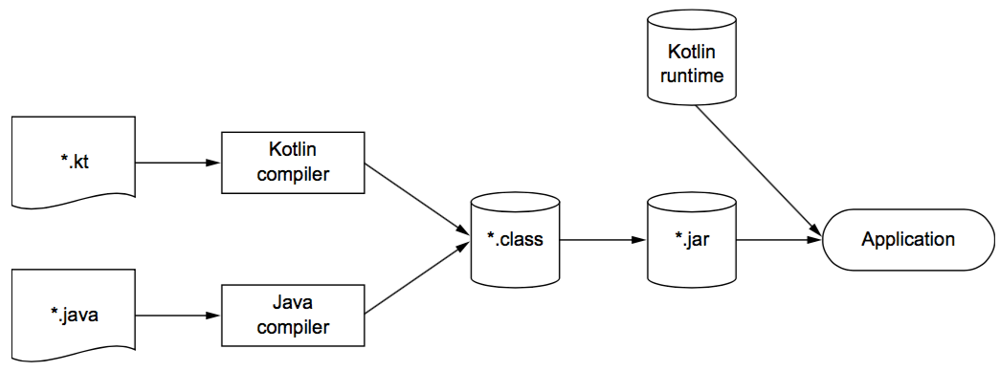

# Chapter01. 코틀린 소개

## 목차

---

- 코틀린 기본 기능 데모
- 코틀린 언어의 주요 특성
- 코틀린을 활용한 안드로이드와 서버 개발
- 코틀린 다중 플랫폼
- 코틀린이 다른 언어보다 더 나은 점
- 코틀린으로 코드를 작성하고 실행하는 방법

## 코틀린이란? 왜 필요한가?

---

- jvm 플랫폼과 jvm 외의 다른 플랫폼에서 돌아가는 현대 프로그래밍 언어
    - android, spring, ktor
- 크로스플랫폼 솔루션을 만들 수 있는 기술을 포함해, 실행될 수 있는 더 많은 타깃을 제공한다.
    - KMP
- 범용 언어로 간결하고 안전하며 실용적이다.
    - 더 나은 자바로 시작
    - 코루틴

## 맛보기

---

```kotlin
data class Person( // data class
    val name: String, // 읽기 전용 프로퍼티
    val age: Int? = null // nullable, 파라미터 기본값
)

fun main() { // 최상위 함수
    val persons = listOf(
        Person("Alice", age = 29), // named parameter
        Person("Bob"), // trailing comma
    )
    val oldest = persons.maxByOrNull { // 람다식
        it.age ?: 0 // elvis 연산자
    }
    println("The oldest is: $oldest") // 문자열 템플릿
}

// The oldest is: Person(name=Alice, age=29) // toString 자동 생성

```

## 주요 특성

---

- 다중 패러다임 언어
    - 객체지향 언어와 함수형 언어의 조합
- 정적 타입 지정(statically typed) 언어
    - 컴파일 시점에 많은 오류를 잡아낼 수 있다는 뜻

<aside>
💡

즉, 코틀린이 활용 가능한 영역은 상당히 광범위 하다는 것을 알 수 있다.

</aside>

### 용례

- 안드로이드 디바이스에서 실행되는 모바일 애플리케이션
- 서버상의 코드(특히 웹 백엔드)

### KMP(kotlin multiplatform)

- 주 목적은 자바가 사용되고 있는 모든 용도에 적합하면서도 더 간결하고 생산적이며 안전한 대체 언어
- 다중 플랫폼을 사용하면 데스크톱, iOS, 안드로이드, 브라우저(javascript)에서도 코틀린을 실행할 수 있는 크로스 플랫폼 애플리케이션을 만들 수 있다.

### 정적 타입 지정 언어의 장점

- 핵심 장점: 프로그램의 모든 식의 타입을 컴파일 시점에 알 수 있다.
    - nullable type
    - 함수 타입
- 성능, 신뢰성, 유지 보수성, 도구 지원

### 함수형과 객체지향의 조합

- 핵심 개념
    - 일급 시민 함수: 함수를 일반 값처럼 다룰 수 있다.
        - 함수를 변수에 저장 가능
        - 함수를 인자로 다른 함수에 전달 가능
        - 함수에서 새로운 함수를 만들어서 반환 가능
    - 불변성: 함수형 프로그래밍에서는 불변 객체를 사용해 프로그램을 작성한다.
    - 부수 효과(side effect) 없음: 순수함수
        - 입력이 같으면 항상 같은 출력
        - 다른 객체의 상태를 변경하지 않음
        - 함수 외부나 다른 바깥 환경과 상호작용하지 않음
- 장점
    - 간결성
        - 코드 중복을 피할수 잇다.
        - 로직에 의존하는 대신 순수 함수를 값처럼 활용하여 더 강력한 추상화
            - 비슷한 코드 조각은 공통 로직을 함수로 뽑아내고 세부 사항을 인자로 전달
            - 이러한 인자는 그 자체가 함수(람다식)
    - 안전한 동시성
        - 다중 스레드 환경에서 불변 데이터 구조와 순수 함수를 사용하면 스레드 세이프
        - 복잡한 동기화 방법을 적용하지 않아도 된다.
    - 테스트 용이성
        - 부수 효과가 없는 함수는 함수가 의존하는 준비 코드 없이 독립적 테스트 가능

<aside>
💡

코틀린은 처음부터 함수형 프로그래밍을 풍부하게 지원하는 특징을 가짐.

</aside>

### 코루틴: 동시성, 비동기 코드를 구조적으로 사용 가능

- 기존 동시성 처리 : 스레드로부터 콜백, 퓨처, 프로미스, 반응형 확장(reactive extension)
- 코틀린 : 코루틴
    - 일시 중단 가능한 계산을 사용
    - 구조화된 동시성이 코루틴 생명주기 관리에 도움을 준다.
    - 아주 가벼운 추상화
        - 수 백만 개의 동시성 작업
        - flow

## 자주 쓰이는 분야

---

- 서버와 안드로이드 개발
- 다중 플랫폼

### 백엔드

- 웹, 백엔드 애플리케이션
- RPC 프로토콜이나 메시지 버스를 통해 서로 통신하는 작은 서비스들로 이뤄진 마이크로서비스
    - **kotlinx.rpc**
- 자바 코드와 자유롭게 상호운용 가능하며 스프링 프레임워크도 확장을 제공
- 코틀린 자체 프레임워크
    - ktor
    - Exposed
    - http4k

## 코틀린 철학

---

### 실용적 언어

- 코틀린은 다른 언어가 채택한 이미 성공적으로 검증된 해법과 기능에 의존한다.
- 특정 프로그래밍 스타일이나 패러다임을 사용할 것을 강제로 요구하지 않는다.
- 인텔리제이 IDE 도구와 맞물려 있다.

### 간결함

- 준비 코드를 암시적으로 제공
    - getter, setter 등

### 안정성

- JVM에서 실행함으로써 안전성 보장
    - 메모리 안정성을 보장, 버퍼 오버플로를 방지, 자동 메모리 해제
    - 정적 타입 지정 언어
    - 불변성
    - NPE
    - class cast, smart cast

### 상호운용성

- 자바에서 사용하는 기존 라이브러리 그대로 사용 가능
- 자바와 코틀린 소스 파일을 자유롭게 네비게이션 가능
- 여러 언어로 이뤄진 프로젝트를 디버깅하고 서로 다른 언어로 작성된 코드를 언어와 관계없이 한 단계씩 실행 가능
- 자바 메소드를 리팩토링해도 그 메소드와 관련 있는 코틀린 코드까지 제대로 변경된다.
    - 역으로 코틀린 메소드를 리팩토링해도 자바 코드까지 모두 자동으로 변경 가능

## 코틀린 도구 사용

---

코틀린 코드를 다른 여러 타깃으로 컴파일 할 수 있다.

- jvm에서 실행되는 jvm 바이트 코드
    - `.class` 파일에 저장됨
- 추가 변환 후 안드로이드에서 실행되기 위한 jvm 바이트 코드
- 다른 운영체제에서 네이티브로 실행되기 위한 네이티브 타깃
- 브라우저에서 실행되기 위한 자바스크립트

### 코틀린/JVM에서의 컴파일 과정

- 코틀린 소스코드를 저장할 때는 보통 `.kt`라는 확장자
- 코틀린 컴파일러는 코드를 분석하여 `.class` 파일을 만든다.
    - `kotlinc`: 컴파일 명령어
    - `-include-runtime`: 코틀린 런타임 라이브러리 추가 정보 필요
        - 코틀린 내장 클래스와 API 의존관계
    - `코틀린 런타임 라이브러리(kotlin runtime library)`
        - 코틀린 기본 클래스 정의: `Int, String`
        - 표준 자바 API 확장 포함
- 만들어진 `.class` 파일은 개발 중인 애플리케이션의 유형에 맞는 표준 패키징 과정을 거쳐 실행될 수 있다.

```bash
kotlinc <소스 혹은 디렉터리> -inclide-runtime -d <jar 이름>
```



- 추가로 `코틀린 표준 라이브러리(kotlin standard library)`도 애플리케이션 의존관계로 필요하다.

## 요약

---

- 코틀린은 타입 추론을 지원하는 정적 타입 지정 언어
    - 정확성과 성능 보장
    - 소스코드 간결 유지 가능
- 코틀린은 객체지향과 함수형 프로그래밍 스타일을 모두 지원
- 코루틴은 스레드에 대한 대안으로 경량이다.
    - 비동기 코드를 순차 코드와 비슷한 로직을 작성 가능
    - 자식-부모 관계로 동시성 코드를 구조화할 때 도움이 된다.
- 코틀린을 서버 애플리케이션 개발에 잘 활용 가능
    - 스프링 부트같은 기존 자바 프레임워크도 완전 지원
- 안드로이드 표준 개발
- 개발 도구 호환성
    - 인텔리제이
    - 안드로이드 스튜디오
- 자바-코틀린 변환기 사용 가능
- 즉 실용적이며 안전하고 간결하며 상호운용성이 좋다.
