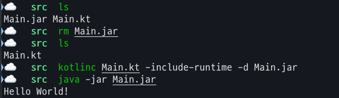

# 코틀린이란 무엇이며, 왜 필요한가?

## 코틀린이란?
**JetBrains에서 자바를 대신할 언어에 대한 필요성을 시작으로 개발되었다**
  - 가장 분명한 요구사항은 정적 타입 지정, 즉 컴파일 시점에 변수나 함수의 타입을 결정하는 것
  - 정적 타입 지정을 가장 필요로 했던 이유?
    - 자바의 동적 타입 지정은 런타임 시점에 오류를 발생시킬 수 있음
    - 정적 타입 지정을 통해 컴파일 시점에 오류를 발견할 수 있어 런타임 오류를 줄일 수 있음
  - '더 나은 자바'를 목표로 한 만큼 자바를 100% 호환되기 때문에 기존 자바 라이브러리 사용 가능

**JVM 및 다중 플랫폼을 위한 정적 타입 언어이다**
- JVM을 타겟으로 했지만 이미 JVM을 넘어 크로스플랫폼 솔루션 제공
    - 크로스플랫폼? 다양한 플랫폼에서 실행될 수 있는 언어, 즉 안드로이드와 IOS 모두에서 실행될 수 있는 언어

 

## 코틀린의 특징

**정적 타입 지정**
- 모든 식(변수, 함수, 클래스 등)의 타입을 명시적으로 지정
  - 타입 추론을 제공하기 때문에 개발자가 모든 타입을 명시적으로 지정하지 않아도 된다
- 컴파일러를 통해 접근하려는 식의 타입을 미리 확인해 검증

**널이 될 수 있는 타입 지원**
- 자바와 가장 크게 다른 점으로 10억짜리 실수라 불리는 NullPointException 방지

**함수형 프로그래밍과 객체지향 프로그래밍의 조합**
- 코틀린에서 맛보는 함수형 프로그래밍의 장점
  - 함수가 다른 데이터 타입과 동일하게 취급되기 때문에 일반 값으로 사용 가능
    - 함수를 변수에 저장할수도, 인자로 다른 함수에 전달할 수도, 새로운 함수를 생성할 수도 있음
  - 불변 객체를 사용하기 때문에 멀티스레드 환경에서 안전하게 사용 가능
  - 순수 함수를 사용하기 때문에 부작용 최소화 및 동작 예측 가능
    - 순수 함수?
      - 동일한 입력에 대해 항상 동일한 출력 뱉는, 즉 함수의 결과가 함수 내/외부 상태에 의존하지 않음
      - ex) `fun toUpperCase(input: String) = input.uppercase()`
  - 이런 순수 함수로 공통 로직을 뽑아내고 세부적인 설정을 람다식으로 인자로 전달하는 방식으로 구현 
    - ex) `fun <T> List<T>.filter(predicate: (T) -> Boolean): List<T>`
      - 이때 람다식 predicate도 순수 함수로 구현되어야 함
        - 사용 ex) `numList.filter { it != 0 }` 

**코루틴**
- 기존 동시성 처리 시 callback, future, promise 등 복잡한 코드 사용
- 일시 중단 가능한 계산을 사용해 비동기 처리
  - 일시 중단 가능한 계산?
    - 코루틴이 일시 중단되면 다른 코루틴이 실행될 수 있도록 하는 것
    - 즉, 코루틴이 일시 중단되면 다른 코루틴이 실행되고, 다시 돌아오면 이전에 중단된 코루틴이 다시 실행됨
- 코루틴은 스레드보다 가벼운 경량 스레드로, 더 적은 자원을 사용하여 많은 동시 작업을 처리할 수 있음
  - 성능 손해 없이 플로우 같은 추상화를 사용해 동시성 처리 가능

 

## 코틀린 철학
- 실제 문제를 효율적으로 해결할 수 있도록 실용적이게
- 불필요한 코드를 줄여 간결하지만 의미는 명확하게
  - 단순히 글자 수를 줄이는 것이 목표가 아니라 어쩌고
- JVM 위에서 더 안전하게
  - null 안정성 제공으로 NullPointerException 방지
  - 타입 추론으로 스마트 캐스트를 제공해 클래스 캐스트 예외 방지
- 기존 자바 라이브러리를 변환 없이 그대로 사용할 수 있도록

 

## 코틀린 컴파일
- 자바와 마찬가지로 컴파일 언어이기에 실행전 컴파일 과정 필요

**자바의 컴파일 과정**
- 자바 소스코드(`.java`) → 자바 바이트코드(`.class`) → JVM
  - 자바 컴파일러가 JVM에서 실행될 수 있도록 자바 바이트 코드로 변환 
  - JVM에서 네이티브로 실행되기에 OS에 종속적이지 않음

**코틀린의 컴파일 과정**
- 코틀린 소스코드(`.kt`) → 자바 바이트코드(`.class`) → JVM
  - 코틀린 컴파일러가 코틀린 소스코드를 자바 바이트코드로 변환

- kotlinc 코틀린 컴파일러로 코틀린 소스코드를 .class 파일로 변환한 뒤 jar 파일로 패키징
- 이 때 `-include-runtime` 옵션으로 코틀린 라이브러리 포함시켜준다

**코틀린 런타임 라이브러리**
- 코틀린 내장 클래스와 API는 의존 관계로 추가 정보가 필요하다
  - Int, String, List 등과 같은 코틀린 내장 클래스와 API를 포함한다
- jar 파일 안에 포함시켜야만 코틀린 프로그램이 실행 가능하다
  - 프로젝트 컴파일을 위해 Maven, Gradle과 같은 빌드 시스템을 사용하면 패키징할 때 알아서 포함시켜준다

  
