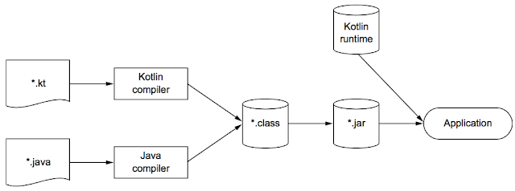

# 코트린이란 무엇이며, 왜 필요한가?
## 코틀린이란?

코틀린은 다중 플랫폼(JVM, 데스크톱, iOS, 안드로이드, 브라우저)에서 사용할 수 있는 현대적인 프로그래밍 언어이다.

코틀린의 목적은 현재 자바가 사용되고 있는 모든 영역에서 **더 간결하고 생산적이며 안전한 대체 언어**를 제공하는 데 있다. 코틀린 다중 플랫폼 기능을 통해 데스크톱, iOS, 안드로이드, 웹 등 다양한 플랫폼에서 코드를 공유할 수 있습니다.

또한 코틀린은 객체지향과 함수형 프로그래밍을 모두 지원하는 **다중 패러다임 언어**로, 우아한 코드 작성과 강력한 추상화를 가능하게 해줍니다.

## 코틀린 주요 특성

### 정적 타입 지정

코틀린은 **정적 타입 지정 언어**입니다. 정적 타입 지정은 컴파일 시점에 타입을 파악해 성능과 안정성, 유지보수성 등을 높여 준다.

코틀린은 **타입 추론(type inference)** 기능을 통해 모든 변수에 타입을 명시하지 않아도, 컴파일러가 문맥을 기반으로 자동으로 타입을 추론해줍니다.

### 객체지향과 함수형 프로그래밍

코틀린은 객체지향 언어의 구조적 장점과 **함수형 프로그래밍의 선언형 스타일**을 조화롭게 제공한다. 함수형 프로그래밍은 다음과 같다.

- 일급 시민 함수: 함수를 값처럼 다룰 수 있어, 변수에 저장하거나 인자로 전달할 수 있습니다. 이를 통해 중복 코드를 줄이고, 더 깔끔한 로직 작성 가능
- 불변성: 불변 객체를 사용함으로써 다중 스레드 환경에서 데이터 변경이 발생하지 않아 안전함
- 부수 효과 없음: 외부 환경과 상호 작용하지 않은 순수 함수로 간결성을 제공하고, 함수를 값처럼 활용 가능하여 강력한 추상화를 통해 테스트를 용이하게 한다.

- 성능: 런타임에 메서드 호출을 결정할 필요 없이 빠른 호출 가능
- 신뢰성: 타입 기반 검증으로 실행 중 오류 가능성 감소
- 유지보수성: 명확한 타입으로 코드 이해도 향상
- 도구 지원: IDE의 자동완성, 리팩토링 정확도 향상

### 코루틴을 통한 동시성과 비동기 제공

코틀린은 **코루틴(Coroutine)** 을 통해 쉽고 효율적인 비동기/동시성 처리를 제공합니다. 코루틴은 **일시 중단 가능한 계산(Suspendable Computation)** 을 의미하며, 중단 후 이어서 실행할 수 있다.

> 동시성 처리 방식으로는 콜백(callback), Future/Promise, Reactive Streams 등이 있으며, 코루틴은 이보다 더 직관적인 코드 작성을 가능하게 합니다.
>

```kotlin
suspend fun loadAndOverlay(first: string, second: String): Image = 
    coroutineScope {
        val firstDeferred = async { loadImage(first) }
        val secondDeferred = async { loadImage(second) }
        combineImages(firstDeferred.await(), secondDeferred.await())
    }
```

## 코틀린의 철학

### 실용적 언어

### 간결함

코틀린은 불필요한 보일러플레이트 코드(Getter, Setter 등)를 줄이고, **강력한 타입 추론과 표준 라이브러리 함수**로 코드의 양을 줄이면서도 가독성을 높인다.

이러한 **간결함**은 생산성을 향상시키고, 읽기 쉽고 이해하기 쉬운 코드를 만드는데 큰 도움을 준다.

### 안전함

코틀린은 정적 타입 언어로서 **타입 안정성**을 제공합니다. 특히 다음과 같은 기능을 통해 안정성을 강화한다.

- **Null 안정성**: nullable 타입 명시로 NullPointerException 방지
- **스마트 캐스트**: 타입 검사 후 별도의 캐스팅 없이 멤버 사용 가능
- **불변 데이터 클래스**: 멀티스레드 환경에서 안전한 상태 유지

```kotlin
fun modift(value: Any) {
   if(value is String) { //타입 검사
       priintln(value.uppercase()) //String 타입 메서드를 바로 사용 가능
   }
}
```

> 또한 JVM을 기반으로 하기 때문에, 메모리 안정성, 버퍼 오버플로우 방지 등 런타임에서의 안전성도 확보할 수 있습니다.
>

### 상호운용성이 좋음

코틀린에서 자바 API를 호출할 때나 자바에서 코틀린을 호출할 때 객체를 감싸거나 변환할 필요 없이 사용할 수 있다.

## 코틀린 JVM에서 컴파일 과정

- 코틀린 내장 클래스와 API는 의존관계로, 코틀린 런타임 라이브러리라는 추가 정보가 필요

> 코드를 컴파일 할 때 명시적으로 -include-runtime을 호출해 jar 파일 안에 런타임 라이브러리를 포함
>

