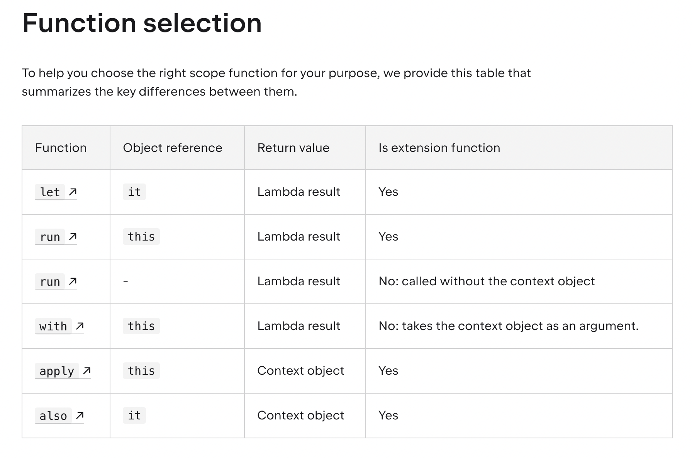

# Chapter07. 널이 될 수 있는 값

## 7장에서 다루는 내용

---

- 널이 될 수 있는 타입
- 널이 될 가능성이 있는 값을 다루는 구문의 문법
- 널이 될 수 있는 타입과 널이 될 수 없는 타입의 변환
- 코틀린의 널 가능성 개념과 자바 코드 사이의 상호운용성

## NPE을 피하고 값이 없는 경우 처리: 널 가능성

---

- 널 가능성은 NPE 오류를 피할 수 있게 돕는 코틀린 타입 시스템의 특성
- null에 대한 접근 방법을 실행 시점에서 컴파일 시점으로 이동

## 널이 될 수 있는 타입으로 널이 될 수 있는 변수 명시

---

- 자바와의 가장 중요한 차이점은 코틀린 타입 시스템이 널이 될 수 있는 타입을 명시적으로 지원한다는 점
- `Type?`
    - Type
    - null
- 널이 될 수 있는 타입의 값
    - 그 값에 대해 수행할 수 있는 연산의 종류가 제한
    - 널이 될 수 없는 타입의 변수에 대입 불가능
    - 널이 아닌 타입의 파라미터를 받는 함수에 전달 불가능

### if 검사를 통해 null 값 다루기

```kotlin
fun strLenSafe(s: String?): Int = if(s != null) s.length else 0
```

- 널 검사를 추가하면 코드가 컴파일 된다.

## 타입의 의미 자세히 살펴보기

---

- 타입: 가능한 값의 집합과 그런 값들에 대해 수행할 수 있는 연산의 집합
- 하지만 자바의 타입 시스템은 null을 제대로 다루지 못한다.
    - null 여부를 검사하기 전에는 그 변수에 대해 어떤 연산을 수행할 수 있을지 알 수 없기 때문
    - Optional이 있긴하지만 코드가 더 지저분해지고 래퍼가 추가됨에 따라 성능이 저하될 수 있다.
- 코틀린에서는 실행시점에 널이 될 수 있는 타입이나 널이 아닌 타입의 객체는 같다.
    - nullable type은 래퍼가 아니라는 뜻
    - 몇 가지 검사를 제외하면 실행 시점 부가 비용이 들지 않는다.

## 안전한 호출 연산자로 null 검사와 메서드 호출 합치기: ?.

---

```kotlin
// 메서드 호출
fun printAllCaps(str: String?) {
    val allCaps: String? = str?.uppercase()
    println(allCaps)
}

// 프로퍼티 호출
class Employee(val name: String, val manager: Employee?)

fun managerName(employee: Employee): String? = employee.manager?.name

// 연쇄 호출
class Address(val streetAddress: String, val zipCode: Int,
              val city: String, val country: String)
class Company(val name: String, val address: Address?)
class Person(val name: String, val company: Company?)

fun Person.countryName(): String {
   val country = this.company?.address?.country
   return if (country != null) country else "Unknown"
}

```

- `?.` : null 검사와 메서드 호출을 한 연산으로 수행
    - 널이 아니라면 일반 메서드 호출처럼 작동
    - 널이라면 호출은 무시되고 결과값은 null
- 안전한 호출의 결과 타입도 널이 될 수 있는 타입
- 메서드 호출뿐 아니라 프로퍼티를 읽거나 쓸 때도 안전한 호출 사용 가능
    - 연쇄 호출도 가능하다.

## 엘비스 연산자로 null에 대한 기본값 제공: ?:

---

```kotlin
fun strLenSafe(s: String?): Int = s?.length ?: 0

fun main() {
    println(strLenSafe("abc"))
    println(strLenSafe(null))
}

```

- `?:` : null 대신 사용할 기본값을 지정할 때 사용하는 연산자.
    - 널이 아니면 그 값이 전체의 결과
    - 첫 번째 값이 널이면 두 번째 값이 결과

### throw와 엘비스 연산자 함께 사용하기

```kotlin
class Address(val streetAddress: String, val zipCode: Int,
              val city: String, val country: String)

class Company(val name: String, val address: Address?)

class Person(val name: String, val company: Company?)

fun printShippingLabel(person: Person) {
    val address = person.company?.address
      ?: throw IllegalArgumentException("No address")
    with (address) {
        println(streetAddress)
        println("$zipCode $city, $country")
    }
}
```

- 엘비스 연산자의 오른쪽에 식을 사용하여 함수가 즉시 어떤 값을 반환하거나(return) 예외를 던진다(throw)
- 이런 패턴은 함수의 전제조건(precondition) 검사하는 경우 특히 유용하다.

## 예외를 발생시키지 않고 안전하게 타입을 캐스트하기: as?

---

- as 사용할 때마다 is를 통해 미리 변환 가능한 타입인지 검사를 안할 순 없을까?
- `as?`
    - 어떤 값을 지정한 타입으로 변환한다.
    - 변환할 수 없으면 null을 반환한다.

```kotlin
class Person(val firstName: String, val lastName: String) {
    override fun equals(other: Any?): Boolean {
        val otherPerson = other as? Person ?: return false

        return otherPerson.firstName == firstName &&
                otherPerson.lastName == lastName
    }

    override fun hashCode(): Int =
        firstName.hashCode() * 37 + lastName.hashCode()
}

```

- 일반적인 패턴은 안전한 캐스트를 수행한 뒤에 엘비스 연산자를 사용하는 것

## 널 아님 단언: !!

---

```kotlin
fun ignoreNulls(str: String?) {
    val strNotNull: String = str!! // 예외 지점
    println(strNotNull.length)
}

fun main() {
    ignoreNulls(null) // NPE
}

```

- 널 아님 단언(not-null assertion)은 코틀린에서 널이 될 수 있는 타입의 값을 다룰 때 사용할 수 있는 도구 중에서 가장 단순하면서도 무딘 도구
- `!!`
    - 어떤 값이든 널이 아닌 타입으로 강제로 바꿀 수 있다.
    - 널에 대해 적용하면 NPE가 발생한다.
- 예외가 발생해도 감수하겠다 라는 것을 컴파일러에게 알리는 것
    - 다른 코드와의 연관관계로 널이 아님이 분명하고 다시 널 검사를 수행하고 싶지 않은 경우 나은 해법이 될 수 있다.
- NPE가 나는 경우 스택 트레이스에는 파일의 라인 정보는 들어 있지만 어떤 식에서 예외가 발생했는지에 대한 정보는 들어있지 않다.
    - 안티패턴: `person.company!!.address!!.country`

## let 함수

---

```kotlin
fun sendEmailTo(email: String) {
    println("Sending email to $email")
}

fun main() {
    var email: String? = "yole@example.com"
    email?.let { sendEmailTo(it) }
    email = null
    email?.let { sendEmailTo(it) }
}

```

- let 함수를 사용하면 널이 될 수 있는 식을 더 쉽게 다룰 수 있다.
    - 안전한 호출 연산자와 함께 사용하면 원하는 식을 평가해서 결과가 널인지 검사한 다음에 그 결과를 변수에 넣는 작업을 간단한 식을 사용해 한꺼번에 처리할 수 있다.
- let 함수는 자신의 수신 객체를 인자로 전달받은 람다에 넘긴다.
- 여러 값이 널인지 검사해야 한다면 let 호출을 내포시켜 처리할 수 있다.
    - 하지만 코드가 복잡해져서 알아보기 어려워진다.
    - 일반적인 if를 사용해 모든 값을 한꺼번에 검사하는 편이 낫다.

## 영역 함수 비교: with, apply, let, run, also를 언제 사용할까?

---


- [https://kotlinlang.org/docs/scope-functions.html#function-selection](https://kotlinlang.org/docs/scope-functions.html#function-selection)

### 사용 목적에 따른 영역 함수

- let
    - 널이 아닌 객체에서 람다(코드 블록) 실행
    - 로컬 범위에서 표현식을 변수로 도입
        - 어떤 식의 결과를 변수에 담되 그 영역을 한정시키고 싶을 때
        
- apply
    - 객체 구성
        - 빌더 스타일의 API를 사용해 객체 프로퍼티를 설정할 때
- run
    - 객체 구성 및 결과 계산
        - 객체를 설정한 다음에 별도의 결과를 돌려주고 싶을 때
    - 표현식이 필요한 경우 실행 문: 비확장형
- also
    - 추가 효과
        - 객체에 어떤 동작을 실행한 후 원래의 객체를 다른 연산에 사용하고 싶을 때
- with
    - 객체에서 함수 호출 그룹화
        - 하나의 객체에 대해 이름을 반복하지 않으면서 여러 함수 호출을 그룹으로 묶고 싶을 때

### 스코프 함수의 큰 차이점 두가지

- 컨텍스트 객체를 참조하는 법
- 반환 값

### 컨텍스트 객체를 참조하는 법 : this or it

- 영역함수에 전달된 람다식 내부에서는 컨텍스트 객체를 이름 대신 짧은 참조를 통해 접근이 가능하다.
- 각 함수들은 lambda receiver (this) 와 lambda argument (it) 두가지 방식 중 하나를 사용한다.
    - 두 방식 모두 동일한 기능을 제공하기 때문에 사용하는 상황에 유리한 방식을 선택하여 사용할 수 있다.
- this
    - run, with, apply 는 컨텍스트 객체를 lambda receiver (this) 로 참조한다.
        - 따라서 함수안에서 일반 클래스 함수와 같이 객체를 사용할 수 있다.
    - 대부분의 경우 컨텍스트 객체의 멤버에 접근할 때 this 를 생략할 수 있는데, 이러한 경우에 외부의 객체나 함수들과 구분이 어렵기 때문에 생략하는 것을 추천하지는 않는다.
    
    ```kotlin
    val adam = Person("Adam").apply { 
        age = 20                       // same as this.age = 20
        city = "London"
    }
    println(adam)
    ```
    
- it
    - 컨텍스트 객체를 람다 인수로 참조.
    - 인자 이름을 지정하지 않으면 암시적 기본 이름인 it으로 객체에 접근한다.
        - this보다 짧고 일반적으로 더 읽기 쉽다.
    - 객체가 주로 함수 호출에서 인수로 사용되는 경우 it 통해 컨텍스트 객체에 액세스하는 것이 더 좋으며, 코드 블록에서 여러 변수를 사용하는 경우에도 더 좋다.
    
    ```kotlin
    fun getRandomInt(): Int {
        return Random.nextInt(100).also {
            writeToLog("getRandomInt() generated value $it")
        }
    }
    
    val i = getRandomInt()
    println(i)
    ```
    

### 반환값: Context object or lambda result

- 수행할 작업에 따라 어떤 반환 값을 원하는지 신중하게 고려해야 한다.
    - 이를 통해 가장 적합한 영역 함수를 선택할 수 있다.
- context object
    - `apply` ,`also` 반환값
    - 컨텍스트 객체를 반환하기 때문에 호출 체인에 사이드 스텝으로 포함시킬 수 있다.
    - 동일한 객체에 대한 함수 호출을 계속 연결할 수 있다.
        
        ```kotlin
        val numberList = mutableListOf<Double>()
        numberList.also { println("Populating the list") }
            .apply {
                add(2.71)
                add(3.14)
                add(1.0)
            }
            .also { println("Sorting the list") }
            .sort()
        ```
        
    - 컨텍스트 객체를 반환하는 함수의 반환문에도 사용할 수 있다.
        
        ```kotlin
        fun getRandomInt(): Int {
            return Random.nextInt(100).also {
                writeToLog("getRandomInt() generated value $it")
            }
        }
        
        val i = getRandomInt()
        ```
        
- lambda result.
    - `let`, `run`,  `with` 반환값
    - 람다 결과를 반환하기 때문에 결과를 변수에 할당하거나 결과에 대한 연쇄 연산 등을 수행할 때 사용할 수 있다.
        
        ```kotlin
        val numbers = mutableListOf("one", "two", "three")
        val countEndsWithE = numbers.run { 
            add("four")
            add("five")
            count { it.endsWith("e") }
        }
        println("There are $countEndsWithE elements that end with e.")
        ```
        
    - 또한 반환값을 무시하고 범위 함수를 사용하여 로컬 변수에 대한 임시 범위를 만들 수도 있다.
        
        ```kotlin
        val numbers = mutableListOf("one", "two", "three")
        with(numbers) {
            val firstItem = first()
            val lastItem = last()        
            println("First item: $firstItem, last item: $lastItem")
        }
        ```
        

## 직접 초기화하지 않는 널이 아닌 타입: 지연 초기화 프로퍼티

---

```kotlin
class MyService {
    fun performAction(): String = "Action Done!"
}

class MyTest {
    private var myService: MyService? = null // nullable type

    @BeforeAll fun setUp() {
        myService = MyService()
    }

    @Test fun testAction() {
        assertEquals("Action Done!", myService!!.performAction()) // 널 가능성 고려
    }
}

```

- 객체를 먼저 생성한 다음에 전용 메서드를 통해 초기화하는 프레임워크가 많다.
    - android onCreate
    - junit @BeforeAll, Each
- 하지만 코틀린에서 클래스 안의 널이 아닌 프로퍼티를 생성자 안에서 초기화하지 않고 특별한 메서드 안에서 초기화할 수는 없다.
    - 일반적으로 생성자에서 모든 프로퍼티를 초기화해야 한다.
    - 게다가 널이 될수 없는 타입이라면 반드시 널이 아닌 값으로, 초기화 값을 제공할 수 없으면 널이 될 수 있는 타입으로 사용해야 한다.
- 하지만 코드가 더러워진다.
    - 이를 해결하기 위해 지연 초기화를 사용할 수 있다.

### 지연 초기화하는 프로퍼티 사용하기

```kotlin
class MyService {
    fun performAction(): String = "Action Done!"
}

class MyTest {
    private lateinit var myService: MyService

    @BeforeAll fun setUp() {
        myService = MyService()
    }

    @Test fun testAction() {
        assertEquals("Action Done!", myService.performAction()) // 널 가능성 고려 x
    }
}

```

- 초기화하지 않고 널이 아닌 프로퍼티를 선언
- 지연 초기화는 항상 var
    - val 프로퍼티는 항상 생성자 안에서 초기화되어야 하기 때문
- 지연 초기화 프로퍼티는 더 이상 생성자 안에서 초기화할 필요가 없다.
    - 초기화하기 전에 프로퍼티에 접근하면 오류가 발생
    - NPE 보다 훨씬 좋다.
- 지연 초기화 프로퍼티를 구글 guice 등의 자바 의존관계 주입 프레임워크와 함께 사용하는 경욱 ㅏ많다.
    - 보통 지연 초기화 값을 DI프레임워크가 외부에서 설정해준다.
- 자바 프레임워크와의 호환성을 위해 지연 초기화 프로퍼티와 가시성이 똑같은 필드를 생성해준다.
- 클래스의 멤버뿐만 아니라 지역 변수나 최상위 프로퍼티도 지연 초기화할 수 있다.

## 안전한 호출 연산자 없이 타입 확장: 널이 될 수 있는 타입에 대한 확장

---

```kotlin
fun String?.isNullOrEmpty(): Boolean {
    return this == null || this.isEmpty()
}

val str: String? = null
println(str.isNullOrEmpty())  // true, 안전한 호출이 필요 없다.

val str: String? = null
println(str.length)  // 컴파일 에러!
```

- 널이 될 수 있는 타입에 대한 확장 함수를 정의하면 null 값을 다루는 강력한 도구로 활용할 수 있다.
- 어떤 메서드를 호출하기전 수신 객체 역할을 하는 변수가 null이 될 수 없다고 보장하는 대신, 메서드 호출이 null을 수신 객체로 받고 내부에서 null을 처리하게 할 수 있다.
    - 확장 함수에서만 가능하다.
    - 안전한 호출 없이도 확장 함수를 호출할 수 있다.
- 일반 멤버 호출은 객체 인스턴스를 통해 디스패치 되므로 인스턴스가 null인지 여부를 검사하지 않기때문
- 확장 함수를 작성한다면 처음에는 널이 될 수 없는 타입에 대한 확장 함수를 정의하자.

## 타입 파라미터의 널 가능성

---

```kotlin
fun <T> printHashCode(t: T) {
    println(t?.hashCode()) // t가 널이 될 수 있으므로 안전한 호출 사용해야 한다.
}

fun main() {
    printHashCode(null) // null, T의 타입은 Any?로 추론된다.
}

```

- 코틀린에서 함수나 클래스의 모든 타입 파라미터는 기본적으로 null이 될 수 있다.
    - 널이 될 수 있는 타입을 포함하는 어떤 타입이라도 타입 파라미터를 대신할 수 있다.
    - 따라서 타입 파라미터 T를 클래스나 함수 안에서 타입 이름으로 사용하면 이름 끝에 물음표가 없더라도 T가 널이 될 수 있는 타입이다.

### 널이 될 수 없는 upper bound 사용하기

```kotlin
fun <T: Any> printHashCode(t: T) { // 널이 될 수 없는 타입
    println(t.hashCode())
}

fun main() {
    printHashCode(null) // 컴파일 되지 않는다.
}

```

- 타입 파라미터가 널이 아님을 확실히 하려면 널이 될 수 없는 타입 상계(upper bound)를 지정해야 한다.
- 타입 파라미터는 널이 될 수 있는 타입을 표시하려면 반드시 물음표를 타입 이름 뒤에 붙여야 한다는 규칙의 유일한 예외라는 점을 기억하자.
    - Q) 왜 이렇게 설계했을까?

## 널 가능성과 자바

---

- 자바 타입 시스템은 널 가능성을 지원하지 않는다.
- 그렇다면 자바와 코틀린을 조합하면 어떤일이 생길까?

### 널 어노테이션 가능성 정보

- 코틀린은 여러 널 가능성 어노테션을 알아보고 그 정보를 활용한다.
    - @Nullable String : String?
- JSR-305 표준
- 안드로이드
- 젯브레인즈 도구들이 지원하는 어노테이션: org.jetbrains.annoations

### 플랫폼 타입

```java
public class Person { // 널 가능성 어노테이션이 없는 자바 클래스
    private final String name;

    public Person(String name) {
        this.name = name;
    }

    public String getName() { // getName은 코틀린에서 플랫폼타입이 되어 널 가능성을 직접 처리해야 한다.
        return name;
    }
}

```

- 널 가능성 어노테이션이 없는 경우 자바의 타입은 코틀린의 플랫폼 타입이 된다.
    - 코틀린이 널 관련 정보를 알 수 없는 타입
    - 해당 타입을 널이 될 수 있는 타입으로 처리해도 되고 널이 될 수 없는 타입으로 처리해도 된다.
- `java Type: kotlin Type? or Type`
    - val s: String? = person.name
    - val s1: String = person.name
        
        ```kotlin
        fun yellAt(person: Person) {
            println(person.name.uppercase() + "!!!") // NPE
        }
        
        fun main() {
            yellAtSafe(Person(null))
        }
        ```
        
        ```kotlin
        fun yellAtSafe(person: Person) {
            println((person.name ?: "Anyone").uppercase() + "!!!")
        }
        
        fun main() {
            yellAtSafe(Person(null))
        }
        
        ```
        
- 코틀린에서 플랫폼 타입을 선언할 수는 없다.

<aside>
💡

자바 API를 다룰 때는 조심해야 한다. 대부분의 라이브러리는 널 관련 어노테이션을 사용하지 않는다. 그렇다면 왜 플랫폼 타입을 도입했을까? 무조건 nullable 타입으로 하지 않은 이유는 불필요한 null 검사와 제네릭을 다룰때 모든 원소에 접근할때마다 널 검사를 수행하거나 안전한 캐스트를 수행해야하기 때문에 프로그래머에게 책임을 부여하는 실용적 접근 방법을 채택

</aside>

### 상속

```java
interface StringProcessor {
		void process(String value);
}
```

- 코틀린에서 자바 메서드를 오버라이드할 때 그 메서드의 파라미터와 반환 타입을 널이 될 수 있는 타입으로 선언할 지 널이 될 수 없는 타입으로 선언할지 결정해야 한다.

```kotlin
class StringPrinter: StringProcessor {
	override fun process(value: String) {
		print(value)
	}
}

class NullableStringPrinter: StringProcessor {
	override fun process(value: String?) {
		if(value != null) {
			print(value)
		}
	}
}
```

- 따라서 자바 클래스나 인터페이스에서 코틀린에서 구현할 경우 널 가능성을 제대로 처리하는 일이 중요하다.

## 요약

---

- 코틀린은 널이 될 수 있는 타입을 지원해 NPE 오류를 컴파일 시점에 감지할 수 있다.
- 일반 타입들은 물음표를 붙여 명시적으로 널이 될 수 있는 타입이라고 지정하기 전까지 기본적으로 널이 될 수 없다.
- 코틀린은 널이 될 수 있는 타입을 간결하게 다룰 수 잇는 다양한 도구를 제공한다.
- 안전한 호출(?.)을 사용하면 널이 될 수 있는 객체의 메서드를 호출하거나 프로퍼티에 접근할 수 있다.
- 엘비스 연산자를 사용하면 어떤 식이 null일 때 대신할 값을 지정할 수도 있고, 실행을 반환시키거나 예외를 던질 수도 있다.
- 널 아님 단언은 컴파이얼레게 주어진 값이 널이 아니라고 약속하는 것이다.
    - 하지만 NPE 발생 가능할 수 있다.
- let 영역 함수는 자신이 호출된 수신 객체를 람다에게 전달한다.
    - 안전한 호출 연산자와 let을 함께 사용하면 널이 될 수 있는 타입의 객체를 널이 될 수 없는 타입으로 변환하느 효과가 있다.
- as? 연산자를 사용하면 값을 다른 타입으로 변환하는 것과 변환이 불가능한 경우를 처리하는 것을 한꺼번에 편리하게 처리할 수 있다.
