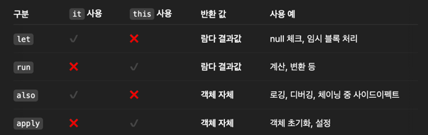

## 널이 될 수 있는 값

**다루는 내용**
- 널이 될 수 있는 타입
- 널이 될 가능성이 있는 값을 다루는 구문의 문법
- 널이 될 수 있는 타입과 널이 될 수 없는 타입의 변환
- 코틀린의 널 가능성 개념과 자바 코드 사이의 상호 운용성

### 널 가능성: NPE 피하기
- 널 가능성은 NPE 오류를 피할 수 있도록 한 코틀린 타입 시스템이다
- 자바 사용 시 런타임에서 마주하는 `java.lang.NullPointerException`을 컴파일 시점으로 옮길 수 있게 해준다
- 널이 될 수 있는지 여부를 타입 시스템에 추가해서 컴파일러가 컴파일 시 미리 감지하도록 한다
- 10억짜리 에러라 불리는 NPE를 피할 수 있는 아주 좋은 타입 시스템

### 널이 될 수 있는 타입
- 프로퍼티나 변수에 null을 허용하려면 타입 이름 뒤에 '?'를 붙여 널이 될 수 있는 타입임을 명시해야 한다
```kotlin
fun strLen(s: String) = s.length
strLen(null) // 컴파일 에러: Null can not be a value of a non-null type String 
```

- 널이 될 수 있는 타입이 지정되면 NPE가 발생할 수 있는 메서드를 호출할 수 없게 되어 NPE를 방지할 수 있다
```kotlin
fun strLen(s: String?) = s.length 
// 컴파일 에러: Only safe (?.) or non-null asserted (!!.) calls are allowed on a nullable receiver of type String?
```

- 널이 될 수 있는 값을 널이 될 수 없는 타입의 변수에 대입할 수 없다.
```kotlin
val x: String? = null
val y: String = x
// 컴파일 에러: Null can not be a value of a non-null type String
```

- 널이 될 수 있는 타입의 값을 널이 될 수 없는 타입의 파라미터를 받는 함수에 전달할 수 없다. 
```kotlin
fun strLen(s: String) = s.length
val x: String? = null
println(strLen(x))
// 타입이 일치하지 않습니다. 필요 항목: String 발견된 항목: String?
```
- 즉 같은 타입 이름이어도 뒤에 '?' 여부에 따라 완전히 다른 타입으로 취급된다**

**널이 될 수 있는 값 다루기**
- 제약이 많은 널이 될 수 있는 값을 null과 비교해서 null이 아님을 증명하면 컴파일러는 그 사실을 기억하고 널이 아닌 타입처럼 사용할 수 있다
```kotlin
fun strLenSafe(s: String?) = 
    if (s != null) s.length else 0 // s가 null이 아님이 증명되어서 s.length가 가능한 것
```

### 타입의 의미 자세히 살펴보기
**Java 타입 시스템의 문제점**
- 자바에서 참조 타입 변수는 해당 타입의 객체를 참조하거나 null일 수 있지만 null은 어떤 타입의 인스턴스도 아니라서 런타임에서는 타입 시스템과는 별개로 null을 전혀 다른 존재로 취급한다.
  - 실제로 `instanceof` 연산자는 피연산자가 `null`인 경우 항상 `false`를 반환하는데 이는 `null`을 어떤 타입의 인스턴스로도 보지 않는다는 뜻이다
- 참조 타입에 null이 들어갈 수 있는 이상, 타입만으로는 메서드 호출이 안전한지 알 수 없다. 
  - null 여부를 항상 검사해주지 않으면 실행 시점에 NPE가 발생할 수 있는 것

**NPE를 다루는 다른 방법**
- 자바에도 NPE를 해결하기 위해 `@Nullable`이나 `@NotNull`과 같은 어노테이션을 제공한다
- 어노테이션을 활용해 NPE가 발생할 수 있는 위치를 찾아주는 도구도 있다 (ex: 인텔리제이 코드 검사기)
  - 표준 자바 컴파일 절차의 일부는 아니기에 일관성있게 적용된다는 보장은 없다
- 절대 null을 안 쓰고 `Optional`처럼 null을 감싼 래퍼 타입을 사용하는 방법도 있다
  - 코드가 지저분해지고 실행 시점에 성능이 저하될 수 있긴하다

**우수한 Kotlin 타입 시스템**
- 널이 될 수 있는 타입과 그렇지 않은 타입을 구분해 명확하게 가능한 연산들을 구분한다
- 실행 시점에 NPE가 발생할 수 있는 연산을 미리 판단하고 아예 연산을 금지시킬 수 있다
- 실행 시점에는 널이 될 수 있는 타입이나 널이 아닌 타입의 객체는 같다
  - 즉, 널이 될 수 있는 타입은 널이 아닌 타입을 감싼 래퍼 타입이 아니라서 실행 시점에 부가 비용이 들지 않는다

### null 검사와 호출을 동시에 ?!
- 세이프 콜 `?.`을 사용하면 null 검사와 메서드 호출을 한 연산으로 수행할 수 있다
- 세이프 콜 연산자는 null이 아닐 때만 메서드를 호출하고 null이면 null을 반환한다
- 세이프 콜을 연쇄적으로 사용하면 null이 아닌 객체를 찾을 때까지 계속 호출할 수도 있다
```kotlin
class Employee(val name: String, val manager: Employee?)

fun managerName(employee: Employee): String? = employee.manager?.name

fun main() {
    val ceo = Employee("Da Boss", null)
    val developer = Employee("Bob Smith", ceo)

    println(managerName(developer)) // Da Boss
    println(managerName(ceo)) // null
}
```

### 엘비스 연산자 `?:`
- 엘비스 연산자를 사용하면 `null` 대신 사용할 기본값을 제공할 수 있다
- 세이프 콜과 함께 사용하면 null이 아닐 때는 메서드를 호출하고 null이면 기본값을 반환한다
```kotlin
fun strLenSafe(s: String?) = s?.length ?: 0

fun main() {
    println(strLenSafe("abc")) // 3
    println(strLenSafe(null)) // 0
}
```

**엘비스 연산자(`?:`)의 기본값은 표현식(expression)이면 전부 가능**
- `return`이나 `throw`도 expression이기 때문에 기본값으로 사용할 수 있다
  - 함수의 인자로 들어온 값이 null일 경우 즉시 반환하거나 예외를 던져 전제 조건을 명확하게 검사하는데 유용하다
```kotlin
class Address(val streetAddress: String, val zipCode: Int, val city: String, val country: String)

class Company(val name: String, val address: Address?)

class Person(val name: String, val company: Company?)

fun printShippingLabel(person: Person) {
    val address = person.company?.address
        ?: throw IllegalArgumentException("No address")

    with(address) {
        println(streetAddress)
        println("$zipCode, $city, $country")
    }
}

fun main() {
    val address = Address("Elsestr, 47", 80687, "Munich", "Germany")
    val company = Company("JetBrains", address)
    val person = Person("John Doe", company)

    printShippingLabel(person)
    // Elsestr, 47
    // 80687, Munich, Germany

    printShippingLabel(Person("John Doe", null))
    // IllegalArgumentException: No address
}
```

### 안전한 타입 캐스를 위한 `as?`
- `as`는 지정한 타입으로 변환하는데 이 때 변환이 불가능하면 `ClassCastException`이 발생한다
  - 물론 'is'로 먼저 변환이 가능한지 검사한 뒤에 `as`로 캐스트해 방지할 수 있다
- `as?`를 사용하면 자바의 `instanceof`와 비슷하게 변환이 불가능하면 null을 반환한다 

**안전한 캐스트를 위해선 보통 `as?`로 캐스트를 시도하고 `?:`로 실패한 경우를 대비한다**
```kotlin
class Person(val firstName: String, val lastName: String) {
    override fun equals(other: Any?): Boolean {
        val otherPerson = other as? Person ?: return false // 안전한 캐스트 시도
        return otherPerson.firstName == firstName && otherPerson.lastName == lastName // 인전한 캐스트 성공 이후엔 스마트 캐스트된 상태인 Person으로 사용 가능
    }
}

fun main() {
    val p1 =    Person("John", "Doe")
    val p2 =    Person("John", "Doe")
    val p3 =    Person("Jane", "Doe")

    println(p1 == p2) // true
    println(p1 == p3) // false

    println(p1.equals(null)) // false
    println(p1.equals("abc")) // false
}
```

### 절대 널이 아니야 `!!`
- 널이 될 수 있는 타입이지만 개발자가 절대 널이 아님을 확신할 때 `!!`를 사용해 널이 아닌 타입으로 강제로 변환할 수 있다
- 개발자의 판단으로 null이 아님을 단언하는 것이므로 null일 경우 예외가 발생해도 감수하겠다는 의미를 가진다
  - 마치 컴파일러의 안전 장치를 무시하고 떼쓰는 느낌이라 코틀린 설계자들은 최소한으로 사용하길 권장한다
- 어떤 함수가 값이 `null`이 아님을 이미 체크했지만 다른 함수를 호출해도 컴파일러는 여전히 null일 수 있다고 판단할 때가 있는데 보통 이럴 때 `!!`를 사용해 강제로 널이 아님을 단언한다
```kotlin
class SelectableTextList(
    val contents: List<String>,
    var selectedIndex: Int? = null
)

class CopyRowAction(val list: SelectableTextList) {
    fun isActionEnabled() = list.selectedIndex != null

    // isActionEnabled()가 true일 때만 호출한다고 가정
    fun executeCopyRow() {
        val index = list.selectedIndex!!   // 절대 null이 아님을 단언
        // val index = list.selecetedIndex ?: return 중복 검증이지만 더 안전할 수 있다
        val value = list.contents[index]
        println("Copying $value")
    }
}
```

**널에 대해 `!!`를 사용해 예외가 발생했을 경우 어떤 식에서 발생했는지는 기록되지 않는다**
- 스택 트레이스에는 어떤 파일의 몇 번째 줄인지에 대한 정보만 들어있으므로 `!!`를 사용할 때에는 한 줄에 연쇄적으로 사용하지 않는 것이 좋다
```kotlin
person.company!!.address!!.country // 어떤 식에서 발생한 NPE인지 알 수 없다
```

### `let` 함수
```kotlin
@kotlin.internal.InlineOnly
public inline fun <T, R> T.let(block: (T) -> R): R {
    contract {
        callsInPlace(block, InvocationKind.EXACTLY_ONCE)
    }
    return block(this)
}
```
- `let`은 인라인 함수로 수신 객체에 대해 람다를 받아 람다 결과를 반환한다 
- `T` 타입의 수신 객체 `this`에 확장함수 형태로 붙어서 사용된다
- `contract`는 코틀린의 계약 시스템으로 컴파일러에게 힌트를 주는 정보이다
  - `let`의 경우 block 람다가 정확히 한번 호출될 것임을 알려주고 있다
- 수신 객체 `this`는 block에 전달해서 실행 결과로 반환한다

**세이프 콜(`?.`)로 `let` 함수 호출해 널 안전하게 작업하기**
- 세이프 콜을 통해 식이 null인지 검사한 다음 널이 아닌 경우에만 `let` 함수 블럭을 진행할 수 있다
  - 식의 결과를 저장할 변수를 따로 만들 필요 없이 바로 수행할 수 있어 좋다
```kotlin
fun sendEmailTo(email: String) {
    println("Sending email to $email")
}

fun main() {
    var email: String? = "js.lee@naver.com"
    email?.let { sendEmailTo(it) } 
    // Sending email to js.lee@naver.com

    email = null
    email?.let { sendEmailTo(it) }
}
```

**언제 어떤 스코프 함수를 써야할까**



반환값으로 다시 분류해보면
- 람다의 결과를 반환
  - `let`: 전달 받은 객체를 가공해서 새로운 값으로 줄게
  - `run`: 전달 받은 객체를 기준으로 이것저것 계산하고 새로운 값으로 줄게
- 객체 자체를 반환
  - `also`: 전달 받은 객체는 그대로 돌려줄게. 대신 뭔가 확인하거나 출력하기만 할게
  - `apply`: 전달 받은 객체의 속성들만 좀 손보고 그대로 돌려줄게

그럼 `it`이랑 `this` 구분은 어떻게 되는걸까?
- 까보면 `let`, `also`는 수신객체로 일반 객체를(`T`) 받고, `run`, `apply`는 수신객체로 확장 함수 형태인 람다를(`T.()`) 받는다
- 일반 객체 `T`로 인자를 받으면 단순히 넘겨받은 외부 객체이므로`it`으로 접근하고 확장함수 `T.()`로 받으면 그 객체가 나 자신이 되어버리는 느낌이라 `this`로 접근한다(생략가능)
  - 넘겨받은 외부인은 `it`, 확장함수로 내 몸에 합체된 나 자신은 `this`

**책에서의 스코프 함수 활용처**
- 널이 아닌 경우에만 코드 블록을 실행하고 싶으면 `?.let`을 사용하라
- 빌더 스타일 API를 사용해 객체의 프로퍼티를 설정할 때에는 `apply`를 사용하라
- 객체에 어떤 동작을 실행한 후 원래의 객체를 다른 연산에 사용하고 싶을 때에는 `also`를 사용하라
- 객체를 설정한 다음 별도의 결과를 돌려주고 싶을 때에는 `run`을 사용하라

**`run` vs `with`**
- `with`는 `run`과 비슷하게 수신 객체를 기준으로 이것저것 계산하고 마지막 연산의 결과를 반환한다
- 다른 점은 `with`는 확장 함수가 아니며 수신 객체를 인자로 넘겨주고, `run`은 확장함수로 수신 객체로 직접 호출한다는 점이다
- `run`은 객체에서 자연스럽게 체이닝해서 그 객체를 주체로 함수형 스타일로 실행하는 느낌
- `with`는 인자로 넘겨받은 객체에 일들을 시키는 느낌

### 지연 초기화 프로퍼티
- 코틀린은 클래스 안의 널이 아닌 프로퍼티를 생성자 이외의 곳에서 바로 초기화할 수 없다.
- 초기 값을 즉시 줄 수 없다면, nullable 타입을 사용할 수밖에 없다
  - 이러면 모든 접근 시 null 체크(`?`., `!!`)를 강제해야 한다.
- 이를 해결하기 위해 코틀린은 초기화는 나중에 하고 타입은 non-nullable로 유지할 수 있도록 `lateinit var` 키워드를 제공한다 
  - 여기서 `val`은 파이널 필드로 컴파일되며 생성자 안에서 반드시 초기화되어야 해서 사용할 수 없다는 점!
- 만약 지연 초기화로 해두고 초기화 안 하고 접근하면 `UninitializedPropertyAccessException`이 발생한다
```kotlin
class MyService {
    fun performAction() = "Action Done!"
}

@TestInstance(TestInstance.Lifecycle.PER_CLASS)
class MyTest {
    private lateinit var service: MyService // non-null 타입으로 지연 초기화

    @BeforeAll
    fun setUp() {
        service = MyService() // 이 때 프로퍼티 초기화
    }

    @Test
    fun test() {
        assertEquals("Action Done!", service.performAction())
    }
}
```

### 세이프 콜 없이 타입 확장
- 일반적으로는 세이프 콜을 써야 null-safe하게 접근할 수 있는데 nullable한 타입에 대한 확장 함수를 정의하면 세이프 콜 없이 호출할 수 있다
- null 체크 대신 확장함수 호출로 nullable한 수신 객체를 받고 내부에서 null을 처리하게 할 수 있다

**확장함수에서만 가능한 이유**
- 코틀린에서 확장함수는 정적 static 함수로 컴파일 시점에 타입만 보고 확장 함수를 호출할지 결정한다
  - 즉, 인스턴스의 실제 값(null 여부)와 관계 없이 그냥 그 타입이면 확장함수를 호출할 수 있는 것
  - 스스로 수신 객체가 null일 때 어떻게 처리해야하는지 알고 있어서 세이프 콜이 필요없다
- 반면 멤버 호출은 동적으로 진짜 객체 인스턴스에 연결되어 있어야 해서 객체가 null이면 호출 자체가 불가능하다
  - 그래서 멤버 함수의 경우 먼저 null 체크를 한 뒤에 호출해야 한다
```kotlin
// nullable한 타입에 대한 확장함수
fun String?.isNullOrEmpty() = this == null || this.isEmpty() // null 체크를 내부에서 명시적으로

fun main() {
    val str: String? = null
    println(str.isNullOrEmpty()) // null을 넘겨줘도 예외 발생하지 않는다
    println(str.length) // 컴파일 에러
}
```

**null 값에 대해 세이프 콜 없이 `let`을 호출하면?**
- `let`도 nullable한 타입의 값에 대해 호출할 수는 있지만 this가 null인지 판단하지는 않는다
- 따라서 세이프 콜 없이 `let`을 호출하면 null 여부와 관계없이 호출되기 때문에 컴파일 에러가 발생할 수 있다
- 항상 nullalbe한 타입에 대해 `let`을 호출할 때에는 세이프 콜을 사용하는 게 좋다
```kotlin
fun sendEmailTo(email: String) {
    println("Sending email to $email")
}

fun main() {
    val recipient: String? = null
    recipient.let { sendEmailTo(it) }
    // 컴파일 에러: 타입이 일치하지 않습니다.
    // 필요 항목: String 발견된 항목: String?
}
```

### 타입 파라미터의 널 가능성
- 타입 파라미터? 함수나 클래스를 다룰 데이터 타입을 나중에 정할 수 있게 해주는 매개변수
- 코틀린에서 함수나 클래스의 타입 파라미터는 기본적으로 널이 될 수 있다
  - 즉, 모든 타입 파라미터 T는 기본적으로 null을 허용하기에 `T?`와 같은 의미를 가진다

```kotlin
fun <T> printHashCode(t: T) {
    println(t?.hashCode()) // t가 null일 수 있으므로 세이프 콜 필요
}

fun main() {
    printHashCode(null) // T는 Any?로 추론되어 null 허용
}
```

**타입 파라미터에 upper bound 제약 걸기**
- 타입 파라미터가 널이 될 수 없게 하려면 널이 될 수 없는 타입을 upper bound로 지정해 널이 될 수 있는 값을 거부한다
- upper bound로 타입 파라미터로 받을 수 있는 타입의 최상위 타입을 지정하는 것

```kotlin
fun <T : Any> printHashCode(t: T) {
    println(t.hashCode()) // t는 이제 null이 될 수 없으므로 세이프 콜 필요 없음
}

fun main() {
    printHashCode("abc") // 정상 작동
    printHashCode(null)
    // 컴파일 에러: Null can not be a value of a non-null type parameter T
}
```

### 자바와 코틀린의 상호 운용성
- 자바의 코드를 코틀린에서 쓸 때 모든 값에 대해 null 체크가 필요할까?
- 자바도 어노테이션으로 널 가능성을 명시하는데 코틀린도 그 정보를 활용한다
  - `@Nullable String`은 `String?`으로, `@NotNull String`은 `String`으로

**플랫폼 타입**
- 자바에서 코틀린으로 가져온 타입 중 널 관련 정보를 알 수 없는 타입을 플랫폼 타입이라고 한다 
- 코틀린 컴파일러는 플랫폼 타입을 널이 될 수 있는 타입으로도, 널이 될 수 없는 타입으로도 처리할 수 있다
  - 플랫폼 타입 처리에 대한 책임은 개발자에게 있으므로 NPE 발생 가능성 있다
- 플랫폼 타입은 타입 뒤에 `!`가 붙는데 코틀린 코드 자체에서 선언할 수는 없고 자바에서 가져온 플랫폼 타입에 대한 IDE나 컴파일러 오류 메세지에서 확인할 수 있다
```java
public class Person {
    private final String name;
    
    public Person(String name) {
        this.name = name;
    }
    
    public String getName() {
        return name;
    }
}
```
```kotlin
// null 체크 없이 플랫폼 타입 처리
fun yellAt(person: Person) {
    println(person.name.uppercase() + "!!!")
}

// null-safe 플랫폼 타입 처리
fun yellAtSafe(person: Person) {
    println((person.name ?: "Anyone").uppercase() + "!!!")
}

fun main() {
    val nullPerson: Person? = null
    yellAt(nullPerson) // 런타임 에러: Null can not be a value of a non-null type parameter T
    yellAtSafe(nullPerson) // ANYONE!!!
}
```

**자바 라이브러리 사용 시 주의사항**
- 자바 라이브러리를 사용할 때는 문서를 통해 메서드가 null을 반환할 수 있는지 확인해야 한다
- 확실하지 않다면 널이 될 수 있는 타입으로 생각하고 처리하는 것이 안전하다

**왜 안전하게 모든 타입을 nullable하게 처리하지 않고 플랫폼 타입을 도입했을까?**
- 컴파일러가 널 가능성을 판단하지 못하므로 널이 절대 되지 않는 값도 불필요한 널 체크가 필요하다
- 모든 자바 `ArrayList<String>`을 코틀린에서 `ArrayList<String?>?`으로 다루면 매번 원소 접근 시 null 체크와 안전한 캐스팅이 필요하다
  - 널 체크 안전성보다 검사 비용이 커져 실용적이지 않다

### 코틀린에서 자바 메서드를 오버라이드할 때
- 코틀린에서 자바 메서드를 오버라이드할 때 그 메서드의 파라미터와 반환 타입을 nullable or non-null 한지 결정해야 한다
- 둘 다 가능하므로 
```java
interface StringProcessor {
    void process(String value);
}
```
```kotlin
// 널 가능성 없다고 판단하고 오버라이드
class StringPrinter : StringProcessor {
    override fun process(value: String) {
        println(value)
    }
}

// 널 가능성 있다고 판단하고 오버라이드
class NullableStringPrinter : StringProcessor {
    override fun process(value: String?) {
        if (value != null) println(value)
    }
}
```

**자바 코드를 코틀린에서 사용할 때 Tip**
1. 자바 코드를 직접 호출해서 쓰지 말고 한번 래핑해서 사용하자
  - null 체크 후 null 안전하게 사용할 수 있도록 래핑해 단일 메서드로 제공하자
2. 단일 진집점을 만들자
  - 자바 코드 접근은 이 단 하나의 래핑된 코틀린 메서드에서만 일어나게 하자
  - 나중에 자바 코드가 바뀌어도 코틀린은 이 단일 메서드만 수정하면 된다
```java
// Java 코드 (외부 라이브러리, 예: API 응답 DTO)
public class ApiResponse {
    public String getMessage() {
        return null; // 실패하거나 응답이 잘못되면 null
    }
}
```

```kotlin
// 안전한 단일 wrapping 메서드
fun ApiResponse.safeMessage(): String {
    return this.message ?: "(no message)"
}

fun handleApiResponseSafe(response: ApiResponse?) {
    if (response == null) {
      println("(empty response)")
      return
    }
    println(response.safeMessage().uppercase())
}

fun main() {
    val validResponse = ApiResponse()
    val nullResponse: ApiResponse? = null
  
    handleApiResponseSafe(validResponse) // (no message)
    handleApiResponseSafe(nullResponse)  // (empty response)
}
```

