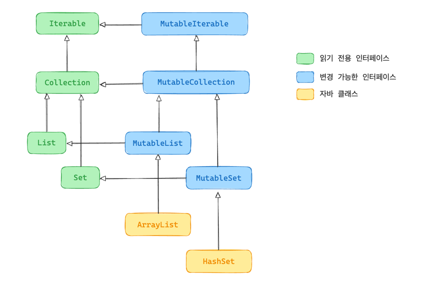

## 기본 타입, 컬렉션, 배열

**다루는 내용**
- 코틀린의 원시 타입 및 기본 타입
- 코틀린 타입과 자바 타입과의 관계
- 코틀린에서의 컬렉션과 배열 및 이들의 널 가능성과 상호운용성 

### 기본 타입

#### 자바에서의 원시 타입과 참조 타입
- 자바에서는 원시 타입(primitive type)과 참조 타입(reference type)을 구분한다
  - 원시 타입(int, boolean, char 등)의 변수에는 그 값이 직접 들어간다
  - 참조 타입(Integer, Boolean, Character 등)의 변수에는 메모리상의 객체 위치가 들어간다
- 자바에서 원시 타입에 대해 메서드를 호출하거나 컬렉션에 담을 수 없다
  - 참조 타입이 필요한 경우 특별한 래퍼 타입으로 원시 타입을 감싸서 사용한다
  - `Collection<int>`가 아닌 `Collection<Integer>`

#### 코틀린에서의 원시 타입과 참조 타입
- 코틀린은 원시 타입과 래퍼 타입을 구분하지 않고 항상 같은 타입으로 취급한다
  - 그렇다면 모든 타입을 항상 객체로 표현하는 것은 아니고 실행 시점에 가장 효율적인 방식으로 표현된다 
  - 대부분의 경우 코틀린의 숫자 타입은 자바의 원시 타입으로 컴파일 되고, 컬렉션과 같은 제네릭 클래스를 사용하는 경우는 래퍼 타입에 해당하는 객체로 컴파일된다

#### 부호 없는 숫자 타입
- 양수를 표현하기 위해 모든 비트 범위를 사용하고 싶을 때 코틀린은 JVM의 일반적인 원시 타입을 확장해 부호 없는 타입을 제공한다
- 부호 없는 숫자 타입들은 상응하는 부호 있는 타입의 범위를 시프트해서 같은 크기의 메모리를 사용해 더 큰 양수 범위를 표현할 수 있게 한다
- 코틀린의 부호 없는 수도 다른 원시 타입과 마찬가지로 필요할 때만 래핑된다
  - JVM 자체는 부호 없는 수에 대한 원시 타입을 제공하지 않지만 인라인 클래스를 통해 추상화를 제공한다
  - 즉, 메모리에는 Int나 Long 그대로 있다가 코드에서 타입 구분할 때만 UInt, ULong 처럼 행동해 성능 손해 없이 부호 없는 수를 다룬다

| 타입 | 크기 | 값의 범위                                  |
|:--|:--|:---------------------------------------|
| `UByte` | 8비트 (2⁸) | 0 ~ 255 (2⁸-1)                         |
| `UShort` | 16비트 (2¹⁶) | 0 ~ 65,535 (2¹⁶-1)                     |
| `UInt` | 32비트 (2³²) | 0 ~ 4,294,967,295 (2³²-1)              |
| `ULong` | 64비트 (2⁶⁴) | 0 ~ 18,446,744,073,709,551,615 (2⁶⁴-1) |

#### 널이 될 수 있는 원시 타입
- 코틀린의 nullable한 타입은(`Int?`) 자바의 원시 타입으로 표현할 수 없기 때문에 자바의 래퍼 타입으로(`Integer`) 컴파일된다
- 코틀린 컴파일러는 두 값이 nullable할 때 무조건 먼저 null 체크한 뒤 일반적인 값으로 다루도록 허용한다
- 자바 클래스를 가져와서 쓸 때에는 그냥 nullable인지 아닌지만 신경 쓰면 된다. 
  - 내부적으로 알아서 `int` or `Integer` 언박싱/박싱해서 컴파일해준다

**제네릭 클래스의 경우**
- 제네릭 클래스의 경우 JVM은 제네릭 타입이 타입 소거 방식으로 구현되기 때문에 타입 파라미터에 원시 타입을 허용하지 않는다
  - 타입 소거 방식? JVM은 제네릭 타입 정보를 컴파일 이후에 버린다. 즉, 런타임에는 타입 인자가 사라지고 Object처럼 다룬다
    ```kotlin
    fun <T> checkType(value: T) {
        if (value is String) { } // OK
        if (value is T) { } // T가 뭔지 모르므로 불가능
    }
    ```
  - 코틀린은 `inline`과 `reified`의 조합으로 이 타입 소거 문제를 피할 수 있다
    - 함수를 인라인하면 타입 파라미터도 복붙으로 삽입될 수 있어서 타입 정보도 런타입까지 살아남게(`reified`) 할 수 있는 것
    ```kotlin
    inline fun <reified T> checkType(value: Any) {
        if (value is T) println("Yes, it's a ${T::class}")
        else println("No, it's not a ${T::class}")
    }
    
    fun main() {
        checkType<String>("Hello") // Yes, it's a class kotlin.String
        checkType<Int>("Hello")    // No, it's not a class kotlin.Int
    }
    ```
- 따라서 제네릭에선 항상 박스 타입을 사용해야 한다

#### 수 변환
- 코틀린은 한 타입의 수를 다른 타입의 수로 자동 변환하지 않기 때문에 명시적으로 변환 메서드를 사용해야 한다
- 코틀린은 Boolean을 제외한 모든 원시 타입에 대해 양방향 변환 함수를 모두 제공한다
  - 표현 범위가 더 좁은 타입으로 변환하면서 값을 벗어나는 경우에는 일부를 잘라내는 함수도 있다

**숫자 리터럴**
- 보통은 변환 함수 호출 필요 없이 타입을 표현하는 문자를 붙여주기만 하면 된다
- 직접 변환하지 않더라도 숫자 리터럴을 타입이 알려진 변수에 대입하거나 인자로 넘기면 컴파일러가 필요한 변환을 자동으로 해준다
- 산술 연산자는 적당한 타입의 값을 받아들일 수 있도록 이미 오버로드되어 있다
  - ex) Int + Long은 Long 기준

| 종류 | 예시                                 | 설명 |
|:--|:-----------------------------------|:--|
| **10진수(Int, Long 기본)** | `123`, `4567`                      | 일반 정수 |
| **Long** | `123L`, `4567L`                    | 끝에 `L` 또는 `l` 추가 |
| **Unsigned(Int, Long)** | `123u`, `4567U`, `123uL`, `4567UL` | `u` 또는 `U` 접미사로 부호 없는 타입 |
| **16진수** | `0x1F`, `0X1F`                     | 접두사 `0x` 또는 `0X` 사용 |
| **2진수** | `0b1010`, `0B1010`                 | 접두사 `0b` 또는 `0B` 사용 |
| **8진수** | (Kotlin은 8진수 지원 X)                 | 사용 불가 (자바는 지원했지만 코틀린은 아님) |
| **부동소수점(Double 기본)** | `123.45`, `1.0e3`, `3.14E-2`       | 지수 표기 가능 (`e`, `E` 사용) |
| **Float** | `123.45f`, `1.0e3f`, `3.14E-2F`    | 끝에 `f` 또는 `F` 추가 |

**문자 리터럴**

| 리터럴 | 의미 |
|:--|:--|
| `'\n'` | 줄바꿈 (New Line) |
| `'\t'` | 탭 (Tab) |
| `'\b'` | 백스페이스 (Backspace) |
| `'\r'` | 캐리지 리턴 (Carriage Return) |
| `'\''` | 작은따옴표 자체 (Single Quote) |
| `'\"'` | 큰따옴표 자체 (Double Quote) |
| `'\\'` | 역슬래시 자체 (Backslash) |


**문자열 변환**
- 문자열을 원시 타입으로 변환하는 여러 함수를 제공하는데 변환에 실패하면 `NumberFormatException`이 발생한다
- `NumberFormatException`를 명시적으로 처리하기 귀찮을 때에는 실패를 `null`로 돌려주는 함수도 있다
- 문자열이 null이 아니고 정확히 단어 true와 같으면(대소문자 구분 X) Boolean `true`로, 그 외에는 `false`로 변환해주는 `toBoolean`도 있다
- 정확히 `true`나 `false`와 일치시키고 싶을 땐 `toBooleanStrict`를 쓰면 일치하지 않을 때 예외를 던져준다


### Any와 Any?
- 자바의 최상위 타입 `Object`이지만 참조 타입만 그 계층에 포함되며 원시 타입은 포함되지 않는다
  - 즉, Object 타입의 객체가 필요한 경우 원시 타입은 래퍼 타입으로 감싸야만 한다
- 코틀린은 모든 타입의 조상 타입으로 `Any` 혹은 `Any?`를 제공하는데 원시 타입과 래퍼 타입 모두 포함된다
  - 자바와 마찬가지로 원시 타입의 값을 `Any`타입의 변수에 대입하면 래퍼 타입으로 자동으로 박싱된다
- `Any`는 `equals`, `hashCode`, `toString` 메서드를 제공하기 때문에 모든 코틀린 클래스가 이 메서드들을 가지고 있다
  - `Any`는 자바의 `Object`로 컴파일되지만 `Object`의 `wait`나 `notify`같은 메서드들은 `Any`에서 사용할 수 없다 (사용하려면 캐스팅 필요)

### Unit: 코틀린의 void
- 코틀린은 자바의 `void`와 같은 역할을 하는 `Unit`이라는 타입을 제공한다
  - 실제로 제네릭 함수를 오버라이드하지 않는 한 자바 `void`로 컴파일되기 때문에 성능 손실 없다
  - 코틀린 쓸 땐 타입처럼 쓰고 자바에서 쓸 땐 `void`처럼 동작

**`void`와 다른 `Unit`만의 특성**
1. 실제로 존재하는 일반 타입이다
   - 타입 인자(제네릭)으로 사용할 수 있고, 값으로 전달하거나 저장할 수도 있다
2. 암시적으로 `Unit` 값을 반환한다
   - `Unit` 타입 함수는 명시적으로 `return Unit`을 적지 않아도 자동으로 `Unit` 객체를 반환한다
3. 제네릭 함수에서 타입 인자로 사용 가능
   - 자바의 경우 값 없음을 `Void`로 표현했지만 `Void`는 진짜 타입이 아니라서 메모리에 어떤 실제 값을 담을 수 없는 껍데기 타입이라 반드시 `return null`을 해줘야 한다
   - 코틀린은 실제 값이 존재하는 정식 타입인 `Unit`을 제네릭 타입 인자로 넣을 수 있다
```kotlin
interface Processor<T> {
    fun process(): T
}

class NoResultProcessor : Processor<Unit> {
    override fun process() {    // Unit을 반환하지만 타입 지정 필요 없다
        // 업무 처리 코드 ..       // 명시적으로 return할 필요 없다
    }
}
```

### Nothing 타입
- 코틀린은 반환값 개념 자체가 의미없는 함수가 일부 존재하는데 이런 함수의 반환 타입을 `Nothing`으로 지정한다
  - ex) 테스트 라이브러리 `fail`, 무한 루프 함수 ...
- `Nothing`은 절대 정상적으로 값을 반환하지 않는다는 의도를 코드에 명시적으로 나타낼 때 사용한다
  - 코틀린 타입 시스템 안에서 정상적으로 끝나지 않을 함수라는 것을 컴파일 타임에 보장할 수 있게 한다
- `Nothing`을 반환하는 함수를 엘비스 연산자(`?:`)와 함께 사용해서 전제 조건을 검사할 수 있다
  - Nothing 이후 코드가 도달 불가로 인식되어서 컴파일러가 경고하거나 최적화할 수 있다
```kotlin
fun fail(message: String): Nothing {
    throw IllegalArgumentException(message)
}

fun main() {
    val name: String = inputName ?: fail("No name") // null이라면 이후 코드 unreachable
    // null이 아니라면 안전하게 String 타입 확정 (스마트 캐스트)
}
```

---

## 컬렉션과 배열

### 널 여부에 따른 컬렉션
- 코틀린은 컬렉션을 다룰 때 컬렉션과 그 안 요소 각각에 대해 널 가능성을 구분한다
  - 컬렉션 자체의 null 여부, 컬렉션 안 요소의 null 여부를 다 구분해서 타입을 정한다
  - ex) `List<Int>` `List<Int?>` `List<Int>?` `List<Int?>?`

**널이 될 수 있는 값으로 이뤄진 컬렉션**
```kotlin
fun readNumbers(text: String): List<Int?> {
    return text.lineSequence()
        .map { it.toIntOrNull() }
        .toList()
}
```

**널이 될 수 있는 값으로 이뤄진 컬렉션의 널을 걸러내기**
- `filterNotNull`을 사용하면 null이 아닌 값만 필터링할 수 있다
- 널을 걸러낸 상태이므로 널이 아님을 보장할 수 있어 새로운 컬렉션 `List<Int>`로 반환된다
```kotlin
fun readNumbers(text: String): List<Int> {
    return text.lineSequence()
        .map { it.toIntOrNull() }
        .filterNotNull()
        .toList()
}
```

### 읽기 전용 및 가변 컬렉션
- 코틀린은 자바와 다르게 컬렉션 안의 데이터에 접근하는 인터페이스와 컬렉션 안의 데이터를 변경하는 인터페이스를 분리했다

**`kotlin.collections.Collection`**
- 읽기 전용 컬렉션 (ex: `List`, `Set`, `Map`)
- 컬렉션 안의 원소에 대해 이터레이션, 크기, 검사 등 여러 연산을 수행할 수 있지만 원소를 추가하거나 제거할 수는 없다

**`kotlin.collections.MutableCollection`**
- 가변 컬렉션 (ex: `MutableList`, `MutableSet`, `MutableMap`)
- 일반 인터페이스인 `kotlin.collections.Collection`를 확장하면서 원소를 추가, 삭제 등의 데이터를 수정할 수 있는 메서드를 제공한다


**`var` 대신 `val`을 사용하는 것처럼 가능하면 읽기 전용인 `Collection`을 사용하자**
- 컬렉션을 다룰 때도 가능하면 읽기 전용 컬렉션을 사용해 오직 읽기만 가능하도록 하는 것이 좋다

**하지만 읽기 전용 컬렉션이 불변하다는 뜻은 아니다**
- 코틀린의 읽기 전용 인터페이스(`List`, `Set`, 등)은 그 타입을 통해서는 변경할 수 없다는 뜻일 뿐이고 실제로 불변이라는 보장은 없다
  - 즉, 내가 읽기 전용으로 보고 있는 `List`는 수정 못하지만 다른 누군가가 같은 인스턴스를 `MutableList`로 변경할 수도 있는 것이다
  - 즉, 뷰만 제공하는 것이지 그 뷰 안 객체를 다른 누군가가 변경할 수 있는 것
- 실행 도중에 이렇게 컬렉션이 바뀌게 되면 `ConcurrentModificationException`과 같은 오류가 발생할 수도 있다
  - 전달받은 컬렉션이나 객체가 외부에서 변경될 위험이 있을 때 방어적 복사를 통해 안전하게 사용하자
- 특히 멀티 스레드 환경에서 데이터들이 동시에 수정되면서 예상치 못한 오류를 만날 수 있다 

**멀티 스레드에서 일관성있게 스레드 안전하게 컬렉션 다루기**
1. `synchronized` 블록 동기화
   - 같은 프로세스 안의 스레드들끼리 동시 접근을 막아준다
   - 즉, JVM 안에서만 유효하기에 같은 서버, 같은 메모리 안에서만 안전하다
2. `Immutable` 컬렉션 활용
  - 표준 라이브러리에는 없지만 `kotlinx.collections.immutable` 라이브러리에서 불변 컬렉션 인터페이스를 제공한다
  - 아예 컬렉션 내용 자체를 변경할 수 없게 만들어서 데이터 수정 시도 자체를 막는다
3. `Concurrent` 컬렉션 활용
  - 자바의 `java.util.concurrent` 컬렉션을 활용해 동시 접근을 막는다
    - ex) `ConcurrentHashMap`, `CopyOnWriteArrayList` 등

**분산 시스템의 경우 여러 파드가 각각 서로 다른 프로세스를 띄우기에 서로 메모리를 공유하지 않아서 무용지물인 점 유의하자**
  - 위 3가지 전부 단일 프로세스에서의 멀티 스레드 환경에서의 안전성을 보장하는 방법일 뿐이다
  - 레디스 분산락같은 도구를 활용해 여러 프로세스에 공유되는 락을 걸어줄 필요가 있다


### 코틀린 컬렉션과 자바 컬렉션의 밀접한 관계
- 모든 코틀린 컬렉션은 자바 컬렉션 인터페이스의 인스턴스로 대응된다
- 따라서 코틀린과 자바 사이를 오갈 때 따로 래퍼 클래스를 만들거나 복사하거나 변환할 필요가 없다

**코틀린 컬렉션 인터페이스 계층 구조**


- 코틀린은 자바 표준 클래스가(`ArrayList`, `HashSet` 등) 각각 코틀린의 인터페이스를(`MutableList`, `MutableSet` 등) 상속한 것처럼 취급한다
- 이런 방식으로 코틀린은 자바 표준 클래스를 읽기 전용 인터페이스와 변경 가능 인터페이스를 분리한다

**컬렉션 생성 함수**

| 타입 | 읽기 전용 생성 함수 | 가변 생성 함수 | 빌더 기반 생성 함수(가변) |
|:---|:---|:---|:----------------|
| `List`, `MutableList` | `listOf(vararg T)` | `mutableListOf(vararg T)`, `arrayListOf(vararg T)` | `buildList { }` |
| `Set`, `MutableSet` | `setOf(vararg T)` | `mutableSetOf(vararg T)`, `hashSetOf(vararg T)` | `buildSet { }`  |
| `Map`, `MutableMap` | `mapOf(vararg Pair<K, V>)` | `mutableMapOf(vararg Pair<K, V>)`, `hashMapOf(vararg Pair<K, V>)` | `buildMap { }`  |

**자바와 코틀린 혼용 시 주의점**
```kotlin
fun provideNames(): List<String> {
    return mutableListOf("Alice", "Bob", "Charlie")
}
```
```java
// Java 코드
import java.util.List;

public class JavaSide {
    public static void main(String[] args) {
        List<String> names = KotlinCodeKt.provideNames();
        names.add("Diana"); 
        names.set(0, null); // 자유롭게 수정 가능한 문제
        System.out.println(names); // 출력: [null, Bob, Charlie, Diana]
    }
}
```
- 자바는 읽기 전용과 가변 컬렉션을 구분하지 않아서 코틀린에서 읽기 전용으로 해도 자바는 그 컬렉션을 변경할 수 있다
- 즉, 컬렉션을 변경하는 자바 메서드에게 읽기 전용 컬렉션을 넘겨도 코틀린 컴파일러가 이를 막을 수가 없다
  - 요소가 null이 불가하도록 한 컬렉션을 넘겨줬을 때 자바 메서드가 null을 넣어버릴 수도 있는 것
- 컬렉션을 자바로 넘기는 코틀린 코드가 있다면 그 타입이 무력화됨을 주의해야 하며 자바 쪽 코드가 이 컬렉션을 수정할 수도 있다는 걸 염두에 두고 타입 선언을 해야한다


### 자바에서 선언한 컬렉션은 코틀린에서 플랫폼 타입으로 취급된다
- 널 관련 정보가 없기에 컴파일러는 어느쪽으로도 사용할 수 있도록 플랫폼타입으로 허용한다
- 컬렉션 타입이 시그니처에 들어간 자바 메서드 구현을 오버라이드하려는 경우 읽기 전용 컬렉션과 가변 컬렉션의 차이가 문제가 도리 수 있다
  - 이런 경우 오버라이드하려는 메서드의 자바 컬렉션 타입을 어떤 코틀린 컬렉션 타입으로 표현할지 명시적으로 정해줘야 한다

**타입 선택 기준**
1. 컬렉션이 null이 될 수 있는가?
2. 컬렉션의 원소가 null이 될 수 있는가?
3. 컬렉션이 읽기 전용인가? 가변인가?

**자바 인터페이스 구현 예제 1)**
```java
interface FileContentProcessor {
    void processContents(
            File path,
            byte[] binaryContents,
            List<String> textContents
    );
}
```
1. 일부 파일이 이진 파일이고 이진 파일은 텍스트로 표현할 수 없는 경우가 있으니까 리스트는 nullable하게
2. 파일의 각 줄은 null이 될 수 없으므로 리스트의 원소는 null이 될 수 없도록
3. 이 리스트는 파일의 내용을 표현하며 그 내용을 바꿀 필요가 없으므로 읽기 전용으로

```kotlin
class FileIndexer : FileContentProcessor {
    override fun processContents(
        path: File,
        binaryContents: ByteArray?,
        textContents: List<String>?
    ) {
        // ..
    }
}
```

**자바 인터페이스 구현 예제 2)**
```java
interface DataParser<T> {
    void parseData(
            String input,
            List<T> output,
            List<String> errors
    );
}
```
1. 호출하는 쪽에서 항상 오류 메세지를 받아야 하므로 errors는 읽기 전용으로
2. 출력 리스트의 모든 원소마다 오류가 발생하는 것은 아니므로 errors의 원소는 nullable하게
3. 구현 코드에서 원소를 추가할 수 있어야 해서 가변으로

```kotlin
class PersonParser : DataParser<Person> {
    override fun parseData(
        input: String,
        output: MutableList<Person>,
        errors: MutableList<String?>
    ) {
        // ..
    }
}
```

**자바 인터페이스나 클래스가 어떤 맥락에서 어떻게 활용되는지 정확하게 판단 후에 코틀린으로 구현해야 한다** 


### 성능 및 상호운용을 위해 객체의 배열이나 원시 타입의 배열 만들기
- 코틀린 `Array<T>`는 타입 파라미터를 가진 제네릭 클래스이다
- 배열의 원소 타입은 타입 파라미터로 결정되며 배열의 크기는 고정된다

**왜 배열이 컬렉션보다 성능이 좋은가?**

| 구분 | 배열 (Array) | 컬렉션 (List, Set 등) |
|:---|:---|:---|
| 메모리 구조 | 연속된 메모리 블록 | 내부적으로 포장(wrapper)된 객체 구조 |
| 접근 속도 | O(1), 바로 인덱스 접근 | O(1) 대부분 가능하지만 추가 오버헤드 존재 |
| 메모리 사용량 | 낮음 (원소만 저장) | 높음 (객체 + 메타데이터 저장) |
| 생성 비용 | 낮음 (크기만 지정) | 높음 (구조 확장/포장 비용) |
| 추가/삭제 지원 | 불가 (고정 크기) | 가능 (가변 크기 구조) |
| 최적 사용 케이스 | 대량의 데이터를 빠르게 읽을 때 | 데이터 추가/삭제가 필요한 경우 |

**배열을 만드는 다양한 방법**
1. `arrayOf(vararg T)`
   - 인자로 받은 원소들을 포함한 배열 생성
2. `arrayOfNulls<T>(size: Int)`
   - 지정한 크기만큼 null로 초기화된 배열 생성
   - 원소 타입이 nullable한 타입일 경우에만 사용 가능
3. `Array(size: Int, init: (Int) -> T)` 생성자
   - 배열 크기와 람다를 받아 람다를 호출해서 각 배열 원소를 초기화한다
   - 람다는 배열 원소의 인덱스를 인자로 받아 배열의 해당 위치에 들어갈 원소를 반환한다
   - 원소가 널이 아닌 배열을 만들어야 하는 경우 사용한다
```kotlin
fun main() {
    val letters = Array<String>(26) { i -> ('a' + i).toString() }
    println(letters.joinToString(""))
    // 출력: abcdefghijklmnopqrstuvwxyz
}
```

**컬렉션을 배열로 변환하는 방법**
```kotlin
fun main() {
    val strings = listOf("a", "b", "c")
    println("%s/%s/%s".format(*strings.toTypedArray())) // 출력: a/b/c
}
```
- `toTypedArray()`를 사용하면 컬렉션을 배열로 변환할 수 있다


**JVM 상에서는 항상 객체 배열(`Object[]`)로 컴파일된다**
- 즉, `Array<Int>`는 사실 내부적으로 `Array<Integer>` 박싱된 타입으로 동작한다
- 원시 타입을 배열로 담고 싶어도 박싱된 객체 타입으로 저장되기에 성능이 느려질 수 있다.
- 따라서 원시 타입을 위한 특별한 배열 클래스를 제공한다

**원시 타입의 배열을 만드는 방법**
1. 각 배열 타입의 생성자는 size 인자를 ㅂ다아 해당 워닛 타입의 기본값으로 초기화된 size 크기의 배열을 반환한다
```kotlin
val numbers = IntArray(5)
println(numbers.joinToString()) // 출력: 0, 0, 0, 0, 0
```

2. 팩토리 함수는 여러 값을 가변 인자로 받아 그런 값이 들어간 배열을 반환한다
```kotlin
val numbers = intArrayOf(1, 2, 3, 4, 5)
println(numbers.joinToString()) // 출력: 1, 2, 3, 4, 5
```

3. 크기와 람다를 인자로 받는 다른 생성자를 사용한다
```kotlin
val squares = IntArray(5) { i -> (i + 1) * (i + 1) }
println(squares.joinToString()) // 출력: 1, 4, 9, 16, 25
```

4. 이미 박싱된 값이 들어있는 컬렉션이나 배열인 경우 확장함수 활용해 변환한다
```kotlin
val boxedNumbers: List<Int> = listOf(1, 2, 3, 4, 5)
val numbers = boxedNumbers.toIntArray()
```

**왜 원시 타입 배열이 빠른가?**

| 구분 | Array<Int> (객체 배열) | IntArray (원시 타입 배열) |
|:---|:---|:---|
| 저장 방식 | 박싱된 객체(Integer) 배열 (Object[]) | 원시 타입(int[]) 직접 저장 |
| 메모리 사용량 | 높음 (객체 참조 + 값) | 낮음 (값만 저장) |
| 접근 속도 | 느림 (객체 참조를 따라가야 함) | 빠름 (바로 값 읽기) |
| GC 부담 | 큼 (객체 수 많음) | 적음 (순수 데이터만 존재) |
| 실행 성능 | 약 1.5~2배 느림 | 빠름 |
| 최적 사용 케이스 | 복합 타입 관리 | 대량 숫자 데이터 처리, 고성능 요구 시 |

**컬렉션에 사용할 수 있는 모든 확장함수를 배열에도 제공한다**
- filter, map 등의 확장 함수를 배열에도 똑같이 사용할 수 있다
  - 원시 타입인 원소로 이루어진 배열도 마찬가지

**배열의 요소와 함께 인덱스도 다루고 싶다면? `forEachIndexed`**
- 배열의 모든 원소에 대해 인자로 받은 람다를 호출해준다
- 이 때 배열의 원소와 그 원소의 인덱스를 람다에게 인자로 전달한다
```kotlin
fun main(args: Array<String>) {
    args.forEachIndexed { index, element ->
        println("args[$index] = $element")
    }
}
```

### **왜 코틀린은 배열보다 컬렉션을 권장할까?**
- 코틀린은 편의성과 안전성, 가독성을 더 중요하게 생각하기 때문에
  특별히 성능이 중요한 경우가 아니라면, 기본적으로 배열보다 컬렉션(List, Set, Map)을 사용하는 것을 권장한다.

| 비교 항목 | 배열 (Array) | 컬렉션 (List, Set 등) |
|:--|:--|:--|
| 구조 | 고정 크기, 연속된 메모리 | 가변 크기, 동적 구조 |
| 접근 속도 | 매우 빠름 (O(1)) | 빠름 (O(1)), 추가적인 오버헤드 |
| 크기 조정 | 불가 (고정) | 가능 (동적으로 확장/축소) |
| 제공 기능 | 최소한의 기능 (get, set) | 다양한 고차 함수(map, filter, etc) 제공 |
| 읽기/쓰기 구분 | 불가능 (항상 가변) | 읽기 전용(List)과 가변(MutableList) 구분 가능 |
| 코드 가독성 | 낮음 | 높음 (표현력 풍부) |
| 메모리 효율 | 높음 (원시 타입 배열 기준) | 상대적으로 높지 않음 |
| 추천 상황 | 성능 최적화가 필요한 경우, 자바 상호운용성 필요 시 | 일반적인 개발 상황(앱/서버 등) |

