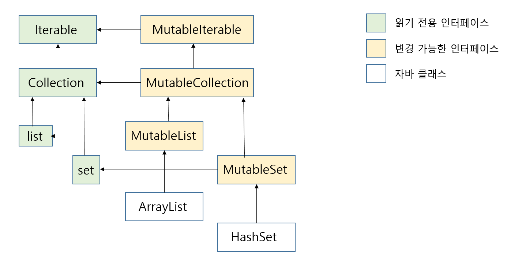

# 기본 타입, 컬렉션, 배열
- 원시 타입과 다른 기본 타입 및 자바 타입과의 관계
- 코틀린 컬렉션과 배열 및 이들의 널 가능성과 상호운용성

## 1. 원시 타입과 기본 타입

자바와 달리 코틀린은 원시 타입과 래퍼 타입을 구분하지 않아 편리하다. 자바는 참조 타입이 필요한 경우 래퍼 타입으로 원시 타입을 감싸 사용하지만, 코틀린은 따로 구분하지 않고 메서드를 호출할 수 있다.

### 정수, 부동소수점 수, 문자, 불리언 값을 원시 타입으로 표현

- 정수 타입: Byte, Short, Int, Long
- 부동소수점 숫자 타입: Float, Double
- 문자 타입: Char
- 불리언 타입

운시 타입과 참조 타입이 같다고 코틀린이 항상 객체로 표현하지는 않는다. 실행 시점에 숫자 타입은 가능한 한 가장 효율적인 방식으로 표현된다. 대부분의 경우 코틀린의 Int 타입은 자바 int 타입으로 컴파일된다.

### 양수를 표현하기 위해 모든 비트 범위 사용: 부호 없는 숫자 타입

양수를 표현하기 위해 모든 비트 범위를 사용하고 싶을 때가 있다. 이런 경우 코틀린은 JVM의 일반적인 원시 타입을 확장해 부호 없는 타입을 제공한다.

| 타입 | 크기 | 값 범위 |
| --- | --- | --- |
| UByte | 8비트 | 0 ~ 255 |
| UShort | 16비트 | 0 ~ 65535 |
| UInt | 32비트 | 0 ~ 2^32 - 1 |
| ULong | 64비트 | 0 ~ 2^64 - 1 |

### 널이 될 수 있는 기본 타입: Int?, Boolean? 등

null 참조를 자바의 참조 타입의 변수에만 대입할 수 있기 때문에 널이 될 수 있는 코틀린 타입은 자바 원시 타입으로 표현할 수 없다. 코틀린에서 널이 될 수 있는 원시 타입을 사용하면 그 타입은 자바의 래퍼 타입으로 컴파일된다.

```kotlin
data class Person(val name: String, val age: Int? = null) {
    fun isOlderThan(other: Person): Boolean? {
        if (age == null || other.age == null)
            return null
        return age ? other.age
    }
}

fun main() {
    println(Person("Sam", 35).isOlderThan(Person("Amy", 42))) // false
    println(Person("Sam", 35).isOlderThan(Person("Amy"))) // null
}
```

### 수 변환

코틀린과 자바의 가장 큰 차이점 중 하나는 수를 변환하는 방식이다. 코틀린은 한 타입의 수를 다른 타입의 수로 자동 변환하지 않는다.

```kotlin
val i = 1
val l: Long = i // Error: type mismatch 컴파일 오류 발생
val l: Long = i.toLong
```

코틀린은 모든 원시 타입에 대해 `toByte()`, `toShort()`, `toChar()` 등의 변환 함수를 제공한다.

숫자 리터럴을 사용할 때는 보통 변환 함수를 호출할 필요가 없다. 상수 뒤에 타입을 표현하는 문자를 붙이면 변환이 필요 없다. 또한, 직접 변환하지 않더라도 숫자 리터럴을 타입이 알려진 변수에 대입하거나 함수에게 인자로 넘기면 컴파일러가 필요한 변환을 자동으로 넣어준다.

산술 연산자는 적당한 타입의 값을 받아들일 수 있도록 오버로드 돼있다.

```kotlin
fun printALong(l: Long) = println(l)
fun main() {
    val b: Byte = 1
    val 1 = b + 1L
    printALong(42)
}
```

코틀린 산술 연산자에서도 자바와 똑같이 숫자 연산 시 오버플로나 언더풀로가 발생할 수 있다.

```kotlin
fun main() {
    println(Int.MAX_VALUE + 1) // -2147483648
    println(Int.MIN_VALUE - 1) // 2147483647
}
```

### Any와 Any?: 코틀린 타입 계층의 뿌리

자바에서 `Object` 가 클래스 계층의 최상위 타입이듯 코틀린에서는 `Any` 타입이 모든 널이 될 수 없는 타입의 조상 타입이다.

자바에서는 참조 타입만 Object를 정점으로 하는 타입 계층에 포함되며, 원시 타입은 그렇지 않다. 하지만 코틀린에서 Any가 Int 등의 원시 타입을 포함한 모든 타입의 조상 타입이다.

원시 타입 값을 Any 타입에 대입하면 자동으로 값을 객체로 감싼다.

```kotlin
val answer: Any = 42 // Any가 참조 타입이기 때문에 42가 박싱된다.
```

코틀린에서 널을 포함하는 모든 값을 대입할 변수를 선언하려면 `Any?` 을 사용해야 한다.

### Unit 타입: 코틀린의 void

코트린 `Unit` 타입은 자바 `void` 와 같은 기능을 한다. 코틀린 함수의 반환 타입이 `Unit` 이고 그 함수가 제네릭 함수를 오버라이드하지 않는다면 그 함수는 내부에서 자바 `void` 함수로 컴파일된다.

`Unit` 은 void와 달리 `Unit` 을 타입 인자로 쓸 수 있다. 제네릭 파라미터를 반환하는 함수를 오버라이드하면서 반환 타입으로 Unit을 쓸 때 유용하다.

```kotlin
interface Processor<T> {
    fun process(): T
}

class NoResultProcessor: Processor<Unit> {
    override fun process() {
       // 명시적으로 return 할 필요가 없다.
    }
}
```

### Nothing 타입: 이 함수는 결코 반환되지 않는다.

`Nothing` 타입은 아무 값도 포함하지 않는다. 따라서 `Nothing` 은 함수의 반환 타입이나 반환 타입으로 쓰일 타입 파라미터로만 쓸 수 있다. 컴파일러는 `Nothing` 이 반환 타입인 함수가 정상 종료되지 않음을 알고 그 함수를 호출하는 코드를 분석할 때 사용한다.

```kotlin
fun fail(message: String): Nothing {
    throw IllegalStateException(message)
}
```

## 2.컬렉션과 배열

### 널이 될 수 있는 값의 컬렉션과 널이 될 수 있는 컬렉션

```kotlin
List<Int?> // Int? 타입의 값을 저장할 수 있다.
List<Int>? // 리스트를 가리키는 변수에 null이 들어갈 수 있다.
List<Int?>? // 리스트의 원소가 null이 될 수 있고 리스트도 null이 될 수 있다.
```

코틀린 표준 라이브러리는 널이 될 수 있는 값과 아닌 값으로 분리할 수 있는 `filterNotNull` 함수를 제공한다.

```kotlin
fun addValidNumbers(numbers: List<Int?>) {
    val validNumber = numbers.filterNotNull()
    println("Sum of valid numbers: ${validNumber.sum()}")
    println("Invalid numbers: ${numbers.size - validNumbers.size}")
}
```

### 읽기 전용과 변경 가능한 컬렉션

코틀린 컬렉션과 자바 컬렉션을 나누는 가장 중요한 특성은 코틀린에서는 읽기 전용 인터페이스와 변경 가능한 인터페이스를 분리한 것이다.

- 읽기 전용 인터페이스: `kotiln.collections.Collection`
- 변경 가능한 인터페이스: `kotlin.collections.MutableCollection`

```kotlin
fun <T> copyElements(source: Collection<T>, target: MutableCollection<T>) {
    for (item in source){
        target.add(item)
    }
}
```

### 코틀린 컬렉션과 자바 컬렉션은 밀접히 연관됨

모든 코틀린 컬렉션은 그에 상응하는 자바 컬렉션 인터페이스의 인스턴스이다. 코틀린은 모든 자바 컬렉션 인터페이스마다 읽기 전용 인터페이스와 변경 가능한 인터페이스를 제공한다.



| 컬렉션 타입 | 읽기 전용 타입 | 변경 가능 타입 |
| --- | --- | --- |
| List | listOf, List | mutableListOf, MutableList, arrayListOf, buildList |
| Set | setOf | mutableSetOf, hashSetOf, linkedSetOf, sortedSetOf, buildSet |
| Map | mapOf | mutableMapOf, hashMapOf, linkedMapOf, sortedMapOf, buildMap |

### 자바에서 선언한 컬렉션은 코틀린에서 플랫폼 타입으로 보임

자바 코드에서 정의한 타입을 코틀린에서는 플랫폼 타입으로 본다. 자바 쪽에서 선언한 컬렉션 타입의 변수를 코틀린에서는 플랫폼 타입으로 본다. 플랫폼 타입인 컬렉션은 기본적으로 변경 가능성에 대해 알 수 없다.

코틀린 코드는 그 타입을 읽기 전용 컬렉션이나 변경 가능한 컬렉션 어느쪽으로든 다를 수 있다. 하지만, 컬렉션 타입이 시그니처에 들어간 자바 메서드 구현을 오버라이드하려는 경우 읽기 전용 컬렉션과 변경 가능 컬렉션의 차이가 문제가 된다.

플랫폼 타입에서 오버라이드하려는 메서드의 자바 컬렉션 타입을 어떤 코틀린 컬렉션 타입으로 표현할지 결정해야 한다.

- 컬렉션이 null이 될 수 있는가?
- 컬렉션의 원소가 null이 될 수 있는가?
- 작성할 메서드가 컬렉션을 변경할 수 있는가?

```kotlin
// 자바
interface FileContentProcessor {
    void processContents(
        File path,
        byte[] binaryContents,
        List<String> textContents
    )
}

// 코틀린
class FileIndexer: FileContentProcessor {
    override fun processContents {
        path: File,
        binaryContents: ByteArray?,
        textContents: List<String>?
    }
}{}
```

이 인터페이스를 코틀린을 구현하려면 다음을 선택해야 한다.

- 일부 파일이 이진 파일이고 이진 파일 내용은 텍스트로 표현할 수 없는 경우가 있으므로 리스트는 null 이 될 수 있다.
- 파일의 각 줄은 null일 수 없으므로 이 리스트의 원소는 null이 될 수 없다.
- 이 리스트는 파일의 내용을 표현하며 그 내용을 바꿀 필요가 없으므로 읽기전용이다.

```kotlin
// 자바
interface DataParser<T> {
    void parseData(
        String input,
        List<T> output,
        List<String> errors
    )
}

// 코틀린
class PersonParser: DataParser<Person> {
    override fun parseData(
        input: String,
        output: MutableList<Person>,
        errors: MutableList<String?>
    )
}{}
```

- 호출하는 쪽에서 항상 오류 메시지를 받아야 하므로 List<String>은 null이 되면 안 된다.
- 출력 리스트의 모든 원소마다 오류가 발생하는 것은 아니므로 errors의 원소는 null이 될 수도 있다.
- 구현 코드에서 원소를 추가할 수 있어야 하므로 List<String>은 변경 가능해야 한다.

### 성능과 상호운용을 위해 객체의 배열이나 원시 타입의 배열을 만들기

코트린 배열은 타입 파라미터를 받는 클래스이다. 배열의 원소 타입은 바로 그 타입 파라미터에 의해 정해진다.

- arrayOf 함수는 인자로 받은 원소들을 포함하는 배열을 만든다.
- arrayOfNulls 함수는 모든 원소가 null인 정해진 크기의 배열을 만들 수 있다.
    - 물론 원소 타입이 널이 될 수 있는 타입인 경우에만 이 함수를 쓸 수 있다.
- Array 생성자는 배열 크기와 람드를 인자로 받아 람다를 호출해서 각 배열 원소를 초기화해준다.
    - 원소를 하나하나 전달하지 않으면서 원소가 널이 아닌 배열을 만들어야 하는 경우 이 생성자를 사용한다.

```kotlin
fun main() {
    val letters = Array<String>(26) { i -> ('a' + i).toString() }
    println(letters.joinToString("")) //abcdefghijklmnopqrstuvwxyz
}
```

코틀린에서는 배열을 인자로 받는 자바 함수를 호출하거나 vararg 파라미터를 받는 코틀린 함수를 호출하기 위해 자주 배열을 만든다.

```kotlin
fun main() {
    val strings = listOf("a", "b", "c")
    println("%s%s%s".format(*strings.toTypedArray()))
}
```

배열 타입의 타입 인자도 항상 객체 타입이다. 코틀린은 원시 타입의 배열을 표현하는 별도 클래스를 각 원시 타입마다 하나씩 제공한다. `IntArray, ByteArray, CharArray, BooleanArray` 의 배열의 값은 박싱하지 않고 가장 효율적인 방식으로 저장된다.

원시 타입의 배열을 맏는 방법은 다음과 같다.

- 각 배열 타입의 생성자는 size 인자를 받아 해당 원시 타입의 기본값으로 초기화된 size 크기의 배열을 반환한다.
- 팩토리 함수는 여러 값을 가변 인자로 받아 그런 값이 들어간 배열을 반환한다.
- 크기와 람다를 인자로 받는 다른 생성자를 이용한다.

```kotlin
val fiveZeros = IntArray(5)
val fiveZerosToo = intArrayOf(0, 0, 0, 0, 0)

fun main() {
    val squares = IntArray(5) { i -> (i + 1) * (i + 1) } // 람다를 인자로 받는 생성자
    println(squares.joinToString()) // 1, 4, 9, 16, 25
}
```

`forEachIndexed` 함수를 사용해 배열의 원소와 그 원소의 인덱스를 람다에게 인자로 전달한다.

```kotlin
fun main(args: Array<String>) {
    args.forEachIndexed { index, element ->
        println("Argument $index is: $element")
    }
}
```

## 요약

- 기본적인 수를 표현하는 타입은 일반 클래스처럼 보이고 동작하지만 보통 자바의 원시 타입으로 컴파일된다.
- 코틀린의 부호 없는 수 클래스는, JVM에는 상으하는 타입이 없는데, 인라인 클래스를 통해 변환되며 원시 타입과 마찬가지 성능을 낸다.
- 널이 될 수 있는 원시 타입은 자바의 박싱된 원시 타입에 대응된다.
- Any 타입은 모든 다른 타입의 상위 타입이며 자바 Object 타입에 대응한다.
- Unit 타입은 void에 대응한다.
- Nothing 타입은 함수가 정상적으로 끝나지 않는다는 것을 나타내는 타입이다.
- 자바에서 온 타입은 코틀린에서 플랫폼 타입으로 취급된다. 개발자는 이를 털이 될 수 있는 타입으로 취급할 수도, 널이 될 수 없는 타입으로 취급할 수도 있다.
- 코틀린은 컬렉션에 대해 표준 자바 클래스를 사용하지만 읽기 전용과 변경 가능한 컬렉션을 구분함으로써 컬렉션을 더 개선했다.
- 코틀린에서 자바 클래스를 확장하거나 자바 인터페이스를 구현해야 한다면 파라미터의 널 가능성과 변경 가능성을 주의 깊게 생각해야 한다.
- 코틀린에서도 배열을 사용할 수 있다. 하지만 일반적으로는 컬렉션을 사용하는 쪽을 더 권장한다.
- 코틀린 Array는 일반적 제네릭 클래스처럼 보이지만 자바 배열로 컴파일된다.
- 원시 타입의 배열을 IntArray 등의 특별한 클래스에 의해 표현된다.