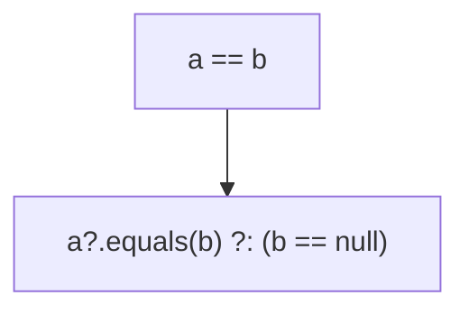
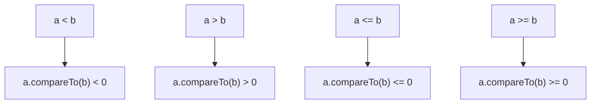

# 9. 연산자 오버로딩과 다른 관례

언어 기능과 미리 정해진 이름의 함수를 연결해 주는 기법을 코틀린에서는 `관례` 라고 부른다.

언어 기능을 타입에 의존하는 자바와 달리 코틀린은 `관례`에 의존한다.

### 산술 연산자의 오버로드해서 클래스에 대한 연산을 편리하기 만들기

- 코틀린에서 관례를 사용하는 가장 단순한 예시는 `산술 연산자`다.
- 자바에서는 `기본 타입`과 추가로 `String` 값에 대해서만 `+` 연산이 가능하지만,<br>
코틀린에서는 모든 타입에 대해서 `+` 연산을 사용할 수 있다.

```kotlin
data class Point(val x: Int, val y: Int) {
    operator fun plus(other: Point): Point {
        return Point(x + other.x, y + other.y)
    }
}

fun main() {
    val p1 = Point(10, 20)
    val p2 = Point(30, 40)
    println(p1 + p2)
    // Point(x=40, y=60)
}
```
- 원래라면 Point 의 더하기 연산을 하기 위해서는 `plus` 함수를 호출해야했지만,<br>
`operator` 키워드를 사용하여 `산술 연산자`를 오버로딩함으로써, `산술 연산자`를 사용하여 더하기 연산을 수행할 수 있게 되었다.
- 아래의 예시처럼 확장함수를 통해서도 산술 연산자를 오버로딩할 수 있다.

```kotlin
data class Point(val x: Int, val y: Int)

operator fun Point.plus(other: Point): Point {
    return Point(x + other.x, y + other.y)
}

fun main() {
    val p1 = Point(10, 20)
    val p2 = Point(30, 40)
    println(p1 + p2)
    // Point(x=40, y=60)
}
```

---

### 오버로딩 가능한 산술 연산자

| 연산자 | 함수 이름   | 식       |
|-----|---------|---------|
| `+` | `plus`  | `a + b` |
| `-` | `minus` | `a - b` |
| `*` | `times` | `a * b` |
| `/` | `div`   | `a / b` |
| `%` | `rem`   | `a % b` |

- 코틀린에서는 프로그래머가 직접 연산자를 만들어 사용할 수는 없고, 언어에서 미리 정해둔 연산자만 오버로딩할 수 있다.
- 직접 정의한 함수를 통해 구현하더라도 연산자 우선순위는 언제나 표준 숫자 타입에 대한 연산자 우선순위와 같다.ㅏ
- 예를 들어, `a + b * c`는 `a + (b * c)`로 해석된다.


### 두 피연산자의 타입이 다른 연산자 정의하기

- 연산자를 정의할때 두 피연산자가 같은 타입일 필요는 없다.
- 대신, 교환법칙은 지원하지 않는다. (`a + b == b + a`)

```kotlin
data class Point(val x: Int, val y: Int)

operator fun Point.times(scale: Double): Point {
    return Point((x * scale).toInt(), (y * scale).toInt())
}

fun main() {
    val p = Point(10, 20)
    println(p * 1.5)
    // Point(x=15, y=30)
}
```

### 연산을 적용한 다음 그 결과를 바로 대입: `+=`, `-=`, ...

- `+=`, `-=` 등의 연산자는 `복합 대입` 연산자라 불린다.
- 복합 대입 연산자는 연산이 객체에 대한 참조를 다른 참조로 바꾸기보다<br>
원래 객체의 내부 상태를 변경하게 만들고 싶을때 사용한다.

```kotlin
fun main() {
    val numbers = mutableListOf<Int>()
    numbers += 42
    println(numbers[0])
    // 42
}
```

- `+`와 `-`는 항상 새로운 컬렉션을 반환하지만, `+=`, `-=` 연산자는 항상 변경 가능한 컬렉션에 작용해 메모리에 있는 객체 상태를 변화시킨다.

```kotlin
@kotlin.internal.InlineOnly
public inline operator fun <T> MutableCollection<in T>.plusAssign(element: T) { // 산술 연산자와 다르게 리턴값이 Unit이다.
    this.add(element)
}

fun main() {
    val list = mutableListOf(1, 2)
    list += 3 // 복합 대입 연산자는 list 내부에 값을 추가한다.
    val newList = list + listOf(4, 5) // 산술 연산자는 새로운 리스트를 반환한다.
    println(list) // [1, 2, 3]
    println(newList) // [1, 2, 3, 4, 5]
}
```

### 피연산자가 1개뿐인 연산자: 단항 연산자

- `단항 연산자`를 오버로딩하는 절차도 `산술 연산자`와 마찬가지다.

```kotlin
data class Point(val x: Int, val y: Int)

operator fun Point.unaryMinus(): Point {
    return Point(-x, -y)
}

fun main() {
    val p = Point(10, 20)
    println(-p)
    // Point(x=-10, y=-20)
}
```

| 연산자 | 함수 이름       | 식            |
|-----|-------------|--------------|
| `+` | `unaryPlus` | `+a`         |
| `-` | `unaryMinus` | `-a`         |
| `!` | `not`       | `!a`         |
| `++` | `inc`       | `++a`, `a++` |
| `--` | `dec`       | `--a`, `a--` |
|     |             |              |

---

### 비교 연산자를 오버로딩해서 객체들 사이의 관계를 쉽게 검사

- 산술 연산자와 마찬가지로 모든 객체에 대해 비교 연산 (`==`, `!=`, `>`, `<` 등)을 수행할 수 있다.

### 동등성 연산자: equals (`==`)

- `==` 연산자는 `equals` 메서드를 호출한다.
- `!=` 연산자는 `equals` 메서드를 호출한 결과를 반전시킨다.
- `equals` 메서드는 `a == b`라는 비교를 처리할때 `a`가 `null`인지 판단해서 `null`이 아닌 경우에만 `equals` 메서드를 호출한다.



```kotlin
data class Point(val x: Int, val y: Int) {
    override fun equals(obj: Any?): Boolean {
        if (obj === this) return true
        if (obj !is Point) return false
        return x == obj.x && y == obj.y
    }
}

fun main() {
    println(Point(10, 20) == Point(10, 20)) // true
    println(Point(10, 20) != Point(5, 5)) // true
    println(null == Point(1, 2)) // false
}
```

### 순서 연산자: compareTo (`<`, `>`, `<=`, `>=`)

- 자바에서 정렬이나 최댓값, 최솟값을 구할때는 `Comparable` 인터페이스를 구현해야 했다.
- 코틀린에서는 `Comparable` 인터페이스를 구현하는 대신 `compareTo` 메서드를 오버로딩하면 된다.



```kotlin
class Person(val firstName: String, val lastName: String) : Comparable<Person> {
    override fun compareTo(other: Person): Int {
        return compareValuesBy(this, other, { it.lastName }, { it.firstName })
    }
}

fun main() {
    val p1 = Person("Alice", "Smith")
    val p2 = Person("Bob", "Johnson")
    println(p1 < p2) // false (Smith과 Johnson을 비교할때, Johnson이 더 우선순위가 높으므로, false)
}
```

---

### 인덱스로 원소 접근: `get`, `set`

- `get`과 `set`은 인덱스 연산자(`[]`)를 오버로딩하는데 사용된다.

```kotlin
data class Point(val x: Int, val y: Int)

operator fun Point.get(index: Int): Int {
    return when (index) {
        0 -> x
        1 -> y
        else -> throw IndexOutOfBoundsException("Index $index out of bounds for Point")
    }
}

fun main() {
    val p = Point(10, 20)
    println(p[1]) // Output: 20
}
```

```kotlin
data class MutablePoint(var x: Int, var y: Int)

operator fun MutablePoint.set(index: Int, value: Int) {
    when (index) {
        0 -> x = value
        1 -> y = value
        else -> throw IndexOutOfBoundsException("Index: $index, Size: 2")
    }
}

fun main() {
    val p = MutablePoint(10, 20)
    p[1] = 42
    println(p) // MutablePoint(x=10, y=42)
}
```

### 어떤 객체가 컬렉션에 들어있는지 검사: `in`, `!in`

- `in`은 객체가 컬렉션에 들어있는지 검사한다.
- 이때, 대응하는 함수는 `contains`다.

```kotlin
data class Point(val x: Int, val y: Int)
data class Rectangle(val upperLeft: Point, val lowerRight: Point)

operator fun Rectangle.contains(p: Point): Boolean {
    return p.x in upperLeft.x..<lowerRight.x &&
            p.y in upperLeft.y..<lowerRight.y
}

fun main() {
    val rect = Rectangle(Point(10, 20), Point(50, 50))
    println(Point(20,30) in rect) // true
    println(Point(5,5) in rect) // false
}
```

### 객체로부터 범위 만들기: `rangeTo`, `rangeUntil`

- `..` 연산자는 `rangeTo` 함수 호출을 간략하게 표현하는 방법이다.
- 어떤 클래스가 `Comparable` 인터페이스를 구현하면 `rangeTo`를 정의할 필요가 없다.
- `rangeUntil`은 `rangeTo`와 비슷하게 열린범위`(..<)`를 만든다.

```kotlin
fun main() {
    val now = LocalDate.now()
    val vacation = now..now.plusDays(10)
    println(now.plusWeeks(1) in vacation)
}
```

### 자신의 타입에 대해 루프 수행: `iterator`

- `for` 루프에서의 `in` 연산자는 `iterator` 메서드를 호출한다.
- 이후 `iterator` 의 `next` 메서드를 호출하여 다음 원소를 가져온다.

```kotlin
operator fun ClosedRange<LocalDate>.iterator(): Iterator<LocalDate> =
    object : Iterator<LocalDate> {
        var current = start
        override fun hasNext(): Boolean {
            return current <= endInclusive
        }

        override fun next(): LocalDate {
            val thisDate = current
            current = current.plusDays(1)
            return thisDate
        }
    }

fun main() {
    val newYear = LocalDate.ofYearDay(2042, 1)
    val daysOff = newYear.minusDays(1)..newYear
    for (dayOff in daysOff) {
        println(dayOff)
    }
}

/*
2041-12-31
2042-01-01
 */
```

---

### Component 함수를 사용한 구조 분해 선언

- 구조 분해를 사용하면 복합적인 값을 분해해서 별도의 여러 지역 변수를 한꺼번에 초기화할 수 있다.
- `data class`는 프로퍼티에 대해 `componentN` 함수를 자동으로 생성한다.
- 데이터 타입이 아닌 클래스에서는 `componentN` 함수를 직접 정의해야 한다.

```kotlin
class Point(val x: Int, val y: Int) {
    operator fun component1() = x
    operator fun component2() = y
}
```

```kotlin
data class NameComponents(val name: String, val extension: String)

fun splitFilename(fullName: String): NameComponents {
    val result = fullName.split(".", limit = 2)
    return NameComponents(result[0], result[1])
}

fun main() {
    val (name, ext) = splitFilename("example.txt")
    println("Name: ${name}, Extension: ${ext}") 
    // Name: example, Extension: txt
}
```

### 구조 분해 선언과 루프

- 변수 선언이 들어갈 수 있는 장소라면 어디든 구조 분해 선언을 사용할 수 있다.
- 루프 안에서도 구조 분해 선언을 사용할 수 있다.

```kotlin
fun printEntries(map: Map<String, String>) {
    for ((key, value) in map) {
        println("$key -> $value")
    }
}

fun main() {
    val map = mapOf("Oracle" to "Java", "JetBrains" to "Kotlin")
    printEntries(map)
    // Oracle -> Java
    // JetBrains -> Kotlin
}
```

### `_` 문자를 사용해 구조 분해 값 무시

- 구조 분해 선언에서 `_` 문자를 사용하면 특정 값을 무시할 수 있다.
- 전체 객체를 구조 분해해야만 하는 것은 아니기 때문에 사용하지 않는 뒷부분은 제거할 수 있다.

```kotlin
data class Person(
    val firstName: String,
    val lastName: String,
    val age: Int,
    val city: String,
)

fun introducePerson(p: Person) {
    val (firstName, lastName, age, city) = p
    println("This is $firstName, aged $age")
}

// ex.2
fun introducePerson(p: Person) {
    val (firstName, _, age, _) = p
    println("This is $firstName, aged $age")
}

// ex.3
fun introducePerson(p: Person) {
    val (firstName, _, age) = p
    println("This is $firstName, aged $age")
}
```

### 구조 분해의 한계와 단점

- 구조 분해의 결과가 대입될 변수의 이름은 중요하지 않고, 클래스에 선언한 순서대로 들어가기 때문에
- 리팩토링을 하면서 데이터 클래스의 프로퍼티 순서가 변경될 경우 문제가 발생할 수 있다.

```kotlin
data class Person(
    val firstName: String,
    val lastName: String,
    val age: Int,
    val city: String,
)

val (firstName, lastName, age, city) = p

// firstName, lastName의 순서가 바뀌면?
data class Person(
    val lastName: String,
    val firstName: String,
    val age: Int,
    val city: String,
)

val (firstName, lastName, age, city) = p

// 컴파일 에러는 발생하지 않지만, 
// 실제로 값은 firstName에는 lastName이, lastName에는 firstName이 들어간다.
```

---

### 프로퍼티 접근자 로직 재활용: 위임 프로퍼티

- 위임 프로퍼티를 사용하면 값을 뒷받침하는 필드에 단순히 저장하는 것보다 더 복잡한 방식으로 동작하는 프로퍼티를 접근자 로직을 매번 재구현할 필요 없이 쉽게 구현할 수 있다.
- 위임은 객체가 직접 작업을 수행하지 않고 다른 도우미 객체가 그 작업을 처리하도록 맡기는 디자인 패턴을 말한다.
- 이때 작업을 처리하는 도우미 객체를 `위임 객체(delegate object)`라고 부른다.

```kotlin
var p: Type by Delegate()
```

- 프로퍼티 위임 관례에 따라 `Delegate` 클래스는 `getValue`와 `setValue` 메서드를 구현해야 한다.
- 변경 가능한 프로퍼티만 `setValue`를 사용한다.
- 추가로, 위임 객체는 선택적으로 `provideDelegate` 함수 구현을 제공할 수도 있다.<br>**(최초 생성 시 검증 및 초기화 기능을 수행)**

### 위임 프로퍼티 사용: `by lazy()` 를 사용한 지연 초기화

- `by lazy`는 객체의 일부분을 초기화하지 않고 남겨뒀다가 실제로 그 부분의 값이 필요할 경우 초기화할때 쓰이는 패턴이다.
- 위임 프로퍼티는 데이터를 저장할 때 쓰이는 뒷받침하는 프로퍼티와 값이 오직 한 번만 초기화됨을 보장하는 게터 로직을 함께 캡슐화해준다. **(스레드 안전보장)**

```kotlin
class Person(val name: String) {
    val emails by lazy { loadEmails(this) }
}
```

### 위임 프로퍼티 구현

- 객체의 프로퍼티가 바뀔 때마다 리스너에게 변경 통지를 보내고 싶다. **(옵저버블 Observable)**

```kotlin
fun interface Observer {
    fun onChange(name: String, oldValue: Any?, newValue: Any?)
}

open class Observable {
    val observers = mutableListOf<Observer>()
    fun notifyObservers(propName: String, oldValue: Any?, newValue: Any?) {
        for (observer in observers) {
            observer.onChange(propName, oldValue, newValue)
        }
    }
}
```

```kotlin
fun interface Observer {
    fun onChange(name: String, oldValue: Any?, newValue: Any?)
}

open class Observable {
    val observers = mutableListOf<Observer>()
    fun notifyObservers(propName: String, oldValue: Any?, newValue: Any?) {
        for (observer in observers) {
            observer.onChange(propName, oldValue, newValue)
        }
    }
}

class ObservableProperty(
    val propName: String,
    var propValue: Int,
    val observable: Observable
) {
    fun getValue(): Int = propValue
    fun setValue(newValue: Int) {
        val oldValue = propValue
        propValue = newValue
        observable.notifyObservers(propName, oldValue, newValue)
    }
}

class Person(val name: String, age: Int, salary: Int) : Observable() {
    val _age = ObservableProperty("age", age, this)
    var age: Int
        get() = _age.getValue()
        set(newValue) {
            _age.setValue(newValue)
        }

    val _salary = ObservableProperty("salary", salary, this)
    var salary: Int
        get() = _salary.getValue()
        set(newValue) {
            _salary.setValue(newValue)
        }
}

fun main() {
    val person = Person("Sep", 28, 1000)
    person.observers += Observer { name, oldValue, newValue ->
        println("Property $name changed from $oldValue to $newValue")
    }

    person.age = 29
    person.salary = 1500
}
```

- 코틀린은 위임 객체를 감춰진 프로퍼티에 저장하고 주 객체의 프로퍼티를 읽거나 쓸 때마다 위임 객체의 `getValue`와 `setValue` 를 호출한다.

```kotlin
class ObservableProperty(
    var propValue: Int,
    val observable: Observable
) {
    operator fun getValue(thisRef: Any?, prop: KProperty<*>): Int = propValue
    operator fun setValue(thisRef: Any?, prop: KProperty<*>, newValue: Int) {
        val oldValue = propValue
        propValue = newValue
        observable.notifyObservers(prop.name, oldValue, newValue)
    }
}

class Person(val name: String, age: Int, salary: Int) : Observable() {
    var age by ObservableProperty(age, this)
    var salary by ObservableProperty(salary, this)
}
```

- 표준 라이브러리의 Delegates.observable 을 사용할 수 있다.
- 하지만, 사용될 람다를 표준 라이브러리 클래스에게 넘겨야한다.

```kotlin
class Person(val name: String, age: Int, salary: Int) : Observable() {
    private val onChange = { property: KProperty<*>, oldValue: Any?, newValue: Any? ->
        notifyObservers(property.name, oldValue, newValue)
    }
    var age by Delegates.observable(age, onChange)
    var salary by Delegates.observable(salary, onChange)
}

```

### 맵에 위임해서 동적으로 애트리뷰트 접근

- 위임 프로퍼티를 사용하면 맵에 저장된 값을 프로퍼티처럼 접근할 수 있다.

```kotlin
class Person {
    private val _attributes = mutableMapOf<String, String>()

    fun setAttribute(attrName: String, value: String) {
        _attributes[attrName] = value
    }

    var name: String
        get() = _attributes["name"]!!
        set(value) {
            _attributes["name"] = value
        }
}

fun main() {
    val p = Person()
    val data = mapOf("name" to "Seb", "company" to "JetBrains")
    for ((attrName, value) in data) {
        p.setAttribute(attrName, value)
    }
    println(p.name)
    p.name = "Sébastien"
    println(p.name)
}
```

- `Map`과 `MutableMap` 은 `getValue`, `setValue` 확장 함수를 제공하기 때문에 특별한 구현없이 `by` 키워드 사용이 가능하다.

```kotlin
class Person {
    private val _attributes = mutableMapOf<String, String>()

    fun setAttribute(attrName: String, value: String) {
        _attributes[attrName] = value
    }

    var name: String by _attributes
}
```
