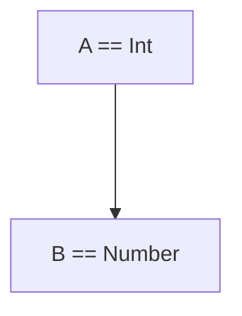
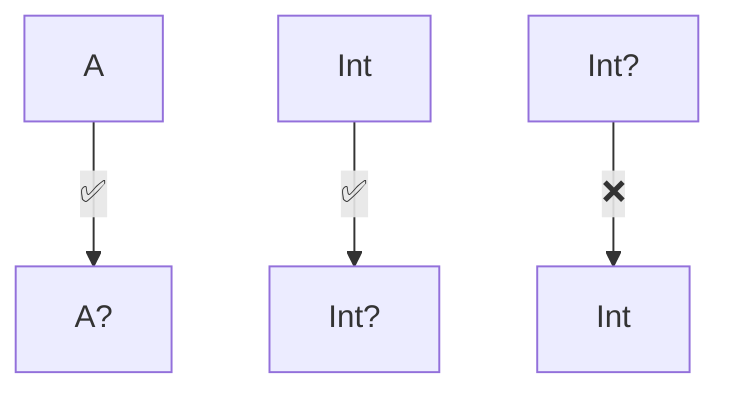

# 11. 제네릭스

`선언 지점 변성`: 클래스 정의할 때 미리 변성 규칙을 정해놓는 것 `(이 클래스는 항상 이런 변성 규칙을 따른다)`

```kotlin
// List는 선언할 때부터 out T로 정의됨 (공변)
interface List<out T> { ... }

// 이제 List<String>을 List<Any>로 쓸 수 있음
val strings: List<String> = listOf("a", "b")
val objects: List<Any> = strings // OK
```

---

`사용 지점 변성`: 실제 사용할 때 변성 규칙을 정하는 것 `(지금 이 상황에서만 이런 변성 규칙을 쓰겠다)`

> ex. 자바 와일드카드(`? extends`, `? super`)

```kotlin
// MutableList는 불변으로 선언됨
interface MutableList<T> { ... }

// 하지만 사용할 때 out/in을 붙여서 변성 지정
fun copy(from: MutableList<out Any>, to: MutableList<in String>) {
    // from에서는 읽기만 가능 (out)
    // to에는 쓰기만 가능 (in)
}
```

## 타입 인자를 받는 타입 만들기 : 제네릭 타입 파라미터

제네릭을 사용하면 타입 파라미터를 받는 타입을 정의할 수 있다.

타입 파라미터를 사용하면, `이 변수는 리스트다.`라고 표현하는 대신 `이 변수는 문자열을 담는 리스트다.`라고 표현할 수 있다.

예를 들면, 문자열을 담는 리스트를 표현하는 구문은 `List<String>` 처럼 타입 파라미터를 사용하여 표현할 수 있다.

- 코틀린 컴파일러는 보통 타입과 마찬가지로 타입 인자도 추론할 수 있다.

```kotlin
val authors = listOf("Dmitry", "Svetlana") // List<String>으로 추론
```

- 반면에 빈 리스트를 선언할때에는 타입 인자를 추론할 근거가 없기 때문에 직접 타입 인자를 명시해야 한다.

```kotlin
val readers: MutableList<String> = mutableListOf()
val readers = mutableListOf<String>()
```

## 제네릭 타입과 함게 동작하는 함수와 프로퍼티

- 제네릭 타입을 사용해 클래스를 만드는 경우, 함수로 받는 인자에서도 제네릭으로 매개변수를 받거나 리턴해야하는 상황이 필수적이다.
- 이럴땐 제네릭 타입을 이용한 함수 작성을 할 수 있다.
- 제네릭 함수를 호출할 때는 반드시 구체적 타입으로 타입 인자를 넘겨야한다.
- `<T>` 를 통해 타입 파라미터를 선언하고 있고, 함수의 리턴 타입에 `<T>`를 사용하고 있다.

```kotlin
fun <T> List<T>.slice(indices: IntRange): List<T>
```

```kotlin
fun main() {
    val letters = ('a'..'z').toList()
    println(letters.slice<Char>(0..2))
    // [a, b, c]
    println(letters.slice(10..13))
    // [k, l, m, n]
}
```

- filter 함수 정의를 살펴보면, `(T) -> Boolean` 타입의 함수를 파라미터로 받는다.
- 람다 파라미터에 대해 자동으로 만들어진 변수 `it`의 타입은 여기서 `String`이다.
- `readers` 의 리스트는 `"Hemingway", "Hadi"`를 통해 `List<String>`으로 추론이 되고,
- `List<String>` 에서 `filter` 함수를 호출했기 때문에 `T`는 `String`으로 추론된다.

```kotlin
fun <T> List<T>.filter(predicate: (T) -> Boolean): List<T>
```

```kotlin
fun main() {
    val authors = listOf("Hemingway", "Orwell", "Fitzgerald")
    val readers = mutableListOf("Hemingway", "Hadi")

    println(readers.filter { it !in authors })
    // [Hadi]
}
```

> 확장 프로퍼티만 제네릭하게 만들 수 있고, 일반 프로퍼티는 제네릭하게 만들 수 없다. <br />
> `val <T> x: T = TODO()` 이런식으로 제네릭 프로퍼티를 만들 수는 없다. <br />
> // ERROR: type parameter of a property must be used in its receiver type

## 제네릭 클래스를 홑화살괄호`(<>)` 구문을 사용해 선언한다.

자바와 마찬가지로 코틀린에서도 타입 파라미터를 넣은 홑화살괄호`(<>)`를 클래스나 인터페이스 이름 뒤에 붙이면 해당 클래스나 인터페이스를 제네릭하게 만들 수 있다.

타입 파라미터를 이름 뒤에 붙이고 나면 클래스 본문 안에서 타입 파라미터를 다른 일반 타입처럼 사용할 수 있게 된다.

```kotlin
interface List<T> {
    operator fun get(index: Int): T // 인터페이스 안에서 T를 일반 타입처럼 사용할 수 있다.
    // ...
}
```

- [1] 제네릭 클래스를 `확장(extends)` 하는 클래스를 정의하려면 기반 타입의 제네릭 파라미터에 대해 타입 인자를 지정해야 한다.
- [2] 이때 구체적인 타입을 넘길수도 있지만, 타입 파라미터로 받은 타입을 그대로 넘길수도 있다.

```kotlin
// [1] 예시
class StringList : List<String> {
    override fun get(index: Int): String = TODO()
}

// [2] 예시
class ArrayList<T> : List<T> {
    override fun get(index: Int): T = TODO()
    // ...
}
```

- 클래스가 자신을 타입 인자로 참조할 수도 있다.
- 아래의 예시를 보면, `Comparable` 인터페이스를 구현하는 `StringComparable` 클래스에서 타입을 `String`으로 지정해서
- `override`한 `compareTo` 메서드의 인자 타입을 `String`으로 지정했다.

```kotlin
interface Comparable<T> {
    fun compareTo(other: T): Int
}

class StringComparable : Comparable<String> {
    override fun compareTo(other: String): Int {
        TODO("Not yet implemented")
    }
}
```

## 제네릭 클래스나 함수가 사용할 수 있는 타입 제한: 타입 파라미터 제약

`타입 파라미터 제약`은 클래스나 함수에 사용할 수 있는 타입 인자를 제한하는 기능이다.<br />
예를 들어 리스트에 속한 모든 원소의 합을 구하는 `sum` 함수를 만들고 싶다고 가정해보자. <br />
`List<Int>`와 `List<Double>`은 합을 구할 수 있지만, `List<String>`은 합을 구할 수 없다. <br />
이럴때 `Number` 클래스를 상속받는 타입만을 허용하는 제약을 걸 수 있다.

제네릭 타입의 타입 파라미터에 대한 상계`(upper bound)`로 지정하면 그 제네릭 타입을 인스턴스화할 때<br />
사용하는 타입 인자는 반드시 그 상계 타입이거나 그 상계 타입의 하위 타입이어야 한다.<br />

자바에서는 `<T extends Number> T sum(List<T> list)` 처럼 `extends`를 써서 같은 개념을 표현한다.

```kotlin
fun <T : Number> List<T>.sum(): T
```

- `T : Number`는 `T`가 `Number`의 하위 타입이라는 의미이다.
- `Number`는 `Int`, `Double`, `Float`의 상위 타입이기 때문에 이들 타입을 인자로 넘길 수 있다.

```kotlin
fun main() {
    println(listOf(1, 2, 3).sum())
    // 6
}
```

- 타입을 제약하는 함수 선언
- `compareTo` 메서드를 통해 비교할 수 있는 타입만 인자로 받을 수 있다.

```kotlin
fun <T : Comparable<T>> max(first: T, second: T): T {
    return if (first > second) first else second
//    return if (first.compareTo(second) == 1) first else second // 과 같다. 연산자 관례에따라 `>` -> `compareTo > 0`으로 변환된다. 
}

fun main() {
    println(max("kotlin", "java"))
    // kotlin
}
```

- 타입 파라미터에 여러 제약을 가할 수 있다.
- 아래의 예시를 보면, `where T : CharSequence, T : Appendable` 부분을 볼 수 있는데,
- 이 부분은 `T`가 `CharSequence`와 `Appendable`의 하위 타입이라는 의미이다.
- `StringBuilder`는 `CharSequence`와 `Appendable`를 모두 구현하는 객체이기 때문에 타입 파라미터로 넣을 수 있다.

```kotlin
fun <T> ensureTrailingPeriod(seq: T) where T : CharSequence, T : Appendable {
    if (!seq.endsWith('.')) {
        seq.append('.')
    }
}

fun main() {
    val helloWorld = StringBuilder("Hello World")
    ensureTrailingPeriod(helloWorld)
    println(helloWorld)
    // Hello World.
}
```

## 명시적으로 타입 파라미터를 널이 될 수 없는 타입으로 표시해서 널이 될 수 있는 타입 인자 제외시키기

제네릭 클래스를 명시할때 타입 파라미터에 아무런 제약을 설정하지 않는 경우, 타입 파라미터는 `Any?` 타입으로 설정된다.<br />
항상 널이 될 수 없는 타입만 인자로 받게 만들려면 타입 파라미터에 제약을 가해야 한다.<br />
`<T : Any>`라는 제약을 통해 `T` 타입이 항상 널이 될 수 없는 타입이 되도록 보장할 수 있다.

```kotlin
class Processor<T : Any> {
    fun process(value: T) {
        value.hashCode()
    }
}
```

`Any` 뿐만 아니라 다른 널이 될 수 없는 타입을 사용해 상계를 정해도 타입 파라미터가 널이 아닌 타입으로 제약된다.

> 자바와 상호운용하는 경우, 제네릭 클래스에 `@NotNull` 어노테이션을 붙여야만, 코틀린에서 사용할때 널이 될 수 없는 타입이 된다.

## 실행 시점 제네릭 동작 : 소거된 타입 파라미터와 실체화된 타입 파라미터

제네릭은 타입 소거`(type erasure)`를 사용해 구현된다.<br />
이는 실행 시점에 제네릭 클래스의 인스턴스에 타입 인자 정보가 들어있지 않다는 뜻이다.

간단히 말하면, 런타임 시점에는 `<String>`, `<Int>` 같은 정보를 기억하지 않는다는 뜻이다.

```kotlin
val words = listOf("안녕", "하세요")  // List<String>
val numbers = listOf(1, 2, 3)       // List<Int>

println(words.javaClass)   // class java.util.Arrays$ArrayList
println(numbers.javaClass) // class java.util.Arrays$ArrayList
// 똑같음!
```

그래서 아래와 같은 코드는 동작하지 않는다.

```kotlin
if (words is List<String>) { // 에러!
    // 실행할 때는 String인지 모르니까
}
```

### 타입 검사와 캐스팅

- List<String> 객체를 만들고, 그 안에 문자열을 여럿 넣더라도 실행 시점에는 그 객체를 오직 List로만 인식한다.
- List 객체가 어떤 타입의 원소를 저장하는지 실행시점에는 알 수 없다.
- 아래의 예시를 보면, 컴파일러는 두 리스트를 서로 다른 타입으로 인식하지만, 실행 시점에 둘은 완전히 똑같은 타입으로 인식된다.
- 그럼에도 보통 `List<String>`에는 문자열만 들어있고, `List<Int>` 에는 정수만 들어있다고 가정할 수 있는데,
- 이는 컴파일러가 타입 인자를 알고 올바른 타입으로만 각 리스트에 넣도록 보장하기 때문이다.

```kotlin
val list1: List<String> = listOf("a", "b", "c")
val list2: List<Int> = listOf(1, 2, 3)
```

- 실행시점에 `List` 인지 여부는 확실히 알아낼 수 있지만, 그 리스트가 문자열, 사람 등 실제 어떤 타입의 원소가 들어있는 리스트인지는 알 수 없다.

```kotlin
fun readNumbersOrWords(): List<Any> {
    val input = readln()
    val words: List<String> = input.split(",")
    val numbers: List<Int> = words.mapNotNull { it.toIntOrNull() }
    return numbers.ifEmpty { words }
}

fun printList(l: List<Any>) {
    when (l) {
        // ERROR: Cannot check for instance of erased type: List<String>
        is List<String> -> println("Strings: $l")
        is List<Int> -> println("Integers: $l")
    }
}

fun main() {
    val list = readNumbersOrWords()
    printList(list)
}
```

- 코틀린에서는 타입 인자를 명시하지 않고 제네릭 타입을 사용 할 수 없다.
- 스타 프로젝션`(star projection)`이라는 문법을 사용하면, 타입 인자를 명시하지 않고 맵이나 리스트를 구분할 수 있다.
- 인자를 알 수 없는 제네릭 타입을 표현할 때 스타 프로젝션을 사용한다.

```kotlin
if (value is List<*>) {
    ...
}
```

- as나 as? 캐스팅에도 제네릭 타입을 사용할 수 있다.
- 하지만, 기저 클래스는 같지만, 타입 파라미터가 다른 경우에도 캐스팅에 성공하기 때문에
- 아래의 예시에서는 `List<Int>`를 넣었을때 제대로 `sum()` 함수가 호출되지만,
- `List<String>`을 넣었을때도 캐스팅에는 성공하는데, `sum()` 함수를 호출할 수 없어 에러가 발생한다.

```kotlin
fun printSum(c: Collection<*>) {
    val intList = c as? List<Int>
        ?: throw IllegalArgumentException("List is expected")
    println(intList.sum())
}

fun main() {
    printSum(listOf(1, 2, 3)) // 6
    printSum(
        listOf(
            "1",
            "2",
            "3"
        )
    ) // class java.lang.String cannot be cast to class java.lang.Number (java.lang.String and java.lang.Number are in module java.base of loader 'bootstrap')
}
```

- 원소 타입이 정해져 있는 경우에는 타입 파라미터를 검사할 수 있다.

```kotlin
fun printSum(c: Collection<Int>) {
    when (c) {
        is List<Int> -> println("List of integers: ${c.sum()}")
        is Set<Int> -> println("Set of integers: ${c.sum()}")
    }
}

fun main() {
    printSum(listOf(1, 2, 3)) // List of integers: 6
    printSum(setOf(3, 4, 5)) // Set of integers: 12
}
```

## 실체화된 타입 파라미터를 사용하는 팜수는 타입 인자를 실행 시점에 언급할 수 있다.

코틀린 제네릭 타입의 타입 인자 정보는 실행 시점에 지워진다.<br />
따라서, 제네릭 클래스의 인스턴스가 있어도 그 인스턴스를 만들 때 사용한 타입 인자를 알아낼 수 없다.<br />
이는 제네릭 함수도 마찬가지다.

```kotlin
fun <T> isA(value: any) = value is T
// ERROR: Cannot check for instance of erased type: T
```

- 인라인 함수의 타입 파라미터는 실체화 되므로, 실행 시점에 인라인 함수의 실제 타입 인자를 알 수 있다.
- `isA()` 함수를 인라인 함수로 만들고, 타입 파라미터에 `reified`를 붙이면 `value`의 타입이 `T`의 인스턴스인지를 실행 시점에 검사할 수 있다.

```kotlin
inline fun <reified T> isA(value: Any) = value is T

fun main() {
    println(isA<String>("abc")) // true
    println(isA<String>(123)) // false
}
```

- 표준 라이브러리 함수 중 `filterIsInstance` 함수는 `Iterable` 객체에서 특정 타입의 원소만 필터링하는 함수이다.
- 이를 직접 구현해보면, 아래와 같이 `inline` 함수와 `reified` 타입 파라미터를 통해 객체 T의 타입을 함수 내에서 지워지지 않게 설정했고,
- 내부에서 `is` 연산자를 통한 검사를 통해 타입파라미터로 들어온 `T` 타입의 원소만 필터링할 수 있다.

```kotlin
inline fun <reified T>
        Iterable<*>.filterIsInstance(): List<T> {
    val destination = mutableListOf<T>()
    for (element in this) {
        if (element is T) {
            destination.add(element)
        }
    }
    return destination
}

fun main() {
    val items = listOf("one", 2, "three")
    print(items.filterIsInstance<String>())
    // [one, three]
}
```

## 클래스 참조를 실체화된 타입 파라미터로 대신함으로써 `java.lang.Class` 파라미터 피하기

`java.lang.Class` 타입 인자를 파라미터로 받는 API에 대한 코틀린 어댑터를 구축하는 경우<br />
실체화된 타입 파라미터를 자주 사용한다. 그런 API의 예로는 JDK의 `ServiceLoader`가 있다.<br />
`ServiceLoader`는 클래스 참조를 통해 서비스 구현체를 로드하는데, 이때 클래스 참조를 타입 파라미터로 받는다.<br />

```kotlin
val serviceImpl = ServiceLoader.load(Service::class.java)

// => reified 타입 파라미터를 사용한 코틀린 버전
inline fun <reified T> loadService(): ServiceLoader<T> {
    return ServiceLoader.load(T::class.java)
}

val serviceImpl = loadService<Service>()
```

## 실제화된`(reified)` 타입 파라미터의 제약

| 할 수 있음                             | 할 수 없음                                                                 |
|------------------------------------|------------------------------------------------------------------------|
| 타입 검사와 캐스팅 (is, !is, as, as?)      | 타입 파라미터 클래스의 인스턴스 생성하기                                                 |
| 코틀린 리플렉션 API (::class)             | 타입 파라미터 클래스의 동반 객체 메서드 호출하기                                            |
| 코틀린 타입에 대응하는 java.lang.Class 객체 얻기 | 실제화된 타입 파라미터를 요구하는 함수를 호출하면서 <br />실체화하지 않은 타입 파라미터로 받은 타입을 타입 인자로 넘기기 |
| 다른 함수를 호출할 때 타입 인자로 사용             | 클래스, 프로퍼티, 인라인 함수가 아닌 함수의 타입 파라미터를 reified로 지정하기                       |

## 변성은 인자를 함수에 넘겨도 안전하지 판단하게 해준다.

코틀린에서는 리스트의 변경 가능성에 따라 적절한 인터페이스를 선택하면 안전성을 제어할 수 있다.<br />
함수가 읽기 전용 리스트를 받는다면, 더 구체적인 타입의 원소를 갖는 리스트를 그 함수에 넘길 수 있다.

## 클래스, 타입, 하위 타입

제네릭 클래스가 아닌 클래스에서는 클래스 이름을 바로 타입으로 쓸 수 있다.<br />
예를 들어 `var x: String`이라고 쓰면 String 클래스의 인스턴스를 담는 변수를 만들 수 있다.<br />
하지만 `var x: String?`처럼 같은 클래스 이름을 널이 될 수 있는 타입으로 쓸 수도 있다.<br />
이는 모든 코틀린 클래스가 적어도 둘 이상의 타입을 구성할 수 있다는 뜻이다.<br />

제네릭 클래스는 좀더 복잡한데, `List<Int>`, `List<String?>`, `List<List<String>>` 처럼<br />
무수히 많은 타입을 만들 수 있다.<br />

타입 사이의 관계를 논의하려면, 하위 타입의 개념을 알아야한다.
어떤 타입 A의 값이 필요한 모든 장소에 어떤 타입 B의 값을 넣어도 아무 문제가 없다면<br />
`A는 B의 하위 타입`이다.<br />

> 예를들면, `Int`는 `Number`의 하위 타입이지만, `String`의 하위 타입은 아니다.

상위 타입은 하위 타입의 반대 개념이다.<br />
A 타입이 B 타입의 하위 타입이라면, `B는 A의 상위 타입`이다.



널이 될 수 있는 타입은 하위 타입과 하위 클래스가 같지 않은 경우를 보여주는 예다.



A가 B의 하위 타입이면 `List<A>`는 `List<B>`의 하위 타입이다.<br />
그런 클래스나 인터페이스를 공변적`(covariant)`이라고 한다.<br />

## 공변성은 하위 타입 관계를 유지한다.

코틀린에서 제네릭 클래스가 타입 파라미터에 대해 공변적임을 표시하려면 타입 파라미터 이름 앞에 `out` 키워드를 붙인다.<br />

```kotlin
interface Producer<out T> {
    fun produce(): T
}
```

클래스의 타입 파라미터를 공변적으로 만들면, 함수 정의에 사용한 파라미터 타입과 타입 인자의 타입이 정확히 일치하지 않더라도<br />
그 클래스의 인스턴스를 함수 인자나 반환값으로 사용할 수 있다.

- 아래의 예시를 보면, Herd 클래스의 T 타입에 아무런 변성도 지정하지 않았기 때문에
- `Cat`은 `Animal`의 하위 타입이지만, `Herd<Cat>`는 `Herd<Animal>`의 하위 타입이 아니므로 컴파일 오류가 발생한다.

```kotlin
open class Animal {
    fun feed() { /* ... */ }
}

class Herd<T : Animal> {
    val size: Int get() = TODO()
    operator fun get(i: Int): T = TODO()
}

fun feedAll(animals: Herd<Animal>) {
    for (i in 0..<animals.size) {
        animals[i].feed()
    }
}

class Cat : Animal() {
    fun cleanLitter() { /* ... */ }
}

fun takeCareOfCats(cats: Herd<Cat>) {
    for (i in 0..<cats.size) {
        cats[i].cleanLitter()
    }
    feedAll(cats) // Error
}
```

- 모든 클래스를 공변적으로 만들 수는 없다.
- 공변적으로 만들면 안전하지 않은 상황이 발생할 수 있다.
- 타입 안전성을 보장하기 위해 공변적 파라미터는 항상 아웃`(out)` 위치에만 있어야 한다.
- 이는 클래스가 `T` 타입의 값을 생산할 수는 있지만, 소비할 수는 없다는 뜻이다.

클래스 멤버를 선언할 때 타입 파라미터를 사용할 수 있는 지점은 인과 아웃으로 나뉜다.

```kotlin
interface Transformer<T> {
    fun transform(t: T): T
    //             ↑ in  ↑ out
}
```

클래스의 타입 파라미터에 out 키워드를 붙이면 해당 클래스 안에서 모든 함수는 타입 파라미터를 아웃 위치에만 선언할 수 있다.

```kotlin
class Herd<out T: Animal> {
    val size: Int get() = TODO()
    fun produce(): T = TODO() 
    fun produce(i: T): Int = TODO() // Error: T는 out 위치에만 있어야 함
}
```

타입 파라미터 T에 붙은 out 키워드는 2가지를 의미한다.
- 하위 타입 관계가 유지된다. -> Herd<Cat>을 넣을 수 있게됨.
- T를 아웃 위치에서만 사용할 수 있다.

`읽기 전용 컬렉션`인 `List<T>`를 확인해보면, `T` 타입의 원소를 반환하는 `get` 메서드는 있지만, <br />
리스트에 `T` 타입의 값을 추가하거나 리스트에 있는 기존 값을 변경하는 메서드는 존재하지 않는다.<br />
만약, 이러한 메서드를 추가하려고 해도 `out` 키워드가 붙어 있기 때문에 컴파일 오류가 발생한다.

```kotlin
interface List<out T> {
    operator fun get(index: Int): T
    // fun add(element: T) // Error: T는 out 위치에만 있어야 함
}
```

`in`과 `out` 위치에 모두 타입 파라미터가 들어가는 경우에는 공변적인 클래스로 선언할 수 없다.<br />
따라서, `MutableList<T>`와 같은 읽기/쓰기 컬렉션은 공변적으로 만들 수 없다.<br />

```kotlin
interface MutableList<T> {
    operator fun get(index: Int): T
    operator fun set(index: Int, element: T)
    fun add(element: T)
    // Error: T는 in 위치와 out 위치에 모두 있어야 함
}
```

결국 변성의 목적은 코드에서 위험할 여지가 있는 메서드를 호출할 수 없게 만듦으로써 <br />
제네릭 타입의 인스턴스 역할을 하는 클래스 인스턴스를 잘못 사용하는 일이 없게 방지하는 역할을 한다.

val이나 var 키워드를 생성자 프로퍼티에 적는다면, 게터나 세터를 정의하는 것과 같으므로 변성을 적용할 수 없다.

```kotlin
class Herd<T: Animal>(var leadAnimal: T, vararg animals: T)
```

`private` 프로퍼티를 적용하는 경우에는 게터만 선언되기 때문에 `out` 키워드를 사용할 수 있게 된다.

```kotlin
class Herd<out T: Animal>(private var leadAnimal: T, vararg animals: T)
```

## 반공변성은 하위 타입 관계를 뒤집는다.

반공변성은 하위 타입 관계를 뒤집는 변성이다.<br />
코틀린에서 제네릭 클래스가 타입 파라미터에 대해 반공변적임을 표시하려면 타입 파라미터 이름 앞에 `in` 키워드를 붙인다.<br />

- 아래의 예시에서 인터페이스의 메서드는 T 타입의 값을 소비하기만 한다.
- 

```kotlin
interface Comparator<in T> {
    fun compare(e1: T, e2: T): Int { /* ... */ }
}
```

- Comparator<Fruit>를 만들면 어떤 구체적 과일 타입이라도 서로 비교할 수 있다.
- 한마디로 정리하면, Apple, Orange 같이 하위 타입을 매개변수로 받는 인자에 Fruit 타입 같은 상위 타입을 넣을 수 있다는 소리다.

```kotlin
sealed class Fruit {
    abstract val weight: Int
}

data class Apple(
    override val weight: Int,
    val color: String,
) : Fruit()

data class Orange(
    override val weight: Int,
    val juicy: Boolean,
) : Fruit()

fun main() {
    val weightComparator = Comparator<Fruit> { a, b ->
        a.weight - b.weight
    }

    val fruits: List<Fruit> = listOf(
        Orange(180, true),
        Apple(100, "green")
    )
    val apples: List<Apple> = listOf(
        Apple(50, "red"),
        Apple(120, "green"),
        Apple(155, "yellow")
    )

    println(fruits.sortedWith(weightComparator))
    // [Apple(weight=100, color=green), Orange(weight=180, juicy=true)]
    println(apples.sortedWith(weightComparator))
    // [Apple(weight=50, color=red), Apple(weight=120, color=green), Apple(weight=155, color=yellow)]
}
```

| 공변성                              | 반공변성                            | 무공변성                |
|----------------------------------|---------------------------------|---------------------|
| `Producer<out T>`                | `Consumer<in T>`                | `MutableList<T>`    |
| 타입 인자의 하위 타입 관계가 제네릭 타입에서도 유지된다. | 타입 인자의 하위 타입 관계가 제네릭 타입에서 뒤집힌다. | 하위 타입 관계가 성립하지 않는다. |
| `Producer<Cat>`은 `Producer<Animal>`의 하위 타입이다. | `Consumer<Animal>`은 `Consumer<Cat>`의 하위 타입이다. |                     |
| T를 아웃 위치에서만 사용할 수 있다. | T를 인 위치에서만 사용할 수 있다. | T를 인과 아웃 위치 모두에서 사용할 수 있다. |

## 사용 지점 변성을 사용해 타입이 언급되는 지점에서 변성 지정

- 클래스를 선언하면서 변성을 지정하면, 그 클래스를 사용하는 모든 장소에 변성 지정자가 영향을 끼치므로 편리하다.
- 이런 방식은 선언 지점 변성`(declaration site variance)`이라 부른다.
- 자바에서는 타입 파라미터가 있는 타입을 사용할 때마다 그 타입 파라미터를 하위 타입이나 상위 타입 중 어떤 타입으로 대치할 수 있는지 명시해야 한다.
- 이런 방식을 `사용 지점 변성` 이라고 부른다.

MutableList 와 같은 상당수의 인터페이스는 타입 파라미터로 지정된 타입을 소비하는 동시에 생산할 수 있기 때문에<br /> 
일반적으로 공변적이지도 반공변적이지도 않다.

```kotlin
fun <T> copyData(source: MutableList<T>, destination: MutableList<T>) {
    for (item in source) {
        destination.add(item)
    }
}
```

위 예시에서 모두 무공변 타입이지만, 원본 컬렉션에서는 읽기만 하고 대상 컬렉션에는 쓰기만 한다.<br />
이 경우 두 컬렉션의 원소 타입이 정확하게 일치할 필요가 없다.<br />
따라서, 아래와 같이 원본과 대상 리스트의 원소타입을 다르게 표현할 수 있다.

```kotlin
fun <T : R, R> copyData(source: MutableList<T>, destination: MutableList<R>) {
    for (item in source) {
        destination.add(item)
    }
}
```

코틀린에서는 `source`가 읽기전용으로만 사용되고 있으므로 `out` 키워드를 붙여 공변적으로 만들 수 있다.<br />
이는 `source` 가 `in` 위치에 있는 메서드를 호출하지 않는다는 것을 뜻한다.

```kotlin
fun <T> copyData(source: MutableList<out T>, destination: MutableList<T>) {
    for (item in source) {
        destination.add(item)
    }
}
```

아래와 같은 방법으로 `in` 위치에 있는 메서드를 호출하지 않는다는 것을 보장할 수 있다.<br />

```kotlin
fun main() {
    val list: MutableList<out Number> = mutableListOf()
    list.add(42)
    // The integer literal does not conform to the expected type Nothing
}
```

## 스타 프로젝션: 제네릭 타입 인자에 대한 정보가 없음을 표현하고자 `*` 사용
스타 프로젝션`(star projection)`은 제네릭 타입 인자에 대한 정보가 없음을 표현하는 방법이다.<br />
스타 프로젝션은 `*` 기호를 사용해 표현한다.<br />

`List<*>` 과 같은 구문으로 표현할 수 있다.

- `MutableList<*>` != `MutableList<Any?>` 
  - 스타 프로젝션은 원소의 타입을 정확히 모른다는 사실을 표현하므로 동일한 표현이 아니다.
  - 하지만, `Any?`는 모든 코틀린 타입의 상위 타입이기 때문에 진짜 원소 타입은 알 수 없지만 `Any?`의 하위 타입이라는 사실은 분명하다.

- 아래의 예시는 컴파일 오류가 발생한다. MutableList<*>를 아웃 프로젝션 타입으로 인식하기 때문이다.
- `MutableList<*>`는 `MutableList<out Any?>`처럼 동작한다.
- 따라서, 읽을 수는 있지만, `in` 위치에 있는 메서드를 호출할 수 없다. 이는 타입스크립트의 `unknown`과 비슷하다.

```kotlin
import kotlin.random.Random

fun main() {
    val list: MutableList<Any?> = mutableListOf('a', 1, "qwe")
    val chars = mutableListOf('a', 'b', 'c')
    val unknownElements: MutableList<*> =
        if (Random.nextBoolean()) list else chars
    println(unknownElements.first())
    unknownElements.add(42) // Error
}
```

- 스타 프로젝션은 타입 인자에 대한 정보가 중요하지 않을 때 사용한다.
- 즉, 타입 파라미터를 시그니처에서 전혀 언급하지 않거나 데이터를 읽기는 하지만 구체적인 타입은 신경 쓰지 않을 때 스타 프로젝션을 사용한다.
- 예를 들어, `printFirst` 함수가 `List<*>`를 파라미터로 받을 수 있다.

```kotlin
fun printFirst(list: List<*>) {
    if (list.isNotEmpty()) {
        println(list.first())
    }
}

fun main() {
    printFirst(listOf("Sveta", "Seb", "Dima", "Roman")) // Sveta
}
```

## 타입 별명

- 여러 제네릭 타입을 조합한 타입을 다룰 때 타입 시그니처의 모든 의미를 추적하기 귀찮을 수 있다.
- ex. `List<(String, Int) -> String>` 타입의 컬렉션의 목적이 무엇인지 즉시 떠올리기 힘들다.
- 이런 경우 코틀린은 타입 별명`(type alias)`을 제공한다.
- 타입 별명은 기존 타입에 대해 다른 이름을 부여한다.
- `typealias` 키워드를 사용해 타입 별명을 정의할 수 있다.

```kotlin
typealias NameCombiner = (String, String, String, String) -> String

val authorsCombiner: NameCombiner = { a, b, c, d -> "$a et al. "}
val bandCombiner: NameCombiner = { a, b, c, d -> "$a, $b & The Gang" }

fun combineAuthors(combiner: NameCombiner) {
    println(combiner("Steva", "Seb", "Dima", "Roman"))
}

fun main() {
    combineAuthors(bandCombiner)
    // Steva, Seb & The Gang
    combineAuthors(authorsCombiner)
    // Steva et al.
}
```
