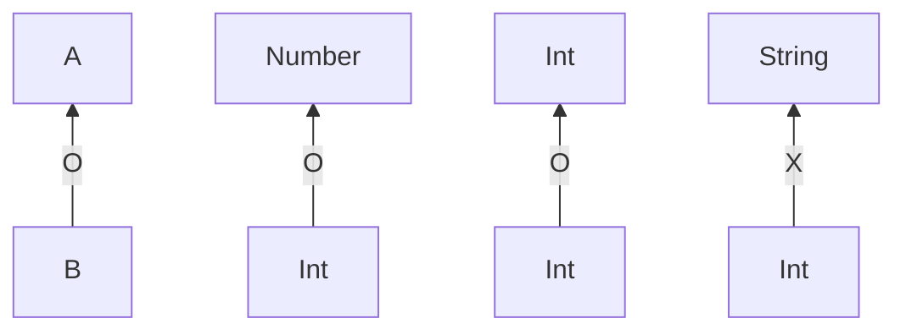
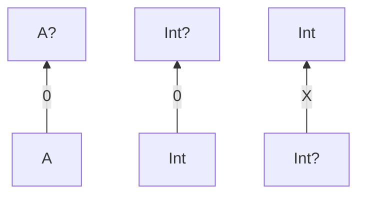

# 제네릭스
- 제네릭 함수와 클래스를 정의하는 방법
- 타입 소거와 실체화된 타입 파라미터
- 선언 지점과 사용 지점 변성
- 타입 별명

## 1. 타입 인자를 받는 타입 만들기: 제네릭 타입 파라미터

제네릭스를 사용하면 타입 파라미터를 받는 타입을 정의할 수 있다. 제네릭 타입의 인스턴스가 만들어질 때는 타입 파라미터를 구체적인 타입 인자로 치환한다.

코틀린 컴파일러는 보통 타입과 마찬가지로 타입 인자도 추론할 수 있다.

```kotlin
val authors = listOf("Dmitry", "Svetlana")
val authors: List<String> = listOf("Dmitry", "Svetlana")
```

반면에 빈 리스트를 만들어야 한다면 타입 인자를 추론할 근거가 없기 때문에 직접 타입 인자를 명시해야 한다.

```kotlin
var readers: MutalbeList<String> = mutableListOf() // 변수의 타입을 지정
val readers = mutableListOf<String>()  // 함수의 타입 인자를 지정
```

### 제네릭 타입과 함께 동작하는 함수와 프로퍼티

제네릭 함수를 호출할 때는 반드시 구체적 타입으로 타입 인자를 넘겨야 한다.

```kotlin
fun <T> List<T>.slice(indices: IntRange): List<T>
```

함수의 타입 파라미터 `T` 가 수신 객체와 반환 타입에 쓰인다. 함수를 호출할 때 타입 인자를 명시적으로 지정할 수 있지만, 대부분 컴파일러가 타입 인자를 추론할 수 있어 생략 가능하다.

```kotlin
fun main() {
    val letters = ('a'..'z').toList()
    println(letters.slice<Char>(0..2)) // 타입 인자를 명시적으로 지정
    // [a, b, c]
    println(letters.slice(10..13)) // 컴파일러는 T가 Char라는 사실을 추론
    // [k, l, m, m]
}
```

제네릭 고차 함수 호출하기

```kotlin
fun <T> List<T>.filter(predicate: (T) -> Boolean): List<T>

fun main() {
    val authors = listOf("Sveta", "Seb", "Roman", "Dima")
    val readers = mutableListOf<String>("Seb", "Hadi")
    println(readers.filter { it !in authors })
    // [Hadi]
}
```

클래스나 인터페이스 안에 정의된 메서드, 최상위 함수, 확장 함수에서 타입 파라미터를 선언할 수 있다. 확장 함수에는 수신 객체나 파라미터 타입에 타입 파라미터를 사용할 수 있다. 제네릭 함수를 정의할 때와 마찬가지로 제네릭 확장 프로퍼티를 선언할 수 있다.

```kotlin
val <T> List<T>.penultimate: T
    get() = this[size - 2]

fun main() {
    println(listOf(1, 2, 3, 4).penultimate) // 3
}
```

확장 프로퍼티만 제네릭하게 만들 수 있다. 일반 프로퍼티를 제네릭하게 정의하면 컴파일러가 오류를 표시한다.

```kotlin
val <T> x: T = TODO() 
// ERROR: type parameter of a property must be used in its receiver type
```

### 제네릭 클래스를 호톼살괄호 구문을 사용해 선언한다

코틀린에서도 타입 파라미터를 넣은 `홑화살괄호(<>)` 를 클래스나 인터페이스 이름 뒤에 붙이면 제네릭하게 만들 수 잇다

```kotlin
interface List<T> {
    operator fun get(index: Int): T
}
```

제네릭 클래스를 확장하는 클래스를 정의하려면 기반 타입의 제네릭 파라미터에 대해 타입 인자를 지정해야 한다. 구체적인 타입을 넘길 수도 있고 타입 파라미터로 받은 타입을 넘길 수도 있다.

```kotlin
// 구체적인 타입 인자로 String을 지정해 List를 구현
class StringList: List<String> {
    override fun get(index: Int): String = TODO()
}

// ArrayList의 제네릭 타입 파라미터 T를 List의 타입 인자로 넘긴다.
class ArrayList<T>: List<T> {
    override fun get(index: Int): T = TODO()
}
```

클래스가 자신을 타입 인자로 참조할 수 있다.

```kotlin
interface Comparable<T> {
    fun compareTo(other: T): Int
}
class String: Comparable<String> {
    override fun compareTo(other: String): Int = TODO()
}
```

String 클래스는 제네릭 Comparable 인터페이스를 구현하면서 그 인터페이스의 타입 파라미터 T로 String 자신을 지정한다.

### 제네릭 클래스나 함수가 사용할 수 있는 타입 제한: 타입 파라미터 제약

`타입 파라미터 제약(type parameter constraint)` 은 클래스나 함수에 사용할 수 있는 타입 인자를 제한하는 기능이다.

어떤 타입을 제네릭 타입의 타입 파라미터에 대한 상계(upper bound)로 지정하면 그 제네릭 타입을 인스턴스화할 때 사용하는 타입 인자는 반드시 그 상계 타입이거나 그 상계 타입의 하위 타입이어야 한다.

```kotlin
  타입 파라미터
fun <T: Number> List<T>.sum(): T
        상계타입
```

타입 파라미터를 제약하는 함수를 선언할 수 있다.

```kotlin
// Comparable<T>로 함수의 인자들은 비교 가능해야 한다.
fun <T: Comparable<T>> max(first: T, second: T): T {
    return if (first > second) first else second
}
```

비교할 수 없는 값 아이에 호출하면 컴파일 오류가 발생한다.

```kotlin
println(max("kotlin", 42))
// ERROR: Type parameter bound for T is not satisfied:
// inferred type Any is not a subtype of Comparable<Any>
```

타입 파라미터에 여러 제약을 둘 수 있다.

```kotlin
fun <T> ensureTrailingPeriod(seq: T)
    where T : CharSequence, T: Appendable { // 타입 파라미터 제약 목록
    
    if (!seq.endsWith('.')) {
        seq.append('.')
    }    
}

fun main() {
    val helloWorld = StringBuilder("Hello World")
    ensureTrailingPeriod(helloWrold)
    println(helloWrold)
    // Hello WOrld.
}
```

### 명시적으로 타입 파라미터를 널이 될 수 없는 타입으로 표시해서 널이 될 수 있는 타입 인자 제외시키기

아무런 상계를 정하지 않은 타입 파라미터는 `Any?` 를 상계로 정한 파라미터와 같다.

```kotlin
class Processor<T> {
    fun process(value: T) {
        value?.hashCode()
    }
}
```

널 허용이 붙어 있지 않지만, T 타입이 널이 될 수 있는 타입이 되지 못하게 막는 제약이 없기 때문에 타입 인자로 널이 될 수 있는 타입을 사용할 수 있다.

```kotlin
val nullableStringProcessor = Processor<String?>()
nullableStringProcessor.process(null)
```

항상 널이 될 수 없는 타입만 타입 인자로 받으려면 타입 파라미터에 제약을 가해야한다.

```kotlin
class Processor<T: Any> {
    fun process(value: T) {
        value.hasCode()
    }
}
```

## 2. 실행시점 제네릭스 동작: 소거된 타입 파라미터와 실체화된 타입 파라미터

JVM의 제네릭스는 보통 타입 소거를 사용해 구현되어 실행 시점에 제네릭 클래스의 인스턴스에 타입 인자 정보가 들어있지 않다.

### 실행 시점에 제네릭 클래스의 타입 정보를 찾을 때 한계: 타입 검사와 캐스팅

코틀린 제네릭 타입 인자 정보는 런타임에 지워진다. 타입 소거로 인해 다음과 같은 한계가 발생한다.

타입 인자를 따로 저장하지 않기 때문에 실행 시점에 타입 인자를 검사할 수 없다.

```kotlin
fun readNumbersOrWords(): List<Any> {
    val input = readln()
    val words: List<String> = input.split(",")
    val numbers: List<Int> = words.mapNotNull { it.toIntOrNull }
    return numbers.ifEmpty { words }
}
fun printList(l: List<Any>) {
    when(l) {
        is List<String> -> println("Strings: $l")
        is List<Int> -> println("Integers: $l")
    }
    // ERROR: Cannot check for an instance of erased type 오류 발생
}
fun main() {
    val list = readNumbersOrWords()
    printList(list)
}
```

하지만, 저장해야 하는 타입 정보의 크기가 줄어들어 애플리케이션의 전체 메모리 사용량이 줄어든다는 장점이 있다.

코틀린에서는 타입 인자를 명시하지 않고 제네릭 타입을 사용할 수 없다. 어떤 값의 타입을 확인하려면 `스타 프로젝션` 구문을 사용하면 된다

`as`나 `as?` 캐스팅에도 제네릭 타입을 사용할 수 있지만, 기저 클래스는 같지만 타입 인자가 다른 타입으로 캐스팅해도 성공한다는 점을 조심해야 한다.

실행 시점에는 제네릭 타입의 타입 인자를 알 수 없으므로 캐스팅은 항상 성공하지만, 타입 캐스팅을 사용하면 컴파일러가 `unchecked cast` 라는 경로를 해준다.

```kotlin
fun printSum(c: Collection<*>) {
    val intList = c as? List<Int> // Unchecked cast 경로 발생
        ?: throw IllegalArgumentException("List is expected")
    println(intList.sum())
}

fun main() {
    printSum(listOf(1, 2, 3)) //6
    printSum(setOf(1, 2, 3)) // 집합은 리스트가 아니므로 예외 발생
    // IllegalArgumentException: List is expected
}
```

잘못된 타입의 원소가 들어있는 리스트를 전달하면 실행 시점에 ClassCastException 발생한다.

```kotlin
fun main() {
    println(listOf("a", "b", "c"))
    // ClassCastException: String cannot be cat to Number
}
```

### 실체화된 타입 파라미터를 사용하는 함수는 타입 인자를 실행 시점에 언급할 수 있다.

제네릭 타입의 타입 인자 정보는 실행 시점에 지워져 사용한 타입 인자를 알아낼 수 없다. 하지만, 인라인 함수의 타입 파라미터로 실체화 한다면 실행 시점에 인라인 함수의 실제 타입 인자를 알 수 있다.

```kotlin
fun <T> isA(value: Any) = value is T
// ERROR: Cannot check for instance of erased type: T
```

타입 파라미터를 reifeid로 지정하면 value의 타입이 T의 인스턴스인지를 실행 시점에 검사할 수 있다.

```kotlin
inline fun <reified T> isA(value: Any) = value is T
fun main() {
    println(isA<String>("abc")) // true
    println(isA<String>(123)) //false
}
```

### 클래스 참조를 실체화된 타입 파라미터로 대신함으로써 java.lang.Class 파라미터 피하기

java.lang.Class 타입 인자를 파라미터로 받는 API에 대한 코틀린 어댑터를 구축하는 경우 실체화된 타입 파라미터를 자주 사용한다.

```kotlin
val serviceImpl = ServiceLoader.load(Service::class.java)
```

::class.java 구문은 코틀린 클래스에 대응하는 java.lang.Class 참조를 얻는 방법이다. 이 예제를 실체화된 타입 파라미터를 사용해 서비스가 읽을 클래스를 loadService의 타입 파라미터로 지정한다.

```kotlin
val serviceImpl = loadService<Service>()
```

서비스 클래스를 loadService 함수의 타입 인자로 지정하며 ::class.java라고 쓰는 경우보다 훨씬 더 읽고 이해하기 쉽다.

```kotlin
inline fun <reified T> loadService() {
    return ServiceLoader.load(T::class.java)
}
```

### 실체화된 타입 파라미터가 있는 접근자 정의

인라인과 실체화된 타입 파라미터를 프로퍼티 접근자에도 사용할 수 있다. 제네릭 타입에 대해 프로퍼티 접근자를 정의하는 경우 프로퍼티 inline으로 표시하고 타입 파라미터를 reified로 하면 타입 인자에 쓰인 구체적인 클래스를 참조할 수 있다.

```kotlin
inline val <reified T> T.canonical: String
    get() = T::class.java.canonicalName

fun main() {
    println(listOf(1, 2, 3).canonical)
    // java.util.List
    println(1.canonical)
    // java.lang.Integer
}
```

### 실체화된 타입 파라미터의 제약

실체화된 타입 파라미터는 몇 가지 제약이 있다.

실체화된 타입 파라미터를 사용 할 수 있는 경우

- 타입 검사와 캐스팅(is, !is, as, as?)
- 10장에서 설명할 코틀린 리플렉션 API(::class)
- 코틀린 타입에 대응하는 java.lang.Class를 얻기(::class.java)
- 다른 함수를 호출할 때 타입 인자로 사용

사용 할 수 없는 경우

- 타입 파라미터 클래스의 인스턴스 생성하기
- 타입 파라미터 클래스의 동반 객체 메서드 호출하기
- 실체화된 타입 파라미터를 요구하는 함수를 호출하면서 실체화하지 않은 타입 파라미터로 받은 타입을 타입 인자로 넘기기
- 클래스, 프로퍼티, 인라인 함수가 아닌 함수의 타입 파라미터를 reified로 지정하기

실체화된 타입 파라미터를 인라인 함수에만 사용할 수 있으므로 실체화된 타입 파라미터를 사용하는 함수는 자신에게 전달되는 모든 람다를 인라이닝한다.

## 3. 변성은 제네릭과 타입 인자 사이의 하위 타입 관계 기술

`변성`은 List<String>과 List<Any> 같이 기저 타입이 같고 타입 인자가 다른 여러 타입이 서로 어떤 관계가 있는지 설명하는 개념이다.

### 변성은 인자를 함수에 넘겨도 안전한지 판단하게 해준다

Any 타입 값을 파라미터로 받는 함수에 String 값을 넘겨도 안전하지만, Any와 String이 List 인터페이스의 타입 인자로 들어가는 경우 안전성을 보장할 수 없다.

```kotlin
fun printContents(list: List<Any>) {
    println(list.joinToString())
}
fun main() {
    printContents(listOf("abc", "bac")) //abc, bac
}
```

코틀린에서는 리스트의 변경 가능성에 따라 적절한 인터페이스를 선택하면 안전성을 제어할 수 있다. 함수가 읽기 전용 리스트를 받는다면 구체적인 타입의 원소를 갖는 리스트를 넘길 수 있지만, 리스트가 변경 가능하다면 그럴 수 없다.

```kotlin
fun addAnswer(list: MutableList<Any>) {
    list.add(42)
}

fun main() {
    val strings = mutableListOf("abc", "bac")
    addAnswer(strings)
    println(strings.maxBy { it.lengths })
    // ClassCastException: Integer cannot be cast to String
}
```

### 클래스, 타입, 하위 타입

- 하위 타입: 타입 A의 값이 필요한 모든 장소에 어떤 타입 B의 값을 넣어도 문제가 없다면 B는 타입 A의 하위 타입이다.
- 상위 타입: A타입이 B 타입의 하위 타입이라면 B는 A의 상위 타입이다.





- 무공변: 서로 다른 두 타입이 하위 타입도 아니고 상위 타입도 아닌 경우 제네릭 타입이 타입 파라미터에 대해 무공변이라고 한다.
- 공변: A가 B의 하위 타입이면 하위 타입이면 클래스나 인터페이스를 공변적이라고 한다.

### 공변성은 하위 타입 관계를 유지한다.

공병적인 클래스는 제네릭 클래스에 대해 A가 B의 하위 타입인 경우를 말한다.

코틀린에서 제네릭 클래스가 타입 파라미터에 대해 공변적임을 표시하려면 타입 파라미터 이름 앞에 `out`을 넣는다.

```kotlin
interface Producer<out T> {
    fun produce(): T
}
```

클래스의 타입 파라미터를 공변적으로 만들면 함수 정의에 사용한 파라미터 타입과 타입 인자의 타입이 정확히 일치하지 않더라도 그 클래스의 인스턴스를 함수 인자나 반환값으로 사용할 수 있다.

```kotlin
open class Animal {
    fun feed() {/*..*/}
}

class Herd<T: Animal> {
    val size: Int get() = /*...*/
    operator fun get(i: Int): T { /*...*/ }
}
fun feedAll(animals: Herd<Animal>) {
    for (i in 0..<animals.size) {
        animals[i].feed()
    }
}
```

```kotlin
class Cat: Animal() {
    fun cleanLitter() { /*...*/ }
}
fun takeCareOfCats(cats: Herd<Cat>) {
    for (i in 0..<cats.size) {
        cat[i].cleanLitter()
    }
    feedAll(cats) // ERROR: inferred type is Herc<Cat>, but Herd<Animal> was expected
}
```

Herd를 공변적인 클래스로 만들면 해결이 가능하다.

```kotlin
class Herd<out T: Animal> {
    /* .. */
}

fun takeCareOfCats(cats: Herd<Cat>) {
    for (i in 0..<cats.size) {
        cats[i].cleanLitter()
    }
    feedAll(cats)
}
```

타입 파라미터를 공변적으로 지정하면 클래스 내부에서 파라미터를 사용하는 방법을 제한한다. 타입 안정성을 보장하기 위해 공변적 파라미터는 항상 아웃 위치에 있어야한다. 이는 클래스가 T 타입의 값을 생산할 수 있지만 소비할 수 없다.

```kotlin
interface Transformer<T> {
                  인 위치
    fun transform(t: T) : T
                        아웃 위치
}
```

out 키워드는 T의 사용법을 제한하며 T로 인해 생기는 하위 타입관계의 타입 안전성을 보장한다.

타입 파라미터 T에 붙은 out 키워드의 의미

- 하위 타입 관계가 유지된다.
- T를 아웃 위치에서만 사용할 수 있다.

타입 파라미터를 다른 타입의 타입 인자로 사용할 수도 있다.

```kotlin
interface List<out T> : Collection<T> {
    fun subList(fromIndex: Int, toIndex: Int): List<T>
}
```

### 반공변성은 하위 타입 관계를 뒤집는다

반공변성은 반공변 클래스의 하위 타입 관계는 그 클래스의 타입 파라미터의 상하위 타입 관계와 반대다.

```kotlin
interface Comparator<in T> {
    fun compare(e1: T, e2: T): Int { /*...*/ }
}
```

인터페이스의 메서드는 T 타입의 값을 소비하기만 한다. T가 in 위치에서만 사용되어 T 앞에 in 키워드를 붙인다.

```kotlin
sealed class Fruit {
    abstract val weight: Int
}

data class Apple(
    override val weight: Int,
    val color: String
): Fruit()

data class Orange(
    override val weight: Int,
    val juicy: Boolean
): Fruit()
```

| 공변성 | 반공변성 | 무공변성 |
| --- | --- | --- |
| Producer<out T> | Consumer<in T> | MutableList<t> |
| 타입 인자의 하위 타입 관계가 제네릭 타입에서도 유지된다. | 타입 인자의 하위 타입 관계가 제네릭 타입에서 뒤집힌다. | 하위 타입 관계가 성립하지 않는다 |
| Producer<Cat>은 Producer<Animal>의 하위 타입이다 | Consumer<Animal>은 Consumer<Cat>의 하위 타입이다. |  |
| T를 아웃 위치에서만 사용할 수 있다. | T를 인 위치에서만 사용할 수 있다. | T를 아무 위치에서나 사요할 수 있다. |

### 사용 지점 변성을 사용해 타입이 언급되는 지점에서 변성 지정

- 선언 지점 변성: 클래스를 선언하면서 변성을 지정하면 그 클래스를 사용하는 모든 장소에 변성 지정자가 영향을 끼치는 방식
- 사용 지점 변성: 타입 파라미터가 있는 타입을 사용할 때마다 그 타입 파라미터를 하위 타입이나 상위 타입 중 어떤 타입으로 대치할 수 있는지 명시하는 방식

코틀린에서도 사용 지점 변성을 지원한다. 따라서 클래스 안에서 어떤 타입 파라미터가 공변적이거나 반공변적인지 선언할 수 없는 경우에도 특정 타입 파라미터가 나타나는 지점에서 변성을 정할 수 있다.

MutableList와 같은 상당수의 인터페이스는 타입 파라미터로 지정된 타입을 소비하는 동시에 생산할 수 있어 일반적으로 공변적이지도 반공변적이지도 않다.

```kotlin
fun <T> copyData(source: MutableList<T>, 
    destination: MutableList<T>) {
    
    for (item in source) {
        destination.add(item)
    }
}
```

두 컬렉션 모두 무공변 타입이지만 원복 컬렉션에서는 읽기만 하고 대상 컬렉션에는 쓰기만 한다. 이 경우 두 컬렉션의 원소 타입이 정확하게 일치할 필요가 없다.

이 함수가 다른 여러 리스트 타입에 대해 작동하게 만들려면 두 번째 제네릭 타입 파라미터를 도입할 수 있다.

```kotlin
fun <T: R, R> copyData(source: MutableList<T>,
    destination: MutableList<R>) {
    
    for (item in source) {
        destination.add(item)
    }
}

fun main() {
    val ints = mutableListOf(1, 2, 3)
    val anyItems = mutableListOf<Any>()
    copyData(ints, anyItems)
    println(anyItem)
    // [1, 2, 3]
}
```

한 리스트에서 다른 리스트로 원소를 복사할 수 있으려면 원본 리스트 원소 타입은 대상 리스트 원소 타입의 하위 타입이어야 한다.

하지만, 코틀린에서는 함수 구현이 아웃 위치 또는 인 위치에 있는 타입파라미터를 사용하는 메서드만 호출한다면 함수를 정의할 때 그 정보를 바탕으로 타입 파라미터에 변성 변경자를 추가할 수 있다.

```kotlin
// 아웃-프로젝션 타입 파라미터를 사용하는 데이터 복사 함수
fun <T> copyData(source: MutableList<out T>,
    destination: MutableList<T>) {
    
    for (item in source) {
        destination.add(item)
    }
}
```

타입 선언에서 타입 파라미터를 사용하는 위치라면 어디에나  변성 변경자를 붙일 수 있다. 따라서 파라미터 타입, 로컬 변수 타입, 함수 반환 타입 등에 타입 파라미터가 쓰이는 경우 in이나 out 변경자를 붙일 수 있다. 이때 타입 프로젝션이 일어난다.

### 스타 프로젝션: 제네릭 타입 인자에 대한 정보가 없을 표현하고자 * 사용

타입 검사와 캐스트에 대해 설명할 때 제네릭 타입 인자 정보가 없을 표현하고자 스타 프로젝션을 사용한다.

- MutableList<*> != MutableList<Any?>
- MutableList<Any?>는 모든 타입의 원소를 담을 수 있는 리스트이다.
- MutableList<*>는 정해진 구체적인 타입의 원소만을 담는 리스트지만 그 원소의 타입을 정확히 모른다는 사실을 표현한다.
- 원소 타입을 모른다고 해서 그 안에 아무 원소나 다 담을수는 없다.
    - 아무 타입의 값이나 넣으면 리스트를 만들어서 넘겨준 쪽이 바라는 조건을  깰 수도 있기 때문이다.

### 타입 별명

여러 제네릭 타입을 조합한 타입을 다룰 때 타입 시그니처의 모든 의미를 추적하기 귀찮을 수 있다.

이런 경우 타입 별명을  사용할 수 있게 해준다. 타입 별명은 기존 타입에 대해 다른 이름을 부여한다. typealias 키워드 뒤에 별명을 적어 타입 별명 선언을 시작할 수 있다.

```kotlin
typealias NameCombiner = (String, String, String, String) -> String

val authorsCombiner: NameCombiner = { a, b, c, d -> "$a et al." }
val bandCombiner: NameCombiner = { a, b, c, d -> "$a, $b & The Gang" }

fun comineAuthors(combiner: NameCombiner) {
    println(combiner("Sveta", "Seb", "Dima", "Roman")
}

fun main() {
    combineAuthors(bandCombiner)
    // Sveta, Seb & The Gang
    combineAuthors(authorsCombiner)
    // Sveta et al.
    combineAuthors { a, b, c, d -> "$d, $c, & Co."}
    // Roman, Dima & Co
}
```

## 요약

- 코틀린 제네릭스는 자바와 비슷하다. 제네릭 함수와 클래스를 자봐 비슷하게 선언 할 수 있다.
- 자바와 마찬가지로 제네릭 타입의 타입 인자는 컴파일 시점에만 존재한다.
- 타입 인자가 실행 시점에 지워지므로 타입 인자가 있는 타입을 is 연산자로 검사할 수 없다.
- 인라인 함수의 타입 파라미터를 reified로 표시해서 실체화하면 실행 시점에 그 타입을 is로 검사하거나 java.lang.Class 인스턴스를 얻을 수 있다.
- 변성은 기저 클래스가 같고 타입 파라미터가 다른 두 제네릭 타입 사이의 상하위 타입 관계가 타입 인자 사이의 상하위 타입 관계에 의해 어떤 영향을 받는지를 명시하는 방법이다.
- 제네릭 클래스의 타입 파라미터가 아웃 위치에서만 사용되는 경우 그 타입 파라미터를 out으로 표시해서 공변적으로 만들 수 있다.
- 공변성의 반대는 반공변성이다. 제네릭 클래스의 타입 파라미터가 인 위치에서만 사용되는 경우 그 타입 파라미터를 in으로 표시해서 반공변적으로 만들 수 있다.
- 코틀린의 읽기 전용 List 인터페이스는 공변적이다.
- 함수 인터페이스는 첫 번째 타입 파라미터에 대해서는 반공변적이고 두 번째 타입 파라미터에 대해서는 공변적이다.
- 토클린에서는 제네릭 클랫스의 공변성을 전체적으로 지정하거나 구체적인 사용 위치에서 지정할 수 있다.
- 제네릭 클래스의 타입 인자가 어떤 타입인지 정확히 모르거나 타입 인자가 어떤 타입인지가 중요하지 않을 때 스타 프로젝션 구문을 사용할 수 있다.
- 타입 별명을 사용하면 타입에 대해 더 짧은 이름이나 다른 이름을 부여할 수 있다.
- 타입 별명은 컴파일 시점에 원래의 타입으로 치환된다.