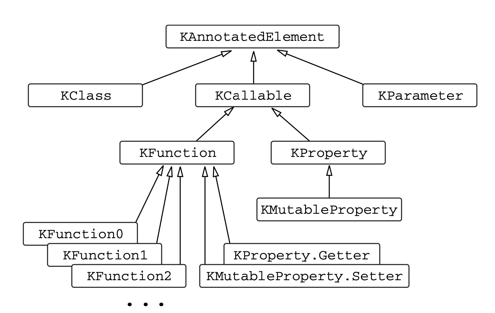

# Chapter12. 어노테이션과 리플렉션

## 12장에서 다루는 내용

---

- 어노테이션 적용과 정의
- 리플렉션을 사용해 실행 시점에 객체 내부 관찰하기
- 코틀린 실전 프로젝트 예제

어노테이션과 리플렉션을 사용하면 그런 제약을 벗어나서 미리 알지 못하는 임의의 클래스를 다룰 수 있다. 어노테이션을 사용하면 라이브러리가 요구하는 의미를 클래스에 부여할 수 있고 리플렉션을 사용하면 실행 시점에 컴파일러 내부 구조를 분석할 수 있다.

## 어노테이션 선언과 적용

---

어노테이션을 사용하면 선언에 추가적인 메타데이터를 연관시킬 수 있다. 그 후 어노테이션이 설정된 방식에 따라 메타데이터를 소스코드, 컴파일된 클래스 파일, 런타임에 대해 작동하는 도구를 통해 접근할 수 있다.

### 어노테이션 적용해 선언에 표지 남기기

```kotlin
@Target(CLASS, FUNCTION, PROPERTY, ANNOTATION_CLASS, CONSTRUCTOR, PROPERTY_SETTER, PROPERTY_GETTER, TYPEALIAS)
@MustBeDocumented
public annotation class Deprecated(
    val message: String,
    val replaceWith: ReplaceWith = ReplaceWith(""),
    val level: DeprecationLevel = DeprecationLevel.WARNING
)

@Target()
@Retention(BINARY)
@MustBeDocumented
public annotation class ReplaceWith(val expression: String, vararg val imports: String)
```

- @와 어노테이션 이름을 선언 앞에 넣으면 된다.
- 어노테이션 인자
    - 기본 타입의 값
    - 문자열
    - 이넘
    - 클래스 참조,
    - 다른 어노테이션 클래스
    - 위 요소들의 배열 요소
- 어노테이션 인자를 지정하는 문법은 자바와 약간 다르다.
    - 클래스를 어노테이션 인자로 지정
        - `::class` 를 클래스 이름 뒤에 넣어야 한다.
        - `@Anno(MyClass::class)`
    - 다른 어노테이션을 인자로 지정
        - 인자로 들어가는 어노테이션의 이름앞에 `@`를 넣지 않는다.
        - `ReplaceWith` 처럼
    - 배열을 인자로 지정
        - 각괄호 `[]` 를 사용한다.
        - `arrayOf` 함수 사용 가능
- 어노테이션 인자를 컴파일 시점에 알 수 있어야 하므로 임의의 프로퍼티를 인자로 지정할 수는 없다.
    - 프로퍼티를 어노테이션 인자로 사용하려면 그 앞에 `const` 변경자를 붙여야 한다.
    - 컴파일러는 `const`가 붙은 프로퍼티를 컴파일 시점 상수로 취급한다.
    - `const`가 붙은 프로퍼티를 파일의 최상위나 `object` 안에 선언해야 하며 기본 타입이나 `String`으로 초기화해야만 한다.

### 어노테이션 타깃: 어노테이션이 참조할 수 있는 정확한 선언 지정

- 코틀린 소스코드에서 한 선언을 컴파일한 결과가 여러 자바 선언과 대응하는 경우가 자주 있어 어노테이션을 붙일 때 어느 요소에 어노테이션을 붙일지 표시할 필요가 있다.
    - 따라서 여러 자바 선언에 각각 어노테이션을 붙여야 할 떄가 있다.
    - eg) 코틀린 프로퍼티 == 자바 필드 게터, + 세터 메서드 및 그 파라미터 선언과 대응
- `사용 지점 타깃(use-site target)` 선언을 통해 어노테이션을 붙일 요소를 정할 수 있다.

```kotlin
@get:JvmName("obtainCertificate")
```

- 사용 지점 타깃은 @기호와 어노테이션 이름 사이에 붙으며 어노테이션 이름과는 콜론으로 분리된다.
    - `get`: JvmName 어노테이션을 프로퍼티 게터에 적용하라는 뜻
- 자바에 선언된 어노테이션을 사용해 프로퍼티에 어노테이션을 붙이는 경우 기본적으로 프로퍼티의 필드에 그 어노테이션이 붙는다.
    - 하지만 코틀린으로 어노테이션을 선언하면 프로퍼티에 직접 적용할 수 있는 어노테이션을 만들 수 있다.
- 사용 지점 타깃 지원 타깃 목록
    - property: 프로퍼티 전체
        - 자바에서 선언된 어노테이션은 해당 사용 지점 타깃 지정 불가능
    - field: 프로퍼티에 의해 생성되는 필드
    - get: 프로퍼티 게터
    - set: 프로퍼티 세터
    - receiver: 확장 함수나 프로퍼티의 수신 객체 파라미터
    - param: 생성자 파라미터
    - setparam: 세터 파라미터
    - delegate: 위임 프로퍼티의 위임 인스턴스를 담아둔 필드
    - file: 파일 안에 선언된  최상위 함수와 프로퍼티를 담아두는 클래스
- file 대상을 사용하는 어노테이션은 파일에서 package 선언보다 더 앞에만 넣을 수 있다.
    - 파일에 흔히 적용하는 어노테이션으로는 파일에 있는 최상위 선언을 담는 클래스의 이름을 바꿔주는 @JvmName 이 있다.
- 클래스 또는 함수선언이나 타입만 사용할 수 있는 자바와 달리 코틀린에서는 어노테이션 인자로 클래스 또는 함수 선언이나 타입 외에 임의의 식을 허용한다.

자바 API를 어노테이션으로 제어하기

<aside>
💡

코틀린은 코틀린으로 선언한 내용을 자바 바이트코드로 컴파일하는 방법과 코틀린 선언을 자바에 노출하는 방법을 제어하기 위한 어노테이션을 많이 제공한다.

</aside>

- @JvmName: 코틀린 선언이 만들어내는 자바 필드나 메서드 이름을 변경한다.
- @JvmStatic: 객체 선언이나 동반 객체의 메서드에 적용하면 메서드가 자바 정적 메서드로 노출된다.
- @JvmOverloads: 디폴트 파라미터 값이 있는 함수에 대해 컴파일러가 자동으로 오버로딩한 함수를 생성해준다.
    - 3.2.3 절
- @JvmField: 프로퍼티에 사요하면 자바 레코드 클래스를 선언할 수 있다.
    - 4.3.2 절
- @JvmRecord: data class에 사용하면 자바 레코드 클래스를 선언할 수 있다.
    - 4.3.2 절

### 어노테이션을 활용해 JSON 직렬화 제어

```kotlin
data class Person(val name: String, val age: Int)
// Person("Alice", 29) -> 직렬화 {"name": "Alice", "age": 29}
// Person("Alice", 29) <- 역직렬화 {"name": "Alice", "age": 29}
```

- 코틀린 객체 json으로 직렬화 형식으로 변환하기 위한 코틀린 라이브러리, 자바 객체를 위한 라이브러리도 완전히 호환된다.
    - 젯브레인 kotlinx.serialization
    - jackson
    - gson
- **제이키드로 예제 및 실습**
    - 어노테이션을 활용해 객체를 직렬화하거나 역직렬화하는 방법을 제어할 수 있다.
    - 객체를 JSON으로 직렬화할 때 제이키드 라이브러리는 기본적으로 모든 프로퍼티를 직렬화하며 프로퍼티 이름을 키로 사용한다.
        - 어노테이션을 통해 변경할 수 있다.
        - @JsonExclude, @JsonName

### 어노테이션 선언

```kotlin
annotation class JsonExclude
annotation class JsonName(val name: String)
```

- 제이키드의 어노테이션을 예제로 어노테이션을 선언하는 방법을 살펴보자.
- 어노테이션 클래스는 선언이나 식과 관련 있는 메타데이터의 구조만 정의하기 때문에 내부에 아무 코드도 들어있을 수 없다.
- 파라미터가 있는 어노테이션을 정의하려면 주 생성자에 파라미터를 선언해야 한다.
    - 반드시 val로 선언해야 한다.

### 메타어노테이션: 어노테이션을 처리하는 방법 제어

```kotlin
@Target(AnnotationTarget.PROPERTY)
annotation class JsonExclude
```

- 자바와 마찬가지로 코틀린 어노테이션 클래스에도 어노테이션을 붙일 수 있다.
- 메타어노테이션: 어노테이션 클래스에 적용할 수 있는 어노테이션
    - eg) @Target
- Target 메타어노테이션은 어노테이션을 적용할 수 있는 요소의 유형을 지정한다.
    - Target을 지정하지 않으면 모든 선언에 적용할 수 있다.
- 메타어노테이션을 만들어야 한다면 ANOOTATION_CLASS를 타깃으로 지정하자.

### 어노테이션 파라미터로 클래스 사용

```kotlin
interface Company {
	val name: String
}

data class CompanyImpl(override val name: String) : Company

data class Person(
	val name: String,
	@DeserializeInterface(CompnayImpl::class) val company: Company
)
```

```kotlin
annotation class DeserializeInterface(val targetClass: KClass<out Any>)
```

- 어떤 클래스를 선언 메타데이터로 참조할 수 있는 기능이 필요한 경우, 클래스 참조를 파라미터로 하는 어노테이션 클래스를 선언하면 그런 기능을 사용할 수 있다.
- 제이키드 `@DeserializeInterface` 는 인터페이스 타입인 프로퍼티에 대한 역직렬화를 제어할 때 쓰는 어노테이션이다.
- 따라서 역직렬화 시 어떤 클래스를 사용해 인터페이스를 구현할지를 지정할 수 있어야 한다.
- KClass 타입은 코틀린 클래스에 대한 참조를 저장한다.
- KClass 타입 파라미터는  KClass의 인스턴스가 가리키는 코틀린 타입을 지정한다.
    - 예시에서의 KClass<CompanyImpl>는 KClass<out Any>의 하위타입이다.
    - KClass<out Any> ← Kclass<CompanyImpl>
- out 변경자 없이 KClass<Any>라고 사용하면 Any::class 만 넘길 수 있다.

### 어노테이션 파라미터로 제네릭 클래스 받기

```kotlin
interface ValueSerializer<T> {
	fun toJsonValue(value: T): Any?
	fun formJsonValue(jsonValue: Any?): T
}
```

```kotlin
annotation class CustomSerializer(
	val serializerClass: KClass<out ValueSerializer<*>>
)
```

```kotlin
      // ---------------------  DateSerializer::class는 허용이지만 Date::Class는 거부한다
KClass<out ValueSerializer<*>>
    // -- ValueSerializer를 구현하는 모든 클래스를 받아 들인다.
                         // ValueSerializer를 사용해 어떤 타입의 값이든 직렬화할 수 있게 허용한다.
```

- ValueSerializer 클래스는 제네릭 클래스이므로 타입 파라미터가 존재한다.
- 따라서 ValueSerializer 타입을 참조하려면 항상 타입 인자를 제공해야 한다.
- 하지만 이 어노테이션이 어떤 타입에 대해 쓰일지 전혀 알 수 없으므로 여기서는 스타 프로젝션을 인자로 사용할 수 있다.
- 클래스를 어노테이션 인자로 받아야 할 때 패턴
    - `KClass<out 자신의 클래스 이름>`
    - `자신의 클래스 이름` 자체가 타입 인자를 받아야 한다면
        - `KClass<out 자신의 클래스 이름<*>>`  타입인자를 *로 바꾼다.

## 리플렉션: 실행 시점에 코틀린 객체 내부 관찰

---

- 리플렉션
    - 실행 시점에 동적으로 객체의 프로퍼티와 메서드에 접근할 수 있게 해주는 방법
        - 보통은 소스코드안에 구체적인 선언이 있는 메서드나 프로퍼티 이름을 사용, 컴파일러는 그런 이름이 실제로 가리키는 선언을 정적(컴파일 시점)으로 찾아내 해당하는 선언이 실제 존재함을 보장한다.
    - 하지만 타입과 관계없이 객체를 다뤄야 하거나 객체가 제공하는 메서드나 프로퍼티 이름을 오직 실행 시점에만 알 수 있는 경우가 있다.
        - 직렬화 라이브러리
        - 어떤 객체든 json으로 변환할 수 있어야 하기 때문에 특정 클래스나 프로퍼티만 참조할 수 없다.
        - 리플렉션 사용
- 코틀린에서 리플렉션을 사용하려면 보통은 코틀린 리플렉션 API
    - kotlin.reflect, kotlin.reflect.full
    - jvm 언어에서 생성한 바이트 코드를 충분히 다룰 수 있다.
    - 별도의 kotlin-reflect.jar 로 제공된다
        - `org.jetbrains.kotlin:kotlin-reflect`
- 차선으로 자바 표준 리플렉션
    - java.lang.reflect

### 코틀린 리플렉션 API: KClass, KCallabe, KFunction, KProperty

```kotlin
import kotlin.reflect.full.memberProperties

class Person(val name: String, val age: Int)

fun main() {
    val person = Person("Alice", 29)
    val kClass = person::class
    println(kClass.simpleName)
    // Person
    kClass.memberProperties.forEach { println(it.name) }
    // age
    // name
}
```

- `KClass`
    - 클래스를 표현
    - 사용하면 클래스 안에 있는 모든 선언을 열거하고 각 선언에 접근하거나 클래스의 상위 클래스를 얻는 등의 작업이 가능하다.
    - `MyClass::class` 식을 사용하면 인스턴스를 얻을 수 있다.
        - 객체의 클래스를 실행 시점에 얻으려면 마찬가지로 `myObject::class`
    - `memberProperties` 를 통해 클래스와 모든 조상 클래스 내부에 정의된 비확장 프로퍼티를 모두 가져온다.
        - KClass 선언을 찾아보면 클래스의 내부를 살펴볼 때 사용할 수 있는 유용한 메서드를 볼 수 있다.

```kotlin
interface interface KCallable<out R> {
	fun call(vararg args: Any?): R
	//...
}
```

```kotlin
import kotlin.reflect.KFunction1

fun foo(x: Int) = println(x)

fun main() {
    val kFunction: KFunction1<Int, Unit> = ::foo // foo에 대한 KFunction1<Int, Unit> 참조 얻는다.
    kFunction.call(42) // 42를 인자로 함수를 호출한다.
    // 42
}
```

- `KCallable`
    - 함수와 프로퍼티를 아우르는 공통 상위 인터페이스
    - call 메서드가 있다.
- call을 사용하면 함수나 프로퍼티의 게터를 호출할 수 있다.
    - 사용할 때는 함수 인자를 vararg 리스트로 전달한다.
    - 함수 인자 개수와 원래 함수에 정의된 파라미터 개수가 맞아야 한다.
- `::foo`
    - 5.1.5절에서 설명
    - 식의 값 타입이 리플렉션 API에 있는 KFunction 클래스의 인스턴스임을 알 수 있다.
- KFunction1 인터페이스를 통해 함수를 호출하려면 invoke 메서드를 사용해야 한다.
    - KFunction1를 직접 호출할 수도 있다. 13.3절
    - call이 아니라 invoke 메서드를 호출할 때는 컴파일이 안되기 때문에 인자 개수나 타입을 실수로 틀릴 수 없다.
    - 해당 인터페이스들은 컴파일러가 생성한 합성 타입

```kotlin
import kotlin.reflect.KMutableProperty0

var counter = 0

fun main() {
    val kProperty: KMutableProperty0<Int> = ::counter
    kProperty.setter.call(21) // 리플렉션 기능을 통해 세터를 호출하면서 21을 인자로 넘긴다.
    println(kProperty.get())
    // 21
}
```

- `KProperty`
    - call은 프로퍼티의 게터를 호출한다.
    - 모든 프로퍼티 표현
- `KMutableProperty`
    - var로 정의한 프로퍼티 표현
- 하지만 프로퍼티 인터페이스는 프로퍼티 값을 얻는 더 좋은 방법으로 get 메서드를 제공한다.
    - get 메서드에 접근하려면 프로퍼티가 선언된 방법에 따라 올바른 인터페이스를 사용해야 한다.
- 최상위 읽기 전용과 가변 프로퍼티는 각각 `KProperty0`이나 `KMutableProperty0` 인터페이스의 인스턴스로 표현된다.
    - 둘 다 인자가 없는 get 메서드를 제공한다.

```kotlin
import kotlin.reflect.KProperty1

class Person(val name: String, val age: Int)

fun main() {
    val person = Person("Alice", 29)
    val memberProperty: KProperty1<Person, Int> = Person::age
    println(memberProperty.get(person))
    // 29
}
```

- 멤버 프로퍼티는 `KProperty1`이나 `KMutableProperty1` 인스턴스로 표현된다.
    - 그 안에는 인자가 1개인 get 메서드가 있다.
    - get 메서드를 통해 프로퍼티 값을 얻으려면 값을 얻을 수신 객체 인스턴스를 넘겨야 한다.
- 5.1.6절에서 살펴봄
- `KProperty1` 은 제네릭 클래스라는 점에 유의하자.
    - 첫번째 파라미터는 수신 객체 타입
    - 두번째 파라미터는 프로퍼티 타입 표현
- 수신 객체를 넘길 때는 `KProperty1` 타입에 일치하는 타입의 객체만을 넘길 수 있다.
- 최상위 수준이나 클래스 안에 정의된 프로퍼티만 리플렉션으로 접근할 수 있고 함수의 로컬 변수에는 접근할 수 없다는 점을 유의하자.
    - 변수에 대한 참조는 아직 지원하지 않음



### **리플렉션을 사용해 객체 직렬화 구현**

- 직렬화 함수는 기본적으로 객체의 모든 프로퍼티를 직렬화한다.
- 원시 타입이나 문자열은 적절히 `JSON 수`, `불리언`, `문자열 값` 등으로 변환된다.
- 컬렉션은 JSON 배열로 직렬화된다.
- 원시 타입이나 문자열, 컬렉션이 아닌 다른 타입인 프로퍼티는 내포된 JSON 객체로 직렬화된다.

```kotlin
private fun StringBuilder.serializeObject(obj: Any) {
    val kClass = obj::class as KClass<Any>
    val properties = kClass.memberProperties

    properties.joinToStringBuilder(
        this, prefix = "{", postfix = "}") { prop ->
        serializeString(prop.name) // 프로퍼티 이름
        append(": ")
        serializePropertyValue(prop.get(obj)) // 프로퍼티 값
    }
```

- 클래스에 정의된 모든 프로퍼티를 열거하기 때문에 각 프로퍼티가 어떤 타입인지 알 수 없다.
    - prop의 타입은 `KProperty1<Any, *>`
    - prop.get(obj) 메서드 호출은 Any? 타입의 값을 반환
- 하지만 get에 넘기는 객체가 프로퍼티를 얻어온 객체이기 때문에 항상 프로퍼티 값이 제대로 반환된다.

### **어노테이션을 활용해 직렬화 제어**

`@JsonExclude`, `@JsonName`, `@CustomSerializer` 가 `serializeObject` 함수가 어떻게 처리하는지 살펴보자

```kotlin
val properties = kClass.memberProperties.filter { it.findAnnotation<JsonExclude>() == null }
```

- `@JsonExclude` 어노테이션이 붙은 프로퍼티는 직렬화에서 제외해야 한다.
- KAnnotatedElement에 대해 호출할 수 있는 findAnnotation 사용

```kotlin
annotation class JsonName(val name: String)

data class Person(
    @JsonName("alias") val firstName: String,
    val age: Int
)

val jsonNameAnn = prop.findAnnotation<JsonName>()
val propName = jsonNameAnn?.name ?: prop.name
```

- `@JsonName` 어노테이션이 붙은 프로퍼티는 이름을 변경해야 한다.
- findAnnotation 사용

```kotlin
import kotlin.reflect.KProperty1
import kotlin.reflect.full.findAnnotation

private fun StringBuilder.serializeObject(obj: Any) {
    (obj::class as KClass<Any>) 
        .memberProperties
        .filter { it.findAnnotation<JsonExclude>() == null }
        .joinToStringBuilder(this, prefix = "{", postifx = "}") {
            serializeProperty(it, obj)
        }
}

private fun StringBuilder.serializeProperty(
  prop: KProperty1<Any, *>, obj: Any,
) {
    val jsonNameAnn = prop.findAnnotation<JsonName>()
    val propName = jsonNameAnn?.name ?: prop.name
    serializeString(propName)
    append(": ")
    serializePropertyValue(prop.get(obj))
}
```

- 변경된 `serializeObject` 함수

```kotlin
import java.util.Date

data class Person(
    val name: String,
    @CustomSerializer(DateSerializer::class) val birthDate: Date
)

annotation class CustomSerializer {
	val serializerClass: KClass<out ValueSErializer<*>>
}
```

```kotlin
fun KProperty<*>.getSerializer(): ValueSerializer<Any?>? {
    val customSerializerAnn = findAnnotation<CustomSerializer>() ?: return null
    val serializerClass = customSerializerAnn.serializerClass
    val valueSerializer = serializerClass.objectInstance // object 로 Serializer를 구현한 경우 인스턴스를 생성할 필요가 없다.
      ?: serializerClass.createInstance()
    @Suppress("UNCHECKED_CAST")
    return valueSerializer as ValueSerializer<Any?>
}
```

```kotlin
private fun StringBuilder.serializeProperty(
    prop: KProperty1<Any, *>, obj: Any,
) {
    val jsonNameAnn = prop.findAnnotation<JsonName>()
  val propName = jsonNameAnn?.name ?: prop.name
    serializeString(propName)
    append(": ")

    // 커스텀 직렬화기 사용
    val value = prop.get(obj)
    val jsonValue = prop.getSerializer()?.toJsonValue(value) // 커스텀 직렬화기가 있으면 사용
        ?: value
    serializePropertyValue(jsonValue)
}
```

- `@CustomSerializer` 어노테이션이 붙은 프로퍼티는 직렬화 시 커스텀 직렬화 로직을 사용해야 한다.
- getSerializer가 주로 프로퍼티를 다루기에 KProperty의 확장함수로 정의
- findAnnotation 사용

### JSON 파싱과 객체 역직렬화

```kotlin
inline fun <reified T: Any> deserialize(json: String): T
```

- 역직렬화 시 올바른 결과를 만들어내려면 실행 시점에 타입 파라미터에 접근해야 한다.
- 이는 11.2절에서 살펴본 것처럼 타입 파라미터에 reified를 붙여야 한다는 뜻이고, 그로 인해 결국 함수를 inline으로 선언해야 한다.

```kotlin
data class Author(val name: String)
data class Book(val title: String, val author: Author)

fun main() {
    val json = """{"title": "book title", "author": {"name": "kevin"}}"""
    val book = deserialize<Book>(json)
    println(book)
    // Book(title=book title, author=Author(name=kevin))
}
```

- 역직렬화할 객체의 타입을 실체화한 타입 파라미터로 deserialize 함수에 넘겨서 새로운 객체 인스턴스를 얻는다.
- 제이키드의 JSON 역직렬화기는 흔히 쓰는 방법에 따라 3단계로 구현돼 있다.
    - 어휘 분석기 (lexical analyzer), == 렉서 (lexer) : 입력 문자열을 토큰의 리스트로 변환
        - 문자 토큰: 문자를 표현, json 문법에서 중요한 의미
        - 값 토큰: 문자열, 수, 불리언 값, null 상수
    - 문법 분석기 (syntax analyzer) == 파서 (parser) : 토큰의 리스트를 구조화된 표현으로 변환
    - 객체 생성기 : 파싱한 결과로 객체를 생성하는 컴포넌트

```kotlin
interface JsonObject {
    fun setSimpleProperty(propertyName: String, value: Any?)
    fun createObject(propertyName: String): JsonObject
    fun createArray(propertyName: String): JsonObject
}
```

- JsonObject 인터페이스는 현재 역직렬화하는 중인 객체나 배열을 추적한다.
- 파서는 현재 객체의 새로운 프로퍼티를 발견할 때마다 그 프로퍼티에 해당하는 JsonObject의 함수를 호출한다.

제이키드 역직렬화기는 json을 읽으면서 만든 프로퍼티 객체들을 저장해 뒀다가 나중에 생성자를 호출할 때 써야 한다.

- 빌더 패턴이 생각나지만 미리 정해진 타입의 객체들을 만들기 위한 도구
- 역직렬화의 경우 해법이 완전히 제네릭해야 한다.
- 빌더라는 용어 대신 씨앗을 의미하는 시드라는 단어를 사용

## 요약

---

- 코틀린에서 어노테이션을 적용할 때는 `MyAnnotation(params)` 구문을 사용한다.
- 코틀린에서는 파일과 식 등 넓은 범위의 타깃에 대해 어노테이션을 붙일 수 있다.
- 어노테이션 인자로 기본 타입 값, 문자열, 이념, 클래스 참조, 다른 어노테이션 클래스의 인스턴스, 배열을 사용할 수 있다.
- `@get : JvmName`에서처럼 어노테이션의 사용 지점 타깃을 명시하면 하나의 코틀린 선언이 여러 가지 바이트코드 요소를 만들어내는 경우 정확히 어떤 부분에 어노테이션을 적용할지 지정할 수 있다.
- 어노테이션 클래스를 정의할 때는 `annotation class`로 시작한다.
    - 이 클래스는 모든 파라미터를 `val` 프로퍼티로 표시한 주 생성자가 있어야 하고, 분문은 없어야 한다.
- 메타어노테이션을 사용해 타깃, 어노테이션 유지 모드 등 여러 어노테이션 특성을 지정할 수 있다.
- 리플렉션 AP를 통해 실행 시점에 객체의 메서드와 프로퍼티를 동적으로 열거하고 접근할 수 있다.
    - 리플렉션 AP에는 클래스, 함수 등 여러 종류의 선언을 표현하는 인터페이스가 들어있다.
- 클래스의 경우 `KClass` 인스턴스를 얻기 위해 `ClassName::class`를 사용한다.
    - 객체로부터 KClass 인스턴스를 얻으려면 `objName::class` 를 사용한다.
- `KFunction`과 `KProperty` 인터페이스는 모두 `KCallable`을 확장한다.
    - KCallable 은 제네릭 call 메서드를 제공한다.
- `KCallable.callBy` 메서드를 사용하면 메서드를 호출하면서 디폴트 파라미터 값을 사용할 수 있다.
- `KFunction0`, `KFunction1` 등의 인터페이스는 모두 파라미터 개수가 다른 함수를 표현하며 `invoke` 메서드를 사용해 함수를 호출할 수 있다.
- `KProperty0`, `KProperty1`은 수신 객체의 개수가 다른 프로퍼티들을 표현하며 값 을 얻기 위한 get 메서드를 지원한다.
    - `KMutableProperty0`과 `KMutableProperty1` 은 각각 `KProperty0`과 `KProperty1`을 확장하며 `set` 메서드를 통해 프로퍼티 값을 변경할 수 있다.
- `KType`의 실행 시점 표현을 얻기 위해 `typeOf<T>()` 함수를 사용한다.
