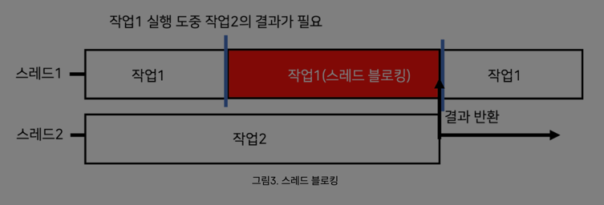
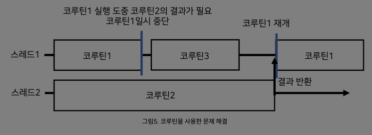
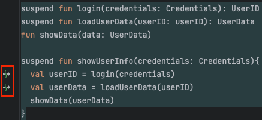

## 14장

- 네트워크에 연결된 애플리케이션은 동시에 여러 요청을 처리해야한다.
- 다른 여러 연산을 서로 블록킹 하지 않고 독립적으로 실행하며, 동시에 여러 작업을 할수있게 하는 코루틴을 알아보자.

### 동시성과 병렬성

- **동시성**
    - 여러 작업을 동시에 실행하는것
    - 물리적으로 함께 실행하는것이 아닌, 코드의 여러 부분을 돌아가며 실행하는 것
    - 하나의 CPU 코어에서도 동시성을 사용할 수 있다
- **병렬성**
    - 여러 작업을 여러 CPU 코어에서 물리적으로 동시에 실행하는 것
- 코루틴은 동시성 계산과 병렬성 계산을 모두 할 수 있다.

---

### 스레드

- JVM 에서 병렬 프로그래밍, 동시성 프로그래밍을 위한 고전적인 추상화로 **스레드** 사용이 있다
- 독립적으로 동시에 실행되는 코드 블록을 지정하게 한다.
- 다음과 같이 스레드를 시작하고 스레드 명을 출력할 수 있다
```kotlin
import kotlin.concurrent.thread

fun main() {
    println("hi")
    thread {
        println("inner hi ${Thread.currentThread().name}")
    }
}
```
- 스레드를 사용하여 작업을 분산시키고, 효율적으로 사용할 수 있게 해주지만, 스레드를 사용하는데 비용이 든다.
- 각 시스템 스레드는 한 번에 몇 천개의 스레드만 효과적으로 관리할 수 있고, 시스템 스레드는 몇 메가바이트의 메로리를 할당받아야 하고, 스레드 간 전환은 운영체제 커널 수준에서 실행되는 작업이다. (그만큼 비용이 크다는 이야기)
- 계층 구조가 없어, 예외 등을 처리하기 힘들다.
- 하여간 스레드는 작업이 완료되길 기다리는 동안 블록된다.



---

- 위와같은 여러 이슈가 존재하기에, 코틀린은 스레드의 대안으로 **코루틴** 이라는 추상화를 도입했다.
- 시스템 자원을 블록시키지 않고 실행을 일시 중단할수 있고, 중단된 지점에서 실행을 재개할 수 있다.
- **구조화된 동시성** 개념을 통해, 동시 계산의 일부가 실패하거나 필요하지 않을 때, 자식으로 시작된 다른 코루틴들도 함께 취소되도록 보장한다.





---

### 일시 중단 함수
- 스레드의 문제점으로, 블록킹이 되는 코드를 확인해보자

```kotlin
fun login(credentials: Credentials): UserID // 블록 함수
fun loadUserData(userID: userID): UserData  // 블록 함수
fun showData(data: UserData)               

fun showUserInfo(credentials: Credentials){
  val userID = login(credentials)
  val userData = loadUserData(userID)
  showData(userData)
}
```
- 첫번째 그림에서 확인할 수 있는 문제점으로, `login()`, `loadUserData()` 함수는 블록되어 결과값을 받아올 때 까지 대기하게 된다.

- 그리고 해당 이슈를 해결할 수 있는 로직으론 다음과 같다.

```kotlin
suspend fun login(credentials: Credentials): UserID // 블록 함수 였던것
suspend fun loadUserData(userID: userID): UserData  // 블록 함수 였던것
fun showData(data: UserData)

suspend fun showUserInfo(credentials: Credentials){
  val userID = login(credentials)
  val userData = loadUserData(userID)
  showData(userData)
}
```
- 블록 함수 앞에 `suspend` 가 붙은게 끝이다. 아주 간단하게 호출이 가능하다.
- `susepend` 변경자는 **함수가 실행을 잠시 멈출 수도 있다**라는 뜻이다.
- 일시 중단된 함수가 되어, 블록킹 상태로 결과값을 기다리는것이 아니라 다른 작업을 진행할 수 있다.
- 그리고 `intellij`에서 일시 중단 함수라고 왼쪽에 화살표 모양이 뜬다.




---

### 다른 방법으로 동시성 접근을 한다면?

#### 콜백으로 여러 함수를 연속으로 호출하기


```kotlin
fun login(credentials: Credentials, callback: (UserId) -> Unit)
fun loadUserData(userID: userID, callback: (UserData) -> Unit)
fun showData(data: UserData)

fun showUserInfo(credentials: Credentials){
  login(credentials) { userID ->
      loadUserData(userId) { userData ->
          showData(userData)
      }
  }
}
```

- `login()` 메서드와 `loadUserData()` 메서드는 콜백 파라미터를 제공해야한다
- 해당 메서드를 호출하는 `showUserInfo()` 메서드도 콜백을 사용하도록 위와같이 변경해야한다.
- 그리고 현재는 두개밖에 없지만, 로직이 뚱뚱해지면 가독성이 급격히 떨어지고 콜백 지옥이 되어버린다.
---

#### CompletableFuture? 반응형 스트림?

```kotlin
import java.util.concurrent.CompletableFuture

fun login(credentials: Credentials): CompletableFuture<UserID> // 블록 함수 였던것
fun loadUserData(userID: userID): CompletableFuture<UserData>  // 블록 함수 였던것
fun showData(data: UserData)

fun showUserInfo(credentials: Credentials) {
    login(credentials)
      .thenCompose { loadUserData(it) }
      .thenAccept { showData(it) }
}
```

- `ComputableFuture` 을 사용해서 콜백 중첩을 피할 수 있지만 `thenCompose`, `thenAccept` 등등 새로운 연산자들이 생겨났다...  
- 또한 메서드의 반환 타입을 `ComputableFuture` 으로 감싸야 한다.
- 반응형 스트림 (`RxJava`) 등도 동일하게 새로운 연산자를 알아야 하는 등 인지적 부가 비용, 새로운 연산자가 추가된다.

---

#### 일시 중단 함수 호출
- 일시 중단 함수는 말 그대로 실행을 일시 중단 할 수 있기 때문에, 아무데서나 호출할 수 없다.
- `함수가 실행을 일시 중단할 수 있다면, 그 함수를 호출하는 함수의 실행도 잠재적으로 일시 중단될 수 있다` 라는 직관에 맞게, 호출하는 함수도 일시 중단할 수 있어야 한다.
- 아까 잠시 예시로 나왔던것중, `suspend` 연산자가 붙은 메서드를 호출하는 함수에서도 `suspend` 연산자가 붙은걸 확인할 수 있다.
- 맨 처음 일시 중단 함수를 호출하는 가장 간단한 방법으로 `main` 함수에 `suspend` 연산자를 붙일 수 있다.
- 하지만 작은 프로젝트에서는 가능하더라도, 더 크고, 안드로이드 같은 SDK나 프레임워크에서 작성할때는 `main` 문에 `suspend` 연산자를 붙이기 쉽지않다.

---

### 코루틴 빌더
- `main` 문에 `suspend` 연산자를 붙여, 전체 코드를 일시 중단 함수로 만드는것 말고, 일시 중단 함수를 호출하는 방법이 몇가지 있는데, `코루틴 빌더`라고 한다.
- 선요약한다면 다음과 같다 

| 항목            | 실행 방식 | 반환 타입         | 특징             |
|---------------|-------|---------------|----------------|
| `runBlocking` | 블로킹   | `T`           | 일반 함수에서 코루틴 진입 |
| `launch`      | 논블로킹  | `Job`         | 작업 실행 (결과 무시)  |
| `async`       | 논블로킹  | `Deferred<T>` | 작업 실행 (결과 필요)  |


#### runBlocking
- 일반 블로킹 코드에서 일시 중단 함수를 호출하게 하려면 `runBlocking` 코루틴 빌더 함수에 코루틴 본문을 구성하는 코드 블록을 전달할 수 있다.
- `runBlocking` 은 하나의 스레드를 블로킹하지만, 추가적인 자식 코루틴을 얼마든 시작하고, 다른 스레드를 블록킹하지 않는다.

```kotlin
suspend fun doSomethingSlowly(){
    delay(500.milliseconds)
  println("done")
}

fun main() = runBlocking {  // suspend 연산자가 없지만 runBlocking 으로 일시 중단 함수를 호출 가능하게 함
    doSomethingSlowly()
}
```

---

#### launch
- `launch` 함수는 새로운 자식 코루틴을 시작하는데 쓰이며, 결과값을 기다리지 않는 경우 주로 사용한다.
- 간단한 예제로 다음이 있다
```kotlin
import kotlinx.coroutines.*
import kotlin.time.Duration.Companion.milliseconds
fun main() = runBlocking {
    log("first start")
    
    launch {
        log("second start")
        delay(100.milliseconds)
        log("second end")
    }
  
    launch {
        log("third start")
        delay(100.milliseconds)
        log("third end")
    }
    log("first end")
}

private var zeroTime = System.currentTimeMillis()
fun log(message: Any) =
  println("${System.currentTimeMillis() - zeroTime}[${Thread.currentThread().name}] $message")
```
- 위의 실행 결과값은 다음과 같고, `main` 스레드에서 실행된것을 확인할 수 있다.
- `main` 스레드에서 블록시키지 않고 일시 중단 되며, `main` 스레드에서 다른 작업을 하도록 놓아준다. 이후 기존 실행을 재개한다.

```
121[main @coroutine#1] first start
131[main @coroutine#1] first end
139[main @coroutine#2] second start
159[main @coroutine#3] third start
258[main @coroutine#2] second end
259[main @coroutine#3] third end
```

- 하지만 `launch` 는 동시 계산은 수행하지만 값을 반환하는건 간단하지 않다.
---

### async
- 비동기 처리할때 익숙한 함수다.
- `async` 함수의 반환 타입은 `Deferred<T>` 인스턴스이며, `Deferred` 는 `await` 일시 중단 함수로 결과를 기다릴 수 있다.
- 다음 예제를 보자

```kotlin
import kotlinx.coroutines.*
import kotlin.time.Duration.Companion.milliseconds
suspend fun slowlyAddNumbers(a: Int, b: Int): Int {
  log("Waiting $a + $b")
  delay(100.milliseconds * a)
  return a + b
}

fun main() = runBlocking {
  log("Start")
  val firstDeferred = async { slowlyAddNumbers(2, 2) }
  val secondDeferred = async { slowlyAddNumbers(4, 4) }
  log("Waiting")
  log("first result : ${firstDeferred.await()}")
  log("second result : ${secondDeferred.await()}")
}

fun log(message: Any) =
  println("[${Thread.currentThread().name}] $message")

```
- 위 코드의 실행 결과는 다음과 같다

```
104[main @coroutine#1] Start
110[main @coroutine#1] Waiting
120[main @coroutine#2] Waiting 2 + 2
135[main @coroutine#3] Waiting 4 + 4
327[main @coroutine#1] first result : 4
536[main @coroutine#1] second result : 8
```
- `launch` 와 마찬가지로 `async` 를 호출한다고 해서 코루틴이 일시 중단되지는 않는다.
- `await` 을 호출하면 `Deferred` 에서 결과값을 사용 가능할 때 까지 루트 코루틴이 일시 중단된다.

---

#### 일시 중단된 코루틴은 ?
- 코루틴이 작동하는건 **컴파일러**가 수행한다. 
- 일시 중단 함수의 코드는 컴파일 시점에 변환되고 실행 시점에 해당 시점의 의 상태 정보가 메모리에 저장된다.
---

### Dispatcher
- 코루틴은 특정 스레드에 고정되지 않는다.
- 코루틴은 한 스레드에서 실행을 일시 중단하고, 다른 스레드에서 실행을 재개할 수 있다.
- 코루틴은 부모 코루틴에서 디스패처(`Dispatcher`)를 상속받기 때문에, 명시적으로 지정할 필요는 없지만, 몇가지 상황에 따라 선택이 가능하다.


#### Dispatchers.Default
- CPU 코어 수 만큼 스레드로 구성된 스레드 풀을 기반으로 한다
- 기본 디스패처에서 코루틴을 스케줄링하면 여러 스레드에서 코루틴이 분산 실행되고, 멀티코어 시스템에서는 병렬로 실행될 수 있다.
- 스레드나 스레드 풀의 제한이 필요없다면, 기본 디스패처를 사용하는것이 적합하다.

#### Dispatchers.Main
- UI 프레임워크 사용할 때는, 메인 스레드에서 실행해야 할 때가 있다.
- 사용자 인터페이스 요소를 다시 그리는 등의 작업이 있다.

#### Dispatchers.IO
- 서드파티 라이브러리를 사용할 때, 코루틴을 염두하여 설계된 APi 를 선택하지 못하는 경우가 있다.
- 예로 데이터베이스와 상호작용하는 API 등에서 기본 디스패처를 사용한다면, CPU 코어 수와 동일한 수의 스레드가 블로킹 되는 작업을 한다면, 다른 코루틴은 완료될 때 까지 실행할 수 없다.

---
| 디스패처 | 스레드 수                  | 특징                         |
| --- |------------------------|----------------------------|
| `Dispatchers.Default` | CPU 코어 수               | 일반적인 연산, CPU 연산            |
| `Dispatchers.Main` | 1                      | UI 프레임워크의 UI 작업            |
| `Dispatchers.IO` | 64개 + 코어 수 (최대 64개 병렬) | 블로킹 IO, 네트워크, 파일, 네트워크 작업 등 |
| `Dispatchers.Unconfined` | (아무 스레드)               | 즉시 스케줄링                    |

---

#### 스레드 풀 ?
- 요청이 들어올 때 마다 새로운 스레드를 할당 대신, 일정한 수의 스레드를 유지하며 내부 논리와 구현에 따라 들어오는 작업을 분배한다.
- 스레드를 새로 생성하는건 비용이 많이들기 때문.


---

### 코루틴 빌더에 디스패처 전달

- `runBlocking`, `launch`, `async` 같은 모든 코루틴 빌더는 코루틴 디스패처를 명시적으로 지정할 수 있다.
```kotlin
fun main() = runBlocking {
    log("first")
    launch(Dispatchers.Default) {
        log("second")
    }
}
```

### 스레드 안정성

- 다 좋다. 그래서 스레드 안정성은 어떨까
- 하나의 코루틴은 항상 순차적으로 실행된다. 이것은 단일 코루틴에 연관된 데이터가 동기화 이슈가 없다는걸 말한다.
- 하지만 여러 코루틴이 동일한 데이터에 접근하게 된다면 다르다...
- 다음 예는 하나의 코루틴에서 실행되어, 항상 10000 의 결과값이 나오는 로직이다.
```kotlin
fun main() {
    runBlocking {
        launch(Dispatchers.Default) {
            var x = 0
            repeat(10_000) { 
                x++ 
            }
          println(x) // 항상 10000
        } 
    }      
}
```

- 그리고 다음은 10000개의 코루틴이 각각 카운터를 하나씩 증가시키는 코드다.
- 다중 스레드 디스패처에서 실행되면 증가 작업이 서로의 결과를 덮어쓰는 상황이 발생하여 기댓값보다 작다.

```kotlin
fun main() {
    runBlocking {
        var x = 0
        repeat(10_100) {
            launch(Dispatchers.Default) {
                x++
            }
        }
          println(x) // 10000 이 아님 (훨씬 작다)
    }      
}

```
- 해당 상황을 해결하기 위한 몇가지 접근 방식이 존재한다.
- `Mutex` 잠금을 통해, 코드 `임계 영역` 이 한 번에 하나의 코루틴만 실행되게 보장할 수 있다
```kotlin
fun main() = runBlocking {
    val mutex = Mutex()
    var x = 0
    repeat(10_000) {
        launch(Dispatchers.Default) {
            mutex.withLock {
                x++
            }
        }
    }

  delay(1.seconds)
  println(x)    // 항상 10000
}
```

- `Mutex` 말고도, `AtomicInteger`, `ConcurrentHashMap` 등 병렬 변경을 위해 설계된 데이터 구조를 사용할 수 있다.

---

### 코루틴은 코루틴 콘텍스트에 추가적인 정보가 있다
- 앞에서, `withContext` 함수에 서로 다른 디스패처를 인자로 전달했다. 
- 하지만 파라미터 이름과 타입이 실제로는 `CoroutineDispatcher` 가 아닌, `CoroutineContext` 이다.
- 각 코루틴은 추가적인 문맥 정보를 갖고 있는데, 이 문맥은 `CoroutineContext` 형태로 제공된다.
- 여기에는 코루틴의 생명주기, 취소를 관리하는 `Job`, `CoroutineName`, `CoroutineExceptionHandler` 같은 추가적인 메타데이터도 있다.

```kotlin
import kotlin.coroutines.coroutineContext

suspend fun introspect() {
    log(coroutineContext)   // coroutineContext 컴파일러 고유 기능에 코루틴에 대한 정보가 있다.
}

fun main() = runBlocking {
    introspect()
}
```

- 코루틴 빌더나 `withContext` 함수에 인자를 전달하면, 자식 코루틴 콘텍스트에서 해당 요소를 덮어쓰게 된다.
- 여러 파라미터를 한번에 덮어쓰려면 `+` 연산자를 사용하여 결합하며 된다.
- 다음과 같은 예제는, `Dispatchers.IO` 디스패처를 실행하며, 이름을 `Cool` 으로 설정한다.

```kotlin
fun main() {
  runBlocking(Dospatchers.IO + CoroutineName("Cool")){
      test()
  }
}

```


## 14.8 코루틴은 코루틴 콘텍스트에 추가적인 정보를 담고 있다

- 앞에서 `launch(Dispatchers.Default)`나 `withContext(Dispatchers.IO)`처럼 디스패처를 인자로 넘겼지만, 실제로 이 인자의 타입은 `CoroutineDispatcher`가 아니라 `CoroutineContext` 이다.

> CoroutineContext란?
CoroutineContext는 코루틴이 실행될 환경 정보를 담고 있는 데이터 집합
>
>
> 여러 요소(디스패처, Job, 이름, 예외 핸들러 등)로 구성되며, 각각이 **"Context Element"이다.**
>

- 현재 코루틴의 콘텍스트 확인하기
    - 코루틴 내부에서는 `coroutineContext` 속성을 통해 자신의 콘텍스트를 확인할 수 있다.

        ```kotlin
        import kotlinx.coroutines.*
        import kotlin.coroutines.coroutineContext

        suspend fun introspect() {
            println(coroutineContext)
        }

        fun main() = runBlocking {
            introspect()
        }
        ```

    - 출력 예시 (환경에 따라 다를 수 있음)

        ```kotlin
        [CoroutineId(1), "coroutine#1":BlockingCoroutine{Active}@... , BlockingEventLoop@...]
        ```


### 콘텍스트 구성 변경하기

- 여러 개의 `CoroutineContext` 요소를 **`+` 연산자**로 조합할 수 있다.

    ```kotlin
    fun main() = runBlocking(Dispatchers.IO + CoroutineName("Coolroutine")) {
        println(coroutineContext)
    }
    ```

    - 출력 예시

        ```kotlin
        [CoroutineName(Coolroutine), CoroutineId(1), ... , Dispatchers.IO]
        ```


| 요소 | 값 |
| --- | --- |
| Dispatcher | Dispatchers.IO (기본 디스패처 대체) |
| CoroutineName | "Coolroutine" |
| Job | BlockingCoroutine |

→ `+` 연산자를 이용하면 기존 콘텍스트를 확장하거나 덮어쓸 수 있다.

### 디스패처도 CoroutineContext의 일부다

```kotlin
launch(Dispatchers.Default)
```

- 이 코드는 **Dispatcher**라는 요소 하나만 전달하는 것이고, 실제로는 **`CoroutineContext` 전체를 전달**하는 것과 동일하다.
- 따라서 아래와 같이 **이름과 디스패처**를 함께 지정할 수도 있다.

```kotlin
launch(Dispatchers.IO + CoroutineName("MyWorker"))
```

| 개념 | 설명 |
| --- | --- |
| `CoroutineContext` | 코루틴에 부가 정보를 담는 환경 객체 (스레드, 이름, 예외 처리 등) |
| 주요 요소 | Dispatcher, Job, Name, ExceptionHandler 등 |
| `coroutineContext` | 현재 코루틴의 Context에 접근할 수 있는 컴파일러 지원 프로퍼티 |
| `+` 연산자 | 여러 Context 요소를 조합해서 전달 가능 |
| Dispatcher도 Context의 일부 | `launch(Dispatchers.IO)`는 Dispatcher가 포함된 Context 전달임 |

---

## 요약

- 동시성은 여러 작업을 동시에 처리하는 것을 의미하며, 여러 작업의 여러 부분이 서로 번갈아 실행되는 방식으로 나타난다. 병렬성은 물리적으로 동시에 실행되면서 현대 멀티코어 시스템을 효과적으로 활용하는 것을 말 한다.
- 코루틴은 스레드 위에서 동시 실행을 위해 동작하는 경량 추상화다.
- 코틀린의 핵심 동시성 기본 요소는 일시 중단 함수로, 실행을 잠시 멈출 수 있는 함수다. 다른 일시 중단 함수나 코루틴 안에서 일시 중단 함수를 호출할 수 있다.
- 반응형 스트림, 끝백, 퓨처 같은 다른 접근 방식과 달리 일시 중단 합수를 쓸 때는 코드의 모양이 달라지지 않는다. 코드는 여전히 순차적으로 보인다.
- 코루틴은 일시 중단 가능한 계산의 인스턴스다.
- 코루틴은 스레드를 블로킹하는 문제를 피한다. 스레드 블로킹이 문제가 되는 이유는 스레드 생성에 비용이 많이 들고, 시스템 자원이 제한적이기 때문이다.
- 코루틴 빌더인 runBlocking, launch, async를 사용해 새로운 코루틴을 생성 할 수 있다.
- 디스패처는 코루틴이 실행될 스레드나 스레드 풀을 결정한다.
- 기본 제공되는 디스패처는 서로 다른 목적을 갖고 있다. Dispatchers. Default 는 일반적인 용도에 쓰이며, Dispatchers.Main은 UI 스레드에서 작업을 실 행할 때 사용되고, Dispatchers. IO는 블로킹되는 IO작업을 호출할 때 사용 된다.
- Dispatchers.Default나 Dispatchers.IO와 같은 대부분의 디스패처는 다중 스레드 디스패처이기 때문에 여러 코루틴이 병렬로 같은 데이터를 변경할 때 주의가 필요하다.
- 코루틴을 생성할 때 디스패처를 지정하거나 withContext를 사용해 디스패처를 변경할 수 있다.
- 코루틴 콘텍스트에는 코루틴과 연관된 추가 정보가 들어있다. 코루틴 디스 패처는 코루틴 콘텍스트의 일부다.