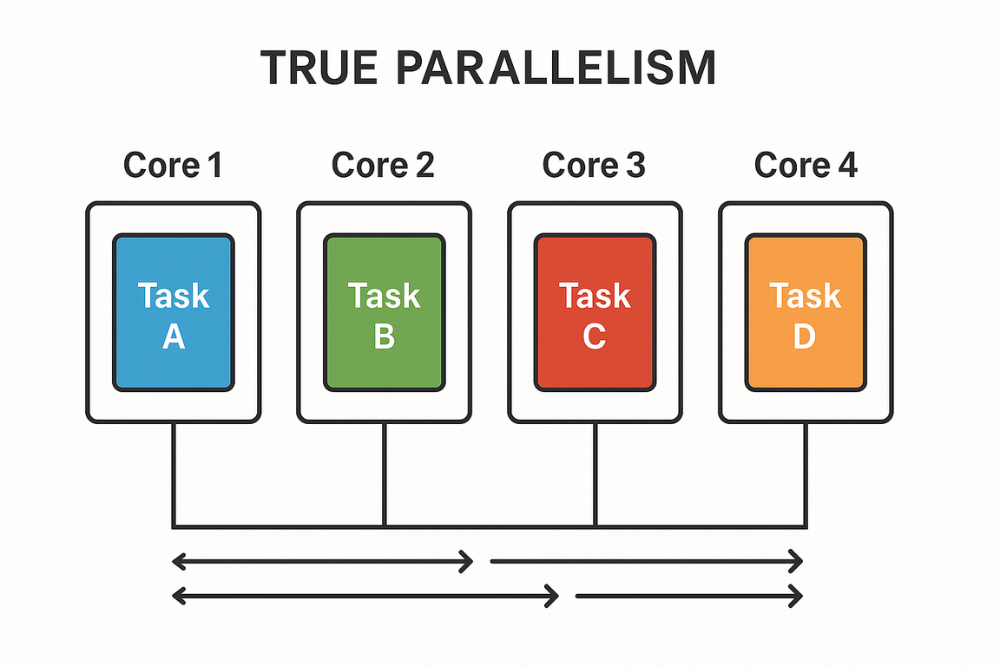

# 14. 코루틴

현대 프로그램에서는 한번에 한가지의 일을 하는 경우가 드물다.

모바일과 데스크톱 앱에서도 네트워크 요청을 보내고, 파일을 읽고, 사용자 입력을 기다리는 등 여러 작업을 처리한다.

이를 처리하기 위해 요청을 기다리고 다음 작업을 진행하는 순차적인 방식이 아닌, 동시에 여러 일을 비동기적으로 할 필요가 있다.

## 14.1 동시성과 병렬성

- **동시성** : 여러 작업을 동시에 실행하는 것
  - 물리적으로 작업을 함께 실행하는 것 뜻하는 건 아니다. <br>이는 CPU 코어가 하나뿐인 시스템에서 실행되는 애플리케이션까지도 동시성을 사용할 수 있다는 뜻이다.
  - 여러 테스크를 계속 전환해 가면서 동시성을 달성한다.
  - 
- **병렬성** : 여러 작업을 **(물리적으로)** 동시에 실행하는 것
  - CPU 코어가 여러 개 있는 시스템에서 여러 작업을 동시에 실행하는 것을 의미한다.
  - 

## 14.2 코루틴의 동시성 처리 방법

코루틴은 비동기적으로 실행되는 넌블로킹 동시성 코드를 우아하게 작성할 수 있게 해준다.

스레드와 같은 전통적 방법과 비교하면 코투린은 훨씬 더 가볍게 작동하면서, 동시성 작업과 그 생명주기를 관리할 수 있다.

코루틴에서는 일시 중단 함수를 통해 동시성을 처리하는데, 일시 중단 함수는 스레드를 블록시키는 단점이 없이 순차적 코드처럼 보이는<br/>
동시성 코드를 작성할 수 있게 해준다.

## 14.3 스레드와 코루틴 비교

JVM에서는 병렬 프로그래밍과 동시성 프로그래밍을 위해 **스레드**를 사용했다.

스레드는 서로 독립적으로 동시에 실행되는 코드 블록 지정할 수 있게 해준다.

```kotlin
fun main() {
    println("I'm on ${Thread.currentThread().name} thread")
    thread {
      println("And I'm on ${Thread.currentThread().name} thread")
    }
}
// I'm on main thread
// And I'm on Thread-0 thread
```

- 스레드의 장점
  - 애플리케이션을 더 반응성 있게 만들어줌
  - 멀티 코어 CPU에 작업을 분산시켜 성능을 향상시킴
- 단점
  - 애플리케이션에서 스레드를 사용하는데 비용이 든다. (JVM의 스레드가 운영체제에서 관리하는 스레드와 매핑되기 때문에)
  - 스레드 간 전환이 운영체제 커널 수준에서 발생하기 때문에 컨텍스트 스위칭 비용이 크다.
  - 스레드 블로킹 발생 시 다른 작업을 처리할 수 없다.
  - 스레드는 독립적인 프로세스로 존재해 취소나 예외처리가 제한적이다.

위와 같은 단점들을 보완한 **코루틴**은 스레드보다 훨씬 가볍고, 스레드와 달리 코루틴은 애플리케이션에서 직접 관리할 수 있다.

- 코루틴의 개선점
  - 초경량 추상화로 가상 스레드를 100,000개 이상 생성할 수 있다. (세밀한 작업이나 짧은 시간의 작업도 스레드를 활용할 수 있다.) <br/>**(내부적으로으로는 JVM 스레드를 사용한다.)**
  - 시스템 자원을 블록 시키지 않고 실행을 일시중단할 수 있다. (논블로킹으로 동작)
  - **구조화된 동시성**을 통해 작업의 계층이 구성돼 취소나 예외처리를 손쉽게 처리할 수 있다.
      

## 14.4 잠시 멈출 수 있는 함수: 일시 중단 함수

코틀린의 코루틴의 장점은 (스레드, Reactive Stream, Callback)과 같은 다른 동시성 접근 방식과 다르게

대부분의 코드의 형태를 크게 변경할 필요가 없다는 점이다.

### 14.4.1 일시 중단 함수를 사용한 코드는 순차적으로 보인다.

아래 코드는 동시성을 사용하지 않은 블로킹 방식으로 작성한 코드의 예시다.

```kotlin
fun login(credentials: Credentials): UserID // 1초 블로킹
fun loadUserData(userID: UserID): UserData // 1초 블로킹
fun showData(data: UserData)

fun showUserInfo(credentials: Credentials) {
    val userID = login(credentials) // 1초 블로킹
    val data = loadUserData(userID) // 1초 블로킹
    showData(data)
}
// 2초의 블로킹이 발생
```


위 작업을 실행하는데 `login()`, `loadUserData()` 함수가 각각 1초씩 블로킹이 발생해 총 2초의 블로킹이 발생한다.<br/>
해당 작업을 실행하는 스레드가 아무런 작업을 하지 않은채로 2초간 대기하게 된다는 뜻이다.

이런 블로킹을 피하기 위해 코루틴의 일시중단 함수를 사용하면 아래와 같이 작성할 수 있다.

```kotlin
suspend fun login(credentials: Credentials): UserID // 1초 일시중단
suspend fun loadUserData(userID: UserID): UserData // 1초 일시중단
fun showData(data: UserData)

suspend fun showUserInfo(credentials: Credentials) {
    val userID = login(credentials) // 1초 일시중단
    val data = loadUserData(userID) // 1초 일시중단
    showData(data)
}
// 2초의 일시중단 발생
```

위 코드에서 `suspend` 키워드를 사용해 일시 중단 함수를 정의했다.<br/>
이전 예제와 다른점은 코드는 순차적으로 보이지만, 실제로는 일시 중단이 발생한다는 점이다.<br/>
일시중단은 스레드를 블로킹하지 않고, 다른 작업을 처리할 수 있게 해준다.

따라서, `showUserInfo()` 함수를 호출하는 스레드는 `login()`과 `loadUserData()` 함수가 일시 중단되는 동안 다른 작업을 처리할 수 있다.<br/>
이러한 구현은 네트워크 요청 (Http, OkHttp, DB)를 사용하는 라이브러리단에서도 논블로킹 코드를 지원해야 완벽한 구현이 가능하다.


## 14.5 코루틴을 다른 접근 방법과 비교

다른 동시성 코드를 작성하는 3가지 방식과 비교를 해보면, 코루틴이 얼마나 우아하게 동시성 코드를 작성할 수 있는지 알 수 있다.

**콜백**

콜백 함수로 동시성을 구현하려면, 함수를 다시 작성해야하는 번거로움이 있다.<br/>
또한, 콜백 함수가 중첩되면 가독성이 떨어지는 **콜백 지옥**이 발생한다.

```kotlin
fun loginAsync(credentials: Credentials, callback: (UserID) -> Unit)
fun loadUserDataAsync(userID: UserID, callback: (UserData) -> Unit)
fun showData(data: UserData)

fun showUserInfoAsync(credentials: Credentials) {
    loginAsync(credentials) { userID ->
        loadUserDataAsync(userID) { data ->
            showData(data)
        }
    }
}
```

**CompletableFuture**

`CompletableFuture`를 사용하면 콜백 지옥을 피할 수 있지만, **CompletableFuture** 객체로 감싸야해서 가독성이 떨어진다.<br/>

```kotlin
import java.util.concurrent.CompletableFuture

fun loginAsync(credentials: Credentials): CompletableFuture<UserID> 
fun loadUserDataAsync(userID: UserID): CompletableFuture<UserData> 
fun showData(data: UserData)

fun showUserInfo(credentials: Credentials) {
  loginAsync(credentials)
    .thenCompose { loadUserDataAsync(it) }
    .thenAccept { showData(data) }
}
```

**RxJava**

RxJava를 사용하면 비동기 작업을 체이닝할 수 있지만, 코드가 복잡해지고 가독성이 떨어진다.<br/>
또한, RxJava 만의 연산자와 개념을 이해해야 해서 러닝커브가 높다.

```kotlin
fun login(credentials: Credentials): Single<UserID>
fun loadUserData(userID: UserID): Single<UserData>
fun showData(data: UserData)

fun showUserInfo(credentials: Credentials) {
    login(credentials)
      .flatMap { loadUserData(it) }
      .doOnSuccess { showData(it) }
      .subscribe()
}
```

코루틴과 비교해보면, 코루틴은 일시 중단 함수 표시인 **suspend** 키워드만 붙여주면 된다.<br/>
하지만, 코루틴 또한 **deferred**, **flow** 와 같은 코루틴용 객체 감싸야하는 경우가 있지만, 확장함수로 이러한 객체로 변환하는 함수를 제공한다.

### 14.5.1 일시 중단 함수 호출

일시 중단 함수는 일반 함수처럼 호출할 수 있지만, **suspend** 키워드가 붙은 함수는 코루틴 내에서만 호출할 수 있다.<br/>
일반 함수 (suspend 키워드가 없는 함수)에서 일시 중단 함수를 호출하려는 경우 컴파일 에러가 발생한다.

```kotlin
suspend fun myOtherSuspendingFunction() {}
suspend fun mySuspendingFunction() {
  myOtherSuspendingFunction() // 올바른 호출
}


fun main() {
    mySuspendingFunction() // 컴파일 에러 발생
}
```

일시 중단 함수를 호출하려면 코드의 최상위까지 올라가며 모두 suspend 함수로 바꿔야하는데, 말이안된다.<br/>
이런 경우, `일반 함수 -> suspend 함수`의 전환이 필요한데 이를 위해 **코루틴 빌더**를 사용한다.<br/>

## 14.6 코루틴 빌더

**코루틴**은 일시 중단 가능한 인스턴스이고, 다른 코루틴들과 동시에 실행될 수 있는 코드 블록으로 생각할 수 있다.<br/>
스레드와 비슷하지만, 코루틴은 함수 실행을 일시 중단하는 데 필요한 매커니즘을 포함하고 있다.<br/>
**코루틴 빌더**는 코루틴을 시작하는 함수로, 일시 중단 함수를 호출할 수 있는 코루틴 컨텍스트를 생성한다.<br/>

**코루틴 빌더 종류**
- **runBlocking** : 블로킹 코드와 일시 중단 함수의 세계를 연결할 때 쓰인다.
- **launch** : 코루틴을 시작하고, 결과를 반환하지 않는다.
- **async** : 코루틴을 시작하고, 결과를 반환한다. (Deferred 객체로 반환)

### 14.6.1 runBlocking

`runBlocking`은 코루틴 빌더 중 하나로, 블로킹 방식으로 코루틴을 실행한다.<br/>
해당 블록내에서 일시 중단 함수 호출이 가능해지고, 모든 코루틴이 완료될때까지 해당 블록은 블로킹된다.

```kotlin
suspend fun doSomethingSlowly() {
    delay(500L) // 500ms 일시 중단
    println("I'm done")
}

fun main() = runBlocking {
    doSomethingSlowly() // 일시 중단 함수 호출
} // 일시 중단 함수가 완료될 때까지 블로킹
```

### 14.6.2 launch

`launch`는 코루틴 빌더 중 하나로, 새로운 코루틴을 시작하고, 결과를 반환하지 않는다.<br/>
결과 값을 기다리지 않는 시나리오에 적합하다.

```kotlin
import kotlinx.coroutines.delay
import kotlinx.coroutines.launch
import kotlinx.coroutines.runBlocking

private var zeroTime = System.currentTimeMillis()
fun log(message: Any?) =
    println("${System.currentTimeMillis() - zeroTime}ms "
    + "[${Thread.currentThread().name}] $message")

fun main() = runBlocking {
    log("The first, parent, coroutine starts")
    launch {
        log("The second coroutine starts and is ready to be suspended")
        delay(500L)
        log("The second coroutine is resumed")
    }
    launch {
        log("The third coroutine can run in the meantime")
    }
    log("The first cotoutine has launched two more coroutines")
}
/*
36ms [main @coroutine#1] The first, parent, coroutine starts
47ms [main @coroutine#1] The first cotoutine has launched two more coroutines
48ms [main @coroutine#2] The second coroutine starts and is ready to be suspended
50ms [main @coroutine#3] The third coroutine can run in the meantime
554ms [main @coroutine#2] The second coroutine is resumed
 */
```

1. runBlocking 초기 실행
- 첫 번째 로그 출력
- `launch` 함수로 두 개의 코루틴 등록
- 마지막 로그 출력

2. 코루틴 스케줄링
- runBlocking 코루틴(#1)이 스레드 반납
- 등록된 코루틴 중 **코루틴 #2**가 먼저 실행

3. 코루틴 #2 실행
- 로그 출력 후 `delay(500ms)` 일시중단
- 일시중단으로 인한 **컨텍스트 스위칭** 발생

4. 코루틴 #3 실행
- 로그 출력 후 즉시 완료

5. 코루틴 #2 재개
- 100ms 대기 완료 후 재실행
- 마지막 로그 출력


launch 함수는 신경쓰지 않아도 되는 데이터베이스 쓰기나 파일 쓰기 작업에 적합하다.

### 14.6.3 async

`async`는 코루틴 빌더 중 하나로, 새로운 코루틴을 시작하고, 결과를 반환한다.<br/>
`launch`와 달리 `Deferred` 객체를 반환하며, 이 객체는 코루틴의 결과를 나타낸다.<br/>

`Deferred` 객체는 `await()` 함수를 사용해 결과를 기다릴 수 있다.

```kotlin
suspend fun slowlyAddNumbers(a: Int, b: Int): Int {
    log("Waiting a bit before calculating $a + $b")
    delay(100L * a) 
    return a + b
}

fun main() = runBlocking {
    log("Starting the async computation") // !1
    val myFirstDeferred = async { 
        slowlyAddNumbers(2, 2) // !6 코루틴 실행 (내부 함수의 delay로 인해 일시중단)
        // !9 delay 종료 후 결과 반환
    } // !2 (코루틴 등록)
    val mySecondDeferred = async { 
        slowlyAddNumbers(4, 4) // !8 코루틴 실행 (내부 함수의 delay로 인해 일시중단)
        // !11 delay 종료 후 결과 반환
    } // !3 (코루틴 등록)
    log("Waiting for the deferred value to be available") // !4
    log("The first result: ${myFirstDeferred.await()}") // !5 (await 호출 (일시중단))
    // !10 await 호출 (일시중단)
    log("The second result: ${mySecondDeferred.await()}") // !7 (await 호출 (일시중단))
    // !12 await 호출 (일시중단)
}
/*
59ms [main @coroutine#1] Starting the async computation
77ms [main @coroutine#1] Waiting for the deferred value to be available
85ms [main @coroutine#2] Waiting a bit before calculating 2 + 2
100ms [main @coroutine#3] Waiting a bit before calculating 4 + 4
299ms [main @coroutine#1] The first result: 4
503ms [main @coroutine#1] The second result: 8
 */
```

|빌더 | 반환 값 | 쓰임새                    |
|---|---|------------------------|
|`runBlocking` | 람다가 계산한 값 | 블로킹 코드와 넌블로킹 코드 사이를 연결 |
| `launch` | `Job` | 작업의 결과값을 사용하지 않을때 사용됨. |
| `async` | `Deferred<T>` | 작업의 결과값을 사용하고, 병렬로 실행할 때 사용됨. |

## 14.7 어디서 코드를 실행할지 정하기: 디스패처

코루틴의 디스패처는 코루틴을 실행할 스레드를 결정한다.<br/>

### 14.7.1 디스패처 선택

코루틴은 기본적으로 부모 코루틴의 디스패처를 상속받기 때문에 모든 코루틴에 대해 명시적으로 디스패처를 지정할 필요는 없다.

하지만, 특정 디스패처를 지정하고 싶다면, `Dispatchers` 객체를 사용해 디스패처를 선택할 수 있다.

- **Dispatchers.Default** : CPU 코어 수에 따라 스레드 풀을 생성한다.
- **Dispatchers.IO** : I/O 작업에 최적화된 스레드 풀을 사용한다.
  - 블로킹되는 작업을 효율적으로 처리하기 위해 설계되었다.
- **Dispatchers.Main** : Android의 메인 스레드에서 실행된다.

### 14.7.2 코루틴 빌더에 디스패처 전달

코루틴을 특정 디스패처에서 실행하기 위해 코루틴 빌더 함수에게 디스패처를 인자로 전달할 수 있다.

`runBlocking`, `launch`, `async` 같은 모든 코루틴 빌더 함수는 코루틴 디스패처를 명시적으로 지정할 수 있다.

```kotlin
fun main() {
    runBlocking {
        log("Doing some work")
        launch(Dispatchers.Default) {
            log("Doing some background work")
        }
    }
}
/*
29ms [main @coroutine#1] Doing some work
39ms [DefaultDispatcher-worker-1 @coroutine#2] Doing some background work
 */
```

runBlocking 코루틴은 기본적으로 메인 스레드에서 실행되지만, `launch` 함수에 `Dispatchers.Default`를 전달해 해당 스레드에서 코드가 실행되는 것을 확인할 수 있다.<br/>

### 14.7.3 withContext를 사용해 코루틴 안에서 디스패처 바꾸기

코루틴 빌더함수 `launch`, `async`를 사용하지 않고, 코루틴 안에서 디스패처만 바꾸고 싶다면 `withContext` 함수를 사용하면 된다.<br/>

```kotlin
fun main() {
    runBlocking { // main 스레드에서 실행
        log("Doing some work") // main 스레드에서 실행
        launch(Dispatchers.Default) { // Dispatchers.Default 스레드에서 실행
            log("Doing some background work") // Dispatchers.Default 스레드에서 실행
            withContext(Dispatchers.IO) { // Dispatchers.IO 스레드에서 실행
                Thread.sleep(1000) // Dispatchers.IO 스레드에서 실행
                log("Doing some IO work") // Dispatchers.IO 스레드에서 실행
            }
            log("Back to background work") // Dispatchers.Default 스레드에서 실행
        }

    }
}

/*
30ms [main @coroutine#1] Doing some work
42ms [DefaultDispatcher-worker-1 @coroutine#2] Doing some background work
1045ms [DefaultDispatcher-worker-2 @coroutine#2] Doing some IO work
1046ms [DefaultDispatcher-worker-1 @coroutine#2] Back to background work
 */
```

### 14.7.4 코루틴과 디스패처의 스레드 안전성 문제

단일 코루틴에서는 스레드가 변경되지 않기 때문에 스레드 안전성 문제가 발생하지 않는다.<br/>
하지만, 여러 코루틴이 동시에 실행되는 경우, 스레드 안전성 문제가 발생할 수 있다.<br/>

**단일 코루틴**

```kotlin
fun main() {
  runBlocking {
    launch(Dispatchers.Default) {
      var x = 0
      repeat(10_000) {
        x++
      }
      println(x) // 10000
    }
  }
}
```

**여러 코루틴**

```kotlin
fun main() {
    runBlocking {
        launch(Dispatchers.Default) {
            var x = 0
            repeat(10_000) {
                launch {
                    x++
                }
            }
            delay(1000)
            println(x) // 9260 (동시성 문제 발생!)
        }
    }
}
```

이러한 동시성은 코루틴 Mutex 잠금 기능을 통해 해결이 가능하다.

```kotlin
fun main() {
    runBlocking {
        launch(Dispatchers.Default) {
            val mutex = Mutex()
            var x = 0
            repeat(10_000) {
                launch {
                    mutex.withLock {
                        x++
                    }
                }
            }
            delay(1000)
            println(x) // 10000
        }
    }
}
```

## 14.8 코루틴은 코루틴 컨텍스트에 추가적인 정보를 담고 있다.

코루틴에서는 코루틴 컨텍스트를 통해 코루틴에 대한 추가적인 정보를 담을 수 있다.<br/>
코루틴 컨텍스트는 코루틴의 실행 환경을 정의하는데 사용되며, 다음과 같은 정보를 포함한다.

- **Job** : 코루틴의 생명주기를 관리하는 객체로, 코루틴의 취소나 완료 상태를 추적한다.
- **Dispatcher** : 코루틴이 실행될 스레드를 결정한다.
- **CoroutineName** : 코루틴의 이름을 지정할 수 있다. 디버깅에 유용하다.
- **CoroutineExceptionHandler** : 코루틴에서 발생한 예외를 처리하는 핸들러를 지정할 수 있다.

중단 함수에서 `coroutineContext` 를 사용하면 현재 코루틴의 컨텍스트 정보를 확인할 수 있다.<br/>

```kotlin
suspend fun introspect() {
    log(coroutineContext)
}

fun main() {
    runBlocking {
        introspect()
    }
}
// 40ms [main @coroutine#1] [CoroutineId(1), "coroutine#1":BlockingCoroutine{Active}@25af5db5, BlockingEventLoop@12cdcf4]
```

코루틴 빌더나 `withContext` 함수에 인자를 전달하면서 코루틴 컨텍스트 정보를 + 연산자를 사용해 넘겨주면,<br/>
해당 코루틴 컨텍스트에 덮어씌워진다.

이전에 봤던 예제에서 `withContext(Dispatchers.IO)`를 사용해 코루틴 컨텍스트를 변경했는데,<br/>
기존 코루틴 디스패처인 `Dispatchers.Default` 가 `Dispatchers.IO`로 덮어씌워지면서 스레드가 전환된 것이다.<br/>

```kotlin
suspend fun introspect() {
    log(coroutineContext)
}

fun main() {
    runBlocking(Dispatchers.IO + CoroutineName("Coolroutine")) {
        introspect()
    }
}
// 32ms [DefaultDispatcher-worker-1 @Coolroutine#1] [CoroutineName(Coolroutine), CoroutineId(1), "Coolroutine#1":BlockingCoroutine{Active}@c5cff2e, Dispatchers.IO]
```
