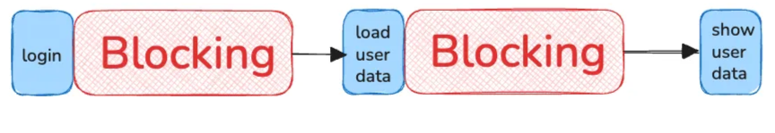
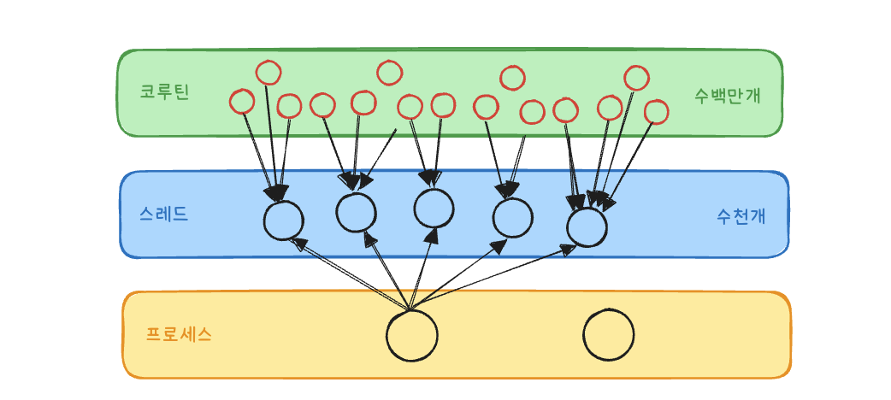
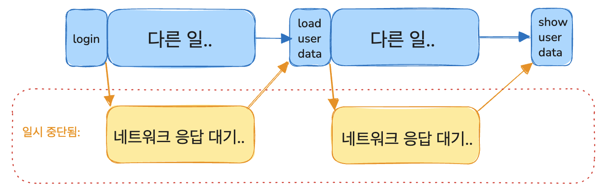
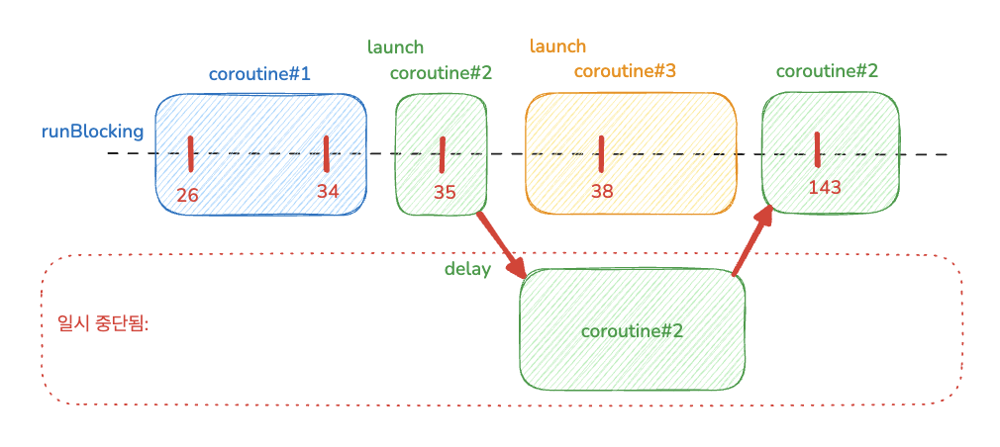
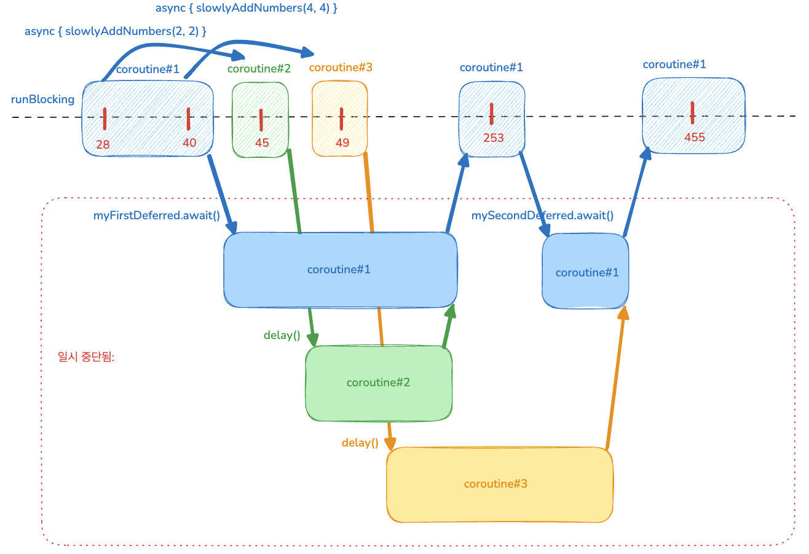
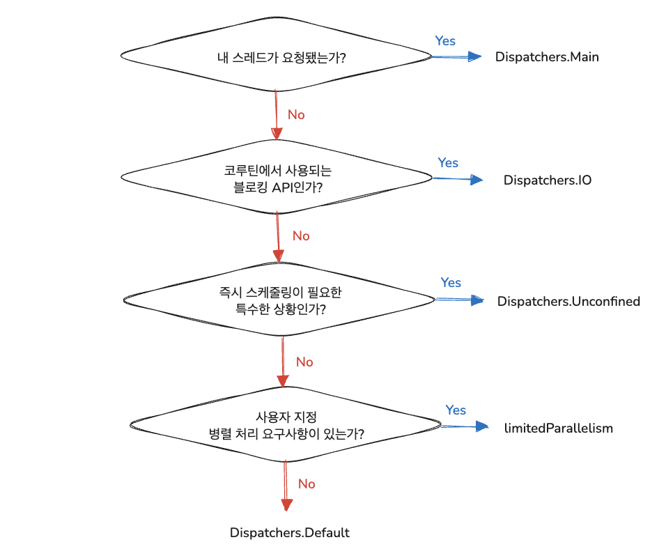
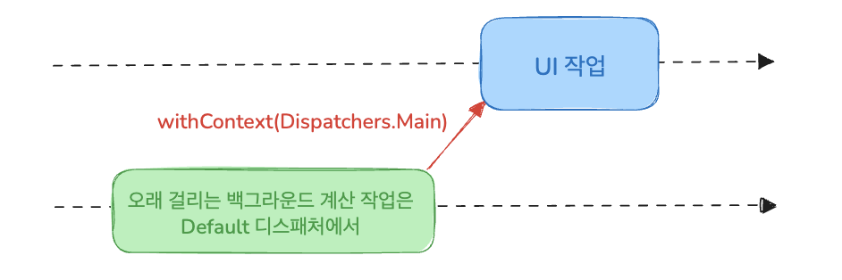
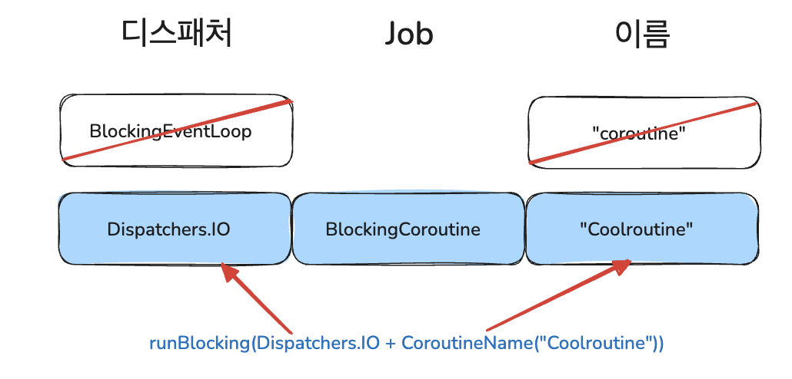

# 14장 코루틴

## 동시성과 병렬성

**동시성이란?**

- 동시성이란 여러 작업을 동시에 실행하는 것을 뜻한다
- 반드시 물리적으로 동시일 필요 없이 코드의 여러 부분을 돌아가면서 실행하는 것도 동시성 시스템이다
- 즉, CPU 코어가 하나여도 동시성을 사용할 수 있다

**병렬성이란?**

- 병렬성은 여러 작업을 여러 CPU 코어에서 물리적으로 동시에 실행하는 것을 뜻한다
- 현대적 멀티코어 하드웨어를 효과적으로 사용해 효율성을 높인다

## 코틀린의 동시성 처리 방법

### **스레드와 코루틴 비교**

- JVM에서의 병렬성 및 동시성의 고전적인 추상화는 스레드를 사용하는 것이다
- 스레드를 통해 서로 독립적으로 동시에 실행되는 코드 블록을 지정한다
- 스레드는 멀티코어 CPU의 여러 코어에 작업을 분산시킬 수 있어 효율적이다

**스레드의 비용 문제**

- JVM에서 생성하는 각 스레드는 일반적으로 OS가 관리하는 스레드인데 이런 시스템 스레드를 생성하고 관리하는 데 비용이 든다
- 한 번에 몇 천개의 스레드만 효과적으로 관리할 수 있고 각 스레드마다 메모리를 할당해줘야 한다
- 스레드간 컨텍스트 스위칭은 OS 커널 수준에서 실행되는 작업이라 또 비용이 든다
- 또한 스레드가 어떤 작업이 완료되길 기다리는 동안 블록되기 때문에 기다리는 동안 시스템 자원만 차지하게 된다

**스레드의 관리 문제**

- 스레드는 독립적인 프로세스로 존재해서 작업을 취소, 예외 처리 등의 관리를 하기 어렵다
- 이런 제약으로 인해 스레드의 사용성이 제한되며 생성 및 관리 비용도 크다

### 코루틴: 일시 중단 가능한 계산

**코틀린은 스레드에 대한 대안으로 코루틴이라는 추상화를 도입했다**

- 코투린은 일시 중단 가능한 계산을 뜻하며 스레드에 비해 장점이 많다

**코루틴의 장점**

- 코루틴은 초경량 추상화라서 생성/관리 비용이 저렴하고 매우 많은 코루틴을 다룰 수 있따
    - 세밀한 작업이나 짧은 시간 동안만 실행하는 작업에도 활용할 수 있는 것
- 코루틴은 시스템 자원을 블록시키지 않고 실행을 일시 중단할 수 있으며 중단된 지점에서 다시 실행을 재개할 수 있다
    - 네트워킹 요청이나 I/O 작업 같은 비동기 작업을 처리할 때 블로킹되는 스레드보다 훨씬 효율적이다
- 코루틴은 구조화된 동시성이라는 개념으로 동시 작업의 구조와 계층을 확립하고, 취소 및 오류 처리를 위한 매커니즘을 제공한다
    - 동시 계산의 일부가 실패하거나 더 이상 필요하지 않을 때 구조화된 동시성은 자식으로 시작된 다른 코루틴들도 함꼐 취소되도록 보장한다

**코루틴 내부 동작 방식**

내부적으로 코루틴은 하나 이상의 JVM 스레드에서 실행된다

- 즉, 코루틴을 사용해도 여전히 기본 스레드 모델이 제공하는 병렬성을 활용할 수는 있는데 OS에 의한 스레드의 한계에는 제약받지 않는다



## 일시 중단 가능하다?

- 코루틴이 다른 동시성 접근 방식과 다른 핵심은 코드의 형태를 크게 변경할 필요 없고, 코드가 순차적으로 보인다는 것이다
- 이것은 코루틴이 일시 중단 함수를 사용하기에 가능한 일이다

### 일시 중단 함수 동작 원리

**전통적인 로직**

- 네트워크에 정보를 요청한 뒤 사용자에게 보여주는 로직
- 로그인과 데이터를 로드하는 함수는 네트워크 요청을 보낸다

```kotlin
fun login(credentials: Credentials): UserID // 블록되는 함수
fun loadUserData(userId: UserID): UserData  // 블록되는 함수
fun showData(data: UserData)                

fun showUserInfo(credentials: Credentials) {
    val userId = login(credentials)
    val userData = loadUserData(userId)
    showData(userData)
}
```

- 이런 코드라면 `showUserInfo` 함수가 실행중인 스레드를 블록시켜 대부분의 시간을 네트워크 작업 결과를 기다리는 데 소모할 것이다


    

**코루틴의 일시 중단 함수 사용**

- suspend 키워드를 함수에 붙여 일시 중단 함수임을 명시한다
- 즉, 네트워크 응답을 기다리는 경우 실행을 일시 중단할 수 있으며 일시 중단 시 기저 스레드를 블록시키지 않는다
- 대신 일시 중단 시 해당 스레드에서 다른 코드가 실행될 수 있다

```kotlin
suspend fun login(credentials: Credentials): UserID // 논블록
suspend fun loadUserData(userId: UserID): UserData  // 논블록
fun showData(data: UserData)                

suspend fun showUserInfo(credentials: Credentials) {
    val userId = login(credentials)
    val userData = loadUserData(userId)
    showData(userData)
}
```



**여전히 코드는 순차적으로 보이지만 블로킹 코드의 단점은 사라졌다!**

- 일시 중단된 사이에 기저 스레드는 다른 작업을 진행할 수 있다

## 코루틴과 다른 동시성 기법의 차이

**콜백 활용**

```kotlin
fun loginAsync(credentials: Credentials, callback: (UserID) -> Unit)
fun loadUserDataAsync(userId: UserID, callback: (UserData) -> Unit)
fun showData(userData: UserData)

fun showUserInfo(credentials: Credentials) {
    loginAsync(credentials) { userId ->
        loadUserDataAsync(userId) { userData ->
            showData(userData)
        }
    }
}
```

- 콜백이 중첩 구조로 쌓이게 되는데 로직이 커질수록 가독성이 떨어지고 복잡해서 callback hell이라고도 부른다

**CompletableFuture 활용**

```kotlin
fun loginAsync(credentials: Credentials): CompletableFuture<UserID>
fun loadUserDataAsync(userId: UserID): CompletableFuture<UserData>
fun showData(data: UserData)

fun showUserData(credentials: Credentials) {
    loginAsync(credentials)
        .thenCompose { userId -> loadUserDataAsync(userId) }
        .thenAccept { userData -> showData(userData) }
}
```

- 콜백 중첩을 피할 수는 있지만 `thenCompose`, `thenAccept`와 같은 연산자를 공부해야 하고, 반환 타입을 `CompletableFuture`로 감싸줘야 한다

**반응형 스트림 활용**

```kotlin
fun login(credentials: Credentails): Single<UserID>
fun loadUserData(userId: UserID): Single<UserData>
fun showData(data: UserData)

fun showUserData(credentials: Credentials) {
    login(credentials)
        .flatMap { userId -> loadUserData(userId) }
        .doOnSuccess { userData -> showData(userData) }
        .subscribe()
}
```

- 마찬가지로 콜백 중첩을 피할 수 있지만 여전히 함수 시크니처를 변경해야 하며 반환값을 `Single`로 감싸야 한다

**코루틴은 함수에 suspend 변경자 키워드만 추가해주면 나머지 코드는 그대로 순차적인 모양을 유지하면서도 스레드를 블록시키는 단점을 피할 수 있다**

### 일시 중단 함수 호출

- 일시 중단 함수는 실행을 일시 중단할 수 있는 코드 블록 안에서만 호출할 수 있다
    - 일반적인 코드에서 일시 중단 함수를 호출하려고 하면 에러가 발생한다
- 즉, “함수가 실행을 일시 중단할 수 있으면 그 함수를 호출하는 함수의 실행도 잠재적으로 일시 중단될 수 있다”
- 위의 예제에서도 `suspend` 붙은 `login`과 `loadUserData`를 호출하는 `showUserInfo`에도 `suspend`가 붙어있었다

**그렇다면 최초의 일시 중단 함수는 어떻게 호출할까?**

- 간단하게 main을 suspend로 해줄 수도 있겠지만 그럴 수 없는 경우엔 코루틴 빌더 함수를 사용해야 한다

## 코루틴 빌더

**코루틴은 일시 중단 가능한 계산의 인스턴스로 다른 코루틴들과 동시에 혹은 병렬로 실행될 수 있는 코드 블록이고**

**이를 생성하기 위해선 코루틴 빌더 함수 중 하나를 사용한다**

### runBlocking 빌더 함수

- `runBlocking` 코루틴 빌더 함수에 코루틴 본문을 구성하는 코드 블록을 전달하면 일시 중단 함수의 세계로 연결해준다
    - 전달된 코드 블록 내에서는 일시 중단 함수를 호출할 수 있다
- `runBlocking`은 새 코루틴을 생성하고 실행하며 해당 코루틴이 완료될 때까지 현재 스레드를 블록시킨다

**엥? 스레드를 블록시킨다고? 그럼 왜 코루틴 써**

- `runBlocking` 자체는 분명 하나의 스레드를 블로킹 하지만 그 코루틴 안에서는 추가적인 자식 코루틴을 얼마든지 시작할 수 있고, 그 자식 코루틴들은 다른 스레드를 블록시키지 않는다
- 대신, 일시 중단될 때마다 하나의 스레드가 해방돼 다른 코루틴이 코드를 실행할 수 있게 된다

**내부 공식 코드 주석 해석**

- Runs a new coroutine and blocks the current thread interruptibly until its completion.
    - 새로운 코루틴을 실행하고 해당 코루틴이 완료될때까지 현재 스레드를 인터럽트 가능하게 블로킹한다
    - 즉, 코루틴에서 10초 딜레이 걸어놨는데 해당 스레드를 `Thread.interrupt()`하면 `runBlocking`은 `InterruptedException`를 던지고 종료된다


- It is designed to bridge regular blocking code to libraries that are written in suspending style, to be used in main functions and in tests.
    - 일반적인 블로킹 코드와 일시 중단 스타일로 작성된 라이브러리 사이를 연결하기 위해 디자인되었다
    - 주로 main 함수나 테스트 코드에서 사용한다


- Calling runBlocking from a suspend function is redundant.
    - `suspend` 함수 내에서 `runBlocking`을 호출하는 것은 잘못된 사용이다
    
    ```kotlin
    suspend fun loadConfiguration() {
        // DO NOT DO THIS:
        val data = runBlocking { // <- redundant and blocks the thread, do not do that
            fetchConfigurationData() // suspending function
        }
    }
    ```
    - Here, instead of releasing the thread on which loadConfiguration runs if fetchConfigurationData suspends, it will block, potentially leading to thread starvation issues.
        - `fetchConfigurationData()`가 중단될 경우 `loadConfiguration()`이 실행되고 있는 스레드를 릴리즈하는 대신 블로킹하게 되어 스레드 고갈 문제(thread starvation issues)가 발생할 수 있다


- The default CoroutineDispatcher for this builder is an internal implementation of event loop that processes continuations in this blocked thread until the completion of this coroutine.
    - runBlocking의 기본 CoroutineDispatcher는 내부 구현된 이벤트 루프이다
    - 이 이벤트 루프는 코루틴이 완료될 때까지 현재 차단된 스레드에서 연속 작업(continuations)를 처리한다


- When CoroutineDispatcher is explicitly specified in the context, then the new coroutine runs in the context of the specified dispatcher while the current thread is blocked.
    - `CoroutineDispatcher`를 명시적으로 `context`로 지정하면 해당 디스패처의 컨텍스트에서 새로운 코루틴이 실행된다
    - 마찬가지로 현재 스레드를 블록킹한다


- If the specified dispatcher is an event loop of another runBlocking, then this invocation uses the outer event loop.
    - 만약 지정된 디스패처가 다른 `runBlocking`에서 사용된 이벤트 루프일 경우 이번 호출은 외부의 이벤트 루프를 재사용한다


- If this blocked thread is interrupted (see Thread.interrupt), then the coroutine job is cancelled and this runBlocking invocation throws InterruptedException.
    - 차단된 스레드가 `Thread.interrupt()`로 인터럽트되면 그 코루틴 작업은 취소되며 그 `runBlocking` 호출은 `InterruptedException`를 던진다


### launch 빌더 함수

- 새로운 자식 코루틴을 시작하는 데 쓰인다
- 보통 어떤 코드를 실행하되 그 결괏값을 기다리지 않는 경우에 사용한다

```kotlin
private var zeroTime = System.currentTimeMillis()
fun log(message: Any?) = println("${System.currentTimeMillis() - zeroTime}) " +
        "[${Thread.currentThread().name}] $message")

fun main() = runBlocking {
    log("The first, parent, coroutine is running")
    launch {
        log("The second coroutine starts and is ready to be suspended")
        delay(100.milliseconds)
        log("The second coroutine is resumed")
    }
    launch {
        log("The third coroutine can run in the meantime")
    }
    log("The first coroutine has launched two more coroutines")
}
```

```kotlin
26) [main @coroutine#1] The first, parent, coroutine is running
34) [main @coroutine#1] The first coroutine has launched two more coroutines
35) [main @coroutine#2] The second coroutine starts and is ready to be suspended
38) [main @coroutine#3] The third coroutine can run in the meantime
143) [main @coroutine#2] The second coroutine is resumed
```

**동작 흐름**



1. `runBlocking`으로 부모 코루틴 시작
    - 이 때 `coroutine#1` 이 생성되고 `"The first, parent, coroutine is running"` 로그 출력
2. `launch`로 2개의 자식 코루틴 생성
    - `coroutine#2`, `coroutine#3` 생성
3. `launch` 호출한 다음 바로 다음 코드로 넘어가 `“The first coroutine has launched two more coroutines"` 로그 출력
4. `coroutine#2` 실행해 일시 중단 지점(suspending point)인 `delay`까지 진행
    - `“The second coroutine starts and is ready to be suspended”` 로그 출력
    - `delay`로 인해 일시 중단 후 실행 제어가 다른 코루틴(`coroutine#3`)으로 넘어감
        - 즉, 메인 스레드가 다른 코루틴이 실행될 수 있게 해방되고 다음 코루틴 실행
5. coroutine#3 실행 및 종료
    - 별도의 일시 중단 없으므로 `“The third coroutine can run in the meantime”` 출력 후 종료
6. 100ms 경과 후 일시 중단되었던 `coroutine#2` 재개
    - `“The second coroutine is resumed”` 로그 출력
7. 모든 자식 코루틴이 완료되면 `runBlocking`도 종료
    - 즉, 부모 코루틴인 `coroutine#1`은 모든 자식 코루틴이 끝날 때까지 블로킹 상태로 있다가 자식 코루틴 모두 종료되면 종료

**launch 빌더 활용처**

- `launch`는 동시 계산을 수행할 수는 있지만 코루틴 내부에서 값을 반환하기 어렵다
- 따라서 파일이나 DB 쓰기 작업처럼 부수 효과를 일으키는, 즉 시작 후 신경쓰지 않아도 되는 작업에 적합하다
- `launch` 함수는 코루틴의 핸들 역할을 하는 `Job` 타입의 객체를 반환하기 때문에 코루틴 실행을 제어할 수 있다
    - ex) 코루틴 취소

### **일시 중단된 코루틴은 어디로 갈까?**

- 코틀린 코루틴은 내부적으로 컴파일 시점에 state machine으로 변환된다
- 즉, 컴파일러는 코드를 읽고 일시 중단 지점을 기준으로 3가지를 자동으로 관리하는 코드로 변환한다
    1. 어디서 중단되었는지
    2. 어떤 지역 변수들이 살아 있어야 하는지
    3. 다음에 어디로 재개해야 하는지

**중단 시점에는 코루틴의 상태가 `Continuation` 객체에 저장된다**

- 중단된 위치(`label`)
- 지역 변수 값들
- 실행 컨텍스트
- …

**코루틴의 실행은 잠시 멈추지만 사라지지 않는다!**

- 해당 시점의 상태 정보가 메모리에 그대로 남는다
- 이 후 `Continuation` 객체의 정보를 바탕으로 정확히 중단된 위치부터 재개한다

### async 빌더 함수

- 비동기 계산을 수행할 때 `async` 빌더 함수를 사용한다
- async 함수의 반환 타입은 `Deferred<T>` 인스턴스로 `await` 라는 일시 중단 함수로 그 결과를 기다릴 수 있다

```kotlin
private var zeroTime = System.currentTimeMillis()
fun log(message: Any?) = println("${System.currentTimeMillis() - zeroTime}) " +
        "[${Thread.currentThread().name}] $message")

suspend fun slowlyAddNumbers(a: Int, b: Int): Int {
    log("Waiting a bit before calculating $a + $b")
    delay(100.milliseconds * a)
    return a + b
}

fun main() = runBlocking {
    log("Starting the async computation")
    val myFirstDeferred = async { slowlyAddNumbers(2, 2) }     // 200ms 걸리는 작업
    val mySecondDeferred = async { slowlyAddNumbers(4, 4) }    // 400ms 걸리는 작업
    log("Waiting for the deferred value to be available")
    log("The first result: ${myFirstDeferred.await()}")
    log("The second result: ${mySecondDeferred.await()}")
}
```

```kotlin
28) [main @coroutine#1] Starting the async computation
40) [main @coroutine#1] Waiting for the deferred value to be available
45) [main @coroutine#2] Waiting a bit before calculating 2 + 2
49) [main @coroutine#3] Waiting a bit before calculating 4 + 4
253) [main @coroutine#1] The first result: 4
455) [main @coroutine#1] The second result: 8
```

**동작 흐름**



**두 계산을 하는데 약 400ms(두 작업 중 오래걸린 작업의 시간)가 걸렸다!**

- `async`로 새로운 코루틴을 시작해 두 계산이 동시에 일어났기 때문
- `await`를 호출하면 `Deferred`에서 결괏값이 사용 가능해질 때까지 루트 코루틴이 일시 중단된다

**코루틴 빌더 정리**

| 빌더 | 반환값 | 활용처 |
| --- | --- | --- |
| `runBlocking` | 람다가 계산한 값 | 블로킹 코드와 넌블로킹 코드 사이를 연결 |
| `launch` | Job | 발사 후 망각 코루틴 시작 (부수 효과 존재할 때) |
| `async` | Deferred<T> | 값을 비동기로 계산 (값을 기다릴 수 있음) |

## 코루틴의 디스패처: 어디서 코드를 실행할지 정하기

**디스패처 선택**

- 코루틴은 기본적으로 부모 코루틴에서 디스패처를 상속받기에 모든 코루틴에 명시적으로 디스패처를 지정할 필요는 없다
- 다만 상황에 따라 명시적 코루틴 실행에 도움을 주는 디스패처들이 있다

**Dispatchers.Default**

- 기본 디스패처로 다중 스레드를 사용하는 디스패처이다
- CPU의 코어 수만큼의 스레드로 구성된 스레드 풀을 기반으로 한다
- 이 디스패처에서 코루틴을 스케줄링하면 여러 스레드에서 코루틴이 분산 실행되며 멀티 코어 시스템에서는 병렬로 실행할 수 있다
    - CPU 계산 중심 작업에 유리하다
- 특별히 특정 스레드로 제한하거나 스레드 풀을 제한할 필요가 없는 일반적인 작업에 사용한다

**Dispatchers.Main**

- UI 프레임워크(Swing, 안드로이드 등)를 사용할 때는 특정 작업을 UI 스레드나 메인 스레드에서 실행해야 할 때가 있다
- 실제 값은 사용하는 UI 프레임워크에 따라 다르다

**Dispatchers.IO**

- 서드 파티 라이브러리가 코루틴 고려 없이 설계된 API일 경우 기본 디스패처에서 호출하면 문제가 발생할 수 있다
    - ex) DB 시스템과 상호작용하는 블로킹 API를 사용해야 하는 경우, 파일, 네트워크 다룰 경우
- 기본 디스패처의 스레드 수는 CPU 코어 수와 동일하기 때문에 기본 스레드 풀이 소진돼 다른 코루틴은 완료될 때까지 실행되지 못한다
- Dispatchers.IO에서 실행된 코루틴은 자동으로 확장되는 스레드 풀에서 실행되며 CPU 집약적이지 않은 작업(ex: 블로킹 API의 응답 대기)에 적합하다

**디스패처 비교**

| 디스패처 | 스레드 개수                           | 활용처                       |
| --- |----------------------------------|---------------------------|
| **Dispatchers.Default** | CPU 코어 수                         | 일반적인 연산, CPU 집약적인 작업      |
| **Dispatchers.Main** | 1                                | UI 프레임워크 작업               |
| **Dispatchers.IO** | 64 + CPU 코어 수 (최대 64개까지만 병렬 실행됨) | 블로킹 IO 작업, 네트워크 작업, 파일 작업 |
| **Dispatchers.Unconfined** | … (아무 스레드나) | 즉시 스케줄링해야 하는 특수한 경우       |
| **limitedParallelism(n)** | 커스텀(n) | 커스텀 시나리오                  |

**디스패처 선택 기준**



### 코루틴 빌더에 디스패처 전달

- 코루틴을 특정 디스패처에서 실행하기 위해 코루틴 빌더 함수에 디스패처를 지정할 수 있다

**`withContext`를 사용해 코루틴 안에서 디스채처 바꾸기**

- 이미 실행중인 코루틴에서 디스패처를 바꿀 때 `withContext` 함수로 다른 디스패처를 전달한다

```kotlin
    launch(Dispatchers.Default) {                        // Defualt
        val result = performBackgroundOperation()
        withContext(Dispatchers.Main) {                  // Main
            update(result) 
        }
    }
```



### 코루틴과 디스패처가 스레드 안전성 문제에 대한 해결책은 아니다 !

**코루틴은 항상 순차적으로 실행되기에 어느 단일 코루틴의 어떤 부분도 병렬로 실행되지 않는다**

- 즉, 단일 코루틴에 연관된 데이터가 전형적인 동기화 문제를 일으키지는 않는다는 것을 의미한다

**하지만 병렬로 실행될 수 있는 여러 코루틴이 동일한 데이터에 접근하는 경우는 얘기가 좀 다르다**

```kotlin
fun main() {
    runBlocking {
        var x = 0
        repeat(10_000) {
            launch(Dispatchers.Default) {
                x++
            }
        }
        delay(1.seconds)
        println(x)
    }
}
// 9920
```

- 여러 코루틴이 같은 데이터에 접근하기에 동시성 문제가 발생해 예상 값인 10000보다 낮은 값이 나온다

**방법 1) Mutex 잠금을 사용해 임계 영역 보호하기**

```kotlin
fun main() = runBlocking {
    val mutex = Mutex()
    var x = 0
    repeat(10_000) {
        launch(Dispatchers.Default) {
            mutex.withLock { x++ }
        }
    }
    delay(1.seconds)
    println(x)
}
// 10000
```

**방법 2) `AtomicInteger` 처럼 스레드 안전하고 원자성 보장하는 데이터 구조 사용하기**

```kotlin
fun main() = runBlocking {
    val counter = AtomicInteger(0)
    
    repeat(10_000) {
        launch(Dispatchers.Default) {
            counter.incrementAndGet()
        }
    }

    delay(1.seconds)
    println(counter.get())  // 10000
}
```

**방법 3) 단일 스레드 디스패처에서 실행되도록 제한**

- 성능 이슈 고려 필요

## 코루틴 컨텍스트

코루틴 빌더 함수나 withContext로 디스패처를 인자로 전달했는데 그 인자의 타입을 보면 CoroutinContext이다

```kotlin
public actual fun <T> runBlocking(
		context: CoroutineContext, 
		block: suspend CoroutineScope.() -> T
): T

public suspend fun <T> withContext(
    context: CoroutineContext,
    block: suspend CoroutineScope.() -> T
): T
```

**각 코루틴은 `CoroutineContext` 형태로 문맥 정보를 담고 있다**

- 이 컨텍스트 요소 중 하나가 디스패처이고, 코루틴의 생명 주기와 취소를 관리하는 `Job` 객체도 포함한다
- 이름이나 에러 핸들링 같은 추가적인 메타 데이터도 포함할 수 있다
- 코루틴 실행 문맥을 확인하려면 어떤 일시 중단 함수 안에서든 `coroutinContext` 속성에 접근하면 된다
- 실제 코틀린 코드에 정의된 것이 아닌 컴파일러 고유의 기능이다

```kotlin
suspend fun introspect() {
    log(coroutineContext)
}

fun main() = runBlocking {
    introspect()
}

/**
 * 26) [main @coroutine#1] [
 *                              CoroutineId(1), 
 *                              "coroutine#1":BlockingCoroutine{Active}@5fe5c6f, 
 *                              BlockingEventLoop@6979e8cb
 *                         ]
 */
```

**코루틴 빌더나 `withContext` 인자로 전달되면 자식 코루틴의 컨텍스트에서 해당 요소를 덮어쓴다**

- `+` 연산자로 여러 `CoroutineContext` 객체를 결합할 수도 있다

```kotlin
suspend fun introspect() {
    log(coroutineContext)
}

fun main() = runBlocking(Dispatchers.IO + CoroutineName("Coolroutine")) {
    introspect()
}

/**
 * 26) [DefaultDispatcher-worker-1 @Coolroutine#1] [
 *                                                      CoroutineName(Coolroutine), 
 *                                                      CoroutineId(1), 
 *                                                      "Coolroutine#1":BlockingCoroutine{Active}@5160d030, 
 *                                                      Dispatchers.IO
 *                                                  ]
 */
```

