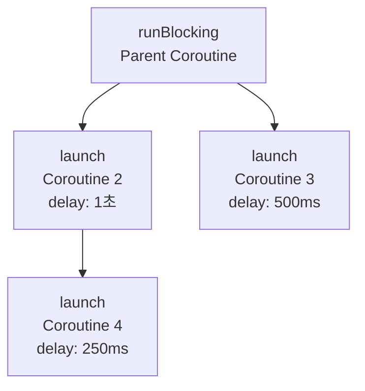
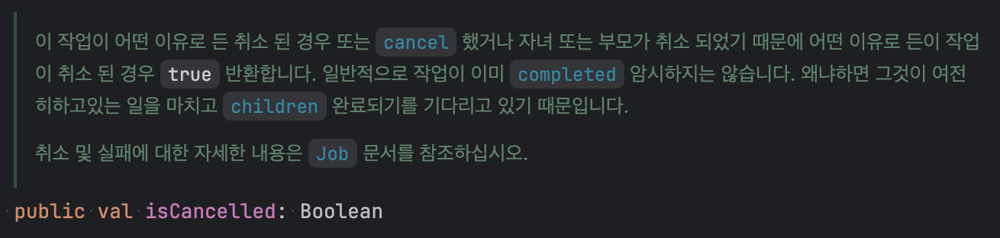

# 15. 구조화된 동시성

여러 동시 작업을 처리할 때 가장 어려운점 -> **개별 작업을 추적하고, 더 이상 필요하지 않은 작업을 취소하고, 오류를 제대로 처리하는 것**

**구조화된 동시성** : 애플리케이션 안에서 코루틴과 그 생애주기의 계층을 관리하고 추적할 수 있는 기능

**장점**
- 코루틴의 생애주기를 명확하게 관리할 수 있다.
- 수동으로 시작된 각 코루틴을 일일이 추적하지 않아도 된다.
- 계획보다 오래 실행되거나 잊혀진 '제멋대로인' 코루틴이 발생하지 않는다.

## 15.1 코루틴 스코프

구조화된 동시성을 통해 각 코루틴은 **코루틴 스코프**에 속하게 된다.<br/>
코루틴 스코프는 코루틴 간 부모-자식 관계를 형성해주고, <br/>

**CoroutineScope**의 확장함수인 `launch`와 `async`를 사용해 코루틴을 만들면,<br/>
자동으로 해당 코루틴의 자식 코루틴이 된다.

```kotlin
fun main() {
    runBlocking {
        launch {
            delay(1.seconds)
            launch {
                delay(250.milliseconds)
                log("Grandchild done")
            }
            log("Child 1 done!")
        }
        launch {
            delay(500.milliseconds)
            log("Child 2 done!")
        }
        log("Parent done!")
    }
}
/*
33ms [main @coroutine#1] Parent done!
550ms [main @coroutine#3] Child 2 done!
1049ms [main @coroutine#2] Child 1 done!
1305ms [main @coroutine#4] Grandchild done
 */
```

`runBlocking` 블록은 내부의 자식 코루틴이 모두 완료될 때까지 기다린다.<br/>
이러한 기능은 코루틴 스코프에 의해 `runBlocking`이 자식 코루틴들이 모두 완료되는지 알 수 있다.<br/>

또한, **부모-자식 간의 관계**를 통해 `부모의 작업이 취소되었을때` `자식 코루틴도 자동으로 취소`되는 기능을 가능하게 한다. 




### 15.1.1 코루틴 스코프 생성: coroutineScope

코루틴 빌더를 사용해 새로운 코루틴을 만들면 이 코루틴은 자체적인 **CoroutineScope**를 생성한다.<br/>
하지만, **coroutineScope** 함수를 사용하면, 새로운 코루틴을 만들지 않고 코루틴 스코프를 그룹화할 수 있다.

> `launch`와 `async`는 새로운 코루틴을 생성

```kotlin
suspend fun generateValue(): Int {
    delay(500.milliseconds)
    return Random.nextInt(0, 10)
}

suspend fun computeSum() {
    log("Computing sum...")
    val sum = coroutineScope {
        val a = async { generateValue() }
        val b = async { generateValue() }
        a.await() + b.await() // coroutineScope는 결과를 돌려주기 전에 모든 자식 코루틴이 끝나길 기다린다.
    }
    log("Sum is $sum")
}

fun main() = runBlocking {
    computeSum()
}
/*
33ms [main @coroutine#1] Computing sum...
559ms [main @coroutine#1] Sum is 3
 */
```

`runBlocking` 블록도 자식 코루틴들이 완료될 때까지 기다리지만,

`coroutineScope`의 다른점은 **자식 코루틴이 완료될 때까지 기다리면서도** <br/>
새로운 코루틴을 생성하지 않음 + 기다릴때 스레드를 블록시키지 않음 <br/>

**`runBlocking`에서만 블록킹이 발생하는지 실험**

```kotlin
suspend fun generateValue(): Int {
    delay(500.milliseconds)
    return Random.nextInt(0, 10)
}

suspend fun computeSum() {
    log("Computing sum...")
    val sum = coroutineScope {
        val a = async { generateValue() }
        val b = async { generateValue() }
        a.await() + b.await() // coroutineScope는 결과를 돌려주기 전에 모든 자식 코루틴이 끝나길 기다린다.
    }
    log("Sum is $sum")
}

suspend fun blockComputeSum() {
    log("Computing sum...")
    val sum = runBlocking {
        val a = async { generateValue() }
        val b = async { generateValue() }
        a.await() + b.await() // coroutineScope는 결과를 돌려주기 전에 모든 자식 코루틴이 끝나길 기다린다.
    }
    log("Sum is $sum")
}

val singleThreadDispatcher = Dispatchers.Default.limitedParallelism(1)

// CASE 1
fun main() = runBlocking(singleThreadDispatcher) {
    launch { computeSum() }
    launch { computeSum() }
    log("Done")
}
/*
33ms [DefaultDispatcher-worker-1 @coroutine#1] Done
40ms [DefaultDispatcher-worker-1 @coroutine#2] Computing sum...
43ms [DefaultDispatcher-worker-1 @coroutine#3] Computing sum...
553ms [DefaultDispatcher-worker-1 @coroutine#2] Sum is 4
553ms [DefaultDispatcher-worker-1 @coroutine#3] Sum is 12
 */

// CASE 2
fun main() = runBlocking(singleThreadDispatcher) {
    launch { blockComputeSum() }
    launch { blockComputeSum() }
    log("Done")
}
/*
34ms [DefaultDispatcher-worker-1 @coroutine#1] Done
41ms [DefaultDispatcher-worker-1 @coroutine#2] Computing sum...
554ms [DefaultDispatcher-worker-1 @coroutine#2] Sum is 12
554ms [DefaultDispatcher-worker-1 @coroutine#3] Computing sum...
1062ms [DefaultDispatcher-worker-1 @coroutine#3] Sum is 7
 */
```

### 15.1.2 코루틴 스코프를 컴포넌트와 연관시키기: CoroutineScope

`coroutineScope` 함수가 작업을 분해하는데 사용되지만, 동시처리나 코루틴의 시작과 종료를 관리하는 클래스를 만들고 싶을 때도 있다.

이런 시나리오에서는 `CoroutineScope` 생성자 함수를 사용해 새로운 독자적인 코루틴 스코프를 생성할 수 있다.

이 함수는 `coroutineScope`와는 달리 실행을 일시 중단하지 않으며, 새로운 코루틴을 시작할 때 쓸 수 있는 새로운 코루틴 스코프를 생성하기만 한다.

기본적인 `Job` 객체는 다른 자식에서 예외가 발생하면, 취소를 전파하지만, 자식간의 취소를 전파하지 않기 위해 `SupervisorJob()`을 사용할 수 있다.<br/>
`SupervisorJob`은 부모-자식 관계를 유지하면서도, 자식 코루틴에서 발생한 예외가 다른 자식 코루틴에 영향을 주지 않도록 한다.

```kotlin
class ComponentWithScope(dispatcher: CoroutineDispatcher = Dispatchers.Default) {
    private val scope = CoroutineScope(dispatcher + SupervisorJob())

    fun start() {
        log("Starting!")
        scope.launch {
            while (true) {
                delay(500.milliseconds)
                log("Component working!")
            }
        }
        scope.launch {
            log("Doing a one-off task..")
            delay(500.milliseconds)
            log("Task done!")
        }
    }

    fun stop() {
        log("Stopping!")
        scope.cancel()
    }
}

fun main() {
    val c = ComponentWithScope()
    c.start()
    Thread.sleep(2000)
    c.stop()
}
/*

17ms [main] Starting!
39ms [DefaultDispatcher-worker-2 @coroutine#2] Doing a one-off task..
543ms [DefaultDispatcher-worker-1 @coroutine#2] Task done!
543ms [DefaultDispatcher-worker-2 @coroutine#1] Component working!
1049ms [DefaultDispatcher-worker-1 @coroutine#1] Component working!
1554ms [DefaultDispatcher-worker-1 @coroutine#1] Component working!
2039ms [main] Stopping!
 */
```

**실무 사용 예제**

```kotlin
suspend fun createEntity(entity: Entity): Entity {
    delay(100.milliseconds)
    val savedEntity = this.XxxRepository.create(entity)
    // 해당 블록에서 발생한 예외가 전파되지 않도록, 구조화된 동시성을 끊어버림
    CoroutineScope(Dispatchers.IO).launch {
        notifyCreateEntityForAnotherUser(savedEntity)
    }
    return savedEntity
}
```

### 15.1.3 GlobalScope의 위험성

`GlobalScope`는 애플리케이션 전체에서 사용할 수 있는 코루틴 스코프를 제공한다.<br/>
하지만, 이 스코프는 **구조화된 동시성**의 원칙을 따르지 않기 때문에 사용을 권장하지 않는다.<br/>
`GlobalScope`를 사용하면, 코루틴의 생애주기를 관리할 수 없고, <br/>
코루틴이 완료되었는지, 취소되었는지 추적할 수 없게 된다.<br/>

```kotlin
fun main() {
    runBlocking {
        GlobalScope.launch {
            delay(1000.milliseconds)
            launch {
                delay(250.milliseconds)
                log("Grandchild done")
            }
            log("Child 1 done!")
        }
        GlobalScope.launch {
            delay(500.milliseconds)
            log("Child 2 done!")
        }
        log("Parent done!") 
    }
}
// 35ms [main @coroutine#1] Parent done!
```

### 15.1.4 코루틴 콘텍스트와 구조화된 동시성

코루틴 스코프는 코루틴 콘텍스트를 통해 코루틴의 생애주기를 관리한다.<br/>
코루틴 콘텍스트는 코루틴의 실행 환경을 정의하며, <br/>
코루틴 스코프는 이 콘텍스트를 사용해 코루틴을 시작하고 관리한다.<br/>

새로운 코루틴이 시작되면,
1. 자식 코루틴은 부모의 콘텍스트를 상속 받는다.
2. 새로운 코루틴은 부모-자식 관계를 설정하는 역할을 하는 새 Job 객체를 생성한다.
3. 코루틴 콘텍스트에 전달된 인자가 적용된다. (상속받은 값을 덮어 씌움)

```kotlin
fun main() {
    runBlocking(Dispatchers.Default) {
        log(coroutineContext)
        launch {
            log(coroutineContext)
            launch(Dispatchers.IO + CoroutineName("mine")) {
                log(coroutineContext)
            }
        }
    }
}
/*
33ms [DefaultDispatcher-worker-1 @coroutine#1] [CoroutineId(1), "coroutine#1":BlockingCoroutine{Active}@2a87e73c, Dispatchers.Default]
42ms [DefaultDispatcher-worker-2 @coroutine#2] [CoroutineId(2), "coroutine#2":StandaloneCoroutine{Active}@496ad9c4, Dispatchers.Default]
43ms [DefaultDispatcher-worker-3 @mine#3] [CoroutineName(mine), CoroutineId(3), "mine#3":StandaloneCoroutine{Active}@24e51d1f, Dispatchers.IO]
 */
```

부모-자식 관계는 `coroutineContext`의 `job` 속성을 통해 확인할 수 있다.<br/>

```kotlin
fun main() = runBlocking(CoroutineName("A")) {
    log("A's job: ${coroutineContext.job}")
    launch(CoroutineName("B")) {
        log("B's job: ${coroutineContext.job}")
        log("B's parent: ${coroutineContext.job.parent}")
    }
    log("A's children: ${coroutineContext.job.children.toList()}")
}
/*
37ms [main @A#1] A's job: "A#1":BlockingCoroutine{Active}@9a7504c
52ms [main @A#1] A's children: ["B#2":StandaloneCoroutine{Active}@4fb64261]
53ms [main @B#2] B's job: "B#2":StandaloneCoroutine{Active}@4fb64261
53ms [main @B#2] B's parent: "A#1":BlockingCoroutine{Completing}@9a7504c
 */
```

## 15.2 취소

**취소** : 코드가 완료되기 전에 실행을 중단하는 것을 뜻한다.

메모리나 불필요한 네트워크 요청을 방지하기 위해 애플리케이션에서 작업 취소가 필요하다.

취소는 오류처리에서도 중요한 역할을 하는데, 여러 작업을 코루틴으로 등록해 동시에 실행해 한번에 기다릴 때<br/>
어떤 한 작업에서 오류가 발생한 경우, 나머지 작업들을 더이상 진행할 필요가 없어 질 수 있다.<br/>
취소는 이런 불필요한 작업을 피할 수 있게한다.

### 15.2.1 취소 촉발

`launch` 코루틴 빌더는 `Job`을 반환하고, `async` 코루틴 빌더는 `Deferred`를 반환한다.<br/>
이 두 객체에서 모두 `cancel` 함수를 호출하면, 해당 코루틴을 취소할 수 있다.<br/>

```kotlin
fun main() {
    runBlocking {
        val launchdedJob = launch {
            log("I'm launched!")
            delay(1.seconds)
            log("I'm done!")
        }
        val asyncDeferred = async {
            log("I'm async")
            delay(1.seconds)
            log("I'm done!")
        }
        delay(200.milliseconds)
        launchdedJob.cancel()
        asyncDeferred.cancel()
    }
}
/*
43ms [main @coroutine#2] I'm launched!
49ms [main @coroutine#3] I'm async
 */
```

`public interface Deferred<out T> : Job {` `Deferred`는 `Job`을 상속받기 때문에, `cancel` 함수를 사용할 수 있다.<br/>

### 15.2.2 시간제한이 초과된 후 자동으로 취소 호출

코루틴에서는 취소를 자동으로 촉발할 수 있는 몇가지 함수를 제공한다.

**withTimeout**: 타임아웃이 되면, 예외(`TimeoutCancellationException`)를 발생시킨다.<br/>
**withTimeoutOrNull**: 타임아웃이 되면, `null`을 반환한다.<br/>

```kotlin
suspend fun calculateSomething(): Int {
    delay(3.seconds)
    return 2 + 2
}

fun main() = runBlocking {
    val quickResult = withTimeoutOrNull(500.milliseconds) {
        calculateSomething()
    }
    log(quickResult)

    val slowResult = withTimeoutOrNull(5.seconds) {
        calculateSomething()
    }
    log(slowResult)
}
/*
572ms [main @coroutine#1] null
3583ms [main @coroutine#1] 4
 */
```

### 15.2.3 취소의 전파

코루틴을 취소하면 해당 코루틴의 모든 자식 코루틴도 자동으로 취소된다.

이는 구조화된 동시성을 통해 부모-자식 관계가 형성되기 때문에 가능한 기능이다.<br/>
코루틴 콘텍스트의 `Job`의 부모와 자식 관계가 정의되어 있기 때문에, 부모가 최소될때 모든 자식들을 정리할 수 있게 된다.

```kotlin
fun main() = runBlocking {
    val job = launch {
        launch {
            launch {
                launch {
                    log("I'm started")
                    delay(500.milliseconds)
                    log("I'm done!")
                }
            }
        }
    }
    delay(200.milliseconds)
    job.cancel()
}
// 41ms [main @coroutine#5] I'm started
```

### 15.2.4 취소된 코루틴은 특별한 지점에서 CancellationException을 던진다

코루틴의 취소 매커니즘은 코루틴이 **일시 중단 지점**에 도달했을 때 작동한다.<br/>
취소가 촉발되게 되면, `Job` 내부의 `isCancelled` 가 `true`로 변경되고, 다음 중단지점이 실행될때<br/>
`isCancelled`가 `true`인지 확인해서 `true`라면 `CancellationException`이 발생한다.<br/>


```kotlin
// delay, yield, 네트워크 호출 등 중단 지점에서
if (isCancelled) {
    throw CancellationException()
}
```

```kotlin
suspend fun doWork() {
    delay(500.milliseconds)
    throw UnsupportedOperationException("Didn't work!")
}

fun main() {
    runBlocking {
        withTimeoutOrNull(2.seconds) {
            while (true) {
                try {
                    doWork()
                } catch (e: Exception) {
                    log("Oops: ${e.message}")
                }
            }
        }
    }
}
```

### 15.2.5 취소는 협렵적이다.

코루틴에서 취소는 **협력적**이다.<br/>
**협력적 취소** -> 코루틴이 스스로 취소 상태를 확인하고 협력해야만 취소가 가능하다는 것을 의미

따라서, 스레드와 다르게 중단 시킨다고해서 그 즉시 중단되는 것이 아니라, 다음 중단 지점에서 취소 상태를 확인하고, <br/>
`CancellationException`을 던진다.<br/>

```kotlin
suspend fun doCpuHeavyWork(): Int {
    log("I'm doing work!")
    var counter = 0
    val startTime = System.currentTimeMillis()
    while (System.currentTimeMillis() < startTime + 500) {
        counter++
    }
    return counter
}

fun main() {
    runBlocking {
        val myJob = launch {
            repeat(5) {
                doCpuHeavyWork()
            }
        }
        delay(600.milliseconds)
        myJob.cancel() // 취소되지 않는다.
    }
}

/*
39ms [main @coroutine#2] I'm doing work!
545ms [main @coroutine#2] I'm doing work!
1045ms [main @coroutine#2] I'm doing work!
1545ms [main @coroutine#2] I'm doing work!
2045ms [main @coroutine#2] I'm doing work!
 */
```

일시 중단 지점을 추가해주면, 코루틴이 취소 상태를 확인하고, `CancellationException`을 던지게 돼서 취소가 가능해진다.

```kotlin
suspend fun doCpuHeavyWork(): Int {
    log("I'm doing work!")
    var counter = 0
    val startTime = System.currentTimeMillis()
    while (System.currentTimeMillis() < startTime + 500) {
        counter++
        delay(100.milliseconds) // 일시 중단 지점 추가 (yield, isActive 등도 가능)
    }
    return counter
}

fun main() {
    runBlocking {
        val myJob = launch {
            repeat(5) {
                doCpuHeavyWork()
            }
        }
        delay(600.milliseconds)
        myJob.cancel() // 취소되지 않는다.
    }
}

/*
39ms [main @coroutine#2] I'm doing work!
545ms [main @coroutine#2] I'm doing work!
 */
```

### 15.2.6 코루틴이 취소됐는지 확인

코루틴이 취소됐는지 확인하는 방법은 `isActive` 속성을 사용하는 것이다.<br/>
`isActive`는 `Job`의 `isCancelled`와 `isCompleted`를 확인하는 프로퍼티로, <br/>
코루틴이 활성 상태인지 확인할 수 있다.<br/>

> `isCancelled`가 `true`라고, `isCompleted`가 무조건 `true`인 것은 아니다.<br/>
> 취소 동작이 완료되지 않는 경우, `isCompleted`는 `false`일 수 있다.

```kotlin
val myJob = launch {
    repeat(5) {
        doCpuHeavyWork()
        if (!isActive) return@launch
    }
}   
val myJob = launch {
    repeat(5) {
        doCpuHeavyWork()
        ensureActive()
    }
}
```


```kotlin
// ensureActive의 구현체
public fun Job.ensureActive(): Unit {
    if (!isActive) throw getCancellationException()
}
```

### 15.2.7 다른 코루틴에게 기회를 주기: yield

코루틴이 디스패처를 점유하고 있는 동안 다른 코루틴에게 기회를 주고 싶을 때는 `yield` 함수를 사용할 수 있다.<br/>
`yield`는 현재 코루틴을 일시 중단하고, 다른 코루틴이 실행될 수 있도록 한다.<br/>
이 함수는 코루틴이 취소되었는지 확인하고, 취소 상태라면 `CancellationException`을 던진다.<br/>

```kotlin
suspend fun doCpuHeavyWork(): Int {
    log("I'm doing work!")
    var counter = 0
    val startTime = System.currentTimeMillis()
    while (System.currentTimeMillis() < startTime + 500) {
        counter++
    }
    return counter
}
fun main() {
    runBlocking {
        launch {
            repeat(3) {
                doCpuHeavyWork()
            }
        }
        launch {
            repeat(3) {
                doCpuHeavyWork()
            }
        }
    }
}

/*
31ms [main @coroutine#2] I'm doing work!
537ms [main @coroutine#2] I'm doing work!
1037ms [main @coroutine#2] I'm doing work!
1537ms [main @coroutine#3] I'm doing work!
2037ms [main @coroutine#3] I'm doing work!
2537ms [main @coroutine#3] I'm doing work!
 */
```

위 예제에서는 `doCpuHeavyWork` 함수가 일시 중단 지점이 없기 때문에, <br/>
두 코루틴이 동시에 실행되지 못하고, 하나의 코루틴이 모두 끝난 뒤에 다음 코루틴이 실행된다.<br/>

하지만, `doCpuHeavyWork` 함수에 `yield`를 추가하면, <br/>
두 코루틴이 번갈아가며 실행되게 된다.

```kotlin
suspend fun doCpuHeavyWork(): Int {
    log("I'm doing work!")
    var counter = 0
    val startTime = System.currentTimeMillis()
    while (System.currentTimeMillis() < startTime + 500) {
        counter++
        yield()
    }
    return counter
}
fun main() {
    runBlocking {
        launch {
            repeat(3) {
                doCpuHeavyWork()
            }
        }
        launch {
            repeat(3) {
                doCpuHeavyWork()
            }
        }
    }
}

/*
34ms [main @coroutine#2] I'm doing work!
42ms [main @coroutine#3] I'm doing work!
542ms [main @coroutine#2] I'm doing work!
542ms [main @coroutine#3] I'm doing work!
1042ms [main @coroutine#2] I'm doing work!
1042ms [main @coroutine#3] I'm doing work!
 */
```

### 15.2.8 리소스를 얻을 때  취소를 염두에 두기

코루틴이 리소스를 얻을 때, 취소를 염두에 두어야 한다.<br/>
예를 들어, 네트워크 요청을 보내는 경우, 요청이 완료되기 전에 코루틴이 취소될 수 있다.<br/>
이 경우, 네트워크 요청이 완료되기 전에 코루틴이 취소되면, <br/>
커넥션이 정리되지 않고 코루틴이 종료돼 리소스가 낭비될 수 있다.<br/>

```kotlin
class DatabaseConnection : AutoCloseable {
    fun write(s: String) = println("writing $s!")
    override fun close() = println("closing connection!")
}

fun main() {
    runBlocking {
        val dbTask = launch {
            val db = DatabaseConnection()
            delay(500.milliseconds)
            db.write("I love coroutines!")
            db.close()
        }
        delay(200.milliseconds)
        dbTask.cancel()
    }
    println("I leaked a resource!")
}
// I leaked a resource!
```

finally 혹은 AutoCloseable이 구현되어있는 경우, `use` 함수를 사용해 간결하게 처리할 수 있다.

```kotlin
val dbTask = launch {
    val db = DatabaseConnection()
    try {
        delay(500.milliseconds)
        db.write("I love coroutines!")
    } finally {
        db.close() // 코루틴이 취소되더라도, finally 블록이 실행되어 리소스가 정리된다.
    }
}

val dbTask = launch {
    DatabaseConnection().use { db ->
        delay(500.milliseconds)
        db.write("I love coroutines!")
    }
}
```

### 15.2.9 프레임워크가 여러분 대신 취소를 할 수 있다.

Spring의 Webflux의 경우 Flow를 사용해 비동기적으로 데이터를 처리할 수 있다.<br/>
SSE 프로토콜을 사용하면 서버에서 클라이언트로 데이터를 스트리밍할 수 있는데,<br/>
이때, 클라이언트가 연결을 끊으면, 프레임 워크에서는 CancellationException을 발생시킨다.<br/>

```kotlin
    suspend fun summarize(
        officeUserContext: OfficeUserContext,
        template: SummarizeTemplate,
        metadata: Map<String, String> = emptyMap()
    ): Flow<CommonResponse> = flow<CommonResponse> {
        ...
    
        mailSummarizeAgent.summarizeMailContent(officeUserContext, template.build(), metadata)
            .onCompletion {
                if (it == null || it is CancellationException) { // 정상적인 완료거나 클라이언트 측에서 연결을 끊은 경우 (결과를 출력)
                    emit(
                        FinishResponse(
                            messageId = messageId,
                            solution = Solution.SUMMARIZE,
                            fullText = assistantAnswer.toString()
                        )
                    )
                }

                it?.let { // 예외가 발생한 경우
                    logger.suspendWarn(it.message ?: "")
                    if (it !is CancellationException) throw it // 취소 예외가 아닌 경우에만 다시 던진다.
                }
            }
            .collect {
                val pendingResponse = PendingResponse(Solution.SUMMARIZE, it)
                emit(pendingResponse)

                messageId = pendingResponse.meta.messageId
                assistantAnswer.append(pendingResponse.data.text)
            }
    }
```
