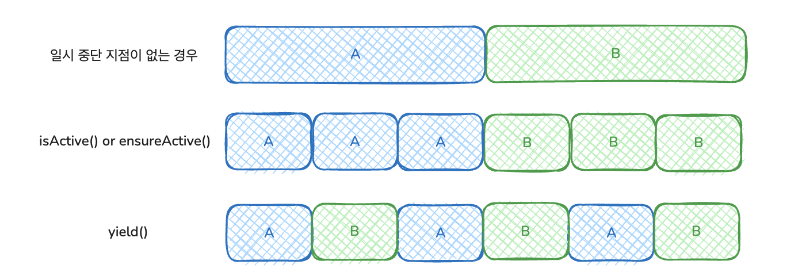

# 15장 구조화된 동시성

**많은 코루틴을 다룰 때..**

- 많은 코루틴을 다룰 때 개별 작업 추적, 취소, 오류 처리가 중요하다
- 추적하지 않으면 버려진 코루틴이 계속 실행되어 리소스 누수 발생한다
- 코틀린 코루틴은 구조화된 동시성으로 코루틴의 생애 주기를 계층적으로 관리할 수 있도록 지원한다

## 코루틴 스코프

- 각 코루틴은 코루틴 스코프에 속하게 되며 코루틴 스코프는 코루틴 간의 부모-자식 관계를 확립한다
- 코루틴 빌더 함수들은(`launch`, `async`) 사실 `CoroutinScope` 인터페이스의 확장함수로 새로운 코루틴을 만들면 자동으로 해당 코루틴의 자식이 된다

**부모 코루틴이 실행을 마쳐도 모든 자식 코루틴이 완료될 때까지 프로그램이 종료되지 않는다.**

```kotlin
fun main(): Unit = runBlocking {
    launch {
        delay(1.seconds)
        launch {
            delay(250.milliseconds)
            log("Grandchild done")
        }
        log("Child 1 done")
    }
    launch {
        delay(500.milliseconds)
        log("Child 2 done")
    }
    log("Parent done!")
}

66) [main] Parent done!
604) [main] Child 2 done
1099) [main] Child 1 done
1354) [main] Grandchild done
```

- 구조화된 동시성 덕분에 코루틴 간의 부모-자식 관계가 있어서 자식 코루틴의 모든 작업이 완료될 때까지 기다린다.
- 실행한 코루틴이나 그 자손을 수동으로 추적할 필요가 없고, 수동으로 `await`를 호출할 필요도 없다
- 마찬가지로 부모 코루틴이 취소될 경우 자식 코루틴도 자동으로 취소된다

### 코루틴 스코프 생성

- 코루틴 빌더를 사용하면 새로운 코루틴을 만들고 자체 `CoroutineScope`를 생성한다
- 코루틴을 만들지 않고도 코루틴 스코프를 그룹화하려면 `coroutinScope` 함수를 사용한다

**coroutineScope 함수?**

```kotlin
public suspend fun <R> coroutineScope(block: suspend CoroutineScope.() -> R): R {
    return suspendCoroutineUninterceptedOrReturn { uCont ->
        val coroutine = ScopeCoroutine(uCont.context, uCont)
        coroutine.startUndispatchedOrReturn(coroutine, block)
    }
}
```

- 일시 중단 함수로 새로운 코루틴 스코프를 생성하고 지정된 block을 실행한다
- 외부 코루틴 스코프의 `coroutineContext`를 상속받으며, 해당 컨텍스트의 `Job`을 부모로 하는 새로운 `Job`을 생성한다.
    - 위 코드에서 `uCont`가 현재 일시 중단 함수의 `continuation`이고 `uCont.context`가 호출한 외부 스코프의 `coroutineContext`이다
- 해당 영역 안 모든 자식 코루틴이 완료될 때가지 기다린다
    - 스코프 내 어떤 자식 코루틴이 실패하면 전체 스코프가 실패하고 다른 모든 자식들을 취소한다

**coroutineScope 함수 활용**

- 동시적 작업 분해(여러 코루틴을 활용한 계산)를 수행할 때 사용한다
- **coroutineScope는 값을 반환할 수 있어서 병렬 계산 결과를 받을 수 있다**

```kotlin
suspend fun generateValue(): Int {
    delay(500.milliseconds)
    return Random.nextInt(0, 10)
}

suspend fun computeSum() {
    log("Computing a sum...")
    val sum  = coroutineScope {
        val a = async { generateValue() }
        val b = async { generateValue() }
        a.await() + b.await()
    }
    log("Sum is $sum")
}

47) [main] Computing a sum...
584) [main] Sum is 8
```

### 코루틴 스코프를 컴포넌트와 연관

- 구체적인 생명 주기를 정의하고 동시 처리나 코루틴의 시작과 종료를 관리하는 클래스를 만들 때 사용한다
- `CoroutineScope()` 생성자 함수로 새로운 독자적인 코루틴 스코프를 생성할 수 있다
- `coroutineScope`와 다르게 실행을 일시 중단하지 않고 단순히 새로운 코루틴 스코프만 생성한다

**CoroutineScope 생성자?**

```kotlin
@Suppress("FunctionName")
public fun CoroutineScope(context: CoroutineContext): CoroutineScope =
    ContextScope(if (context[Job] != null) context else context + Job())
```

- 코루틴 스코프와 연관된 코루틴 `context`를 감싸는 `CoroutineScope`를 생성한다.
- 해당 범위에서 시작된 코루틴이 사용할 디스패처를 지정할 수 있다
- 기본적으로는 새로운 `Job`이 기본 생성된다
    - 모든 코루틴 스코프는 Job을 가져야 하기 때문
    - Job이 없으면 부모-자식 관계를 확립할 수 없다
- 그러나 실무에서는 `CoroutineScope`랑 `SupervisorJob`을 사용하는 것이 좋다

**SupervisorJob ?**

- 동일한 스코프와 관련된 다른 코루틴을 취소하지 않고 처리되지 않은 예외를 전파하지 않게 해주는 특수한 `Job`이다
- `supervisorJob`의 자식들은 서로 독립적으로 실패할 수 있다
- 즉, 자식의 실패나 취소에 영향받지 않고 다른 자식들에게도 영향을 주지 않는다
- `supervisor`가 자식들의 실패에 대한 커스텀 정책을 구현할 수 있다

왜 실무에서는 **SupervisorJob를 쓰는 게 좋다고 할까?**

- 일반 Job의 경우는 하나 실패하면 모든 자식을 취소시킨다
- 반면 `SupervisorJob`은 하나 실패해도 다른 자식들은 계속 실행된다
- 실무에서는 여러 API를 호출하거나 백그라운드 작업들을 할 때 하나가 실패해도 나머지는 계속 진행시키기 위해 사용한다
- 추가로 `SupervisorJob`는 `CoroutineExceptionHandler`로 실패 정책을 커스텀할 수 있어서 좋다

**CoroutineScope & SupervisorJob 활용**

```kotlin
class ComponentWithScope(
    dispatcher: CoroutineDispatcher = Dispatchers.Default
) {
    // SupervisorJob으로 독립적인 실패 가능하도록 지정
    private val scope = CoroutineScope(dispatcher + SupervisorJob())

    fun start() {
        log("Starting!")
        scope.launch {
            while (true) {
                delay(500.milliseconds)
                log("Component working!")
            }
        }
        scope.launch {
            log("Doing a one-off task...")
            delay(500.milliseconds)
            log("Task done!")
        }
    }

    fun stop() {
        log("Stopping!")
        scope.cancel()
    }
}

fun main() {
    val c = ComponentWithScope()
    c.start()
    Thread.sleep(2000)
    c.stop()
}

31) [main] Starting!
68) [DefaultDispatcher-worker-1] Doing a one-off task...
574) [DefaultDispatcher-worker-2] Component working!
574) [DefaultDispatcher-worker-1] Task done!
1077) [DefaultDispatcher-worker-1] Component working!
1583) [DefaultDispatcher-worker-1] Component working!
2073) [main] Stopping!
```

- 컴포넌트의 인스턴스 생성 후 `start`를 호출하면 컴포넌트 내부에서 코루틴이 시작되고 `stop`을 호출하면 컴포넌트의 생명주기가 종료되면서 모든 코루틴을 즉시 취소시킨다
- `launch` 블록으로 시작되는 두 코루틴이 독립적으로 실행되어서 하나가 실패해도 다른 하나에 영향이 없다

### GlobalScope의 위험성

**GlobalScope ?**

- 전역 수준에 존재하는 특수한 코루틴 스코프 인스턴스
- 애플리케이션 전체 생명주기 동안 존재하며 취소되지 않는다

**그러나.. GlobalScope는 구조화된 동시성이 제공하는 모든 이점을 포기해야 한다 !**

- 전역 범위에서 시작된 코루틴은 자동으로 취소되지 않고, 생명주기에 대한 개념이 없다
- 코루틴 추적이 어렵기에 계속 작동되어 리소스 누수가 발생할 수 있다

```kotlin
@DelicateCoroutinesApi
fun main() {
    runBlocking {
        GlobalScope.launch {
            delay(1000.milliseconds)
            launch {
                delay(250.milliseconds)
                log("Grandchild done")
            }
            log("Child 1 done")
        }
        GlobalScope.launch {
            delay(500.milliseconds)
            log("Child 2 done")
        }
    }
    log("Parent done")
}

56) [main] Parent done
```

- `GlobalScope`는 구조화된 동시성에서 자동으로 설정되는 계층 구조가 깨지기 때문에 즉시 종료된다
- `runBlocking`과 연관된 `coroutine#1`과의 부모 관계에서 벗어나 있어 프로그램은 자식이 완료되기 전에 종료된다
- 이런 문제들로 불가피하게 사용해야할 때에는 `@DelicateCoroutinesApi`로 경고 메세지를 표시해야 한다

사용할 일은 매우 매우 드물기에 보통은 코루틴 빌더나 `coroutineScope` 함수를 사용하는 것이 좋다

### 코루틴 context와 구조화된 동시성

**코루틴 context ?**

- 코루틴의 지속적인 컨텍스트로 `Element` 인스턴스들의 인덱싱된 집합이다
- 인덱싱은 Set과 Map을 혼합한 형태로 각 `Element`는 고유한 `Key`를 가진다

    ```kotlin
    public interface Key<E : Element>  // 타입 안전성 보장
    public interface Element : CoroutineContext {
        public val key: Key<*>         // 각 요소의 고유 키
    }
    ```

    - 각 `Element`는 그 자체로 하나의 `CoroutineContext`이며 고유한 `Key`로 식별되는 싱글톤 컨텍스트이다

**새로운 코루틴을 시작할 때 코루틴 context에 일어나는 일**

1. 자식 코루틴은 부모의 context를 상속받는다
    - `Dispatcher`, `CoroutineName` 등 모든 context 요소가 전달된다
2. 새로운 코루틴은 부모-자식 관계를 설정하는 역할을 하는 새 `Job` 객체를 생성한다
    - Job은 유일하게 상속되지 않는 context로 자체로 새로 생성한다
    - 이 새로운 `Job` 객체는 부모 코루틴의 `Job` 객체를 parent로 설정한다
    - 이로 인해 코루틴 간 부모-자식 계층 구조가 형성된다
3. 코루틴 context에 전달된 인자가 적용된다
    - `launch(context)` 또는 `async(context)`로 전달된 인자가 적용된다
    - 상속받은 값과 동일한 `Key`를 가진 `Element`는 새로운 값으로 덮어쓰여진다
    - `CoroutineContext.plus()` 연산을 통해 결합된다

```kotlin
// 부모 컨텍스트: Dispatchers.IO + Job(parent=null) + CoroutineName("Parent")
scope.launch(Dispatchers.Main + CoroutineName("Child")) {
    // 결과 컨텍스트: Dispatchers.Main + Job(parent=부모Job) + CoroutineName("Child")
}
```

**상속받은 값과 동일한 Key를 가진 Element는 새로운 값으로 덮여쓰여진다 ?**

- 전달받은 정보가 맵의 putAll() 처럼 덮여씌워진다

```kotlin
private var zeroTime = System.currentTimeMillis()

@OptIn(ExperimentalStdlibApi::class, ExperimentalCoroutinesApi::class)
fun log(context: CoroutineContext, message: String = "") {
    val time = System.currentTimeMillis() - zeroTime
    val thread = Thread.currentThread().name
    val job = context[Job]
    val dispatcher = context[CoroutineDispatcher]
    val name = context[CoroutineName]

    val jobInfo = job?.let {
        "${it.javaClass.simpleName}{${if(it.isActive) "Active" else "Inactive"}}@${it.hashCode()}"
    } ?: "null"

    val parentInfo = job?.parent?.let {
        "${it.javaClass.simpleName}@${it.hashCode()}"
    } ?: "null"

    println(buildString {
        appendLine("$time) [$thread] Job: $jobInfo")
        appendLine(" Parent: $parentInfo")
        appendLine(" Dispatcher: $dispatcher")
        appendLine(" Name: ${name?.name ?: "없음"}")
        if (message.isNotEmpty()) {
            appendLine("  → $message")
        }
    })
}

fun main() {
    runBlocking(Dispatchers.Default) {
        log(coroutineContext, "runBlocking 시작")
        launch {
            log(coroutineContext, "첫 번째 launch")
            launch(Dispatchers.IO + CoroutineName("mine")) {
                log(coroutineContext, "두 번째 launch")
            }
        }
    }
}
```

```kotlin
43) [DefaultDispatcher-worker-1] Job: BlockingCoroutine{Active}@1325530821
 Parent: null
 Dispatcher: Dispatchers.Default
 Name: 없음
  → runBlocking 시작

67) [DefaultDispatcher-worker-2] Job: StandaloneCoroutine{Active}@590606171
 Parent: BlockingCoroutine@1325530821
 Dispatcher: Dispatchers.Default
 Name: 없음
  → 첫 번째 launch

71) [DefaultDispatcher-worker-2] Job: StandaloneCoroutine{Active}@1373274695
 Parent: StandaloneCoroutine@590606171
 Dispatcher: Dispatchers.IO
 Name: mine
  → 두 번째 launch
```

- 책에서는 `runBlocking` 사용 시 기본값인 `“coroutine”`으로 이름이 초기화된다고 하는데 나는 없다고 나온다. 버전 문제인가?

---

## 취소

작업을 취소할 수 없다면 필요없는 코루틴이 계속 연산되거나 메모리에서 데이터 구조체에 대한 참조를 유지해서 GC가 메모리를 해제하지 못해 리소스 누수가 발생한다

### 취소 촉발

- 코루틴 빌더 함수의 반환값을 취소를 촉발하는 핸들로 사용할 수 있다

```kotlin
fun main() = runBlocking { 
    val launchedJob = launch { // launch는 Job을 반환
        log("I'm launched!")
        delay(1000.milliseconds)
        log("I'm done!")
    }
    val asyncDeferred = async { // async는 Deferred를 반환
        log("I'm async!")
        delay(1000.milliseconds)
        log("I'm async done!")
    }
    delay(200.milliseconds)
    
    // 코루틴 빌더 함수 취소 가능
    launchedJob.cancel()
    asyncDeferred.cancel()
}

25) [main] I'm launched!
30) [main] I'm async!
```

### 자동 취소 호출

- `withTimeout`과 `withTimeoutOrNull` 함수로 계산에 쓸 최대 시간을 제한하면서 값을 계산하도록 해 자동으로 취소를 호출할 수 있다
    - `withTimeout`은 타임 아웃이 발생하면 `TimeoutCancellationException` 예외가 발생하고 이를 처리하기 위해 `try-catch`로 해당 예외를 잡아 처리해야 한다
    - `TimeoutCancellationException` 예외의 상위 타입인 `CancellationException`은 코루틴을 취소하기 위한 특별한 표식으로 사용되기 때문에 예외를 잡아서 처리하지 않으면 의도와 다르게 코루틴이 취소될 수 있다

```kotlin
fun main() = runBlocking {
    val quickResult = withTimeoutOrNull(500.milliseconds) {
        calculateSomething()
    }
    println("$quickResult")  // null

    val slowResult = withTimeoutOrNull(5.seconds) {
        calculateSomething()
    }
    println("$slowResult")   // 4
}
```

### 취소는 모든 자식 코루틴에 전파된다

- 코루틴이 취소되면 모든 자식 코루틴도 자동으로 취소된다
- 구조화된 동시성으로 자식들을 알고 있기에 불필요한 코루틴들을 정리할 수 있는 것이다

```kotlin
fun main() = runBlocking {
    val job = launch {
        launch {
            launch {
                launch {
                    log("I'm started")
                    delay(500.milliseconds)
                    log("I'm done")
                }
            }
        }
    }
    delay(200.milliseconds)
    job.cancel()
}

28) [main] I'm started
```

### 취소된 코루틴은 특별한 지점에서 CancellationException을 던진다

**취소된 코루틴은 일시 중단 지점에서 `CancellationException`를 던진다**

- 코루틴의 모든 일시 중단 함수는 `CancellationException`이 던져질 수 있는 지점을 도입한다

    ```kotlin
    coroutinScope {
        log("A")
        delay(500.milliseconds)  // 유일한 함수 취소 가능 지점
        log("B")
        log("C")
    }
    ```

    - 여기서 `CancellationException`가 던져질 수 있는 지점은 delay 지점이 유일하기 때문에 결과는 “A” 또는 “ABC”가 출력되며 “AB”는 절대 출력될 수 없다

**코루틴은 예외를 사용해 코루틴 계층에서 취소를 전파한다**

- 따라서 이 예외를 실수로 삼켜버리거나 직접 처리하지 않도록 주의해야 한다

    ```kotlin
    suspend fun doWork() {
        delay(500.milliseconds)    // 여기서 CancellationException을 던진다!
        throw UnsupportedOperationException("Didn't work!")
    }
    
    fun main() = runBlocking() {
        withTimeoutOrNull(2.seconds) {
            while (true) {
                try {
                    doWork()
                } catch (e: Exception) {   // but 여기서 CancellationException를 삼켜버림
                    println("Oops! ${e.message}")
                }
            }
        }
    }
    
    // Oops!: Didn't work!
    // Oops!: Didn't work!
    // Oops!: Didn't work!
    // Oops!: Timed out waiting for 2000 ms
    // Oops!: Timed out waiting for 2000 ms
    // .. (종료되지 않고 계쏙 출력)
    ```

    - `withTimeoutOrNull`에 의해 2초 후 타임아웃이 발생해 자식 코루틴 스코프의 취소를 요청하고 이로 인해 다음 `delay` 호출이 `CancellationException`를 던진다
    - 하지만 `CancellationException`이 `Exception`을 잡는 `catch` 문에 잡히면서 취소 호출이 무시되고 `while (true)` 무한 루프에 빠지게 된다
    - 따로 `if (e is CancellationException)`과 같은 분기 처리로 예외를 다시 던지거나 아예 처음부터 `catch`문에서 `UnsupportedOperationException` 예외만 잡아야 한다
    - 따라서 `CancellationException`의 부모 타입인 `IllegalStateException`, `RuntimeException`, `Exception`, `Throwable`을 다룰 때 주의해야 한다

### 취소는 협력적이다

**코틀린 코루틴에 포함된 모든 함수는 이미 취소 가능하다.**

**그러나 직접 작성한 코루틴에서는 직접 코루틴을 취소 가능하게 만들어야 한다.**

**직접 취소 실패한 예제**

```kotlin

private var zeroTime = System.currentTimeMillis()
fun log(message: Any?) = println("${System.currentTimeMillis() - zeroTime}) " +
        "[${Thread.currentThread().name}] $message")

suspend fun doCpuHeavyWork(): Int {
    log("I'm doing work!")
    var counter = 0
    val startTime = System.currentTimeMillis()
    while (System.currentTimeMillis() < startTime + 500) {
        counter++
    }
    return counter
}

fun main() = runBlocking() {
    val myJob = launch {
        repeat(5) {
            doCpuHeavyWork()
        }
    }
    delay(600.milliseconds)
    myJob.cancel()
}

27) [main] I'm doing work!
534) [main] I'm doing work!
1034) [main] I'm doing work!
1534) [main] I'm doing work!
2034) [main] I'm doing work!
```

- 취소는 함수의 일시 중단 지점에서 `CancellationException`을 던져져야 되는데 `doCpuHeavyWork`는 `suspend` 함수이지만 일시 중단 지점을 포함하고 있지 않기 때문에 취소되지 않는다
- 이렇게 스스로 취소 가능하도록 `delay` 같은 취소 가능 지점을 도입해야 하기 때문에 취소가 협력적이라 불리는 것이다.

### 코루틴 취소를 가능하게 만드는 유틸리티

**코루틴이 취소됐는지 확인하는 isActive**

- `CoroutineSocpe`의 `isActive` 속성이 `false`이면 코루틴은 비활성화 상태이다
- 비활성 상태면 현재 작업을 완료하고 획득한 리소스를 닫은 후 반환할 수 있다

```kotlin
fun main() = runBlocking() {
    val myJob = launch {
        repeat(5) {
            doCpuHeavyWork()
            if (!isActive) return@launch
        }
    }
    delay(600.milliseconds)
    myJob.cancel()
}
```

- 코루틴은 편의 함수로 `ensureActive`를 제공해 활성 상태가 아닐 경우 `CancellationException`을 던진다

    ```kotlin
    fun main() = runBlocking() {
        val myJob = launch {
            repeat(5) {
                doCpuHeavyWork()
                ensureActive()
            }
        }
        delay(600.milliseconds)
        myJob.cancel()
    }
    ```

    - 근데 이렇게 하면 취소가 안된다.. 문제는 `runBlocking` 때문! 스레드 블록킹하고 모든 자식의 완전한 종료를 기다리기 때문! (`suspend`가 아닌 그저 일반 함수일 뿐)

**다른 코루틴에게 기회를 주는 yield**

- 코드 안에서 취소 가능 지점을 제공하고 현재 점유된 디스패처에서 다른 코루틴이 작업할 수 있도록 한다

```kotlin
fun main() = runBlocking {
    launch(CoroutineName("Coroutine1")) {
        repeat(3) {
            doCpuHeavyWork()
        }
    }
    launch(CoroutineName("Coroutine2")) {
        repeat(3) {
            doCpuHeavyWork()
        }
    }
    delay(750.milliseconds)
}
```

```kotlin
28) [main] Job: StandaloneCoroutine{Active}@226170135
 Parent: BlockingCoroutine@1170794006
 Dispatcher: BlockingEventLoop@6b71769e
 Name: Coroutine1
  → I'm doing work!

39) [main] Job: StandaloneCoroutine{Active}@2088051243
 Parent: BlockingCoroutine@1170794006
 Dispatcher: BlockingEventLoop@6b71769e
 Name: Coroutine2
  → I'm doing work!

538) [main] Job: StandaloneCoroutine{Active}@226170135
 Parent: BlockingCoroutine@1170794006
 Dispatcher: BlockingEventLoop@6b71769e
 Name: Coroutine1
  → I'm doing work!

539) [main] Job: StandaloneCoroutine{Active}@2088051243
 Parent: BlockingCoroutine@1170794006
 Dispatcher: BlockingEventLoop@6b71769e
 Name: Coroutine2
  → I'm doing work!

1038) [main] Job: StandaloneCoroutine{Active}@226170135
 Parent: BlockingCoroutine@1170794006
 Dispatcher: BlockingEventLoop@6b71769e
 Name: Coroutine1
  → I'm doing work!

1039) [main] Job: StandaloneCoroutine{Active}@2088051243
 Parent: BlockingCoroutine@1170794006
 Dispatcher: BlockingEventLoop@6b71769e
 Name: Coroutine2
  → I'm doing work!
```

- `yield`에 의해 서로 다른 코루틴 1, 2가 교차 실행되면서 작업을 처리하고 있다

**`isActive`, `ensureActive` vs `yield`**

| 함수 | 설명 |
| --- | --- |
| isActive | 취소가 요청됐는지 확인 |
| ensureActive | ‘취소 지점’ 도입. 취소 시 `CancellationException`을 던져 즉시 작업 중단  |
| yield | CPU 작업의 스레드 소모를 방지하기 위해 계산 자원 양도 |



### 리소스를 얻을 때 취소를 염두에 두기

- DB, IO 등 리소스를 사용해 작업한 경우 명시적으로 닫아야 한다
- 코루틴이 의도적으로 취소된 경우 close()가 호출되지 않고 리소스를 계속 소유하게 될 수 있다
- 항상 취소를 다룰 땐 리소스 닫는 것도 신경써야 한다

```kotlin
val dbTask = launch {
    DatabaseConnection().use {
        delay(500.milliseconds)
        db.write("I love coroutines!")
    }
}
```

### 프레임워크가 대신 취소하는 경우

- ktor와 같은 프레임워크가 코루틴 스코프를 제공하고 취소를 자동으로 처리하는 경우가 있다
- 따라서 적절한 코루틴 스코프를 선택해서 잘 취소될 수 있도록 설계해야 한다

```kotlin
routing {
    get("/") {  // this: PipelineContext
        launch {
            println("I'm doing some background work!")
            delay(5000.milliseconds)
            println("I'm done")
        }
    }
}
```

- 각 요청의 핸들러는 암시적 수신 객체로 CoroutineScope를 상속한 PipelinContext를 가진다
- 즉, 핸들러 안에서 여러 코루틴을 시작할 수 있고, 코루틴이 불필요한 작업을 수행하지 않도록 클라이언트가 연결을 끊으면 해당 코루틴 스코프가 취소된다
- 만약 비동기적으로 계속 작업을 수행해야 한다면 다른 스코프를 선택해야 한다