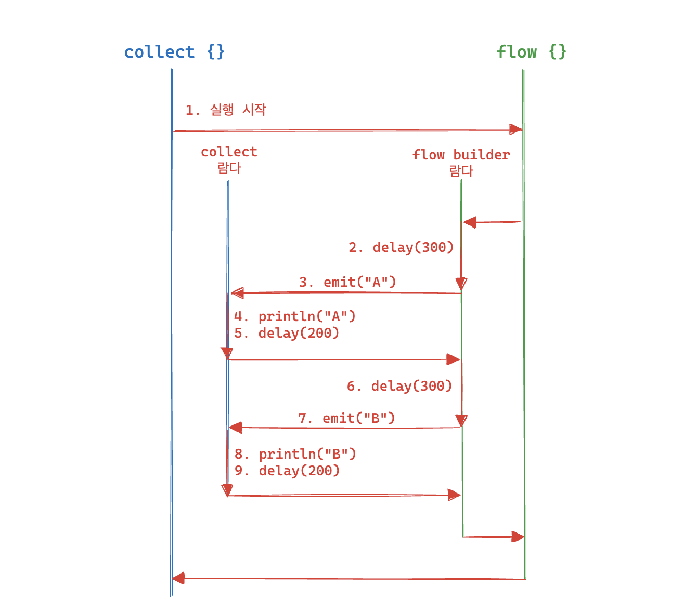

# 16장 플로우

**다루는 내용**

- 값의 연속적인 스트림을 모델링하는 플로우 다루는 법
- 콜드 플로우와 핫 플로우의 차이점

## 16.1 플로우는 연속적인 값의 스트림을 모델링한다

**일시 중단 함수는 원시 타입, 객체, 객체의 컬렉션과 같은 단일 값만 반환할 수 있다**

```kotlin
suspend fun createValues(): List<Int> {
    return buildList {
        add(1); delay(1.seconds)
        add(2); delay(1.seconds)
        add(3); delay(1.seconds)
    }
}

fun main() {
    runBlocking(Dispatchers.Default) {
        val list = createValues()
        list.forEach { log(it) }
    }
}

[출력]
3092) [DefaultDispatcher-worker-1] 1
3104) [DefaultDispatcher-worker-1] 2
3104) [DefaultDispatcher-worker-1] 3
```

- 일시 중단 함수로 3개의 값을 각 1초의 지연시간을 주고 생성한다
- 실행해보면 모든 값이 계산된 후, 즉 3초 후에 3개의 값을 한번에 출력한다

**원소가 추가되었을 때 함수의 실행이 끝날때까지 기다리지 않고 바로 값을 사용하고 싶다면?**

- 비동기적으로 즉시 값을 반환하고 싶을 땐 플로우를 쓰면 된다

**플로우?**

- 시간이 지남에 따라 나타나는 값들을 처리하는 코루틴 기반의 비동기 데이터 스트림
- 단일 값을 반환하는 `suspend` 함수와 다르게 여러 값을 시간에 따라 순차적으로 방출 가능하다

### 16.1.1 플로우를 사용하면 배출되자마자 원소를 처리할 수 있다

**`flow` 빌더 함수로 `createValues` 함수 리팩토링**

```kotlin
suspend fun createValues(): Flow<Int> {
    return flow {
        emit(1); delay(1000.milliseconds)  // emit에 의해 배출된 원소는 즉시 수집자(collect)에 의해 처리
        emit(2); delay(1000.milliseconds)
        emit(3); delay(1000.milliseconds)
    }

}

fun main() {
    runBlocking(Dispatchers.Default) {
        val myFlowOfValues = createValues()
        myFlowOfValues.collect { log(it) }  // 값이 배출(emit)되자마자 로그
    }
}

[출력]
76) [DefaultDispatcher-worker-1] 1
1111) [DefaultDispatcher-worker-1] 2
2114) [DefaultDispatcher-worker-1] 3
```

- 1초 간격으로 바로 로그가 찍히는 모습..!

### 16.1.2 코틀린 플로우의 여러 유형

**콜드 플로우**

- 비동기 데이터 스트림
- 값이 실제로 소비되거나 시작할 때만 값을 배출

**핫 플로우**

- 값이 실제로 소비되고 있는지와 상관없이 값을 독립적으로 배출
- 브로드캐스트 방식으로 동작

## 16.2 콜드 플로우

### 16.2.1 콜드 플로우 생성

- flow 빌더 함수를 통해 새로운 플로우를 생성한다
- `emit` 함수로 플로우의 수집자에게 값을 제공하고 수집자가 해당 값을 처리할 때까지 빌더 함수의 실행을 중단한다
- `flow`가 받는 블록은 `suspend` 변경자가 붙어 있으므로 빌더 내부에서 `delay`와 같은 다른 일시 중단 함수를 호출할 수 있다

**콜드 플로우는 최종 연산자가 호출되어야만 빌더에서 정의된 계산이 시작된다**

- flow 빌더 함수는 연속적인 값의 스트림을 표현하는 Flow<T> 타입의 객체를 반환한다
- 따라서 플로우를 구성해도 비활성 상태로 남아있다가 최종 연산자 호출 시 계산이 시작된다

**콜드 플로우는 일시 중단 함수가 아닌 곳에서도 작성할 수 있다**

- 실제 작업이 시작되지 않고 지연 실행되기 때문에 일시 중단 함수가 아니어도 플로우 작성이 가능하다
- 즉, 실행하는 것과 작성하는 것은 별개의 문제
- 실무에서는 `Domain`과 `Repository` 레이어에서 플로우를 생성하고, `Application Service`(또는 `UseCase`) 레이어에서 생성된 플로우들을 조합한 뒤 `Controller`나 `Scheduler`에서 최종적으로 `collect`하여 플로우를 실행하는 패턴을 사용한다.

### 16.2.2 콜드 플로우 실행

**플로우를 실행 트리거 `collect` 함수**

- 플로우에 대해 `collect` 함수를 호출하면 그 로직이 실행된다
- 플로우가 값을 방출할 때 네트워크 호출, DB 접근 등 일시 중단 작업을 수행할 수 있어야 하니까 당연히 `collect`도 `suspend` 함수로 설계되었다
- `collect`는 플로우가 모든 값을 방출하고 정상적으로 완료되거나 예외가 발생할 때까지 코루틴을 일시 중단시킨다
- 별도의 스레드나 코루틴을 생성하지 않고 `collect`를 호출한 코루틴에서 플로우 방출과 수집이 이뤄진다
    - 이로 인해 플로우의 모든 원소가 방출 순서대로 순차적으로 처리되도록 보장한다

**플로우를 수집하는 수집자(`Collector`)**

- `collect`를 호출하여 플로우를 실행하고 값을 처리하는 주체
- `collect`를 호출할 때 플로우에서 배출된 각 원소에 대해 호출될 람다를 제공할 수 있다
    - 즉, 플로우가 `emit`으로 값을 방출할 때마다 각각 `collect` 람다 안의 로직이 실행된다

```kotlin
// 수집자
flow.collect { value -> save(value) } 

// 실제 내부 동작
flow.collect(object : FlowCollector<String> {
    // emit 될때 save 호출된다
    override suspend fun emit(value: String) {
        save(value)
    }
})
```

**같은 콜드 플로우에 대해 collect를 여러 번 호출하면 코드가 여러 번 실행된다**

```kotlin
val letters = flow {
    log("Emitting A!"); emit("A"); delay(200.milliseconds)
    log("Emitting B!"); emit("B")
}

fun main() {
    runBlocking {
        letters.collect {
            log("(1) Collecting: $it")
            delay(500.milliseconds)
        }
        letters.collect {
            log("(2) Collecting: $it")
            delay(500.milliseconds)
        }
    }
}

[출력]
61) [main] Emitting A!
82) [main] (1) Collecting: A
797) [main] Emitting B!
797) [main] (1) Collecting: B
1300) [main] Emitting A!
1300) [main] (2) Collecting: A
2007) [main] Emitting B!
2007) [main] (2) Collecting: B
```

- 플로우에 네트워킹 요청과 같은 부수 효과가 있다면 신경 써줘야 한다
- 특히 무한 플로우라면 collect 함수에 의해 모든 원소가 처리될 때까지 일시 중단되기에 무기한 일시 중단될 수 있다

### 16.2.3 플로우 수집 취소

**플로우를 수집하는 코루틴이 취소되면 플로우의 실행도 함께 중단된다**

- 플로우 수집은 다음 취소 지점에 도달했을 때 실제로 중단된다
- 현재 처리 중인 작업을 즉시 중단하지는 않고 안전한 지점에서 정리 후 종료된다
- emit도 코드에서 취소와 일시 중단 지점으로 작동한다
    - 즉, 방출할 때마다 내부적으로 코루틴의 취소 요청이 있는지 검사한다
    - emit도 suspend 함수이므로 취소 신호를 감지해 일시 중단되는 지점이 될 수도 있다

```kotlin
val counterFlow = flow {
    for (i in 1..100) {
        emit(i)        // 취소 지점: 여기서 취소 체크
        delay(200)     // 취소 지점: delay도 취소 체크
    }
}

fun main() {
    runBlocking {
        val collector = launch {
            counterFlow.collect { print("$it ") }
        }
        delay(5.seconds)
        collector.cancel()
    }
}

[출력]
// 1 2 3 ... 25
```

- 5초동안 200ms 간격으로 25개 정도만 처리되는 모습..!

### 16.2.4 콜드 플로우의 내부 구현

콜드 플로우는 Flow, FlowCollector 2가지 인터페이스만 필요하다

**Flow 인터페이스**

```kotlin
public interface Flow<out T> {
    public suspend fun collect(collector: FlowCollector<T>)
}
```

- `collect` 함수의 인자로 수집자(`FlowCollector`)를 받아서 값들을 방출시킨다
- `suspend` 함수로 비동기 처리를 지원한다

**FlowCollector 인터페이스**

```kotlin
public fun interface FlowCollector<in T> {
    public suspend fun emit(value: T)
}
```

- 플로우에서 방출된 값을 받는 수신자로 값을 방출하는 함수 `emit`을 정의한다
- 함수현 인터페이스로 설계되어 있어서 람다 사용이 가능하다

**flow 빌더 함수**

```kotlin
public fun <T> flow(@BuilderInference block: suspend FlowCollector<T>.() -> Unit): Flow<T> = SafeFlow(block)

private class SafeFlow<T>(private val block: suspend FlowCollector<T>.() -> Unit) : AbstractFlow<T>() {
    override suspend fun collectSafely(collector: FlowCollector<T>) {
        collector.block()
    }
}
```

- `flow` 빌더는 블록을 `SafeFlow`라는 `Flow` 구현체의 `block` 필드에 저장만 한다
- 실제 실행은 `collect` 호출 시점에 `collectSafely` 함수가 호출되면서 저장해뒀던 블록을 `FlowCollector`의 확장함수로 실행한다
    - 여기서 `block`을 `FlowCollector<T>.() -> Unit` 즉 수신 객체 지정 람다 타입으로 받아서 `this`인 `collector`가 암시적 수신 객체가 되면서 `flow` 빌더 안의 람다가 확장함수로 실행되는 것이다

    ```kotlin
    // 1. 플로우 작성
    val myFlow = flow {    // 이 블록이 SafeFlow.block에 저장됨
        emit(1)            // 아직 실행 안됨
    }
    
    // 2. 실제 실행 시작
    myFlow.collect { value -> println(value) }
    
    // collect 내부에서 FlowCollector 생성
    val collector = object : FlowCollector<Int> {
    	override suspend fun emit(value: Int) {
    		println(value) // collect의 람다가 삽입됨
    	}
    }
    
    // Flow.collect 호출 -> SafeFlow.collectSafely 호출
    myFlow.collect(collector)
    
    // 3. collector가 암시적 수신 객체가 되어 블록을 확장 함수로 실행
    collector.block()
    
    // 실제 collector의 저장된 block 실행
    collector.emit(1) // 결국 println(1)이 실행
    
    [출력]
    1
    ```


**콜드 플로우 흐름 예시**

```kotlin
val letters = flow {
    delay(300.milliseconds); emit("A");
    delay(300.milliseconds); emit("B");
}

fun main() {
    runBlocking {
        letters.collect {
            log(it)
            delay(200.milliseconds)
        }
    }
}

[출력]
375) [main] A
894) [main] B
```

- 일반적인 함수 호출이며 모두 하나의 코루틴 안에서 실행된다




### 16.2.5 채널 플로우를 사용한 동시성 플로우

**콜드 플로우의 순차적 특성이 여러 작업을 수행해야 할 때에는 병목이 될 수 있다**

```kotlin
suspend fun getRandomNumber(): Int {
    delay(500.milliseconds)
    return Random.nextInt()
}

val randomNumbers: Flow<Int> = flow {
    repeat(10) {
        emit(getRandomNumber())
    }
}

fun main() {
    runBlocking {
        randomNumbers.collect { log(it) }
    }
}

[출력]
758) [main] -1159206362
1269) [main] -504398261
1770) [main] -2039045732
2276) [main] -1732094125
2783) [main] 782203624
3286) [main] -1634465198
3792) [main] -1479231390
4296) [main] 605165740
4801) [main] 1770369051
5303) [main] -1955613330
```

- 플로우는 순차적으로 실행되고, 모든 계산이 동일한 코루틴에서 실행되기 때문에 5초나 걸린다

**독립적인 플로우 작업이니까 flow 빌더 함수 안에서 자식 코루틴들을 활용해 백그라운드 작업을 시도해보면?**

```kotlin
val randomNumbers = flow {
    coroutineScope {
        repeat(10) {
            launch { emit(getRandomNumber()) }
        }
    }
}
```

- 런타임 에러가 발생한다

    ```kotlin
    Flow invariant is violated:
    		Emission from another coroutine is detected.
    		FlowCollector is not thread-safe and concurrent emissions are prohibited.
    		To mitigate this restriction please use 'channelFlow' builder instead of 'flow'
    ```

    - 플로우 수집자가 스레드 안전하지 않기 때문에 원소를 병렬로 배출하는 코드를 사용하면 안 된다는 뜻이다
    - 기본적인 콜드 플로우 추상화가 같은 코루틴에서만 `emit` 함수를 호출할 수 있도록 허용하기 때문이다

**여러 코루틴에서 배출을 호용하는 channelFlow를 사용하자**

- 콜드 플로우의 특별한 유형으로 순차적으로 배출하는 `emit` 함수를 제공하지 않는다
- 대신 여러 코루틴에서 `send`를 사용해 값을 제공할 수 있다
- 플로우의 수집자는 여전히 값을 순차적으로 수신하지만 `collect` 람다가 그 작업을 수행해준다
- 마치 `coroutinScope` 처럼 `channelFlow`의 람다는 새로운 백그라운드 코루틴을 시작할 수 있는 코루틴 스코프를 제공한다

```kotlin
val randomNumbers = channelFlow {
    repeat(10) {
        launch { send(getRandomNumber()) }
    }
}

[출력]
587) [main] -1876737260
592) [main] -482313700
592) [main] 294535218
592) [main] 1496483659
592) [main] -1224033092
592) [main] 1328279951
592) [main] -1578329205
592) [main] 2029693240
592) [main] 819754865
592) [main] -489610127
```

- 500ms만에 끝나는 모습..!

**콜드 플로우 vs 채널 플로우**

- 가장 간단하고 성능이 좋은 콜드 플로우를 기본적으로 사용
- 채널채널 관리에 비용이 좀 더 드는 채널 플로우는 플로우 안에서 새로운 코루틴을 시작해야 하는 경우에만 선택

---

## 16.3 핫 플로우

- 핫 플로우는 여러 구독자라고 불리는 수집자들이 배출된 항목을 공유한다
- 이벤트나 상태 변경 시 수집자 존재 여부에 상관없이 값을 배출해야 하는 경우에 적합하다
- 항상 활성화된 상태이기에 핫 플로우라 불린다

**핫 플로우의 2가지 구현**

1. 공유 플로우
2. 상태 플로우

### 16.3.1 공유 플로우

**공유 플로우는 값을 구독자에게 브로드캐스트한다**

- 구독자 존재 여부에 상관없이 배출이 발생하는 브로드캐스트 방식으로 동작한다
- 플로우 빌더를 사용하는 것 대신 가변 공유 플로우 `MutableSharedFlow`에 대한 참조를 활용한다

```kotlin
class RadioStation {
    private val _messageFlow = MutableSharedFlow<Int>() // 가변 공유 플로우를 비공개 프로퍼티로 정의
    val messageFlow = _messageFlow.asSharedFlow()       // 읽기 전용 공유 플로우 제공
    
    fun beginBroadcasting(scope: CoroutineScope) {
        scope.launch { 
            while (true) {
                delay(500.milliseconds)
                val number = Random.nextInt(0..10)
                log("Emitting $number!")
                _messageFlow.emit(number)
            }
        }
    }
}

fun main() = runBlocking {
    // runBlocking 코루틴 스코프에서 코루틴 시작
    RadioStation().beginBroadcasting(this)  
}
```

- `RadioStation` 인스턴스를 생성하고 `beginBroadcasting` 함수를 호출하면 구독자가 없어도 브로드캐스트가 즉시 시작된다
- 배출 자체가 구독자 유무와 관계없이 발생하므로 실제 배출을 수행하는 코루틴을 시작할 책임이 있다
    - 즉 개발자가 `scope.launch { }` 와 같이 직접 방출을 시작해야 한다

**공유 플로우 구독하기**

- 콜드 플로우를 수집하는 것과 마찬가지로 collect를 호출하면 구독이 된다
- collect 호출로 인해 배출이 발생할 때마다 제공한 람다가 실행된다
- 다만 말그대로 구독이기에 구독 시점 이후에 배출된 값만 수신한다

```kotlin
fun main(): Unit = runBlocking {
    val radioStation = RadioStation()
    radioStation.beginBroadcasting(this)
    delay(600.milliseconds)
    radioStation.messageFlow.collect {
        log("A collecting $it!")
    }
}

[출력]
583) [main] Emitting 5!
1094) [main] Emitting 0!
1095) [main] A collecting 0!
1601) [main] Emitting 0!
```

- 구독 이후의 배출만 수집하는 모습..!

**구독자를 위한 값 재생**

- 공유 플로우 구독자는 구독을 시작한 이후에 배출된 값만 수신받는다
- 이전에 배출된 원소도 수신하길 원한다면 `MutableSharedFlow` 생성 시 `replay` 파라미터로 캐싱해야 한다
    - 구독을 시작하면 캐싱된 것부터 수신을 시작한다

```kotlin
private val _messageFlow = MutableSharedFlow<Int>(replay = 5) // 이전 5개 캐싱
```

**콜드 플로우를 공유 플로우로 전환하기**

- 콜드 플로우를 여러 번 호출하려면 각 수집자가 독립적으로 질의하게 되면서 불필요하게 중복된 작업을 하게 된다
- `shareIn` 함수를 사용하면 주어진 콜드 플로우를 한 플로우인 공유 플로우로 변환할  수 있다
    - `shareIn`을 사용한 변환은 플로우를 실행하게 하는데 플로우는 코루틴 안에서 실행되어야 한다
    - 따라서 `shareIn`은 `CoroutinScope` 타입의 `scope` 파라미터를 받아서 코루틴을 실행하고 그 코루틴 안에서 변환이 이뤄진다
    - 코루틴 스코프 안에서 실행되기 때문에 공유 플로우를 둘러싼 코루틴 스코프가 취소되면 공유 플로우 내부 로직도 자동으로 취소된다
- 공유 플로우로 변환되면 중복을 줄이고 한 번의 실행으로 여러 구독자가 처리할 수 있다
    - ex) 여러 명이 각자 날씨앱 켜서 날씨 확인하기 vs 한 명이 날씨앱 켜서 확인한 뒤 모두에게 알려주기

```kotlin
fun main() {
    val temps = getTemperatures()
    runBlocking { 
        val sharedTemps = temps.shareIn(
            scope = this,
            started = SharingStarted.Lazily
        )
        
        launch { 
            sharedTemps.collect { log("$it Celsius") }
        }
        launch { 
            sharedTemps.collect { log("${celsiusToFahrenheit(it)} Fahrenheit") }
        }
    }
}

[출력]
106) [main] -5 Celsius
120) [main] 23.0 Fahrenheit
602) [main] 22 Celsius
602) [main] 71.6 Fahrenheit
1107) [main] -6 Celsius
...
```

- 공유 플로우로 변환되면서 `getTemperatures` 호출을 한 번만 해줘도 두 구독자가 수신해 처리한다
- `shareIn`의 두번째 파라미터인 `started`는 플로우가 실제로 언제 시작돼야 하는지를 정의한다
    - **`Eagerly`**: 플로우 수집 즉시 시작
    - **`Lazily`**: 첫 번째 구독자가 나타나야만 수집 시작
    - **`WhileSubscribed`**: 첫 번째 구독자가 나타나야만 수집 시작 및 마지막 구독자 사라지면 수집 취소

### 16.3.2 상태 플로우: 시스템 상태 추적

- 변수의 상태 변화를 추적할 수 있는 공유 플로우의 특별 버전

**상태 플로우를 생성하고 구독자에게 노출시키는 방법**

- 공유 플로우와 비슷하게 `private`로 `MutableStateFlow`를 생성하고 읽기 전용 뷰를 노출한다
- 변경될 수 있는 값을 나타내므로 생성자에 초깃값을 제공해야 한다
- 읽기 전용 뷰에서 value 속성으로 현재 상태에 접근할 수 있다
    - 일시 중단 없이 값을 안전하게 읽을 수 있다
- 값을 배출하는 `emit` 대신 갱신하는 `update` 함수를 사용한다

```kotlin
class ViewCounter {
    private val _counter = MutableStateFlow(0)
    val counter = _counter.asStateFlow()

    fun increment() {
        _counter.update { it + 1 }
    }
}

fun main() {
    val vc = ViewCounter()
    vc.increment()
    println(vc.counter.value) // 1
}
```

**value 속성은 가변 속성으로 값을 할당할 수 있다**

- 하지만 원자적인 연산이 아니고, 디스패처가 스레드를 여러 개 사용할 때에는 원자성이 지켜지지 않는다
- 코루틴들이 여러 스레드에 분산 실행되면서 동시에 동일한 값을 읽고 동일하게 `++` 연산하게 될 경우 누락되는 연산이 생긴다

```kotlin
class ViewCounter {
    private val _counter = MutableStateFlow(0)
    val counter = _counter.asStateFlow()

    fun increment() {
        _counter.value++ // 값 할당
    }
}

fun main() {
    val vc = ViewCounter()
    runBlocking(Dispatchers.Default) {
        repeat(10_000) {
            launch { vc.increment() }
        }
    }
    println(vc.counter.value) // 8352
}
```

**update 함수로 안전하게 상태 플로우에 쓰기**

- 상태 플로우는 원자성을 보장하는 `update` 함수를 제공한다
- `update` 함수는 이전 값을 기반으로 새 값을 어떻게 계산해야 하는지 정하는 람다 표현식을 인자로 받는다
- 두 갱신이 병렬로 발생할 경우 새로 읽은 previous 값을 사용해 한 번 더 갱신 함수를 실행해서 누락되는 연산이 없도록 한다

**상태 플로우는 값이 실제로 달라졌을 때만 값을 배출한다**

- 상태 플로우는 동등성 기반 통합을 수행하기 때문에 실제로 값이 달라졌을 때만 값을 배출한다
- 값을 여러번 관찰했는데 모두 값이 동등하다면 개념적으로는 아무것도 바뀌지 않는다

```kotlin

class DirectionSelector {
    private val _direction = MutableStateFlow(Direction.LEFT)
    val direction = _direction.asStateFlow()

    fun turn(d: Direction) {
        _direction.update { d }
    }
}

fun main(): Unit = runBlocking {
    val switch = DirectionSelector()
    launch {
        switch.direction.collect {
            log("Direction now $it")
        }
    }
    delay(200.milliseconds)

    switch.turn(Direction.RIGHT); delay(200.milliseconds)
    switch.turn(Direction.LEFT); delay(200.milliseconds)
    switch.turn(Direction.LEFT); delay(200.milliseconds)
}

[출력]
192) [main] Direction now LEFT
387) [main] Direction now RIGHT
592) [main] Direction now LEFT
```

- LEFT로 전환 요청을 2번 보냈지만 구독자가 한 번만 호출되었다

**stateIn으로 콜드 플로우를 상태 플로우로 변환**

- 콜드 플로우의 경우 value 같은 속성이 없어서 현재 값을 바로 알 수가 없다
- `stateIn`으로 콜드 플로우를 상태 플로우로 변환하면 원래 플로우에서 배출된 최신 값을 항상 읽을 수 있게 된다
- 여러 수집자를 추가하거나 `value` 속성에 접근해도 업스트림 플로우는 실행되지 않는다
    - 즉, `collect`로 여러 수집자를 추가해도 변환 시점에 딱 한번만 실행되고 이후엔 캐시된 상태값만 제공하기 때문에 중복 실행하지 않는다
- 공유 플로우와 다르게 시작 전략을 따로 전달하지 않는 이유는 호출 즉시 콜드 플로우를 실행시키고 상태로 캐싱하기 때문이다

```kotlin
fun main() {
    val temps = getTemperatures()
    runBlocking {
        val tempState = temps.stateIn(this)
        print("${tempState.value} ")
        delay(800.milliseconds)
        println(tempState.value) // 10 17
    }
}
```

### 16.3.3 공유 플로우보다는 상태 플로우를 사용하자

**공유 플로우의 불편함**

- 공유 플로우는 배풀이 예상되는 시점에 구독자가 존재한다는 사실을 보장하는 책임이 개발자에게 있다
- 특히 브로드캐스트가 다 끝난 이후에 구독자가 나타나면 이미 배출된 메세지를 받을 수 없다
    - 물론 캐시를 사용할 수는 있겠지만 그럴바엔 상태 플로우를 사용하는 게 낫다

**상태 플로우로 공유 플로우 대체하기**

- 상태 플로우를 개별 메세지 캐싱이 아닌 전체 메세지 기록을 리스트로 캐싱할 수 있다

```kotlin
class Broadcaster {
    private val _messages = MutableStateFlow<List<String>>(emptyList())
    val messages = _messages.asStateFlow()

    fun beginBroadcasting(scope: CoroutineScope) {
        scope.launch {
            _messages.update { it + "Hello!" }
            _messages.update { it + "Hi!" }
            _messages.update { it + "Hola!" }
        }
    }
}

fun main() {
    runBlocking {
        val broadcaster = Broadcaster()
        broadcaster.beginBroadcasting(this)
        delay(200.milliseconds)
        println(broadcaster.messages.value)
    }
}

[출력]
[Hello!, Hi!, Hola!]
```

### 16.3.4 언제 어떤 플로우를 사용할까?

**필요할 때만 실행하고 싶을 땐? 콜드 플로우**

- 기본적으로 비활성이고 필요할 때 수집자에 의해 활성화
- 수집자가 하나이고, 모든 배출을 받으며 보통은 완료된다
- `channelFlow`를 제외하면 하나의 코루틴에서만 배출 발생

| 사용 케이스 | 예시 |
| --- | --- |
| API 호출 | 사용자 정보 조회, 주문 목록 가져오기 |
| DB 쿼리 | 특정 조건으로 데이터 검색 |
| 파일 처리 | CSV 파싱, 이미지 업로드 |
| 배치 작업 | 데이터 마이그레이션, 리포트 생성 |
| 일회성 작업 | 비밀번호 재설정, 결제 처리 |

**여러 곳에서 같은 이벤트를 받고 싶거나 현재 상태를 관리하고 싶을 땐? 핫 플로우(상태 플로우)**

- 항상 활성화 상태로 여러 구독자가 동일한 배출을 수신한다
- 여러 코루틴에서 배출할 수 있다
- 즉시 현재 상태를 확인할 수 있으며 리스트로 모든 메세지를 캐싱할 수도 있다

| 사용 케이스 | 예시 |
| --- | --- |
| 연결 상태 | DB 연결, Redis 연결, 외부 API 상태 |
| 사용자 상태 | 로그인 여부, 권한 레벨 |
| 시스템 설정 | 기능 플래그, 환경 설정 |
| 캐시된 데이터 | 사용자 정보, 설정값 |
| 애플리케이션 상태 | 시작/중지, 헬스체크 결과 |