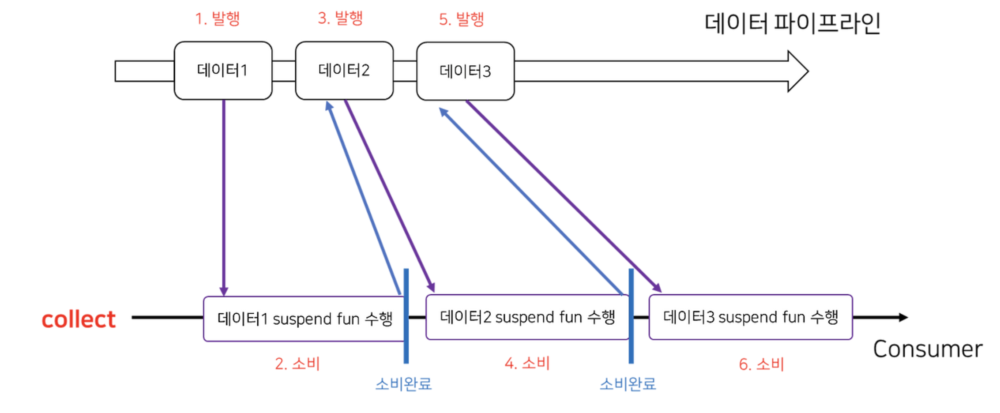
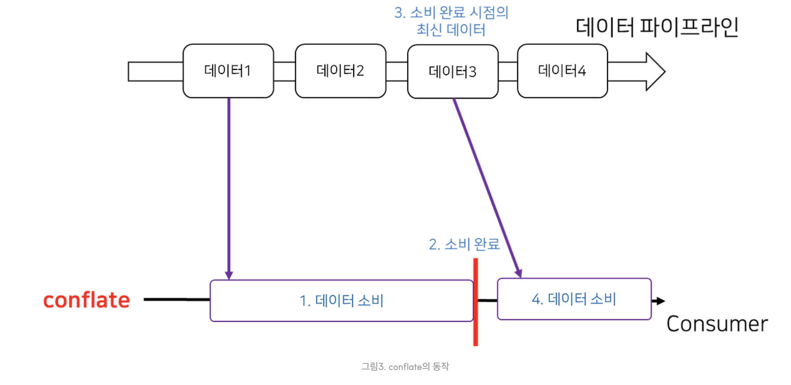

## 플로우 연산자 

### 중간 연산자
- 시퀀스와 마찬가지로 중간 연산자와 최종 연산자를 구분한다.
- 중간 연산자는 **코드를 실행하지 않고** 변경된 플로우를 반환
- 최종 연산자는 **값을 반환**하거나, 아무 값도 반환하지 않으며 **플로우를 수집**하고 **실제 코드를 실행**한다.

---

### 업스트림 플로우, 다운스트림 플로우
- 연산자가 적용되는 플로우를 업스트림 플로우, 중간 연산자가 반환하는 플로우를 다운스트림 플로우라고 한다.
- 단순히 선언된 순서라고 보면 된다.
- 핫 플로우에 중간연산자를 선언하면 구독되기 전까지 실행되지 않는다.

---


### transform 함수: 업스트림 원소별로 임의의 값을 배출

- 다음 예시에서, 우리가 자주 사용하는 `map` 함수를 사용하여 하나씩 값을 다운스트림에 원소를 배출한다.


```kotlin
fun main() {
    val names = flow {
        emit("Jo")
        emit("May")
        emit("Sue")
    }
    val upper = names.map {
        it.uppercase()
    }
    runBlocking {
        upper.collect { print("$it ") }
    }
}

output> JO MAY SUE
```

- 하지만 어떤 경우에 두개 이상의 원소를 배출하고 싶을 수 있다.
- `transform` 함수를 사용할 수 있다.

```kotlin
fun main() {
    val names = flow {
        emit("Jo")
        emit("May")
        emit("Sue")
    }
    val upperAndLower = names.transform {
        emit(it.uppercase())    // 배출
        emit(it.lowercase())    // 두번
    }
    runBlocking {
        upperAndLower.collect { print("$it ") }
    }
}

output> JO jo MAY may SUE sue
```

---

### take 함수: 플로우 취소
- 조건에 유효하지 않으면 업스트림 플로우가 취소할 수 있다.
  - take: 특정 횟수만큼만 실행
  - takeWhile: 조건에 맞다면 계속 실행 (false 나오면 업스트림 플로우 종료)

```kotlin
fun querySensor(): Int = Random.nextInt(-10..30)
fun getTemperatures(): FLow<Int> {
    return flow {
        while(true) {
            emit(querySensor())
            delay(500.milliseconds)
        }
    }
}

fun main() {
    val temps = getTemperatures()
    temps
        .take(5)
        .collect {
            log(it)
        }
}

output> 1
// 약 500ms 이후
2
// 약 500ms 이후
3
// 약 500ms 이후
4
// 약 500ms 이후
5
```

---

### 단계별 후킹 함수
- 플로우의 생명 주기 단계에서 실행되는 함수가 있다.
  - `onStart`: 플로우 수집이 시작될 때, 첫 번째 배출이 일어나기 전
  - `onEach`: 업스트림 플로우에서 배출된 원소에 작업 수행후
  - `onClompletion`: flow 가 완료되었을 때
  - `onEmpty`: flow 가 비어있을 때

```kotlin
suspend fun process(flow: Flow<Int>) {
     flow
        .onEmpty {
            println("Nothing - emitting default value!")
            emit(0)
        }
        .onStart {
            println("Starting!")
        }
        .onEach {
            println("On $it!")
        }
        .onCompletion {
            println("Done!")
        }
        .collect()
}
```

---

```kotlin
fun main() {
    runBlocking {
        process(flowOf(1, 2, 3))
    }
}

output> Starting
On 1!
On 2!
On 3!
Done!
```
 

---


```kotlin
fun main() {
    runBlocking {
        process(flowOf())
    }
}

output> Starting
Nothing - emitting default value!
On 0!
Done!
```

### buffer 연산자: 다운스트림 연산자와 수집자를 위한 원소 버퍼링
- 플로우에서 아주 시간이 오래 걸리는 함수를 호출할때, 콜드 플로우 처럼 값 생산자는 수집자가 이전 원소를 처리할 때까지 작업을 중단한다.
- 하지만 flow 소비자가 처리할 때 까지 생산자가 기다리지 않는다면 조금이라도 실행 속도가 빠르게 할 수 있다.
- 다음은 3개의 원소를 저장할 수 있는 버퍼를 추가한 코드다. 
```kotlin
fun getAllUserIds(): Flow<Int> {
    return flow {
        repeat(3) {
            delay(200.milliseconds)
            log("Emitting!")
            emit(it)
        }
    }
}

suspend fun getProfileFromNetwork(id: Int): String {
    delay(2.seconds)
    return "Profile[$id]"
}

fun main() {
    val ids = getAllUserIds()
    runBlocking {
        ids
            .buffer(3)      // 버퍼 추가
            .map { getProfileFromNetwork(it)}
            .collect { log("Got $it") }
    }
}

```

- `onBufferOverflow` 파라미터로 버퍼 용량이 초과될 때, 어떻게 처리할지 지정할 수도 있다.




---

### conflate 연산자: 항상 최신 데이터만 가져온다.
- 소비자의 시간이 생산자에 비해 오래걸린다고 한다면, 생산자가 값을 계속 배출할 때 소비자는 항상 최신값을 받을 수 없다.
- 최신값이 존재한다면 사이에 배출된 중간값들은 버리는 연산자인 `conflate` 는 다음처럼 사용한다.

```kotlin
fun main() {
    runBlocking {
        val temps = getTemperatures()
        temps
            .onEach {
                log("Read $it from sensor")
            }
            .conflate()
            .collect {
                log("Collected $it")
                delay(1.seconds)
            }
    }
}

output> Read 1 from sensor
Collected 1
Read 2 from sensor
Read 3 from sensor
Collected 3
Read 4 from sensor
Read 5 from sensor
Collected 5
```




---

### debounce 연산자: 일정 시간 동안 값을 필터링
- 문자 자동완성 등, 플로우 값을 처리하기 전에 잠시 기다리는게 유용할 수 있다.
- 특정 타임아웃이 지난 이후 다운 스트림 플로우로 배출하는 함수다.

```kotlin
val searchQuery = flow {
    emit("K")
    delay(100.milliseconds)
    emit("Ko")
    delay(200.milliseconds)
    emit("Kotl")
    delay(500.milliseconds)
    emit("Kotlin")
}

fun main() = runBlocking {
    searchQuery
        .debounce(250.milliseconds)
        .collect {
            log("Searching for $it")
        }
}
```

---

### flowOn 연산자: 플로우가 실행되는 코루틴 콘텍스트 변경
- 수집 프로세스는 `collect`가 호출된 콘텍스트에서 실행되지만, 다른 디스패처나 코루틴 콘텍스트에서 실행할 수 있다.
- `witihContext` 함수와 비슷하게 코루틴 콘텍스트를 조정한다.

```kotlin
fun main() {
    runBlocking {
        flowOf(1)
            .onEach { log("A") }
            .flowOn(Dispatchers.Default)
            .onEach { log("B") }
            .flowOn(Dispatchers.IO)
            .onEach { log("C") }
            .collect()
    }
}

output> 
[DefaultDispatcher-worker-3 @coroutine#3] A
[DefaultDispatcher-worker-1 @coroutine#2] B
[main @coroutine#1] C
```

---

### 커스텀 중간 연산자 만들기
- 처음에 설명했듯, 중간 연산자는 수집자와 생산자 역할을 동시에 한다.
  - 업스트림 플로우에서 원소 수집 - 다운 스트림에 원소 배출

```kotlin
fun Flow<Double>.averageOfLast(n: Int): Flow<Double> =
    flow { 
        val numbers = mutableListOf<Double>()
        collect {
            if (numbers.size >= n) {
                numbers.removeFirst()
            }
            numbers.add(it)
            emit(numbers.average()) // 배출
        }
    }

fun main() = runBlocking {
    flowOf(1.0, 2.0, 30.0, 121.0)
        .averateOfLast(3)
        .collect {
            print("$it ")
        }
}

output> 1.0 1.5 11.0 51.0
```

---

### 최종 연산자는 업스트림 플로우를 실행하고 계산한다
- 중간연산자는 실제로 코드를 실행하지 않는다.
- 최종연산자는 업스트림 플로우의 실행을 담당하기 때문에 **항상 일시 중단 함수**다.

- `first`, `firstOrNull` 등을 사용하여 업스트림 플로우를 취소할 수 있다.

```kotlin
fun main() = runBlocking {
    getTemperatures()
        .first()
}
```
