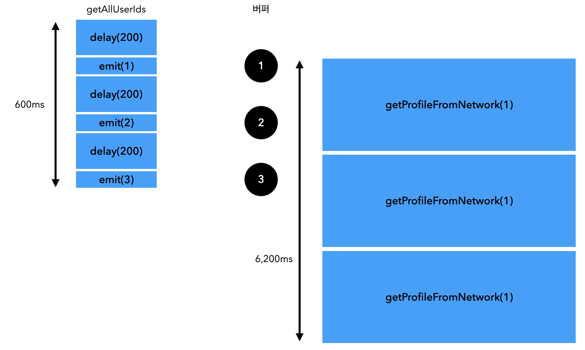

# 17. 플로우 연산자

## 17.1 플로우 연산자로 플로우 조작

시퀀스와 마찬가지로 플로우도 **중간 연산자**와 **최종 연산자**를 구분한다.<br/>
**중간 연산자**는 코드를 실행하지 않고, 변경된 플로우를 반환하고,<br/>
**최종 연산자**는 컬렉션, 개별 원소, 계산된 값을 반환하거나 아무 값도 반환하지 않으면 플로우를 수집하고 실제 코드를 실행한다.

## 17.2 중간 연산자는 업스트림 플로우에 적용되고, 다운스트림 플로우를 반환한다.

중간 연산자는 업스트림 플로우에 적용되고, 다운스트림 플로우를 반환한다.<br/>
연산자가 적용되는 플로우를 **업스트림 플로우**라고 하고,<br/>
연산자에 의해 반환되는 플로우를 **다운스트림 플로우**라고 한다.<br/>

다운스트림 플로우는 또 다른 중간 연산자에 의해 업스트림 플로우로 작용할 수 있다.<br/>
시퀀스와 마찬가지로 중간 연산자가 호출되더라도 플로우가 실제로 실행되지는 않는 **콜드**상태이다.<br/>


> 그림을 보면, map 연산자의 업스트림은 flow고, filter 연산자는 map의 다운스트림이다.

### 17.2.1 업스트림 원소별로 임의의 값을 배출: transform 함수

map 함수는 원소를 변환한 후 다운스트림 플로우에 그 원소를 배출한다.

```kotlin
fun main() {
    val names = flow {
        emit("Jo")
        emit("May")
        emit("Sue")
    }
    val uppercasedNames = names.map {
        it.uppercase()
    }
    runBlocking {
        uppercasedNames.collect { print("$it ")}
    }
}
// JO MAY SUE
```

하나 이상의 원소를 배출하고 싶은 경우 transform 함수를 사용한다.

```kotlin
fun main() {
    val names = flow {
        emit("Jo")
        emit("May")
        emit("Sue")
    }
    val uppercasedNames = names.transform {
        // 두개의 원소를 배출
        emit(it.uppercase())
        emit(it.lowercase())
    }
    runBlocking {
        uppercasedNames.collect { print("$it ")}
    }
}
// JO jo MAY may SUE sue
```

### 17.2.2 take나 관련 연산자는 플로우를 취소할 수 있다.

takeWhile 같은 함수들을 플로우에서도 똑같이 쓸 수 있는데, 이런 연산자를 사용하면<br/>
연산자가 지정한 조건에 더이상 만족하지 않는 경우 업스트림 플로우가 취소되며, 더 이상 원소를 배출하지 않게된다.

```kotlin
fun getTemperatures() = flow {
    while (true) {
        delay(100)
        emit((0..100).random())
    }
}

suspend fun main() {
    val temps = getTemperatures()
    temps // 기존 플로우가 무한으로 배출하지만, 5개만 받고, 플로우를 취소한다.
        .take(5) 
        .collect {
            log(it)
        }
}

/*
127ms [kotlinx.coroutines.DefaultExecutor] 82
238ms [kotlinx.coroutines.DefaultExecutor] 79
339ms [kotlinx.coroutines.DefaultExecutor] 69
444ms [kotlinx.coroutines.DefaultExecutor] 54
546ms [kotlinx.coroutines.DefaultExecutor] 24
 */
```

### 17.2.3 플로우의 각 단계 후킹: onStart, onEach, onCompletion, onEmpty

플로우의 각 단계에 후킹할 수 있는 함수들이 있다.<br/>

- **onCompletion**: 플로우가 완료되면 호출된다.
  - 정상적으로 끝나거나, 취소되거나, 예외로 종료된 후에 호출되는 람다를 지정할 수 있게 해준다.

```kotlin
fun getTemperatures() = flow {
    while (true) {
        delay(100)
        emit((0..100).random())
    }
}

suspend fun main() {
    val temps = getTemperatures()
    temps
        .take(5)
        .onCompletion { cause ->
            if (cause != null) {
                log("An error occurred! $cause")
            } else {
                log("Completed!")
            }
        }
        .collect {
            log(it)
        }
}

/*
139ms [kotlinx.coroutines.DefaultExecutor] 88
255ms [kotlinx.coroutines.DefaultExecutor] 70
360ms [kotlinx.coroutines.DefaultExecutor] 90
461ms [kotlinx.coroutines.DefaultExecutor] 38
566ms [kotlinx.coroutines.DefaultExecutor] 1
566ms [kotlinx.coroutines.DefaultExecutor] Completed! // 플로우가 정상적으로 완료되면 호출된다.
 */
```

- **onStart**: 플로우가 시작되기 전에 호출된다.
  - 플로우가 수집되기 전에 실행할 코드를 지정할 수 있다.
- **onEach**: 플로우의 각 원소가 작업을 수행한 후 이를 다운스트림 플로우에 전달한다.
- **onEmpty**: 플로우가 비어있을 때 호출된다.
  

```kotlin
suspend fun main() {
    emptyFlow<Int>()
        .onEmpty {
            println("Nothing - emitting default value!")
            emit(0)
        }
        .onStart {
            println("Starting!")
        }
        .onEach {
            println("On $it!")
        }
        .onCompletion {
            println("Done!")
        }
        .collect()
}

/*
Starting!
Nothing - emitting default value!
On 0!
Done!
 */
```

### 17.2.4 다운스트림 연산자와 수집자를 위한 원소 버퍼링: buffer 연산자

실제 어플리케이션 코드에서는 플로우 내부에서 많은 작업을 수행하게 된다.<br/>
onEach와 같은 연산자로 처리할 때 시간이 걸리는 일시 중단 함수를 호출하는 경우가 많다.

이런 경우, 다운스트림 플로우가 업스트림 플로우의 원소를 수집하는 동안,<br/>
업스트림 플로우가 원소를 배출하는 것을 막을 수 있다.<br/>

```kotlin
fun getAllUserIds(): Flow<Int> {
    return flow {
        repeat(3) {
            delay(200.milliseconds)
            log("Emitting!")
            emit(it)
        }
    }
}

suspend fun getProfileFromNetwork(id: Int): String {
    delay(2.seconds)
    return "Profile [$id]"
}

fun main() {
    val ids = getAllUserIds()
    runBlocking {
        ids
            .map { getProfileFromNetwork(it) }
            .collect { log("Got $it") }
    }
}
/*
243ms [main @coroutine#1] Emitting!
2258ms [main @coroutine#1] Got Profile [0]
2463ms [main @coroutine#1] Emitting!
4464ms [main @coroutine#1] Got Profile [1]
4670ms [main @coroutine#1] Emitting!
6670ms [main @coroutine#1] Got Profile [2]
 */
```

각 원소를 처리하는데 2.2초가 소요되므로, 총 6.6초가 소요됐다.<br/>
`getAllUserIds` 플로우는 배출하는데 200 밀리초가 걸리기 때문에 굳이 2초를 더 기다릴 필요가 없었는데, 기다렸다.

이런 경우, `buffer` 연산자를 사용하면 다운스트림 플로우가 업스트림 플로우의 원소를 수집하는 동안,<br/>
업스트림 플로우가 원소를 배출할 수 있도록 버퍼링을 할 수 있다.<br/>

```kotlin
fun getAllUserIds(): Flow<Int> {
    return flow {
        repeat(3) {
            delay(200.milliseconds)
            log("Emitting!")
            emit(it)
        }
    }
}

suspend fun getProfileFromNetwork(id: Int): String {
    delay(2.seconds)
    return "Profile [$id]"
}

fun main() {
    val ids = getAllUserIds()
    runBlocking {
        ids
            .buffer(3)
            .map { getProfileFromNetwork(it) }
            .collect { log("Got $it") }
    }
}
/*
253ms [main @coroutine#2] Emitting!
464ms [main @coroutine#2] Emitting!
669ms [main @coroutine#2] Emitting!
2274ms [main @coroutine#1] Got Profile [0]
4281ms [main @coroutine#1] Got Profile [1]
6287ms [main @coroutine#1] Got Profile [2]
 */
```

`buffer` 연산자를 사용해 다운스트림 플로우가 프로세스를 처리하는 동안 나머지 작업들이 버퍼에 쌓여서<br/>
다운스트림 플로우가 업스트림 플로우의 나머지 원소를 기다릴 필요없이 바로 소비하게 되었다.<br/>



### 17.2.5 중간값을 버리는 연산자: conflate 연산자

`conflate` 연산자는 다운스트림 플로우가 업스트림 플로우의 원소를 수집하는 동안,<br/>
업스트림 플로우가 원소를 배출하는 것을 막지 않고, 중간값을 버린다.<br/>

> 가장 최근에 배출된 원소만 다운스트림 플로우가 소비할때 전달된다.

```kotlin
fun main() {
    runBlocking {
        val temps = getTemperatures()
        temps
            .onEach { log("Read $it from sensor") }
            .conflate()
            .collect {
                log("Collected $it")
                delay(1.seconds)
            }
    }
}
/*
587ms [main @coroutine#2] Read 21 from sensor
594ms [main @coroutine#1] Collected 21
1099ms [main @coroutine#2] Read 86 from sensor
1604ms [main @coroutine#1] Collected 86
1605ms [main @coroutine#2] Read 70 from sensor
2110ms [main @coroutine#2] Read 13 from sensor
2610ms [main @coroutine#1] Collected 13
 */
```

### 17.2.6 일정 시간 동안 값을 필터링하는 연산자: debounce 연산자

어떤 상황에서는 플로우의 값을 처리하기 전에 잠시 기다리는 것이 유용할 수 있다.<br/>
예를 들어, 사용자가 검색어를 입력할 때마다 검색을 수행하는 대신,<br/>
사용자가 입력을 멈춘 후에 검색을 수행하는 것이 더 효율적일 수 있다.<br/>

`debounce` 연산자는 업스트림에서 원소가 배출되지 않은 상태로 정해진 타임아웃 시간이<br/>
지나야만 항목을 다운스트림 플로우로 배출한다.


```kotlin
val searchQuery = flow {
    emit("K")
    delay(100.milliseconds)
    emit("Ko")
    delay(200.milliseconds)
    emit("Kotl")
    delay(500.milliseconds)
    emit("Kotlin")
}
fun main() = runBlocking {
    searchQuery
        .debounce(250.milliseconds)
        .collect {
            log("Searching for $it")
        }
}

/*
614ms [main @coroutine#1] Searching for Kotl
867ms [main @coroutine#1] Searching for Kotlin
 */
```

### 17.2.7 플로우가 실행되는 코루틴 컨텍스트를 바꾸기: flowOn 연산자

플로우가 실행되는 코루틴 컨텍스트를 바꾸고 싶을 때는 `flowOn` 연산자를 사용한다.<br/>
`flowOn` 연산자는 업스트림 플로우가 실행되는 코루틴 컨텍스트를 변경한다.<br/>

`flowOn`은 `withContext`와 비슷하지만, `flowOn`은 업스트림 플로우에만 적용된다.

```kotlin
fun main() = runBlocking {
    flowOf(1)
        .onEach { log("A") }
        .flowOn(Dispatchers.Default)
        .onEach { log("B") }
        .flowOn(Dispatchers.IO)
        .onEach { log("C") }
        .collect()
}

/*
39ms [DefaultDispatcher-worker-3 @coroutine#3] A // Dispachers.Default
47ms [DefaultDispatcher-worker-1 @coroutine#2] B // Dispachers.IO
47ms [main @coroutine#1] C
 */
```

`flowOn` 연산자는 업스트림 플로우의 디스패처에만 영향을 미치고,<br/>
다운스트림 플로우의 디스패처에는 영향을 미치지 않는다.<br/>

주의할 점은 `flowOn` 호출보다 더 앞에 있는 플로우들의 코루틴 컨텍스트가 모두 바뀐다는걸 주의해야한다.

## 17.3 커스텀 중간 연산자 만들기

플로우의 중간 연산자를 만들 때는 `Flow`를 확장하는 함수를 만들어야 한다.<br/>
업스트림 플로우에서 원소를 수집하는 것은 `collect` 함수를 사용하고,<br/>
확장함수 안에서 `flow` 빌더를 사용하면 새로운 다운스트림 플로우를 생성할 수 있다.<br/>

```kotlin
fun Flow<Double>.averageOfLast(n: Int): Flow<Double> = flow {
    val numbers = mutableListOf<Double>()
    collect {
        if (numbers.size >= n) {
            numbers.removeFirst()
        }
        numbers.add(it)
        emit(numbers.average())
    }
}

fun main() = runBlocking {
    flowOf(1.0, 2.0, 30.0, 121.0)
        .averageOfLast(3)
        .collect {
            print("$it ")
        }
}

/*
1.0 1.5 11.0 51.0 
 */
```

## 17.4 최종 연산자는 업스트림 플로우를 실행하고 값을 계산한다.

최종 연산자는 다운스트림 플로우를 반환하지 않고, 업스트림 플로우를 수집하고, 실제 코드를 실행한다.<br/>

가장 일반적인 최종 연산자는 `collect` 함수이다.<br/>
최종 연산자는 업스트림 플로우의 실행을 담당하기 때문에 항상 일시 중단 함수다.
collect를 호출하면 플로우 전체가 수집될 때까지 일시 중단된다.

```kotlin
fun main() = runBlocking {
    getTemperatures()
        .onEach { temp ->
            log("Temperature: $temp")
        }
       .collect() // collect는 최종 연산자이므로, 플로우를 수집하고 실행한다.
}
```

first나 firstOrNull 같은 최종 연산자는 업스트림 플로우의 첫번째 원소를 받은 다음에 플로우를 취소한다.<br/>

```kotlin
fun main() = runBlocking {
    getTemperatures()
        .first { it > 50 } // 첫번째 원소가 50보다 큰 경우에만 수집하고, 플로우를 취소한다.
        .let { log("First temperature above 50: $it") }
}
```
