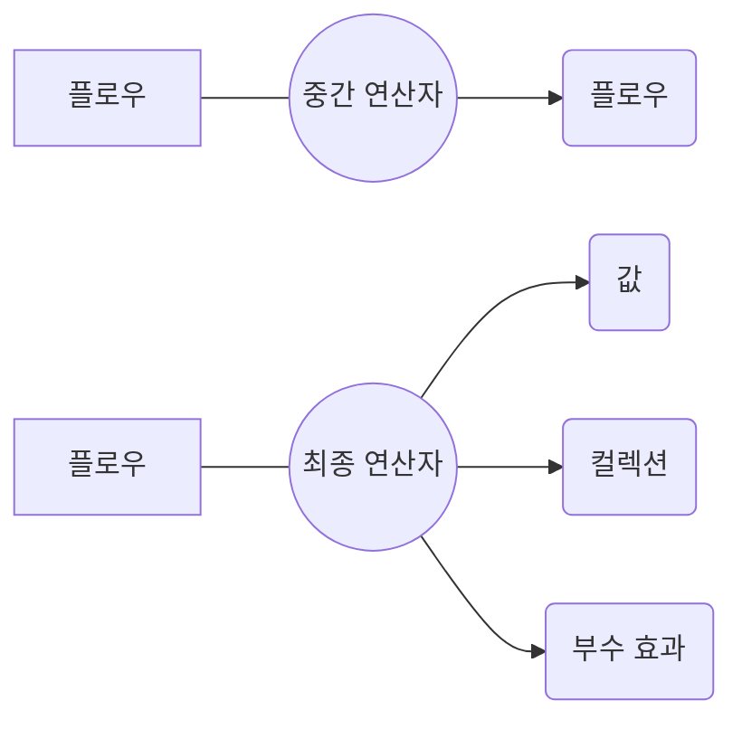

# 플로우 연산자
코틀린의 동시성 메커니즘을 제공하는 플로우의 다양한 연산자를 살펴본다.

## 1. 플로우 연산자로 플로우 조작

플로우는 `중간 연산자`와 `최종 연산자`를 구분한다.

- 중간 연산자: 코드를 실행하지 않고 변경된 플로우를 반환
- 최종 연산자: 컬렉션, 개별 원소, 계산된 값을 반환하거나 아무 값도 반환하지 않으며 플로우를 수집하고 실제 코드를 실행



## 2. 중간 연산자는 업스트림 플로우에 적용되고 다운스트림 플로우를 반환한다.

플로우를 `업스트림`과 `다운 스트림` 플로우러 구분해 설명할 수 있다.

- 업스트림 : 연산자가 적용되는 플로우
- 다운 스트림 : 중간 연산자가 반환하는 플로우이며 또 다른 연산자의 업스트림 플로우로 작용할 수 있다.

플로우는 중간 연산자가 호출되더라도 플로우 코드가 실제로 실행되지 않는 `콜드 상태` 다.

플로우에서도 `map`, `filter`, `onEach` 등의 함수를 제공할 뿐만 아니라 특별한 동작과 기능을 제공하는 연산자도 있다.

| 함수 | 설명 |
| --- | --- |
| transform | 업스트림의 원소별로 임의의 값을 배출 |
| take |  |
| takeWhile |  |
| onStart | 플로우의 수집이 시작될 때 첫 번재 배출이 일어나기 전에 실행 |
| onEach | 업스트림 플로우에서 배출된 각 원소에 대해 작업을 수행 후 다운스트림 플로우에 전달 |
| onCompletion | 플로우가 수집 완료 후 종료되는 것을 확인하기 위한 연산자 |
| onEmpty | 원소를 배출하지 않고 종료되는 플로우 연산자 |
| buffer | 다운스트림 연산자와 수집자를 위한 원소 버퍼링을 제공하는 연산자 |
| conflate | 중간값을 버리는 연산자 |
| debounce | 일정 시간 동안 값을 필터링하는 연산자 |
| flowOn | 플로우가 실행되는 코루틴 콘텍스트를 바꾸는 연산자 |

### 업스트림 원소별로 임의의 값을 배출: transform 함수

`transform` 함수는 업스트림 플로우의 각 원소에 대해 원하는 만큼의 원소를 다운스트림 플로우에 배출할 수 있게 해준다.

```kotlin
fun main() {
    val names = flow {
        emit("Jo")
        emit("May")
        emit("Sue")
    }
    val upperAndLowercasedNames = names.transform {
        emit(it.uppercase())
        emit(it.lowercase())
    }
    runBlocking {
        upperAndLowercasedNames.collect { print("$it ") }
    }
    // JO jo MAY may SUE sue
}
```

### take나 관련 연산자는 플로우를 취소할 수 있다.

`take` 나 `takeWhile` 같은 함수들은 플로우에서도 똑같이 사용할 수 있으며 플로우를 취소할 수 있다.

```kotlin
fun querySensor(): Int = Random.nextInt(-10..30)
fun getTemperatures(): FLow<Int> {
    return flow {
        while(true) {
            emit(querySensor())
            delay(500.milliseconds)
        }
    }
}
fun main() {
    val temps = getTemperatures()
    temps
        .take(5)
        .collect {
            log(it)
        }
}
/*
37 [main @coroutine#1] 7
568 [main @coroutine#1] 9
1123 [main @coroutine#1] 2
1640 [main @coroutine#1] -6
2148 [main @coroutine#1] 7
*/
```

### 플로우의 각 단계 후킹: onStart, onEach, onCompletion, onEmpty

```kotlin
suspend fun process(flow: Flow<Int>) {
     flow
        .onEmpty {
            println("Nothing - emitting default value!")
            emit(0)
        }
        .onStart {
            println("Starting!")
        }
        .onEach {
            println("On $it!")
        }
        .onCompletion {
            println("Done!")
        }
        .collect()
}

fun main() {
    runBlocking {
        process(flowOf(1,2,3))
        // Starting!
        // On 1!
        // On 2!
        // On 3!
        // Done!
        process(flowOf())
        // Starting!
        // Nothing - emitting default value!
        // On 0!
        // Done!
    }
}
```

### 다운스트림 연산자와 수집자를 위한 원소 버퍼링: buffer 연산자

플로우의 원소를 수집하거나 onEach 같은 연산자로 처리할 때 일시 중단 함수를 호출하는 경우가 많다.

`buffer` 연산자는 수집자가 원소를 처리할 때까지 생산자가 기다리지 않고 원소를 생성할 수 있도록한다.

이를 통해 플로우에서 연산자 사슬의 연결을 분리하는 효과가 있다.

```kotlin
fun getAllUserIds(): Flow<Int> {
    return flow {
        repeat(3) {
            delay(200.milliseconds)
            log("Emitting!")
            emit(it)
        }
    }
}

suspend fun getProfileFromNetwork(id: Int): String {
    delay(2.seconds)
    return "Profile[$id]"
}

fun main() {
    val ids = getAllUserIds()
    runBlocking {
        ids
            .buffer(3)
            .map { getProfileFromNetwork(it)}
            .collect { log("Got $it") }
    }
}
/*
304 [main @coroutine#2] Emitting!
525 [main @coroutine#2] Emitting!
796 [main @coroutine#2] Emitting!
2373 [main @coroutine#1] Got profile[0]
4388 [main @coroutine#1] Got profile[1]
6461 [main @coroutine#1] Got profile[2]
*/
```

### 중간값을 버리는 연산자: conflate 연산자

`conflate`는 값 생산자가 방해받지 않고 작업을 계속할 수 있게 하는 방법으로 배출된 항복을 그냥 버리는 연산자다.

```kotlin
fun main() {
    runBlocking {
        val temps = getTemperatures()
        temps
            .onEach {
                log("Read $it from sensor")
            }
            .conflate()
            .collect {
                log("Collected $it")
                delay(1.seconds)
            }
    }
}

/*
43 [main @coroutine#2] Read 20 from sensor
51 [main @coroutine#1] Collected 20
558 [main @coroutine#2] Read -10 from sensor
1078 [main @coroutine#2] Read 3 from sensor
1294 [main @coroutine#1] Collected 3
1579 [main @coroutine#2] Read 13 from sensor
2153 [main @coroutine#2] Read 26 from sensor
2556 [main @coroutine#1] Collected 26
*/
```

### 일정 시간 동안 값을 필터링하는 연산자: debounce 연산자

`debounce` 연산자는 플로우의 값을 처리하기 전에 기다리는 연산자이다.

```kotlin
val searchQuery = flow {
    emit("K")
    delay(100.milliseconds)
    emit("Ko")
    delay(200.milliseconds)
    emit("Kotl")
    delay(500.milliseconds)
    emit("Kotlin")
}

fun main() = runBlocking {
    searchQuery
        .debounce(250.milliseconds)
        .collect {
            log("Searching for $it")
        }
}
// 644 [main @coroutine#1] Searching for kotl
// 876 [main @coroutine#1] Searching for kotlin
```

### 플로우가 실행되는 코루틴 콘텍스트를 바꾸기: flowOn 연산자

`flowOn` 연산자는 `withContext` 함수와 비슷하게 코루틴 콘텍스트를 조정한다.

`flowOn` 연산자는 업스트림 플로우의 디스패처에만 영향을 미치며, 다운스트림 플로우는 영향을 받지 않으므로 이 연산자를 `콘텍스트 보존` 연산자라고도 부른다.

```kotlin
fun main() {
    runBlocking {
        flowOf(1)
            .onEach { log("A") }
            .flowOn(Dispatchers.Default)
            .onEach { log("B") }
            .flowOn(Dispatchers.IO)
            .onEach { log("C ") }
            .collect()
    }
}
/*
36 [DefaultDispatcher-worker-3 @coroutine#3] A
44 [DefaultDispatcher-worker-1 @coroutine#2] B
44 [main @coroutine#1] C
*/
```

## 3. 커스텀 중간 연산자 만들기

일반적으로 중간 연산자는 동시에 수집자와 생산자의  역할을 한다. 업스트림 플로우에서 원소를 수지한 다음, 이를 변환하거나 부수 효과를 수행하거나 사용자가 정의한 동작을 수행하고 다운스트림 플로우에 새 원소를 배출한다.

```kotlin
fun Flow<Double>.averageOfLast(n: Int): Flow<Double> =
    flow {
        val nummbers = mutableListOf<Double>()
        collect {
            if (numbers.size >= n) {
                numbers.removeFirst()
            }
            numbers.add(it)
            emit(numbers.average())
        }
    }

fun main() = runBlocking {
    flowOf(1.0, 2.0, 30.0, 121.0)
        .averateOfLast(3)
        .collect {
            print("$it ")
        }
}
// 1.0 1.5 11.0 51.0
```

## 4. 최종 연산자는 업스트림 플로우를 실행하고 값을 계산한다.

`중간 연산자`는 주어진 플로우를 다른 플로우로 변환하지만 실제로 코드를 실행하지 않는다. 실행은 `최종 연산자`가 담당한다.

- 단일 값이나 값의 컬렉션을 계산하거나, 플로우의 실행을 촉발시켜 지정된 연산과 부수 효과를 수행한다.
- 업스트림 플로우의 실행을 담당하기 때문에 항상 일시 중단 함수다.
- collect를 호출하면 플로우 전체가 수집될 때까지 일시 중단된다.

```kotlin
fun main() = runBlocking {
    getTemperatures()
        .onEach {
            log(it)
        }
        .collect()
}
```

`first`나 `firstOrNull`  같은 최종 연산자는 원소를 받은 다음에 업스트림 플로우를 취소할 수 있다.

```kotlin
fun main() = runBlocking {
    getTemperatures()
        .first()
}
```

### 프레임워크는 커스텀 연산자를 제공한다.

구글 안드로이드 UI 프레임워크는 코틀린 플로우를 State 객체로 변환할 수 있게 해준다. UI 프레임워크가 사용자 인터페이스를 다시 그리게 할 때 이 State 객체가 쓰인다.

```kotlin
@Composable fun TemperatureDisplay(temps: FLow<Int>) {
    val temperature = temps.collectAsSate(null)
    Box {
        temperature.value?.let {
            Text("The current temperature is $it!")
        }
    }
}
```

## 5. 요약

- 중간 연산자는 플로우를 다른 플로우로 변환한다.
- 중간 연산자는 업스트림 플로우에 대해 작동하며 다운스트림 플로우를 반환한다.
- 중간 연산자는 콜드 상태이며 최종 연산자가 호출될 때까지 실행되지 않는다.
- 시퀀스에 사용할 수 있는 중간 연산자 상당수를 플로우에도 직접 사용할 수 있다.
    - 플로우에는 변환을 수행하거나, 플로우가 실행되는 콘텍스트를 관리하거나, 특정 단계에서 코드를 실행하는 다른 중간 연산자도 추가 제공한다.
- collect와 같은 최종 연산자는 플로우의 코드를 실행한다. 핫 플로우의 경우 collect는 플로우에 대한 구독을 처리한다.
- 플로우 빌더 안에서 플로우를 수집하고 변환된 원소를 배출하는 방식으로 자신만의 중간 연산자를 만들 수 있다.
- 젯팩 컴포즈나 컴포즈 다중 플랫폼 같은 일부 외부 프레임워크는 코틀린 플로우와의 직접적인 통합을 제공한다.